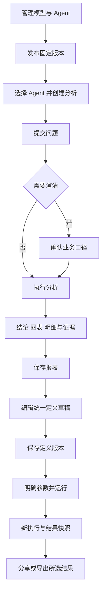

# 前端页面设计方案

日期：2026-09-27。对应[前端实施流程](前端实施流程.md)第 1 步，实施范围见[实施清单](前端第1步实施清单.md)。本稿供用户确认布局与交互，正式 Web 工程继续采用 Vue 3、Vite、TypeScript。

## 1. 用户任务与设计方向

业务人员首先需要提出问题、确认统计口径、阅读结果并核对依据；随后保存报表、调整条件和交付文件。管理人员配置可用的模型、Agent、数据与权限，为业务分析提供稳定入口。

本次采用浅色、紧凑的工作界面：左侧导航，中间承载主要任务，右侧补充分析依据或结果说明。分析页以问题和结论为中心，报表页以参数和结果为中心，管理页以资源清单和版本详情为中心。用户已认可当前风格，并于 2026-09-27 回复“element plus 吧”，确认采用 Element Plus 与项目统一主题。

## 2. 页面地图

下表的正式路由是规划建议；本轮原型仅实现三个哈希路由。

| 分组     | 页面与建议路由                                         | 主要操作                               | 实施步骤 |
| -------- | ------------------------------------------------------ | -------------------------------------- | -------- |
| 身份     | 登录 `/login`                                          | 登录、过期恢复、退出                   | 3        |
| 分析     | 工作台 `/analysis`、会话 `/analysis/:id`               | 选 Agent、提问、澄清、追问、取消、证据 | 4        |
| 报表     | 中心 `/reports`、详情 `/reports/:id`                   | 列表、参数、运行、结果历史、分析说明   | 5        |
| 报表编辑 | `/reports/:id/edit`                                    | 表单、画布、对话共用定义草稿           | 6        |
| 交付     | 报表详情内分享与导出                                   | 分享对象、Excel/Word/PDF、生成状态     | 7        |
| 分析能力 | `/settings/models`、`/settings/agents`                 | 模型、固定版本、工具、Skill、启停      | 8        |
| 组织权限 | `/settings/users`、`/settings/permissions`             | 用户、角色部门、对象列行权限           | 9        |
| 数据管理 | `/settings/data`                                       | DAS、目录、业务配置、关系发布          | 9        |
| 知识任务 | `/knowledge`、`/settings/knowledge`、`/settings/tasks` | 查阅、审核发布、任务重试               | 10       |
| 个人设置 | `/preferences`                                         | 常用查询偏好、自动应用设置             | 10       |

菜单按当前身份权限显示。原型导航中的“报表中心”直接打开示例详情，正式列表在第 5 步实现。页面地图弹窗展示其余页面的归属。

## 3. 三个核心页面

### 分析工作台

左侧展示新建分析与最近会话；主区按“用户问题 → 澄清 → 运行状态 → 结论 → 图表和明细 → 追问”排列。右侧显示当前查询条件、来源、时间口径、数据更新时间及执行证据。

新会话从已启用的 Agent 中选择，创建后固定 Agent 与模型版本。发布新版本供新会话使用，历史会话继续显示原绑定版本。完成分析之前，依据栏显示待生成提示。

状态包含首次使用、待澄清、运行中、完成、失败、空结果与取消。失败提供重试；取消保留问题；图表旁始终有明细入口。结果使用相同数据源计算合计、增长率和科室贡献。原型问题和生成内容均为固定虚构示例。

正式实现还需按现有合同处理 SSE 授权、事件去重、`Last-Event-ID`、刷新恢复、上下文压缩状态和历史权限复核。

### 报表详情

顶部显示报表名称、当前定义版本、分享状态和编辑、分享、导出操作。参数区修改后提示旧结果仍在展示，只有点击“运行报表”才产生新执行。结果区单独显示实际参数、所用定义版本、执行标识、生成时间和快照版本。

切换历史执行时，图表、明细、分析说明及导出目标一起切换。参数区仍可保留准备运行的条件，并与所选历史结果明确区分。执行失败时保留旧结果和待执行参数。

三个编辑入口共用一个草稿。原型以标题修改演示表单、画布、对话之间的内容传递；画布展示查询与呈现的连接，对话按钮应用预设修改。完整节点拖拽、查询配置、参数绑定编辑和真实 AI 修改在第 6 步实现。

保存定义推进定义版本；分享变更也推进定义版本。保存时发现版本冲突，保留草稿并让用户核对新基准。旧执行继续标注自己的定义版本。原型分享成员为虚构选项，文件导出展示格式、范围、生成中、成功与失败状态。

### 模型与 Agent 管理

页面内以分类切换模型和 Agent，资源列表展示名称、启停状态和最新版本，详情展示公开配置与历史版本。新建、发布新版本使用表单；启停前说明对新分析的影响。

Agent 配置包括固定模型版本、职责、工具、Skill 和执行预算。绑定 Skill 时需要启用 `read_skill_reference`。工具名称按当前后端工具目录选取。模型表单区分“配置显示名称”和“服务端模型名称”，凭据仅以“已配置”状态展示；新版本的凭据独立提交。

发布失败保留输入并提供恢复重试入口。原型仅使用虚构服务地址和测试值，状态存于页面内存，刷新恢复初始示例。

## 4. 视觉规则与组件要求

| 项目   | 当前规则                                                                         |
| ------ | -------------------------------------------------------------------------------- |
| 色彩   | 白色主画布、浅灰导航；深橄榄色主操作；青绿色图表；错误、提示、成功使用独立语义色 |
| 字体   | 系统中文无衬线字体；正文 14px；页面标题 27px；表格数值右对齐                     |
| 层级   | 页面标题 → 主要操作 → 当前任务 → 补充依据；状态以文字和颜色共同表达              |
| 密度   | 分隔线和留白组织结果，表单使用清晰标签，长标识允许换行                           |
| 图表   | 图形、图例、单位与明细配套；完整性、数据时间与查询范围靠近结果                   |
| 交互   | 控件显示焦点；按钮带文字；弹窗支持 Esc 关闭并恢复焦点；减少动态效果设置生效      |
| 响应式 | 桌面保留侧栏；窄屏收起导航；依据和说明移到主内容后方；表单堆叠；表格区域允许滚动 |

当前原型以 CSS 变量保存色彩和层级，使用原生控件、SVG 图表及系统字体。正式组件应覆盖按钮、输入、选择器、对话框、提示、数据表、分页、状态与表单校验；统一空态、失败态、权限态和加载态。

第 2 步确认正式组件、图标、图表及画布依赖的版本、兼容性和安装位置。组件选型应适配中文密集表单、键盘导航、窄屏、按需加载及现有工具链。

## 5. 接口与数据映射

- Agent、模型、报表定义和澄清示例已使用 `@ai-data/contracts` 的公开 schema 校验。
- 示例报表定义使用日期参数、`metric_query`、参数绑定、chart/table 呈现及编辑布局；页面内历史记录和界面状态属于原型模型。
- 科室范围筛选用于原型交互展示，正式实现时必须映射获准的数据范围与查询能力，再经 API 合同核对。
- 分享成员、角色部门选项及普通用户数据源列表的接口缺口，在对应步骤列清单审核。
- 原型没有登录、真实 API、真实模型、SSE 网络或实际导出文件的验收结论；这些由后续步骤完成。

## 6. 操作流程

可点击入口与实际检查结果见[第 1 步交付说明](前端第1步交付说明.md)。

## 7. UI 库选型（2026-09-27，已确认 Element Plus）

用户认可当前风格，并要求正式前端使用 UI 库统一风格。经过候选与大表能力比较，用户确认 **Element Plus + 项目统一主题**。普通管理列表采用 Table，大结果优先采用 Table V2 并进行专项验证；下面保留选型比较依据。第 2 步的具体版本、文件范围、命令和验证要求见[环境与依赖实施清单](前端第2步实施清单.md)。

### 候选比较

| 候选         | 官方提供的能力                                                        | 对本项目的判断                                                     |
| ------------ | --------------------------------------------------------------------- | ------------------------------------------------------------------ |
| Element Plus | 数据表、表单校验；CSS/SCSS 主题变量；全局语言、组件尺寸及弹层层级配置 | 首选。适合报表、配置表单、权限树等管理场景，可通过主题延续当前风格 |
| Naive UI     | Vue 3 与 TypeScript 组件；通过主题覆盖对象统一定制                    | 备选。主题配置集中，适合偏好 TypeScript 配置主题的团队             |
| PrimeVue     | 基础、语义、组件三层设计变量，支持自定义主题预设                      | 备选。主题组织灵活；当前阶段用 Element Plus 已能覆盖主要控件需求   |

以上适合程度为结合本项目页面与维护方式的判断，不表示其他库缺少对应业务能力。参考官方[Element Plus 表格](https://element-plus.org/en-US/component/table)、[表单](https://element-plus.org/en-US/component/form)、[主题定制](https://element-plus.org/en-US/guide/theming)、[全局配置](https://element-plus.org/en-US/component/config-provider)、[Naive UI](https://github.com/tusen-ai/naive-ui)和[PrimeVue 主题](https://primevue.dev/theming/styled/)。

### 统一风格的实施方式

1. 全站基础控件统一使用 Element Plus：按钮、输入、日期选择、表单、表格、分页、树、弹窗、抽屉、提示和确认框。
2. 继续使用当前白色内容区、浅灰侧栏、橄榄色主操作与青绿色图表。把颜色、字体、圆角、间距、控件高度及状态色维护为一套项目主题，并映射到组件库变量。
3. 同时定制悬停、按下、浅色背景、禁用和焦点状态；仅替换主色不足以形成完整主题。常规表单保持易读尺寸，密集表格按场景使用紧凑尺寸，窄屏兼顾触控。
4. 会话、报表、权限等业务布局沿用当前页面方案；提取重复的页面标题、筛选区、结果表格和状态展示。公共封装集中承载业务约定，保留底层组件能力。
5. 图表沿用依赖规划中的 ECharts / vue-echarts，图标沿用 lucide-vue-next，并共同使用项目主题。报表画布和文件生成按各自步骤选型。
6. 先用三个代表页面核对正常、错误、加载、禁用、键盘与窄屏效果，再推广到其他页面。

### 对后续步骤的影响

第 2 步在 Web 依赖清单中增加 `element-plus`，核对 Vue、Vite、TypeScript 与类型检查工具的兼容性，确定按需引入方式及主题所需工具。安装、升级和卸载继续由用户执行；本次依赖操作为 0。

### Ant Design Vue 补充评估（2026-09-27）

用户询问“atvue”，本次按 `ant-design-vue` 评估，库选择仍待确认。

Ant Design Vue 面向企业桌面应用，组件适合表格、表单和管理页面。通过 `ConfigProvider` 的 `theme.token` 集中配置主色、圆角等，可以延续当前浅色、紧凑的页面方向。浮层提示和确认框需使用能够继承主题上下文的调用方式，使全站反馈风格一致。依据：[官方仓库](https://github.com/vueComponent/ant-design-vue)、[主题与全局配置](https://www.antdv.com/components/config-provider)、[App 上下文](https://www.antdv.com/components/app-cn)。

当前官方 Releases 最新标记为 `4.2.6`，发布于 `2024-11-11`；对照 Element Plus 当前最新标记为 `2.14.6`，发布于 `2026-09-18`。这反映了公开版本的发布间隔，不据此断言项目停止维护。对于本项目较新的 Vue/Vite/TypeScript 工具链，采用 Ant Design Vue 时需明确核对构建、类型检查、日期组件、表格及弹层的兼容性。依据：[Ant Design Vue 发布记录](https://github.com/vueComponent/ant-design-vue/releases)、[Element Plus 发布记录](https://github.com/element-plus/element-plus/releases)。

结论：Ant Design Vue 的视觉与组件能力符合目标；新项目综合后续兼容性维护，当前仍优先推荐 Element Plus。团队已有 Ant Design Vue 经验或明确偏好其组件交互时，可以将其作为正式候选，再做版本兼容验证。本次仅补充选型记录，依赖操作为 0。

### 大数据渲染比较（2026-09-27）

用户补充团队较多使用 Ant Design Vue，并要求比较大数据渲染。以下是官方文档、已发布版本源码和项目设计的能力核对，尚未执行两库的同机性能测试。发布较新不能直接推导出渲染更快。

| 场景                           | Ant Design Vue 4.2.6                                                                                    | Element Plus                                                                                     |
| ------------------------------ | ------------------------------------------------------------------------------------------------------- | ------------------------------------------------------------------------------------------------ |
| 大结果本地分页，每页 50/100 行 | 可以先对已有结果切片，只把当前页交给 Table；团队已有经验有利于实施                                      | 普通 Table 同样可以使用当前页切片；单凭总结果行数无法判断谁更快                                  |
| 数千至数万行连续浏览           | 普通 Table 的公开 API 没有内置 `virtual` 开关，默认表体映射传入的数据；虚拟化需要额外适配或独立表格方案 | 单独提供 Table V2，内置虚拟渲染，接入大结果连续浏览的路径更直接                                  |
| 固定列、长文本、自定义单元格   | 普通表格功能与既有开发经验可复用；接入虚拟化后要复验组合行为                                            | V2 有对应示例；动态行高需要测量，官方提示可能产生跳动，应按真实内容验证                          |
| 多列宽表                       | 需要检查横向滚动、列渲染数量及固定列开销                                                                | 同样需要检查；具备行虚拟化并不等于上百列场景已经通过性能验收                                     |
| 复杂合并、编辑、树形与选择     | 按普通 Table 的实际功能和团队已有实现逐项核对                                                           | V2 与普通 Table 是两套接口，选择、编辑等需要按 V2 的渲染接口组合，不能直接视为原表格的无成本替换 |
| 大图表                         | 由项目的 ECharts 数据组织与渲染策略决定                                                                 | 同左；UI 库选择不直接决定图表性能                                                                |

依据：[Ant Design Vue 4.2.6 Table API](https://github.com/vueComponent/ant-design-vue/blob/4.2.6/components/table/index.en-US.md)、[默认表体源码](https://github.com/vueComponent/ant-design-vue/blob/4.2.6/components/vc-table/Body/index.tsx)、[Element Plus Table V2](https://element-plus.org/en-US/component/table-v2)。`scroll.y` 设置滚动区域高度，与虚拟化只渲染可见行的机制不同。

Element Plus 官方目前仍将 Table V2 标为 **beta**。其虚拟渲染能减少页面节点数量，但无法消除完整数据的下载、JSON 解析、内存占用以及本地排序筛选成本。Vue 官方也分别讨论了列表虚拟化与大数据结构的响应式开销，实际实现需要一起处理。依据：[Vue 性能指南](https://vuejs.org/guide/best-practices/performance.html)。

#### 本项目的选型结论

[既有结果交付设计](../需求文档/result-delivery-and-export.md)要求浏览器持有资源预算内的完整结果，本地分页并虚拟渲染，Excel 使用全部可导出行。返回行数硬上限为 100,000，标准化结果 JSON 上限为 32 MiB，两项同时约束；浏览器实际内存还包括解析后的对象、索引及导出过程。翻页和导出复用已有结果。

若希望一套 UI 库直接提供大结果表格方案，当前仍建议 **Element Plus + 普通 Table / Table V2 分场景使用**，理由是现成虚拟化路径；V2 的 beta 状态和功能组合需要性能样例验证。若保留 Ant Design Vue 以复用团队经验，则把大结果虚拟表格作为独立选型项，核对接入成本后再决定。当前尚未决定新增独立表格依赖。

#### 安装后建议的验证口径（待对应清单批准）

- 数据规模分别覆盖 1,000、10,000、50,000、100,000 行；每份交付样例都满足 32 MiB 预算。宽表与长文本另设样例，避免只测少列短文本。
- 两种方案使用相同数据、生产构建、浏览器、硬件、视口、行高与单元格内容；分别比较每页 100 行及连续虚拟滚动模式。若 Ant 采用额外虚拟化方案，明确记录该依赖，不能把普通 Table 与虚拟表格的差异称为两库通用性能差异。
- 记录数据准备完成后的首次可交互时间、滚动长任务、排序筛选耗时、内存峰值、页面切换后的释放情况，以及固定列、选择、弹层和键盘操作是否正确。
- 本轮没有生成毫秒、帧率或内存对比结论。依赖继续由用户安装，测试结果进入后续交付记录。
