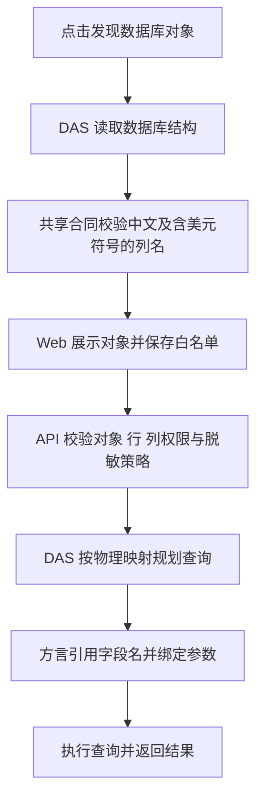

# 含美元符号字段支持交付说明

日期：2026-10-09。用户确认“加吧”后，由主代理单独实施。依赖操作及数据库迁移为 0。

## 问题与结果

`hdr` 发现接口的第 496 个对象是 `table.dbo.temp_t_yp0_drug_list_CT`。截图报错的列为 `__$start_lsn`、`__$end_lsn`、`__$seqval`、`__$operation`、`__$update_mask`，原字符白名单拒绝 `$`，导致整批发现结果校验失败。

现已允许标识符首字符之后包含 `$`，贯通目录发现、对象白名单、查询、结果列、权限、脱敏、指标及报表。中文列名继续支持。数据源标识规则保持原有约束。

## 实施范围

以下路径以 `ai-data/` 为根目录。

| 模块     | 修改文件与作用                                                                                                                                                                                                                                                                                                            |
| -------- | ------------------------------------------------------------------------------------------------------------------------------------------------------------------------------------------------------------------------------------------------------------------------------------------------------------------------- |
| 共享合同 | `packages/contracts/src/catalog/{dataset,api-dataset,catalog-relations}.ts`、`query/{query-dsl,pre-aggregate,output-mask}.ts`、`permission/permission-policy.ts`、`metrics/metric.ts`、`reports/report-definition.ts`、`memory/user-preference.ts`、`data-access/data-source-management.ts`：统一字段和对象引用的字符校验 |
| API      | `apps/api/src/query/{relational-fields,relational-authorization}.ts`、`routes/{catalog-management-routes,catalog-relation-routes}.ts`：兼容字段引用、结果别名和目录管理                                                                                                                                                   |
| DAS      | `apps/data-access/src/catalog/catalog-identifier.ts`、`connectors/{executable-query,sql-query-compiler}.ts`：兼容目录、执行合同及各方言标识符引用                                                                                                                                                                         |
| Web      | `apps/web/src/features/reports/models/definition-editor.ts`：兼容报表字段编辑；发现列表使用更新后的共享合同                                                                                                                                                                                                               |
| 回归测试 | 新增 `packages/contracts/tests/catalog/dollar-identifiers.test.ts`；扩展 API 字段权限测试、DAS 编译和隔离 SQL 测试、Web 管理流程夹具与浏览器用例                                                                                                                                                                          |

字符校验仍拒绝空格、引号、括号、SQL 注释和表达式。数据库字段经方言引用，例如 SQL Server 的 `[__$operation]`；筛选值继续通过驱动参数绑定。既有对象、行、列权限及脱敏判断继续生效。

## 执行流程

## 验证结果

- 修复前新增合同测试复现 3 项失败，涉及发现、查询与指标；修复后通过。
- 包级测试共 **1,712 项通过**：contracts 242、API 758、DAS 480、Web 204、metadata 28；工程规则 **42 项通过**。
- DAS 隔离 SQL Server 管理集成 **9 项通过**，包括中文表/视图中 `__$operation` 的发现、白名单保存、实际筛选查询和 `操作$类型` 结果列回读。
- 正式 Web 构建的浏览器回归 **1 项通过**：含 `$` 字段的表/视图发现、勾选、保存、回读和取消。浏览器使用隔离测试 API。
- 全部包及 Web 测试脚本类型检查通过；全仓 lint、本轮代码及新增交付文件格式、diff 检查通过。
- 全仓格式检查仍有此前 19 个非本轮文件的问题；交接 README 旧段落也有既存格式差异。本轮追加段落已单独确认符合格式，保留原有内容。
- API、DAS、Web 本地构建通过。Web 仍有既有大分块提示。

### hdr 实库只读复验

使用当前 `hdr` 数据源已有连接，只读取结构；4 次验证 SQL 均包裹 `SELECT TOP (0)`，业务行读取为 0，未修改白名单、连接或业务数据。

| 验证项目        | 结果                                    |
| --------------- | --------------------------------------- |
| 发现对象        | 539 个，整批合同校验通过                |
| 中文列名        | 82 个，通过                             |
| 含 `$` 列名     | 20 个，通过                             |
| 实际 SQL 列引用 | 下列 4 张表均返回预期的 5 个列名和 0 行 |

验证对象：

- `table.dbo.temp_t_yp0_drug_list_CT`
- `table.dbo.temp_ts_sys_icd_CT`
- `table.dbo.temp_ts_sys_operation_CT`
- `table.dbo.temp_ts_yp0_drug_dict_CT`

SQL Server 已实机验证。MySQL、PostgreSQL、Oracle 已通过编译与参数绑定回归，未连接对应实库。

## 生效方式

API、DAS、Web 本地构建已更新。实际运行的服务未手动重启，发布目录未重新打包。让 API、DAS 加载新代码，并刷新 Web 后，在 `hdr` 的“对象白名单”中重新点击“发现数据库对象”。开发模式如仍使用旧缓存，可重启 Web dev 后刷新。
