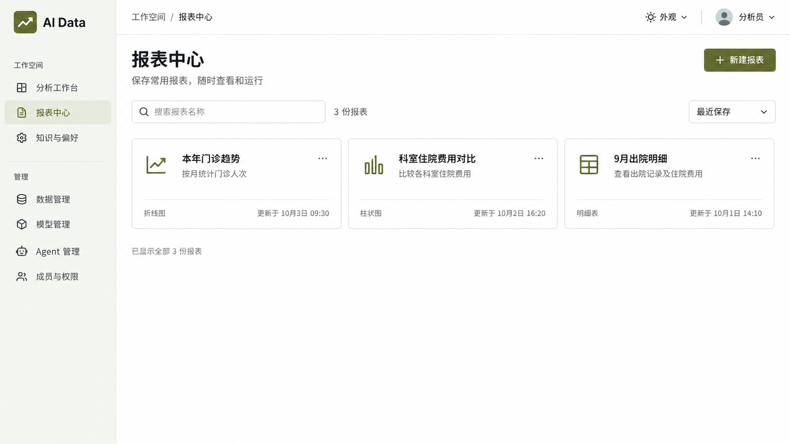
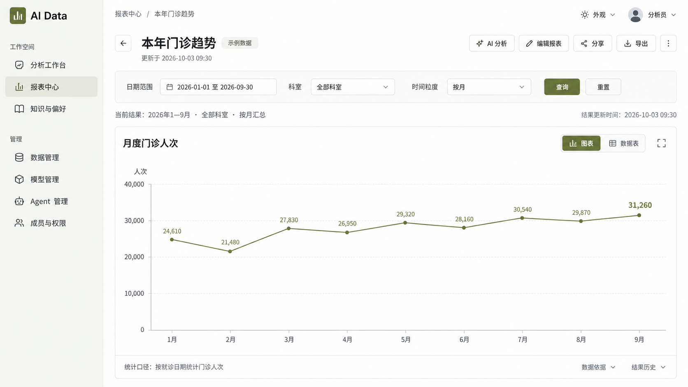
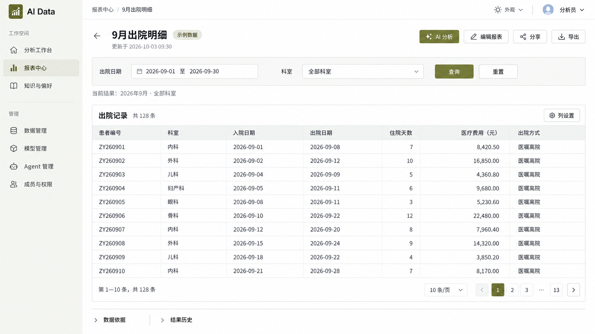

# 一期基础报表效果稿

2026-10-03。按已确认分期制作视觉稿，沿用橄榄绿主题及 Element Plus 控件风格。每份报表以一张图表或一份明细表为主体；同一结果可以切换图表和数据表展示。报表中心示例为分别保存的三份独立报表。

## 审核图片

### 当前审核状态

[打开全部图片审核目录](审核.html)，可按已认可／待审核筛选，点击图片查看原图。以下编号是本轮效果稿编号。

| 编号 | 页面或弹层 | 状态 |
| --- | --- | --- |
| 01 | [报表中心 · 紧凑卡片](01-报表中心-v2.png) | 样式已认可 |
| 02 | [单图表详情](02-单图表报表.png) | 待审核 |
| 03 | [明细表详情](03-明细表报表.png) | 样式已认可 |
| 04 | [编辑-筛选条件](04-编辑-筛选条件.png) | 待审核 |
| 05 | [编辑-数据与展示](05-编辑-数据与展示.png) | 待审核 |
| 06 | [数据编排-画布与属性](06-数据编排-画布与属性.png) | 待审核 |
| 07 | [AI修改-侧栏](07-AI修改-侧栏.png) | 待审核 |
| 08 | [分享设置](08-分享设置.png) | 待审核 |
| 09 | [导出文件](09-导出文件.png) | 待审核 |
| 10 | [结果历史与依据](10-结果历史与依据.png) | 待审核 |
| 11 | [从对话保存报表](11-从对话保存报表.png) | 待审核 |
| 12 | [提交组织模板](12-提交组织模板.png) | 待审核 |

用户已确认名称可修改，月份、日期及科室由筛选条件表达。组合看板属于二期。本次补充图 04—12 采用内置 image_gen 生成并进行文字校对，提示词见[补充页面生成提示词](补充页面生成提示词.md)及[校对提示词](补充页面校对提示词.md)。图片用于页面审核，具体行为需在实施清单中核对现有合同后落实。

九张补充原图已保存，生成来源记录见 `生成文件记录.json`。目录共收录 12 张当前稿，中心 v2 和明细详情标记样式已认可，其余 10 张待审核。原图内容已查看；页面布局及弹层均为视觉提案。

1. [报表中心 v2](01-报表中心-v2.png)：紧凑卡片展示类型图标、名称、简短说明、更新时间与更多操作入口。
2. [单图表报表](02-单图表报表.png)：围绕一张门诊趋势图展示筛选、结果、图表／数据表切换及编辑、分享、导出入口。
3. [明细表报表](03-明细表报表.png)：围绕一份出院记录展示筛选、列设置、分页及编辑、分享、导出入口。

图像由内置 image_gen 生成，完整输入见[生成提示词](生成提示词.md)。日期和数字均为视觉示例，具体交互待审核。应用代码、数据库及依赖保持现状；当前交付为效果图，尚未实施页面改造。组合看板按[分期记录](../报表模块BI方向讨论.md)安排在二期。

已查看三张图并核对 PNG 文件尺寸，均为 1672×941，接近 16:9。主要审核点：卡片是否便于识别报表、单图表页面的信息密度、明细表的筛选与操作布局。

最新反馈：用户认可明细页，要求中心采用紧凑入口卡片。已重新生成中心 v2 并核对尺寸为 1672×941；完整提示词见[中心卡片 v2](中心卡片-v2-提示词.md)。明细页效果保留，当前等待中心新稿审核。前一版中心原图保留在 `01-报表中心.png` 供历史对照。

后续审核结论：用户认可中心 v2 样式，明确报表名称可修改。实施时名称采用长期业务用途，例如“门诊趋势分析”“出院明细”，查询日期与科室另由筛选条件表达。当前图片保留生成时的示例名称，业务代码尚未改动。

## 2026-10-04 实施确认

用户回复“可以 你这样改”，确认上述 12 张效果稿的一期方向并批准实施。当前执行范围见[一期基础报表改造执行清单](../一期基础报表改造执行清单.md)。历史审核过程保留。
