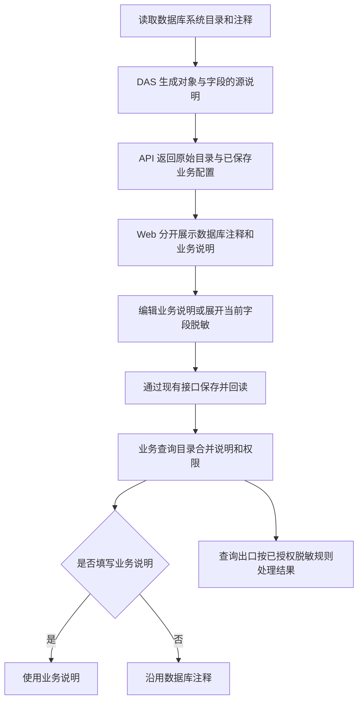

# 字段配置布局与数据库注释交付说明

日期：2026-10-09。

## 范围与结果

用户指出字段搜索、业务说明和脱敏配置混在一起，并询问为何没有读取数据库字段注释；查看静态效果图后确认“主体可以”。本轮按该布局完成 Web 字段编辑区，并补齐 DAS 四种数据库目录的注释读取。

主代理单独实施，依赖操作为 0。复用现有 API、`source_description` 合同和配置保存接口，数据库结构及用户的业务配置未修改。本地 Web 与 DAS 已构建，实际服务未手动重启，未生成新发布包。

## 页面变化

- 搜索单独放在顶部工具栏，可匹配字段名、数据库注释以及当前编辑中的业务说明；保留每页 20 项，搜索后回到第一页。
- 桌面按“字段、字段说明、脱敏规则”三列排列。数据库注释只读展示，业务说明有独立标签和编辑框；无源注释时明确显示“数据库未提供注释”。
- 业务说明留空时沿用数据库注释，填写后作为本系统的业务解释覆盖。保存不会修改业务数据库注释，也不会把源注释自动复制成业务覆盖。
- 脱敏状态和按钮固定在右侧。展开区注明所属字段，集中配置方式、保留字符、遮罩字符、免脱敏角色与固定示例预览。
- 部分遮罩按现有 DAS 行为适用于文本字段；其他类型显示说明。已有免脱敏角色在切换规则时保留，取消默认脱敏时清除该字段的策略。
- 手机宽度下，字段名称与脱敏入口放在首行，说明和配置逐项排列，保持字段归属。

## 注释读取根因与修复

连接器、合同、API 和 Web 已支持传递 `source_description`，但原数据库目录 SQL 没有投影 `object_description`、`column_description`，导致页面拿不到源说明。

| 数据库     | 本轮读取方式                                                                                                    |
| ---------- | --------------------------------------------------------------------------------------------------------------- |
| SQL Server | `sys.extended_properties` 中的 `MS_Description`；按 schema、对象与真实 `column_id` 定位，分别返回对象和字段说明 |
| MySQL      | `INFORMATION_SCHEMA.TABLES.TABLE_COMMENT`、`COLUMNS.COLUMN_COMMENT`；视图不把系统的 VIEW 标记显示成注释         |
| PostgreSQL | 按 schema、对象 OID 和字段 `attnum` 调用 `obj_description`、`col_description`                                   |
| Oracle     | 关联 `ALL_TAB_COMMENTS`、`ALL_COL_COMMENTS`                                                                     |

元数据关联保留现有目录的对象可见范围，缺少注释的对象和字段仍正常发现。SQL Server 对说明使用 Unicode 字符串转换，多行和引号可完整保留。

实现依据核对了官方元数据说明：[SQL Server 扩展属性](https://learn.microsoft.com/en-us/sql/relational-databases/system-catalog-views/extended-properties-catalog-views-sys-extended-properties)、[PostgreSQL 注释读取函数](https://www.postgresql.org/docs/15/functions-info.html)、[Oracle 对象注释](https://docs.oracle.com/en/database/oracle/oracle-database/21/refrn/ALL_TAB_COMMENTS.html)。

## 执行流程

## hdr 只读核验

使用新的 SQL Server 目录查询和连接器读取 `hdr` 系统元数据，结果如下。业务记录读取为 0，未写入数据库。

| 项目                            |    数量 |
| ------------------------------- | ------: |
| 发现对象                        |     539 |
| 带对象注释                      |     289 |
| 对象字段总数                    |  13,453 |
| 带字段注释                      |   9,868 |
| `cv_report` 字段 / 注释         | 42 / 42 |
| `cv_report_detail` 字段 / 注释  | 17 / 17 |
| `cv_report_main` 字段 / 注释    | 52 / 52 |
| `cv_report_timeout` 字段 / 注释 | 14 / 14 |

一次性核验脚本已移除；以上统计只包含元数据数量。

## 验证

测试先覆盖“有源注释但目录未返回”和“字段配置缺少分区”两个场景，确认原实现失败后实施修复。

| 检查                              | 结果                                                                                                |
| --------------------------------- | --------------------------------------------------------------------------------------------------- |
| DAS 普通测试                      | 完整 48 个文件、480 项通过；新增 4 个注释转换用例后，连接器相关 48 项通过，累计覆盖 484 个不同测试  |
| Web 普通测试                      | 完整 41 个文件、216 项通过                                                                          |
| API 业务目录测试                  | 4 项通过，包含业务说明覆盖源注释及清空后恢复                                                        |
| SQL Server 隔离集成               | 9 项通过；中文表和视图的对象/字段注释、中文多行及引号、其他扩展属性隔离、未注释字段和目录回读均通过 |
| 正式 Web 构建浏览器测试           | 5 项通过：新增字段配置 2 项，上一轮高级配置回归 3 项                                                |
| 类型检查                          | Web 应用与工具、DAS、API 通过                                                                       |
| 本轮代码 lint、格式和差异空白检查 | 通过                                                                                                |
| Web 与 DAS 本地构建               | 通过；Web 保留已有的大体积 chunk 提示                                                               |

新增浏览器验收覆盖说明与脱敏保存回读、清空恢复、角色保留、注释和草稿搜索、多页筛选、空结果、亮暗主题及 390px 宽度。截图来自实际 Chromium 页面；手机长截图保持相同宽度并增高视口，避免固定保存栏覆盖截图内容。

MySQL、PostgreSQL、Oracle 完成目录 SQL 接入和标准化转换回归，本轮没有对应实库环境，未记为实机验证。SQL Server 已完成隔离集成及 hdr 元数据实测。

## 文件清单

路径以 `ai-data/` 为根。

| 文件                                                                      | 修改内容                                             |
| ------------------------------------------------------------------------- | ---------------------------------------------------- |
| `apps/web/src/features/data-management/components/catalog-fields.vue`     | 搜索工具栏、三列字段区、说明编辑、脱敏入口和响应布局 |
| `apps/web/src/features/data-management/components/catalog-field-mask.vue` | 新增当前字段脱敏编辑器及固定示例预览                 |
| `apps/data-access/src/connectors/dialects/sqlserver-dialect.ts`           | SQL Server 注释投影及关联                            |
| `apps/data-access/src/connectors/dialects/mysql-dialect.ts`               | MySQL 注释投影                                       |
| `apps/data-access/src/connectors/dialects/postgresql-dialect.ts`          | PostgreSQL 对象与字段注释                            |
| `apps/data-access/src/connectors/dialects/oracle-dialect.ts`              | Oracle 注释视图关联                                  |
| `apps/data-access/tests/connectors/database-connector.test.ts`            | 四类数据库的源说明转换回归                           |
| `apps/data-access/tests/integration/chinese-objects.ts`                   | 真实表/视图注释集成断言                              |
| `apps/api/tests/catalog/business-catalog-service.test.ts`                 | 源说明、业务覆盖及恢复验证                           |
| `apps/web/tests/e2e/catalog-fields.spec.ts`                               | 新增交互与布局浏览器验收                             |

## 截图与生效方式

- [暗色字段配置](字段说明与脱敏验收/字段说明暗色.png)
- [亮色字段配置](字段说明与脱敏验收/字段说明亮色.png)
- [手机字段配置](字段说明与脱敏验收/字段说明手机.png)

Web dev 刷新即可查看新布局。数据库注释由 DAS 读取，DAS 需加载本轮代码后生效；常驻旧版本需要重启，再重新进入业务目录对象。静态部署使用本轮新 Web 构建，本次未执行发布。API 接口与数据库结构均保持现状。
