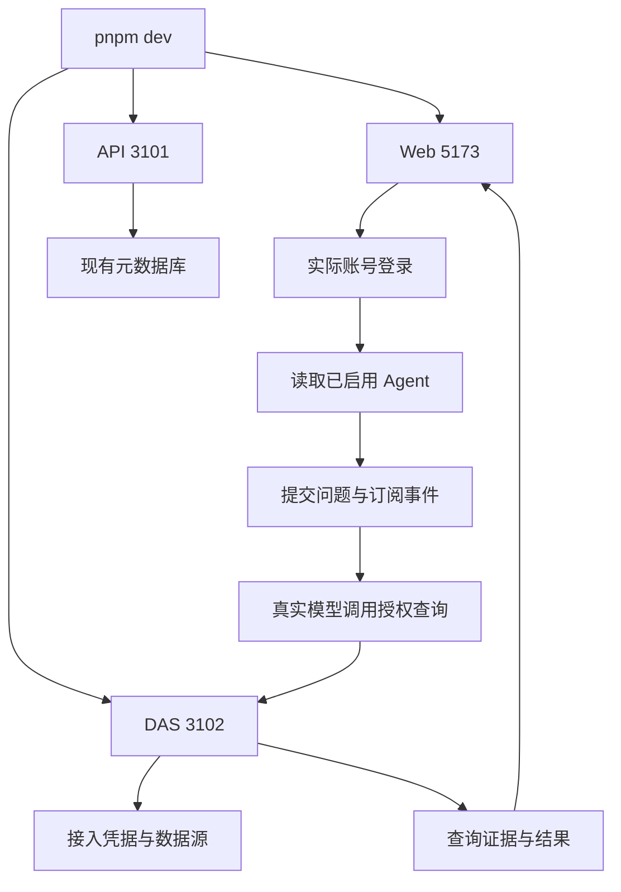
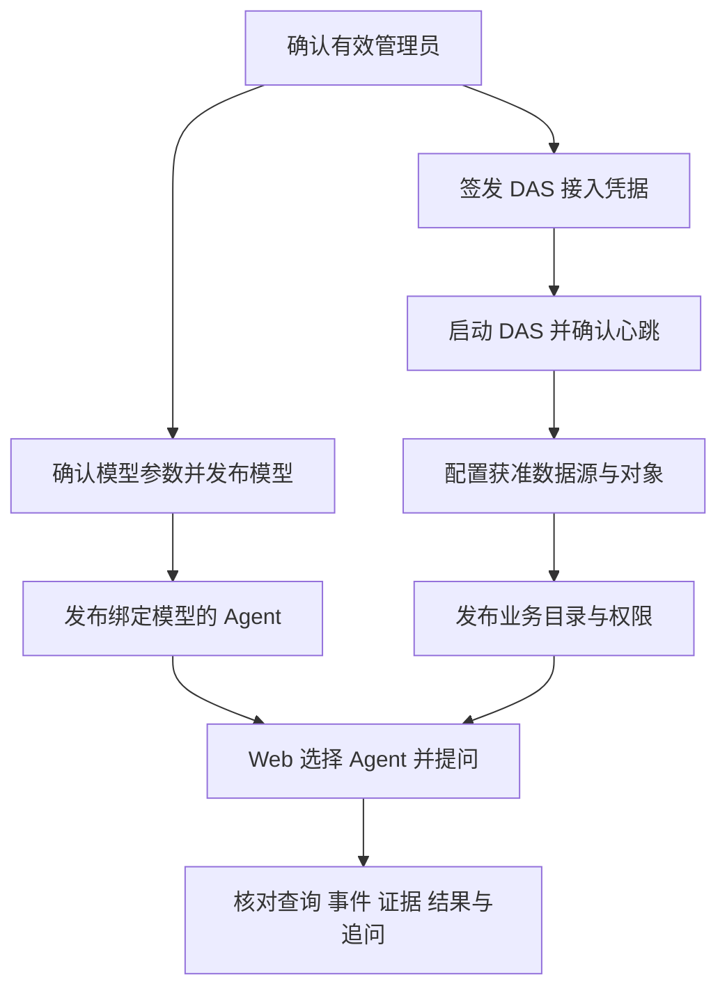
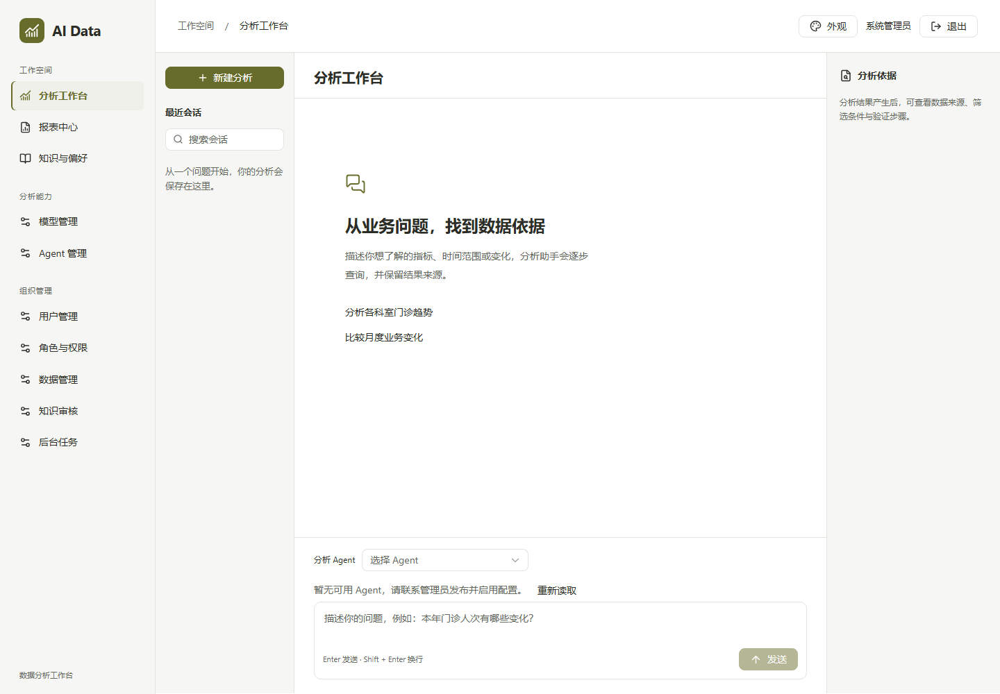
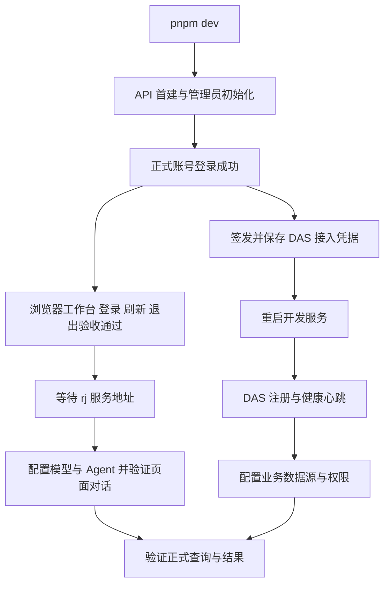
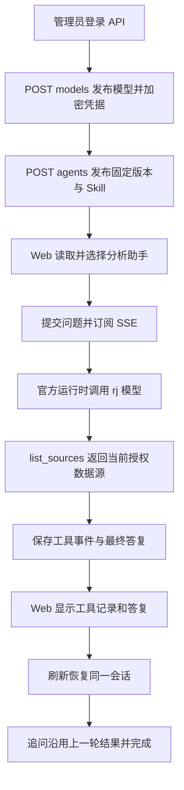

# 开发启动命令交付与正式联调记录

日期：2026-09-27。最新状态：**正式服务、账号登录、rj 模型与 Agent 发布、浏览器真实对话和追问已通过；当前先讨论独立业务库造数方案，准备第 4 步最后验收。** 最新模型验收见第 11 节；真实业务 SQL、表格和证据验证待造数方案获准并接入后执行，方案见[业务造数与验收讨论稿](前端第4步业务造数与验收讨论稿.md)。[第 5 步实施清单](前端第5步实施清单.md)暂放，尚未编码。

用户确认优先完成正式启动入口和真实链路验证。本轮由主代理单独实施，新增依赖和依赖安装操作均为 0。

## 1. 已交付命令

在工作区根 `ai-data/package.json` 新增：

```json
{
  "dev": "pnpm --parallel --filter @ai-data/api --filter @ai-data/data-access --filter @ai-data/web run dev"
}
```

运行位置及命令：

```powershell
cd D:\porject_new_2026\ai-data\ai-data
pnpm dev
```

该入口使用各包原有 dev 脚本：API 和 DAS 运行 `tsx watch src/index.ts`，Web 运行 Vite。根目录仍可单独执行 `pnpm dev:api`、`pnpm dev:data-access` 和 `pnpm dev:web`。同一终端按 Ctrl+C 停止。

Web 默认地址为 `http://127.0.0.1:5173`，默认代理目标为 `http://127.0.0.1:3101`。若当前 PowerShell 曾设置其他代理地址，可在启动前显式指定：

```powershell
$env:WEB_API_TARGET = 'http://127.0.0.1:3101'
pnpm dev
```

本轮启动检查后已重新启动并保留 Web/API，方便用户打开登录页面。再次启动前先关闭占用同一端口的开发进程。

## 2. 实际启动结果

| 检查     | 结果                                                                             |
| -------- | -------------------------------------------------------------------------------- |
| 根命令   | 实际执行 `pnpm dev`，同时调用三个正式包的 dev 脚本                               |
| Web      | 5173 返回 200，实际浏览器进入登录页，用户名输入和登录按钮可见，页面异常为 0      |
| API      | 3101 的 `/health` 返回 200、healthy，已连接配置中的本机 SQL Server               |
| DAS      | 启动报 ENOENT，缺少 `apps/data-access/secrets/api-registration.jwt`，3102 未监听 |
| 退出     | Ctrl+C 后 3101、3102、5173 监听数为 0；随后重新启动 Web/API                      |
| 脚本检查 | 三个包选择及 dev 入口核对通过，根 package.json 格式通过                          |

API 使用现有启动配置执行内置初始化流程。本轮未执行手动数据库重建或模型、Agent、数据源配置发布。

## 3. 正式环境核对

只读查询配置指定的数据库，当前状态如下：

| 项目       | 当前状态                                                       | 后续所需                                                                  |
| ---------- | -------------------------------------------------------------- | ------------------------------------------------------------------------- |
| 登录账号   | 存在启用的 admin；使用配置中的初始密码调用正式登录接口返回 401 | 用户使用当前有效账号登录，或提供本地联调凭据文件路径                      |
| 模型       | 0 个                                                           | 确认服务地址、模型名、认证方式，再通过管理接口发布配置                    |
| Agent      | 0 个                                                           | 发布绑定模型、工具与 Skill 的 Agent 并启用                                |
| 数据源配置 | 0 个                                                           | 配置本次查询使用的数据源与连接凭据                                        |
| 暴露对象   | 0 个                                                           | 发布可查询对象并确认用户权限与查询范围                                    |
| DAS 登记   | 元数据库有 1 条服务登记，当前 DAS 未启动                       | 通过授权管理入口签发接入凭据，按现有配置保存，再启动 DAS 并核对健康与心跳 |

本轮验证到正式 Web 登录页、API 健康与真实元数据库读取。登录成功、Agent 选择、模型调用、真实 SQL 查询及结果在页面显示尚未完成；以上缺口不能用自动化测试服务的通过结果替代。

本地凭据只供进程读取，交付文档和日志不保存密码、令牌或模型密钥。用户补齐有效登录及初始化参数后，继续原定联调流程。

## 4. 执行与接续流程



先补齐有效登录和首次配置，再验证一条明确范围的只读查询、SSE 展示、证据读取与追问。相关参数及初始化范围需由用户明确，保持现有数据和权限归属。

## 5. 文件及依赖记录

- 修改 `ai-data/package.json`：新增 dev 脚本。
- 更新[实施清单](开发启动命令实施清单.md)，追加任务交接 README。
- 新增本交付记录。
- 锁文件 SHA-256 保持 `C01291736EB04195950E7A79EA7C8AFE072FE2D2F7C5F5E99BAC41E48B51AEDA`。
- 安装元数据 SHA-256 保持 `83D7465D2FF13624F3D947A3FB20DC99CEADCF16DD6E7EE450E30DDF01F6769F`。

前端既有实现和自动化检查记录见[第 4 步交付说明](前端第4步交付说明.md)，本记录补充正式启动和环境检查结果。

## 6. 接续核对与初始化顺序

用户回复“继续”后，继续检查现有正式环境。2026-09-27 16:31（东八区）实际结果：

- API `http://127.0.0.1:3101/health` 返回 200、healthy；Web 5173 返回 200。
- Web `http://127.0.0.1:5173/api/health` 同样返回正式 API 的健康信息，确认同源代理可用。
- 经 Web 访问 `/api/agents`、`/api/models`、`/auth/me`，未登录均返回 401、`AUTHENTICATION_FAILED`。
- DAS 3102 连接被拒绝；接入凭据文件仍缺失。
- 再次只读查询元数据库，模型、Agent、数据源、暴露对象数量仍均为 0。
- 接续检查时重试根启动命令发现 3101、5173 已被原实例占用，已停止本次重复启动进程；临时 Web 5174 已关闭，原 3101、5173 继续响应。

账号初始化逻辑仅在账号不存在时插入初始密码。已有账号不会因修改 `bootstrap_admin.password` 或重启 API 而更新密码。此前 401 的记录仍待有效凭据解决，本次未重复尝试密码。

当前模型、Agent 和数据管理页面仍是后续阶段的模块入口。首次配置使用已有管理 API，执行顺序如下；实际参数与写入范围待用户确认。

| 顺序 | 操作与现有入口                                                                                                       | 涉及数据或文件                                                                                                                                                     | 验收条件                                                                           |
| ---- | -------------------------------------------------------------------------------------------------------------------- | ------------------------------------------------------------------------------------------------------------------------------------------------------------------ | ---------------------------------------------------------------------------------- |
| 1    | 有效管理员通过 `POST /auth/login` 登录，再读取 `GET /auth/me`                                                        | 创建本次认证会话                                                                                                                                                   | 登录成功，确认组织和系统管理员角色                                                 |
| 2    | `POST /admin/data-access/services/data-access-service/credential`，空请求体省略 JSON Content-Type                    | 将响应 `credential` 原文保存到 `ai-data/apps/data-access/secrets/api-registration.jwt`                                                                             | DAS 启动后 `/health` 为 200；API `GET /internal/data-access/services` 返回健康实例 |
| 3    | `POST /models` 发布用户指定的 Responses 模型；读取 `GET /agent-tools`、`GET /skills` 后，`POST /agents` 发布选定配置 | 模型和 Agent 版本入库；模型凭据加密与 Skill 快照写入现有状态目录                                                                                                   | `GET /models`、`GET /agents` 返回发布版本；Web 可选择 Agent                        |
| 4    | 通过 `/admin/data-access/services/data-access-service/` 下的管理入口配置连接与对象                                   | `POST data-source-secrets` 保存连接凭据，`PUT data-sources` 保存单库数据源，`POST data-source-objects/discover` 发现对象，`PUT data-source-objects` 保存获准白名单 | DAS 心跳上报数据源健康；物理目录包含选定对象                                       |
| 5    | `PUT /admin/catalog/datasets` 配置业务目录；按需要调用对象、列权限及行策略管理接口                                   | 用户确认的业务目录、角色权限与查询范围                                                                                                                             | 当前联调用户能读取获准的数据集和字段                                               |
| 6    | Web 登录、选 Agent、提问、查看工具与结果，再提交追问                                                                 | 正式会话、运行、证据与查询审计                                                                                                                                     | 模型调用及 SQL 查询完成，SSE、表格与证据显示一致，追问能恢复上下文                 |

当前 DAS 公钥路径是 `../../api/secrets/jwt-public.pem`，相对于 DAS 的 `config/` 目录，已经指向现有 API 公钥。补齐接入凭据时沿用该路径。凭据文件生成后需要重新启动 DAS，不能只依赖源码监听器感知新增凭据文件。



## 7. 下一次执行所需输入

以下为首次环境核对时的输入清单。账号与 DAS 接入已在第 9 节完成，模型和 Agent 已在第 11 节完成发布及对话验收；业务查询还需实际数据源及授权范围。

| 输入     | 需要用户给出的内容                                                                               |
| -------- | ------------------------------------------------------------------------------------------------ |
| 正式账号 | 含 `username`、`password` 的本地凭据文件路径，或用户完成账号恢复后通知执行者                     |
| 模型     | 支持 Responses 的实际服务地址、模型名称、认证方式；需要认证时提供本地凭据文件路径                |
| Agent    | Agent 名称与用途，以及拟启用的工具、Skill 范围；执行者据此整理待发布配置供确认                   |
| 查询数据 | 业务数据库地址、库名、连接凭据文件路径、允许查询的表或视图、字段与行范围，以及一条用于验收的问题 |

联调账号文件可由用户保存在已被 Git 忽略的 `ai-data/secrets/integration-login.json`，格式如下。示例值需替换为当前有效值，执行者仅在进程内读取，不将凭据写入交接记录。

```json
{
  "username": "admin",
  "password": "替换为当前有效密码"
}
```

本次新增检查未发布模型、Agent、数据源或权限配置；依赖操作为 0。修改范围为本交付记录和交接入口，Prettier 检查与 `git diff --check` 通过；锁文件及安装元数据的 SHA-256 与第 5 节一致。正式查询链路的验收仍待以上配置完成。

## 8. 正式配置账号复核

用户指出应使用 API 正式配置文件。已直接从 `ai-data/apps/api/config/api.config.json` 读取 `bootstrap_admin`，密码仅在核对进程内使用。通过项目现有用户仓储和密码校验函数读取配置指定的 `ai_to_bi` 元数据库，确认账号存在、处于启用状态、组织一致，但配置密码与数据库保存的密码摘要校验不通过。分别使用该配置调用 API 3101 和 Web 5173 的 `/auth/login`，均返回 401、`AUTHENTICATION_FAILED`。

当前配置已经提供管理员初始化凭据。若用户确认以该配置为准，可按以下清单一次性恢复账号，之后继续正式联调；该恢复尚未执行。

- 目的：使现有管理员能够使用配置中的密码登录。
- 数据范围：仅配置指定组织和用户名的管理员；使用项目现有 scrypt 实现生成密码摘要，在事务中更新密码、递增授权版本并撤销该账号旧会话。角色和数据权限保持现状。
- 进程影响：恢复后重启开发 API，清除进程内身份缓存；该账号需要重新登录。
- 文件范围：补充本交付记录和任务交接 README；应用代码与配置文件沿用现状，依赖操作为 0。
- 验证：密码摘要校验通过，API 直连及 Web 同源登录成功，`/auth/me` 返回预期账号与组织；验证用会话在检查后退出。


## 9. 清表后的正式启动与浏览器登录验收

用户确认已清理 `ai_to_bi` 的表并启动原 rj 模型，继续当前正式联调。重启前只读检查剩余五张 DAS 表；停止原开发进程后，通过 `pnpm dev` 运行现有 API 首建与管理员初始化。随后使用正式配置中的 `bootstrap_admin` 登录成功。

以该管理员调用现有接入凭据接口，将结果保存到配置指定的 `ai-data/apps/data-access/secrets/api-registration.jwt`。重启统一开发命令后，三个服务均可用。并行启动时 DAS 首次心跳早于 API 监听，曾返回连接拒绝；下一次自动重试完成注册，管理接口返回健康实例。

| 检查       | 实际结果                                                                    |
| ---------- | --------------------------------------------------------------------------- |
| API 首建   | `schema_migrations` 包含 `001_initial_api_schema`                           |
| DAS 首建   | `schema_migrations` 包含 `001_initial_das_metadata_schema`                  |
| 正式管理员 | 配置账号登录 200，`/auth/me` 返回 `organization-001` 和 `system_admin`      |
| API 健康   | `http://127.0.0.1:3101/health` 返回 200、healthy                            |
| DAS 健康   | `http://127.0.0.1:3102/health` 返回 200、healthy                            |
| 服务注册   | API 返回 `data-access-service`、`http://127.0.0.1:3102`、healthy 及心跳时间 |
| 浏览器登录 | Chromium 打开 Web 5173，实际填写正式配置账号，进入分析工作台                |
| 页面接口   | 经 Web 请求 `/api/agents`、`/api/conversations` 均为 200                    |
| 刷新恢复   | 刷新页面后 `/auth/refresh` 返回 200，保持登录，刷新 Cookie 为 HttpOnly      |
| 退出       | `/auth/logout` 返回 204，回到登录页，刷新 Cookie 已移除                     |
| 页面异常   | `pageerror` 为 0；截图检查通过                                              |

登录前浏览器首次尝试恢复会话返回 401，随后进入登录页，符合匿名访问流程。验收产生的登录会话均已退出。

当前可直接打开 `http://127.0.0.1:5173`，使用 API 正式配置里的管理员账号和密码查看工作台。运行中的根开发会话已保留；日后在工作区根目录执行 `pnpm dev` 启动全部服务。

浏览器证据：



当前用户数为 1；模型、Agent、数据源、暴露对象均为 0。工作台显示“暂无可用 Agent”，发送按钮禁用，与实际配置状态一致。历史记录中的模型名称为 `rj-model-v1`，当前应用配置和数据库没有模型服务地址，已向用户请求地址；模型调用、SSE 答复与业务 SQL 结果尚未验收。



本轮业务代码与依赖声明沿用现状，依赖操作为 0。新增运行凭据与服务自动初始化的持久化状态；更新本交付记录和 README，保存正式登录截图。

## 10. rj 地址确认与前端阶段状态

用户提供模型服务 `192.168.110.208:8000`，并询问管理页面与第 4 步完成状态。当前沿用历史模型名 `rj-model-v1`，候选 Responses 基础地址为 `http://192.168.110.208:8000/v1`。

本机执行环境最初访问该内网地址返回 `EACCES`。申请网络执行权限后，实际 `GET /health` 返回 200、`{"status":"ok"}`；`GET /v1/models` 返回 401，尚未取得受认证的模型列表或验证 Responses 调用。已向用户请求模型认证信息的本地文件路径，可保存在被 Git 忽略的 `ai-data/secrets/rj-model.json`，字段为 `api_key`。模型和 Agent 配置尚未发布；实际运行还需确认启动 API 的进程能够访问该内网模型服务。

前端阶段以以下状态接续：

| 范围                              | 当前状态                         |
| --------------------------------- | -------------------------------- |
| 第 4 步分析工作台开发与自动化验收 | 已完成                           |
| 正式服务、SQL 账号与浏览器登录    | 已通过                           |
| 正式模型对话、事件展示与追问      | 待模型认证配置后验证             |
| 业务 SQL 查询、表格与证据链路     | 待业务数据源和授权范围配置后验证 |
| 第 8 步模型与 Agent 管理页面      | 尚未实施，现为导航与模块占位     |
| 第 9 步用户、权限与数据管理页面   | 尚未实施，现为导航与模块占位     |

第 4 步当前描述为“开发与自动化验收完成，正式联调收尾中”。先完成用户已要求的正式联调；后续页面顺序仍按总流程，调整顺序另行确认。此次同步总流程与第 4 步交付说明的当前状态，依赖操作为 0。

## 11. 模型发布与真实浏览器对话通过

用户补充模型认证信息，继续授权当前模型联调。通过 Bearer 认证访问指定服务的 `GET /v1/models` 返回 200，确认实际模型为 `rj-model-v1`。使用正式配置管理员登录 API，调用已有 `POST /models` 和 `POST /agents` 管理接口完成发布，两次均返回 201。管理页面后续调用同一组后端接口。

### 已发布配置

| 对象  | 实际配置                                                                   |
| ----- | -------------------------------------------------------------------------- |
| 模型  | `analysis-model`，版本 1，名称“RJ 分析模型”，启用                          |
| 连接  | `http://192.168.110.208:8000/v1`，Responses 协议，模型 `rj-model-v1`       |
| 凭据  | 通过模型接口加密入库；公开配置返回 `has_api_key: true`                     |
| Agent | `default`，版本 1，名称“分析助手”，绑定 `analysis-model` 版本 1，启用      |
| 工具  | 当前 `/agent-tools` 返回的 18 项已注册业务工具；每次执行继续按用户权限校验 |
| Skill | `query-analysis`、`query-dsl`，发布时生成固定资源快照                      |
| 预算  | 单轮 600000 毫秒、最多 30 次工具调用、业务输入最多 65536 字节              |

数据库只读核对确认模型凭据密文和密钥引用存在，公开定义不包含 `api_key` 字段。模型密钥未写入本交付记录或验收 JSON。

API 原开发进程受当前执行环境的内网连接限制。获准网络执行权限后，以 `pnpm dev` 重启正式开发服务，使用已入库的模型和 Agent 进行浏览器验证。

### 实际验收

Chromium 使用正式管理员登录 Web 5173，选择“分析助手 · v1”，通过页面提交问题。浏览器请求经过正式 API、SQL 持久化和官方模型运行时。

| 场景       | 结果与证据                                                                                          |
| ---------- | --------------------------------------------------------------------------------------------------- |
| 首轮问题   | 请求检查当前可查询的数据源；真实模型调用 `list_sources`，后端返回成功，页面答复当前没有可查询数据源 |
| 首轮事件   | `run_started → tool_call → tool_result → final_answer → run_completed`，终态 completed              |
| 页面刷新   | 刷新后恢复同一会话、首轮消息与完成状态                                                              |
| 同会话追问 | 询问上一轮的数据源数量，模型依据历史结果回答 0                                                      |
| 追问事件   | `run_started → final_answer → run_completed`，终态 completed；没有新增工具调用                      |
| SSE        | 首轮、刷新恢复和追问的事件接口均返回 200、`text/event-stream`                                       |
| 版本绑定   | 两轮运行均固定 `default` 版本 1                                                                     |
| 页面与退出 | 页面异常为 0；验证后退出登录成功                                                                    |

会话标识为 `19d2ce74-909f-4718-be05-b13b74ddafd6`。首轮运行 `21b416dc-d28a-4a49-a5f0-fd7ab2649890`，追问运行 `ed32fd35-fb35-47b1-aa4c-bfb954dfea4f`。两轮各保存一条最终答复事件。API 事件回放已再次核对工具成功及追问没有重复调用。

首次浏览器验证在提交消息前遇到测试定位器匹配两个 Agent 标签；将定位范围限定为选择区后完成上述验证，业务代码未改动。

记录与截图：

- [模型对话验收 JSON](正式联调验收/模型对话验收.json)
- [首轮对话截图](正式联调验收/模型首轮对话.png)
- [刷新后追问截图](正式联调验收/模型追问恢复.png)



### 当前可用范围与后续输入

打开 `http://127.0.0.1:5173`，使用正式配置账号登录，可选择分析助手并进行模型对话。开发服务保持运行，后续仍使用工作区根命令 `pnpm dev`。

业务数据源与暴露对象当前为空，两轮证据数量均为 0。本次验证了模型对话、工具发现、SSE、持久化恢复和追问；真实业务 SQL、查询结果表格和业务证据验收仍需用户指定数据库、凭据、获准对象及查询范围。

本轮变更为数据库模型与 Agent 配置、加密凭据和固定 Skill 资源；更新交接文件并保存验收 JSON、截图。业务代码与依赖声明沿用现状，依赖操作为 0。管理页面仍按前端后续步骤实施。
