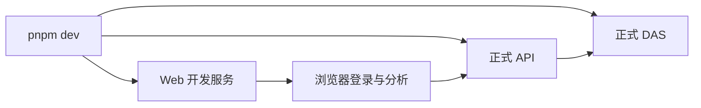

# 统一开发启动命令实施清单

日期：2026-09-27。状态：统一启动入口已完成，正式查询联调等待环境配置。用户回复“对的”，确认优先完成正式启动入口和真实联调。实际启动、登录页及配置缺口见[交付记录](开发启动命令交付说明.md)。

用户希望通过 `pnpm dev` 一类命令启动查看效果。当前正式 Web、API、DAS 已分别提供 dev 脚本；此前介绍的 4318 端口入口用于隔离浏览器验收，分析调度和查询结果为测试实现。

## 1. 目的与命令

在 `D:/porject_new_2026/ai-data/ai-data` 工作区根目录新增 `pnpm dev`，并行运行真实 Web、API 和 DAS，统一在一个终端查看服务输出。

拟在根 package.json 的 scripts 中新增：

```json
{
  "dev": "pnpm --parallel --filter @ai-data/api --filter @ai-data/data-access --filter @ai-data/web run dev"
}
```

继续保留现有 `dev:web`、`dev:api`、`dev:data-access`，方便只启动指定服务。沿用各包的现有入口和热更新方式。

## 2. 实际连接与前提

- Web 默认地址 `http://127.0.0.1:5173`，代理目标 `http://127.0.0.1:3101`。
- 当前实际 API 配置监听 3101，DAS 配置监听 3102，API 的 analysis_runtime 已启用。
- API 与 DAS 使用现有配置连接元数据库；真实分析使用组织实际账号、已发布并启用的 Agent、模型和授权数据源。
- 若同一 PowerShell 窗口曾将 `WEB_API_TARGET` 设置为测试服务地址，真实开发前应将该环境变量设置为实际 API 地址。
- API 启动沿用现有迁移初始化行为；该脚本只组织已有启动命令。

## 3. 文件与影响范围

| 操作 | 文件                               | 用途                         |
| ---- | ---------------------------------- | ---------------------------- |
| 修改 | `ai-data/package.json`             | 新增根 dev 脚本              |
| 维护 | 本清单                             | 审核和实施状态               |
| 新增 | `任务交接/开发启动命令交付说明.md` | 实际命令、执行流程和验证结果 |
| 追加 | `任务交接/README.md`               | 交付入口                     |

依赖操作为 0。主代理单独实施，子代理数量为 0。应用配置、业务入口、数据库结构和模型配置均沿用当前项目。

## 4. 验证与交付

- 核对根命令选择三个正式工作区包及各包已有 dev 入口。
- 检查脚本并行启动、输出与退出行为，注明实际启动时是否连接了配置中的数据库。
- 对变更文件执行格式检查和差异检查。
- 保存交付说明、启动与关闭方式、流程图，并追加交接入口。



本清单已获准。除统一启动命令外，按用户确认继续核对现有正式服务的登录、Agent、提问、查询和页面结果。沿用当前配置与授权数据；若缺少模型、Agent 或数据源，记录具体缺口后由用户确定配置范围。
