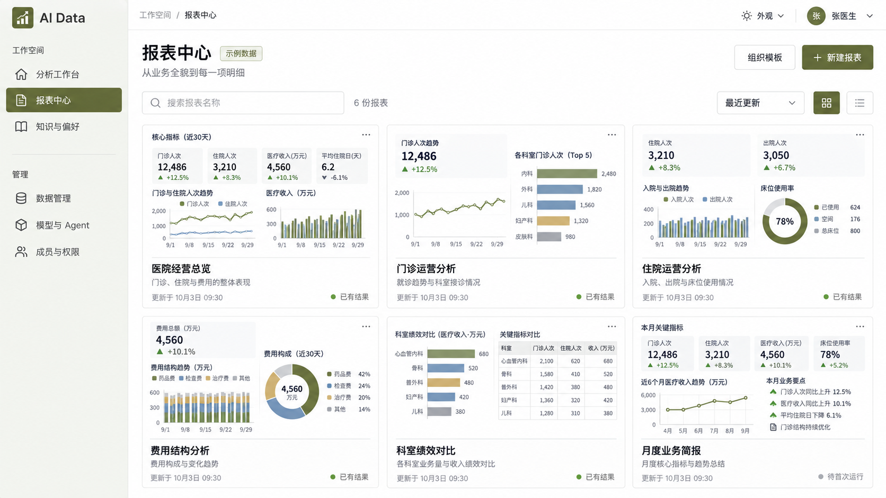
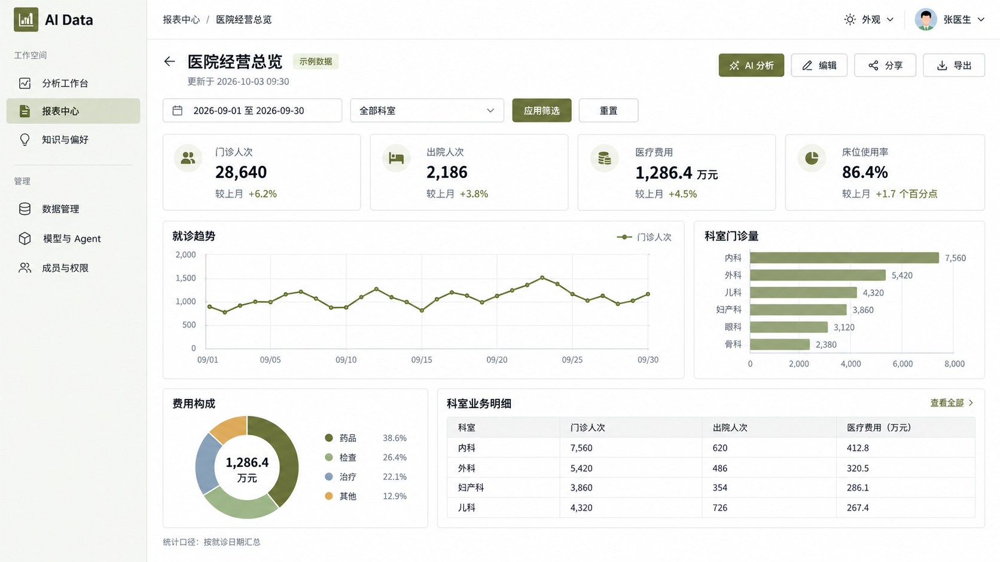
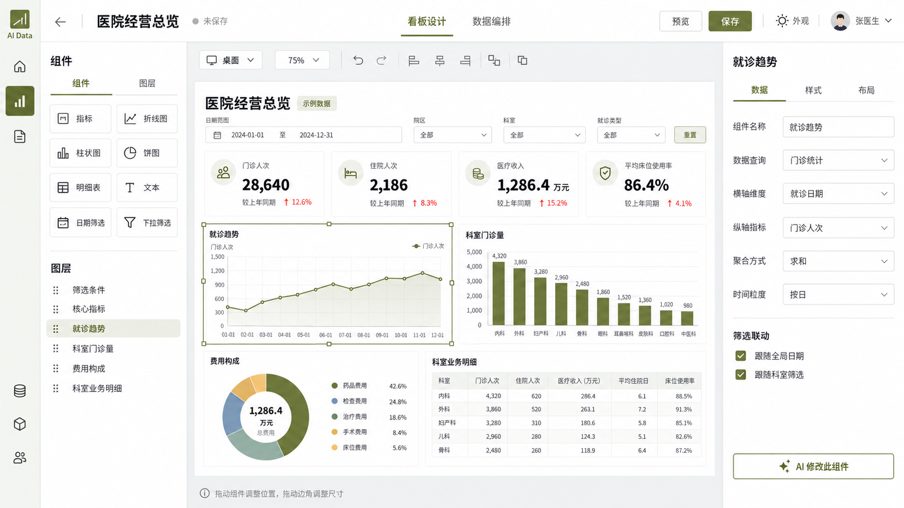

# 报表 BI 效果稿

状态：二期组合看板视觉参考。用户已确认一期以独立图表或明细表作为报表，组合看板留待二期；具体分期见[报表模块与组合看板分期](../报表模块BI方向讨论.md)。

2026-10-03。用户要求先看视觉效果，本轮仅生成并保存三张概念图。采用内置 image_gen，完整提示词见[生成提示词](生成提示词.md)。图中数字、日期和内容均为视觉示例，各图不作为同一份业务结果核对。

1. [报表中心](01-报表中心.png)：卡片预览、报表识别、搜索与新建。
2. [BI 看板](02-BI看板.png)：业务筛选、指标、趋势、科室对比与明细。
3. [看板设计器](03-看板设计器.png)：组件库、可拖拽布局、数据属性及 AI 修改入口。

沿用当前橄榄绿主题和 Element Plus 控件风格。这组三张图作为二期看板中心、看板阅读与看板设计器的参考，待二期启动时再细化数据规则和交互。

三张原图均为 1672×941，接近 16:9，已核对文件尺寸并查看内容。应用代码、依赖和数据库未改动。

