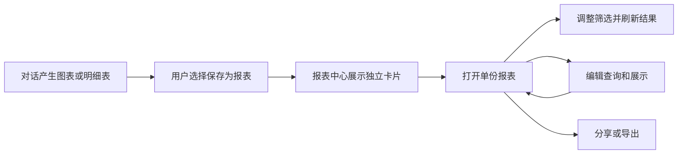

# 报表模块与组合看板分期

日期：2026-10-03。状态：用户已确认分期方向，当前仍在页面审核与效果讨论阶段，尚未进入本轮代码实施。

## 已确认的产品单位

一张图表或一份明细表可以独立成为一份报表。用户从对话结果中选择保存后，报表中心展示相应卡片；同一份结果切换图表或表格仍属于同一报表。多个基础报表经选择、排布和筛选关联组成看板。

用户明确：组合看板作为二期内容，当前先完成基础报表。审核编号 06—15 及关联入口围绕基础报表统一梳理。

## 名称与查询条件

用户认可报表中心 v2 的紧凑卡片样式，并要求报表名称可修改，以适应后续增加时间、科室等筛选选项。名称表达长期业务用途，例如“门诊趋势分析”“出院明细”；实际月份、日期及科室由查询条件和当前结果范围展示。仅修改名称不改变查询条件。

现有报表编辑页已提供标题输入框，保存沿用报表定义版本机制。后续一期实施清单应明确可编辑权限，并考虑在卡片“更多”中提供重命名入口；该快捷入口尚未实施。

## 一期：基础报表

| 范围 | 目标 |
| --- | --- |
| 报表中心（06） | 紧凑卡片展示类型图标、名称、简短说明、更新时间与操作入口，点击打开对应报表；保留搜索与加载能力。 |
| 报表查看（07—08） | 以单份图表或表格为主体，提供业务筛选与结果刷新；历史、执行记录和数据依据按需查看。 |
| 分享与导出（09—10） | 围绕选定的单份报表及结果提供授权分享和导出。 |
| 报表编辑（11—12） | 配置当前报表的查询、参数、图表或表格展示；具体交互按后续效果审核确定。 |
| 数据编排（13—15） | 保留现有节点、连线和流光风格，用于配置数据源、关系、查询及参数绑定。 |
| AI 辅助 | 生成、修改和解释当前报表，对话过程在辅助面板中展示。 |
| 保存与复用 | 当前报表的查询绑定、筛选及展示配置与已有版本、历史结果和模板能力衔接。 |

## 二期：组合看板

从已有基础报表中选择内容，调整组件位置和尺寸，配置共同筛选条件，形成医院经营总览等组合页面。看板中心、看板布局编辑、跨报表筛选联动、组合看板的保存、分享及布局导出均在二期单独规划。

[组合看板三张效果图](报表BI效果稿-2026-10-03/README.md)归入二期视觉参考。[一期效果稿](基础报表效果稿-2026-10-03/README.md)覆盖报表中心、单图表详情和明细表详情。用户已认可明细页和中心 v2 的紧凑卡片样式，具体代码实施清单另行审核。

用户随后要求其余报表页面也提供效果图。已补充筛选条件编辑、数据与展示编辑、数据编排画布、AI 修改侧栏、分享、导出、结果历史及依据、从对话保存报表、提交组织模板共 9 张。连同前三张组成[12 张审核目录](基础报表效果稿-2026-10-03/审核.html)。中心和明细页的样式已认可；单图表详情及补充页面均待审核。

## 当前代码核对

- 报表中心目前按行展示标题、定义版本、结果版本和创建时间。
- 详情按 section / block 纵向展示，运行参数位于侧栏，分析说明组件位于结果末尾。
- 展示合同目前支持 text / table / chart，图表类型为 line / bar / pie。
- `editor_layout.nodes` 保存查询画布节点坐标；组合看板的组件尺寸和网格排布属于二期设计范围。
- 已有报表定义、查询执行、结果快照、权限、分享和版本能力可作为基础。具体接口与兼容改动应列入后续实施清单。

## 一期用户流程

下一份实施清单以一期基础报表为范围，核对 Web、共享合同、必要 API、AI 工具与模板、导出、已有报表兼容、验证和交付文件。待用户审核后实施。本次仅保存分期结论，依赖操作和子代理均为 0。

## 2026-10-04 实施确认

用户回复“可以 你这样改”，确认上述 12 张效果稿的一期方向并批准实施。当前执行范围见[一期基础报表改造执行清单](一期基础报表改造执行清单.md)。历史审核过程保留。
