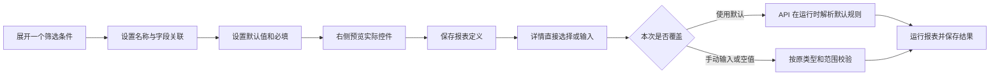

# 报表筛选条件调整交付说明

日期：2026-10-04。用户反馈筛选条件界面别扭，在[调整清单](报表筛选条件界面调整清单.md)后回复“改完改后图看看？”，批准修改并查看实际截图。主代理单独完成。

## 改动

- 条件以可展开的条目呈现，收起时显示名称、形态和默认值摘要；必填勾选与文字保持同行。
- 显示名称、字段关联、默认值集中在同一条件内。一个条件作用于多个查询时，分别展开维护；参数标识、底层类型、允许值及上下限放入高级设置。
- 日期、数字、选择项直接呈现在使用表单中。每项旁边的更多入口保留恢复默认、手动输入和显式空值等操作；布尔值显示“是／否”。
- 范围使用成对控件；相对日期显示“本年”等语义，保持每次执行时由 API 解析。显示默认值不会将它自动固化为本次覆盖值。
- 右侧只保留使用表单，上次保存结果可展开查看。预览区的查询按钮表示布局效果，不执行数据请求。
- 详情筛选栏采用同一套直接输入控件，版本选择收进次要入口。

## 文件与边界

新增 `parameter-input.vue`、`parameter-bindings.vue`；修改报表 `parameter-form.vue`、`parameter-editor.vue`、`binding-editor.vue`、`typed-value.vue`、编辑／详情页面、参数呈现模型以及 `reports.css`、`report-editor.css`。新增默认呈现测试与浏览器专项，更新受新入口影响的既有测试定位方式。

以上组件位于 `ai-data/apps/web/src/features/reports/`。字段绑定仍使用原合同，并保留查询、对象预过滤及关联条件作用位置。编辑一个条件时，其余条件和其他查询的绑定保持原样。依赖操作、API、数据库结构及子代理均为 0。

## 流程

## 验证记录

- 新增默认呈现用例先失败，再完成实现；报表单元测试 71 项通过，覆盖默认值、相对日期、空字符串、空值、零、否、范围和多值的原有语义。
- 既有报表及编辑浏览器回归 19 项通过，覆盖固定版本、权限变化、失败恢复、AI 修订、画布、主题和窄屏。
- Web 应用及工具配置类型检查、本轮 lint 和格式检查通过；生产构建通过，保留已有大体积 chunk 提示，见[构建记录](筛选条件调整验收/构建.log)。
- 最终生产预览的新界面专项 **3 项全部通过**：直接填写／恢复默认／空值、按条件维护多查询绑定，以及相对日期／双值范围／手动日期覆盖。结合既有 19 项，本轮相关浏览器场景共 22 项分批通过。
- 两张改后主图与暗色图为 1920×1080，手机图为 390×844；已检查实际截图及横向溢出。尺寸、切换和链接检查见[截图记录](筛选条件调整验收/截图检查.json)。

测试发现的定位差异已调整：Element Plus 复选框检查可见外层控件；详情定义读取包含版本查询参数；收到 403 后按既有权限规则清除定义，日期覆盖用例重新读取后继续验证。

截图使用隔离验收数据，字段绑定样例由浏览器测试构造；本轮不涉及模型、实际业务 SQL 或数据权限规则变更。

## 页面审核

[改前／改后切换查看](筛选条件调整验收/审核.html)提供筛选编辑页与详情筛选栏，另附暗色和手机截图。改前图片保留上一轮原始截图；改后图片来自本轮浏览器实际页面。
