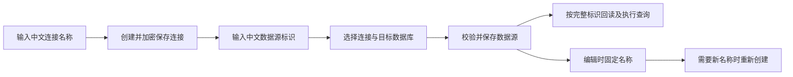

# 数据库连接与数据源中文名称交付说明

日期：2026-10-09。

用户确认：连接名称和数据源标识直接支持中文，创建后不允许改名，需要新名称时重新创建。由主代理单独实施，依赖操作和数据库迁移均为 0。

## 改动与兼容性

- 数据源保存校验允许汉字（含简体、繁体）、英文字母、数字及 `_ . -`，以汉字、英文字母或下划线开头，最多 128 个字符。已有英文标识继续有效。
- 数据库连接新建合同原本支持中文，本轮补充中文创建、回读和路径解码验证。
- 两个表单提供中文示例及创建后不可改名的提示，沿用已保存名称禁用编辑的行为。
- 内部仍使用原名称标识；数据库字段及 SQL 参数均使用 Unicode 字符串，接口路径按现有规则编码，运行连接池按完整字符串定位。
- 连接更新合同拒绝传入新名称；数据源携带原记录修订改用新名称时发生修订冲突，不会移动或覆盖原记录。

## 修改范围

业务代码：

- `ai-data/packages/contracts/src/data-access/data-source-management.ts`：中文数据源标识校验、长度及错误提示。
- `ai-data/apps/web/src/features/data-management/components/source-form.vue`：中文示例及规则提示。
- `ai-data/apps/web/src/features/data-management/components/database-connection-manager.vue`：中文连接示例及名称固定提示。

测试：

- 新增 `packages/contracts/tests/data-access/data-source-name.test.ts`。
- 更新 `packages/contracts/tests/data-access/database-connection.test.ts`。
- 更新 API `tests/routes/database-connection-routes.test.ts`。
- 更新 DAS `tests/routes/data-source-management-route.test.ts`、`tests/integration/management.integration.ts`。
- 更新 Web `tests/e2e/database-connections.spec.ts`。

## 执行流程

## 验证结果

| 验证                                   | 结果         |
| -------------------------------------- | ------------ |
| contracts 全部测试                     | 221 项通过   |
| DAS 数据源服务及管理路由测试           | 46 项通过    |
| API 连接管理、数据访问授权及可用源测试 | 30 项通过    |
| DAS 隔离 SQL Server 管理集成           | 9 项通过     |
| Web 连接管理浏览器场景                 | 7 项分批通过 |
| API、DAS、contracts、Web 类型检查      | 通过         |
| 本轮代码 ESLint、Prettier              | 通过         |
| API、DAS、Web 本地构建                 | 通过         |

真实 SQL 验证使用自动创建并清理的隔离元数据库。通过管理服务创建“医院业务库”连接及“门诊数据”数据源，经元数据读取、凭据解密、运行连接池执行参数化 SQL，成功返回中文标识；同时验证原修订不能用于改名。没有修改业务库。

浏览器使用正式 Web 构建及隔离管理接口数据，验证中文创建、测试连接、数据源绑定、回读、搜索、名称不可编辑和其他连接参数更新。首次新增场景漏掉更新已引用连接的确认步骤；补齐脚本后该场景通过，业务逻辑未因此调整。

截图：[中文连接与数据源](数据库连接管理验收/中文连接与数据源.png)。

本轮没有运行真实模型问答，也没有对其他数据库类型进行实机验证。中文名称改动位于共用配置标识层，不涉及各数据库 SQL 方言。

## 生效

本地 `dist` 已更新，运行中的 API/DAS 未重启。使用最新代码重新加载服务并刷新 Web 后生效；尤其 DAS 仍运行旧代码时，中文数据源仍会被旧校验拒绝。无需重建数据库或修改既有名称。
