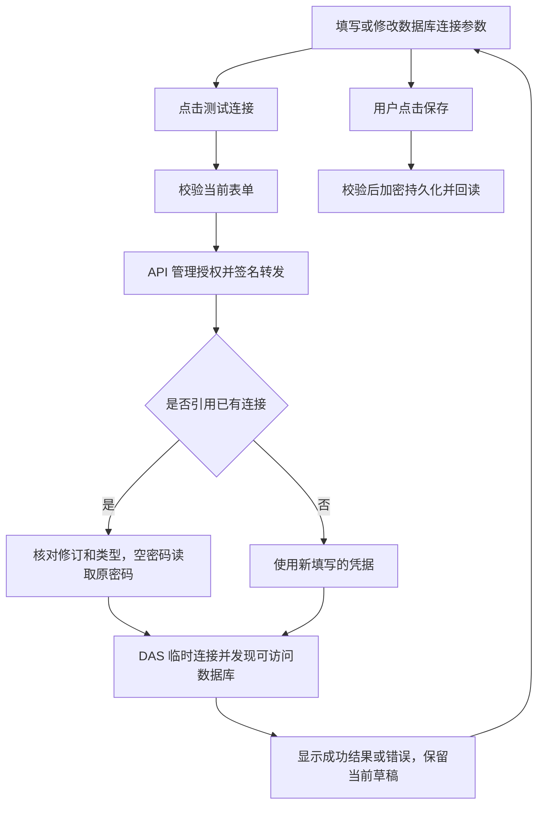

# 数据库连接测试与确认框调整交付说明

2026-10-09。根据用户截图反馈调整数据库连接展示、保存前测试和确认框宽度。主代理单独实施，使用已有依赖。

## 交付结果

1. 数据库连接卡片和详情只展示连接本身的信息，移除关联数据源清单。保存影响提示使用简短说明；后台仍检查引用，正在使用的连接不能删除。
2. “测试连接”与“保存数据库连接”放在同一操作栏。新建时填写类型、主机、端口、账号和密码即可测试，连接名称可稍后填写。编辑时测试当前表单参数，密码留空使用已保存密码；填写新密码时仅用于本次测试。
3. 测试只在内存中组合参数并发现可访问数据库，成功和失败均不保存连接。只有点击保存才提交配置。修改测试参数后清空旧成功提示和数据库结果；测试进行中禁用表单，避免结果对应旧参数。
4. 确认框恢复居中限宽，默认最多 420px，小屏两侧各保留至少 16px。修复共享样式覆盖 Element Plus 默认宽度的问题，适用于使用相同确认框的管理操作。

Oracle 测试在新建和编辑时都提供 SID / Service Name 及目标输入。编辑测试需核对连接修订和类型；已被其他操作更新的连接需重新读取后再测试。

## 执行流程

## 文件与接口

业务代码改动共 10 个文件，验证代码改动共 8 个文件；新增本交付说明并追加原实施清单、原交付说明及交接入口。

| 层   | 文件与职责                                                                                                                                                                   |
| ---- | ---------------------------------------------------------------------------------------------------------------------------------------------------------------------------- |
| 合同 | `packages/contracts/src/data-access/database-connection.ts`、`database-connection-types.ts`、`src/index.ts`：增加当前表单测试合同及导出。                                    |
| API  | `apps/api/src/data-access/data-access-management-client.ts`、`src/routes/data-access-routes.ts`：增加保存前测试代理，保持管理授权、内部签名和响应校验。                      |
| DAS  | `apps/data-access/src/data-sources/database-connection-service.ts`、`src/routes/data-source-management-route.ts`：临时组合参数，复用现有驱动发现能力，不调用保存或缓存失效。 |
| Web  | `apps/web/src/features/data-management/api/data-access-api.ts`、`components/database-connection-manager.vue`：测试当前表单、统一按钮位置、简化连接展示。                     |
| 样式 | `apps/web/src/styles/controls.css`：恢复确认框宽度上限。                                                                                                                     |
| 验证 | 扩展合同、DAS 服务及路由、API 授权路由、真实 SQL 集成、浏览器场景和两个测试替身。                                                                                            |

新增 API `POST /admin/data-access/services/:serviceId/database-connections/test`，转发至 DAS `POST /internal/admin/database-connections/test`。请求包含当前连接参数，可选 `saved_connection` 引用与修订；响应仅返回数据库目标清单。已有 `/:secretRef/test` 接口继续服务已保存连接发现流程。

## 验证结果

| 检查           | 结果                                                                                                                                                            |
| -------------- | --------------------------------------------------------------------------------------------------------------------------------------------------------------- |
| 普通测试       | API 741、DAS 462、Web 204、共享合同 204、元数据包 28、工程规则 42，合计 1,681 项通过。                                                                          |
| DAS SQL 集成   | 7 项通过。真实 SQL Server 验证新建草稿测试、编辑空密码测试；测试前后连接列表或修订保持一致。                                                                    |
| 正式构建浏览器 | 6 项场景分批通过，覆盖新建保存前测试、编辑成功与失败不改存储、参数变化清空旧结果、保存/删除/冲突及亮暗和窄屏布局。确认框验证桌面与 390px 手机宽度、居中和限宽。 |
| 静态检查       | API、DAS、Web、共享合同类型检查通过；本轮改动文件 ESLint、Prettier 及差异空白检查通过。                                                                         |
| 构建           | API、DAS 本地 `dist/index.js` 和 Web `dist/` 构建通过。Web 保留已有大分块提示。                                                                                 |

服务测试先验证新增方法缺失时失败，再完成实现和复验。浏览器初次宽度断言误选全屏遮罩，改为测量内部 `.el-message-box` 后通过，实际截图已目视核对。全仓格式的 19 个已有问题沿用[此前记录](数据库连接管理验收/全仓格式检查.log)。

浏览器使用正式 Web 构建和隔离管理响应，真实驱动与存储行为由 DAS SQL 集成独立验证。SQL 集成写入随机命名的临时元数据库并按原测试流程清理；业务数据库仅做目标发现读取。MySQL、PostgreSQL、Oracle 本轮未连接实际服务器验收。

## 页面证据

- [暗色连接编辑与统一操作栏](数据库连接管理验收/连接编辑-暗色.png)
- [单连接卡片](数据库连接管理验收/连接卡片-单连接.png)
- [桌面确认框](数据库连接管理验收/确认框-1920.png)
- [手机确认框](数据库连接管理验收/确认框-390.png)

## 生效说明

源码和应用本地构建已更新。API 与 DAS 需要同时加载最新代码，Web 刷新后使用新界面；本轮未重启实际服务。现有实例配置、密钥与发布目录保持原状，没有表结构变更、数据迁移、依赖操作或子代理。`ai-book` 未修改。
