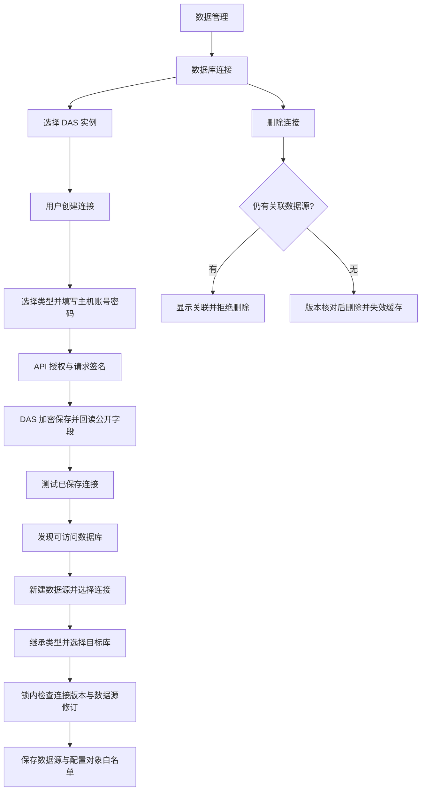

# 数据库连接管理交付说明

2026-10-08。用户回复“开始”，批准[实施清单](数据库连接管理实施清单.md)。主代理单独实施；依赖操作、表结构变更、数据迁移和子代理均为 0。

2026-10-09 更新：当前界面已移除关联数据源展示，测试连接改为使用当前表单、允许保存前执行，确认框恢复限宽。最新流程与验证见[数据库连接测试与确认框调整交付说明](数据库连接测试与确认框调整交付说明.md)；下文保留原交付记录。

## 交付结果

数据管理新增独立的“数据库连接”入口，支持搜索、创建、详情、编辑、测试和删除。列表展示连接名称、类型、主机端口及关联数据源。连接名称与数据库类型在创建时确定；编辑密码留空保留原密码。

创建数据源时选择已有数据库连接，页面自动显示其数据库类型，再选择目标数据库。切换连接会清空旧目标库、Oracle 目标和发现结果；后端检查连接存在、类型一致及连接修订，防止绕过前端提交不匹配配置。

首次初始化的连接和数据源列表为空，由用户显式创建。已有 `clinical-demo` 来自历史演示数据脚本 `ai-data/scripts/demo-data/provision.mjs`，正常启动和首建迁移不自动执行该脚本。本轮保留现有连接、数据源及关联历史记录。

## 使用流程

1. 进入“数据管理 → 数据库连接”，选择在线 DAS 实例。
2. 点击“新建数据库连接”，填写名称、数据库类型、主机、端口、账号和密码后保存。
3. 点击“测试连接”，查看该账号可访问的数据库。Oracle 测试需要填写 SID 或 Service Name。
4. 进入“数据源 → 新建数据源”，选择已保存的连接，发现或输入目标数据库后保存。
5. 在“对象白名单”中选择可发现、可查询的对象，再维护业务目录与关系。

未被数据源使用的连接可删除；启用和停用的数据源引用都会阻止删除。连接被引用时，编辑保存会列出受影响的数据源，确认后刷新其运行连接。

## 主要代码

| 层         | 改动                                                                                                                                                     |
| ---------- | -------------------------------------------------------------------------------------------------------------------------------------------------------- |
| 共享合同   | 新增 `database-connection.ts` 与 `database-connection-types.ts`，定义公开详情、创建、比较更新、删除与测试请求。                                          |
| API        | `data-access-management-client.ts`、`data-access-routes.ts` 增加连接管理代理，逐次刷新权限并向选定 DAS 签名请求。                                        |
| DAS        | 新增 `database-connection-service.ts` 与依赖类型，负责加解密、公开字段回读、密码保留、比较更新和目标库发现。                                             |
| DAS 存储   | `sql-data-source-administration.ts` 对连接删除和数据源绑定锁定同一连接记录，检查修订和全部引用后提交事务。                                               |
| 数据源服务 | `data-source-management-service.ts` 校验连接存在与类型一致，并调用锁内绑定保存；旧凭据接口继续兼容，已存在连接的类型保持固定。                           |
| Web        | 新增 `database-connection-manager.vue`；更新管理页、DAS 容器、数据源组件、表单与客户端。移除被统一管理替代的旧凭据表单和独立 SQL Server 连接选项编辑器。 |
| 验证       | 新增连接合同、服务、API 路由和浏览器测试，扩展 DAS 真实 SQL 集成及相关管理测试替身。                                                                     |

API 的新路径前缀为 `/admin/data-access/services/:serviceId/database-connections`，提供列表 GET、创建 POST、详情 GET `/:secretRef`、编辑 PUT `/:secretRef`、删除 POST `/:secretRef/delete`、测试 POST `/:secretRef/test`。沿用已有管理权限、固定内部路径签名、响应合同及 `no-store`。

复用 DAS 的 `dbo.data_source_secrets` 和 `dbo.data_source_configs`。密码保持加密存储，详情响应只包含公开字段和修订。更新和删除核对当前修订；更新后失效相关数据源缓存。并发删除与绑定只能有一方成功，避免产生悬空引用。

Web 保存遇到版本冲突、网络异常、服务器错误或不完整回执时保留草稿并回读核对。重新读取会先处理未保存修改，密码不会自动重复提交。权限撤回时清空管理内容。

## 验证结果

| 验证           | 结果与范围                                                                                                                                                                                         |
| -------------- | -------------------------------------------------------------------------------------------------------------------------------------------------------------------------------------------------- |
| API 普通测试   | 94 个文件、740 项通过，包含新增 6 个连接路由授权场景。                                                                                                                                             |
| DAS 普通测试   | 48 个文件、458 项通过，包含创建、密码保留、修订、类型校验及管理路由。                                                                                                                              |
| Web 单元测试   | 40 个文件、204 项通过。                                                                                                                                                                            |
| 共享合同       | 28 个文件、202 项通过。                                                                                                                                                                            |
| 元数据库共享包 | 5 个文件、28 项通过。                                                                                                                                                                              |
| 工程规则       | 42 项通过。以上普通测试合计 1,674 项。                                                                                                                                                             |
| DAS SQL 集成   | 7 项通过：空列表、加密保存和空密码编辑、停用源引用保护、删除与绑定并发、真实 SQL Server 库发现及原有比较更新流程。                                                                                 |
| 正式构建浏览器 | 最新构建 6 项连接管理场景通过；原有数据源白名单及业务目录 2 项回归通过。覆盖空环境创建、类型继承、编辑、删除、测试失败、权限撤回、并发冲突、丢失/不完整回执，以及 1440、1024、390 宽度与亮暗主题。 |
| 静态检查       | API、DAS、Web、contracts、metadata 类型检查通过；全仓 ESLint 和本轮文件格式检查通过。                                                                                                              |
| 构建           | API、DAS 应用自身 `dist/index.js` 与 Web `dist/` 构建通过。Web 保留现有大型分块提示。                                                                                                              |
| 全仓格式       | 检出 19 个本轮未修改文件的已有格式问题，名单见[全仓格式检查](数据库连接管理验收/全仓格式检查.log)。本轮未扩展修改这些文件。                                                                        |

SQL 集成测试只在随机命名的隔离元数据库中写入和清理。真实数据库发现使用项目已配置 SQL Server，查询服务器库目录并验证临时库可发现；最终用例不依赖演示库或 `clinical-demo` 文件。此前还用现有演示只读账号完成一次创建、空密码编辑及发现 `ai_bi_demo` 的验证。实际开发元数据库配置和业务数据未改动。

浏览器使用真实 Web 正式构建和隔离测试服务，管理响应由测试替身提供。SQL 加密、并发和真实驱动发现由独立 DAS 集成覆盖。本轮未对 MySQL、PostgreSQL、Oracle 实际服务器做连接验收。

验证中修正了删除异常未被路由捕获、测试替身类型过窄、表单辅助名称定位、窄屏保存按钮遮挡及不完整保存回执的处理。失败场景先复现，再修正并复验。暗色截图等待外观弹层关闭后采集。

## 页面证据

- [数据库连接列表](数据库连接管理验收/连接列表.png)
- [桌面编辑](数据库连接管理验收/连接编辑-1440.png)
- [中等宽度编辑](数据库连接管理验收/连接编辑-1024.png)
- [手机编辑](数据库连接管理验收/连接编辑-390.png)
- [暗色编辑](数据库连接管理验收/连接编辑-暗色.png)
- [数据源类型继承](数据库连接管理验收/数据源类型继承.png)

## 生效范围

本轮已更新源码和应用本地构建，实际 API、DAS 服务未重启。API 和 DAS 需要同时加载最新代码，Web 刷新后使用新的管理界面。发布目录中的现有实例配置、密钥和程序未覆盖；本轮未重新生成多平台发布包。

本轮使用已有依赖，按包直接运行已安装的检查器和构建器；API/DAS 打包停在应用本地 bundle 阶段，未执行会整理发布目录的 `prepare-release.mjs`。`ai-book` 未修改。

## 2026-10-08 连接列表改为卡片

用户查看实际列表后要求“也用卡片得了”。连接列表已复用数据源的 `ResourceCard` 和响应式网格：名称作为标题、类型作为角标、主机端口作为副标题，关联数据源在卡片内集中显示；点击整张卡片或按 Enter 进入原有编辑详情。单个连接保持一张卡片宽度，桌面三列、中等宽度两列、手机一列。

本次修改 `database-connection-manager.vue` 和对应浏览器验收脚本，并更新交接记录。复用已有组件与主题，依赖操作为 0。

Web 类型、修改文件 lint/格式及正式构建通过；正式构建的 6 项连接管理浏览器场景通过，包含搜索匹配与空结果、键盘进入、原有保存/删除/异常恢复，以及亮暗主题和 1440、1024、390 宽度。截图已经目视检查。

- [单连接卡片](数据库连接管理验收/连接卡片-单连接.png)
- [桌面卡片](数据库连接管理验收/连接卡片-1440.png)
- [中等宽度卡片](数据库连接管理验收/连接卡片-1024.png)
- [手机卡片](数据库连接管理验收/连接卡片-390.png)
- [暗色卡片](数据库连接管理验收/连接卡片-暗色.png)

本次卡片调整仅涉及 Web，开发模式刷新页面即可查看；使用静态部署时发布最新 Web `dist/`。
