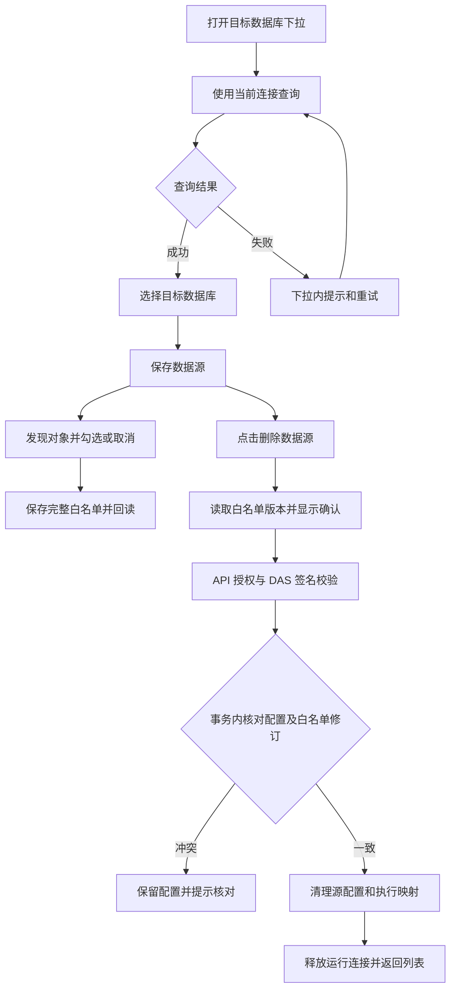

# 数据源交互与删除交付说明

2026-10-09。根据用户“ok”批准的[实施清单](数据源交互与删除实施清单.md)，完成下拉发现、白名单交互和数据源删除。

## 使用变化

- 目标数据库下拉打开时，自动使用已选数据库连接查询可访问目标；加载和失败提示在下拉内展示，失败可重试，也可手动填写目标。切换连接清空旧选择，发现请求按当前参数核对返回值。Oracle 的发现入口与目标配置放在同一表单中。
- 白名单统一为勾选表格，名称、类型、字段数和配置操作分列，支持搜索、分页、只看已选及直接取消。现有对象保留逻辑别名和物理映射，取消后重新勾选会恢复当前草稿配置；对象详情按需打开。修改先留在草稿，点击“保存完整白名单”提交并回读，空集合需确认。
- 数据源详情的保存旁增加删除按钮。确认中显示数据源和对象数量，说明后续查询影响。删除成功返回列表，版本冲突保留数据源并要求核对；回执异常时读取实际状态，避免自动重复删除。

## 删除边界

删除操作在 DAS 元数据库的同一事务中核对配置修订和完整白名单修订，然后清理该源的 `data_source_configs`、`exposed_source_objects` 和 `api_dataset_response_mappings`。成功后失效运行连接。白名单保存也核对源仍存在，防止删除与保存并发时留下孤立对象。

独立数据库连接及其密文、实际业务数据库、API 业务目录/指标/报表定义和历史审计继续保留。删除后新的查询无法取得运行配置；API 的数据源发现状态随 DAS 后续心跳更新。恢复业务查询需重新配置有效的数据源。

## 执行流程

## 改动文件

业务源码共 11 个文件，验证相关共 11 个文件。应用和共享包路径均相对于 `ai-data/`。

| 层       | 主要文件                                                                                                                                                               |
| -------- | ---------------------------------------------------------------------------------------------------------------------------------------------------------------------- |
| Web      | `features/data-management/components/source-form.vue`、`data-source-manager.vue`、`object-whitelist.vue` 和 `api/data-access-api.ts`。样式限定在对应组件。             |
| 共享合同 | `packages/contracts/src/data-access/data-source-management.ts`、`src/index.ts`：新增要求双修订的 `deleteDataSourceSchema`。                                            |
| API      | `apps/api/src/data-access/data-access-management-client.ts`：增加固定路径删除操作、参数及回执校验，复用现有授权路由注册。                                              |
| DAS      | 管理路由、`data-source-management-service.ts`、`sql-data-source-administration.ts`、`exposed-object-repository.ts`：签名入口、事务删除、运行连接失效及孤立白名单防护。 |
| 验证     | 新增删除合同测试与数据源浏览器专项；扩展管理服务、路由、SQL 集成、浏览器管理/连接回归及替身。                                                                          |

新增 API `POST /admin/data-access/services/:serviceId/data-sources/delete`，转发 DAS `POST /internal/admin/data-sources/delete`。请求包含 `source_id`、`expected_revision`、`expected_objects_revision`，响应确认 `source_id`。沿用管理权限、内部签名和响应禁止缓存；未引入迁移或依赖。

## 验证结果

| 检查           | 结果                                                                                                                                              |
| -------------- | ------------------------------------------------------------------------------------------------------------------------------------------------- |
| 普通测试       | API 742、DAS 464、Web 204、共享合同 205、元数据包 28、工程规则 42，共 1,685 项通过。                                                              |
| 真实 SQL       | DAS 隔离管理集成 9 项通过，包含删除保留连接密文、配置与白名单冲突、并发删除/保存、拒绝旧页面重新写入，以及原有真实 SQL Server 目标发现。          |
| 正式构建浏览器 | 数据源专项 4 项、数据库连接 6 项、原管理回归 8 项，共 18 项分批通过。覆盖取消后保存、恢复配置、清空、删除取消/冲突/回执丢失、亮暗主题和三种宽度。 |
| 类型与 lint    | API、DAS、Web、contracts、metadata 类型检查及全仓 ESLint 通过。                                                                                   |
| 格式           | 本轮改动格式及差异空白检查通过。全仓格式仍报告此前 19 个非本轮文件的问题，见[已有名单](数据库连接管理验收/全仓格式检查.log)。                     |
| 构建           | API/DAS 本地 `dist/index.js`、Web `dist/` 构建通过，Web 有已有的大分块提示。                                                                      |

删除服务用例先复现方法缺失，再实现并通过。浏览器初次失败来自测试定位到 Element Plus 隐藏原生输入、确认按钮名称不符，以及“只看已选”取消后行已消失；调整测试按可见控件和实际筛选行为验证后通过。

浏览器截图使用真实 Web 正式构建，管理数据为隔离测试替身；数据库事务和真实 SQL Server 连接由独立集成覆盖。SQL 写入仅发生在随机命名的临时 DAS 元数据库，测试结束按原隔离流程清理。当前用户数据源未被测试删除。

## 页面截图

- [数据库下拉自动查询](数据源交互与删除验收/数据库下拉查询.png)
- [桌面白名单](数据源交互与删除验收/白名单-1440.png)
- [暗色白名单](数据源交互与删除验收/白名单-暗色.png)
- [手机白名单](数据源交互与删除验收/白名单-390.png)
- [删除确认](数据源交互与删除验收/删除确认.png)

## 生效范围

源码和应用本地构建已更新。API 与 DAS 同时加载最新代码后，刷新 Web 即可使用删除功能；本轮未重启实际服务或更新发布目录。主代理单独实施，依赖操作、子代理、迁移均为 0，`ai-book` 未修改。
