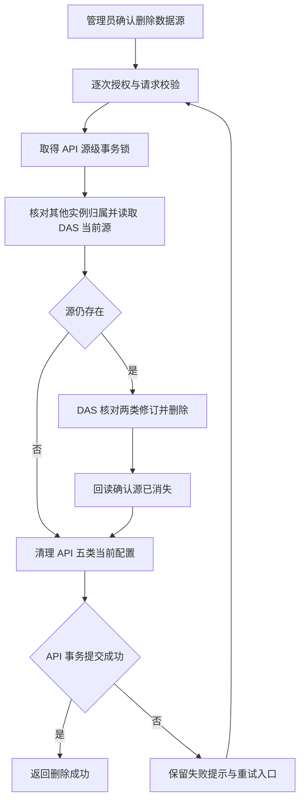
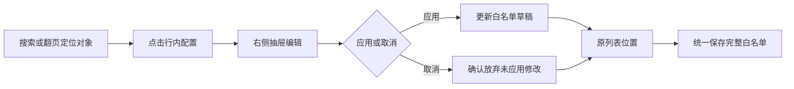
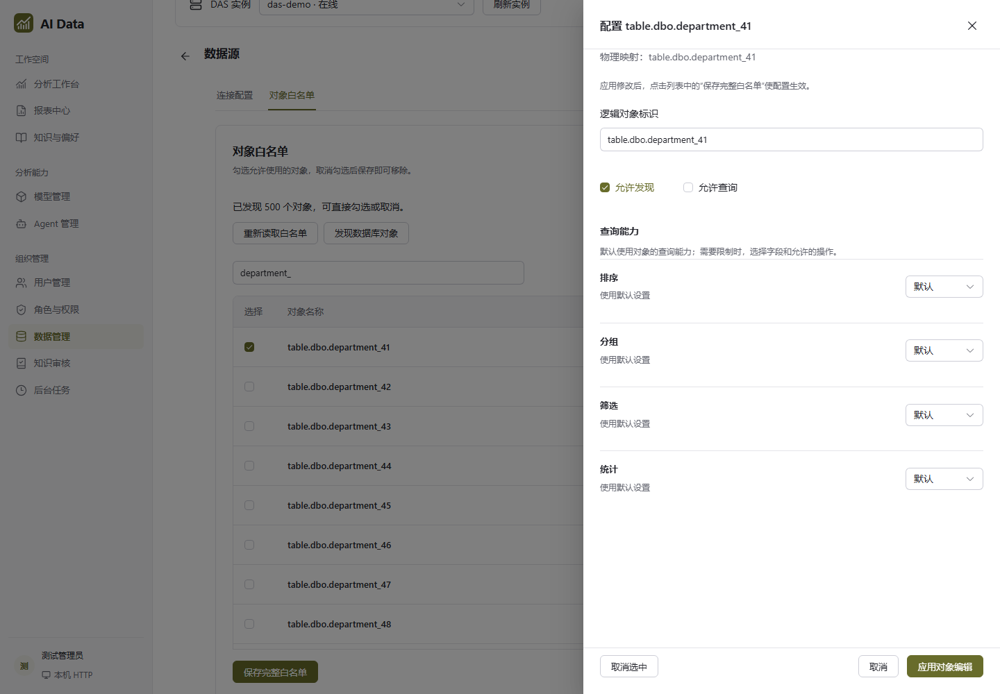

# 数据源删除清理与白名单抽屉交付说明

日期：2026-10-09。用户回复“两个一起改”，批准数据源删除同步清理 API 配置，以及白名单对象配置改用右侧抽屉。主代理单独实施，依赖操作为 0。

## 数据源删除

此前删除仅清理 DAS 的运行配置、白名单及执行映射，API 的业务目录仍保留。现在 Web 经 API 删除时，会在确认 DAS 数据源不存在后，同步删除目标 `source_id` 的以下当前配置：

| 表                        | 配置内容                           |
| ------------------------- | ---------------------------------- |
| `api_dataset_configs`     | 数据集业务说明、字段和查询能力配置 |
| `approved_relations`      | 对象关联关系                       |
| `role_object_permissions` | 对象访问权限                       |
| `role_column_permissions` | 字段访问权限                       |
| `role_row_policies`       | 行过滤策略                         |

API 五张表在同一本地事务内清理，失败一起回滚；DAS 和 API 为两个服务，恢复依靠回读及重试。接口成功响应表示本次 API 清理已提交。DAS 已删除而 API 清理失败时，再次提交同一删除请求可补完清理。Web 显示“删除待完成”和“重试删除清理”，不会仅凭 DAS 配置消失显示成功。

同名源的新建、更新、删除在 API 元数据库中使用事务级应用锁串行处理。API 目录按 `source_id` 共用；发现其他已注册 DAS 仍登记同名源时，删除返回冲突，要求核对归属。该保护以已登记的实例信息为依据；绕过 API 的直接数据库变更不受 API 生命周期锁协调。

独立数据库连接、业务库内容、历史策略快照、会话、查询证据、审计及指标和报表定义保留。历史策略快照不会作为当前权限重新装载。依赖已删除数据源的报表查询仍需有效的数据源和当前权限。

## 旧残留处理

本轮针对用户截图的 `危急值数据 → table.dbo.beds` 做了实际补清理：

1. 只读确认本地 DAS 不存在该数据源，API 注册表仅有配置对应的一个 DAS，且未登记该源。
2. 确认 API 中仅残留该对象的 1 条 `api_dataset_configs`；其余四类当前配置均为 0。
3. 在 DAS 事务中对该源的配置、白名单、执行映射做范围锁检查，确认三处均为空；使用本轮 API 清理仓储按固定 `source_id` 补清理。
4. 回读五张 API 表，目标数据源记录数均为 0。

这次实际删除的是截图中的 1 条目录配置。API/DAS 服务未重启；后续删除使用新逻辑，需要运行的 API 加载本轮代码。

## 白名单配置抽屉

点击对象行中的“配置”，打开宽度最多 600px 的右侧抽屉，窄屏适配视口。标题显示当前对象；正文独立滚动；底部固定“取消选中”“取消”“应用对象编辑”。

应用对象编辑进入当前白名单草稿，再由“保存完整白名单”提交。取消未应用编辑时先确认，其他对象草稿保留。列表沿已保存对象和发现结果保持稳定顺序，勾选不把对象移动到首行。应用、关闭后保留搜索、页码及页面位置。

截图来自实际 Web 构建产物的浏览器验收，管理接口使用隔离夹具。真实数据库清理由独立 SQL 集成测试及上述旧残留回读验证。

## 文件范围

- API 新增 `data-source-lifecycle.ts`、`sql-data-source-lifecycle.ts`；修改数据访问路由、应用依赖声明及装配，并给管理请求设置有界等待时间。
- Web 修改 `object-whitelist.vue`、`data-source-manager.vue`。
- 新增 API 删除协调、路由授权和 SQL 清理测试；调整对应路由测试夹具。
- 扩展 Web 数据管理夹具及浏览器测试，覆盖 500 个对象、编辑取消、列表位置、手机宽度、删除失败重试。
- 新增本交付说明及截图，追加交接入口。

## 验证结果

- API 全量执行 756 项：754 项通过，2 项原路由测试仍使用旧代理替身。调整为生命周期协调服务后，该文件 17 项复验全部通过。
- Web 单元测试 204 项通过。
- 新增 SQL Server 隔离集成 3 项通过：目标源清理与其他源/历史保留、失败回滚、同名管理操作串行。随机测试库已按测试流程关闭并删除。
- 数据源浏览器场景共 6 项，修正列表排序与位置保持后分次复验全部通过。手机尺寸断言等待组件尺寸过渡结束。
- API、Web 类型检查及本轮文件 ESLint、格式检查通过。
- API 与 Web 本地构建通过。Web 保留现有大分包提示。

旧记录补清理已生效。界面由 Web dev 热更新或重新加载 Web 产物生效；后续删除逻辑由 API 重新加载本轮代码生效。发布目录未更新。
