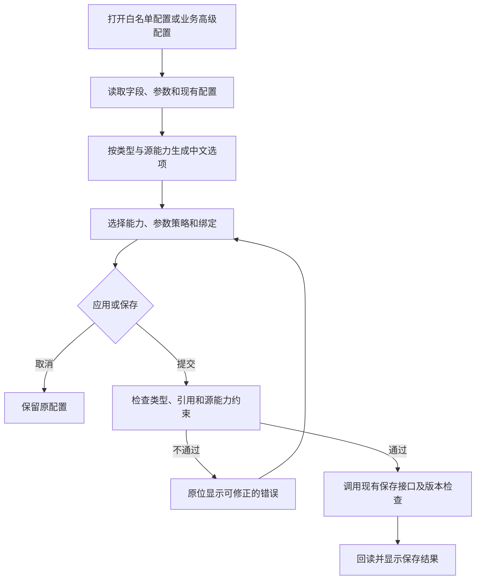

# 查询能力与业务高级配置可视化交付说明

日期：2026-10-09。

## 交付范围

用户指出白名单查询能力需要手写配置，并追加要求“包括业务与关系的高级配置也得改”。本轮按合并范围完成白名单查询能力，以及业务目录的查询能力、参数策略和权限参数绑定。

主代理单独实施，依赖操作为 0。改动集中在 Web，复用现有 API、合同校验和版本检查；数据库结构、API/DAS 服务及发布包未变更。验收使用隔离的管理接口数据，没有修改用户的实际业务配置。

## 页面操作

### 对象白名单

点击对象的配置按钮后，抽屉自动读取字段。排序、分组、筛选、统计分别提供“默认、自定义、禁用”，自定义时通过可搜索的字段多选框配置。中文及包含 `$` 的字段可正常选择。

筛选字段可选择允许的操作，并展开设置必填和默认值；统计字段可选择计数、去重计数、求和、平均、最大、最小等适用函数。选项依据字段类型生成。字段读取失败时可以在原位重试。

点击“应用对象编辑”更新页面草稿，再点击列表中的“保存完整白名单”持久化；取消抽屉编辑保持原配置。存储过程的完整定义编辑仍沿用现有入口。

### 业务目录与关系

对象详情的“高级能力与参数策略”内使用同一套查询能力控件，选项遵守数据源提供的能力范围。

参数策略自动列出可用参数、类型、源操作、必填要求和默认值。点击“自定义”后可选择操作、必填策略和默认值；点击“恢复默认”撤销该参数的覆盖。数值、布尔、日期和日期时间使用对应控件，支持保留 `0`、`false`、空值及未设置的区别。

权限参数绑定使用“输出字段—等于—输入参数”逐行选择，支持添加和移除。仅提供类型匹配且支持等值操作的参数，检查重复绑定；普通表或视图显示适用范围说明。配置通过原有“保存业务配置”提交。

无参数时显示说明；多参数列表支持搜索并限制列表高度。旧配置自动回显，失效引用保持可见并标注不可用，便于修正。

## 配置语义与校验

| 页面选择 | 保存语义                               |
| -------- | -------------------------------------- |
| 默认     | 删除该组覆盖，使用数据源默认或继承能力 |
| 自定义   | 保存选定字段及其操作、统计函数等设置   |
| 禁用     | 保存空数组，显式禁用该组能力           |

自定义列表清空后，保存含义同禁用。编辑默认模式不会自动扩展为所有字段。字段筛选、源能力限制和参数类型在前端检查，提交仍经过共享合同及现有后端校验。

保存保留无关的业务描述、关系、字段设置与权限策略。源参数已经要求必填时，业务层不能放宽为可选；源能力不允许的操作和函数不能被业务配置放开。

## 执行流程

## 文件清单

以下路径以 `ai-data/` 为根。

| 文件                                                                             | 主要作用                               |
| -------------------------------------------------------------------------------- | -------------------------------------- |
| `apps/web/src/features/data-management/stores/capability-editor.ts`              | 新增能力模式、可选项生成及参数约束校验 |
| `apps/web/src/features/data-management/components/query-capability-editor.vue`   | 新增排序、分组、筛选及统计编辑器       |
| `apps/web/src/features/data-management/components/capability-value.vue`          | 新增按类型编辑默认值的控件             |
| `apps/web/src/features/data-management/components/parameter-policy-editor.vue`   | 新增参数策略编辑器                     |
| `apps/web/src/features/data-management/components/permission-binding-editor.vue` | 新增权限参数绑定编辑器                 |
| `apps/web/src/features/data-management/components/object-whitelist.vue`          | 接入可视化编辑、字段自动读取与重试     |
| `apps/web/src/features/data-management/stores/object-selection.ts`               | 应用结构化能力草稿                     |
| `apps/web/src/features/data-management/components/catalog-form.vue`              | 业务高级配置接入三个可视化编辑器       |
| `apps/web/src/features/data-management/components/catalog-manager.vue`           | 保存时校验源元数据并在回读后刷新编辑器 |
| `apps/web/src/features/data-management/stores/catalog-draft.ts`                  | 克隆、校验并保存结构化业务配置         |
| `apps/web/src/features/data-management/stores/catalog-draft-types.ts`            | 移除独立的 JSON 文本草稿字段           |
| `apps/web/tests/features/data-management/capability-editor.test.ts`              | 新增能力、类型和参数绑定测试           |
| `apps/web/tests/features/data-management/config-preservation.test.ts`            | 验证旧配置及空值、零值、布尔值保留     |
| `apps/web/tests/support/management-fixture.ts`                                   | 增加可视化高级配置的隔离数据           |
| `apps/web/tests/e2e/visual-query-settings.spec.ts`                               | 新增真实浏览器操作、保存回读和布局验证 |

另新增本交付说明和验收截图，在 `任务交接/README.md` 追加入口。

## 验证结果

| 检查                                     | 结果                                                                                                             |
| ---------------------------------------- | ---------------------------------------------------------------------------------------------------------------- |
| Web 普通测试                             | 完整运行 41 个文件、215 项通过；随后补充一项配置保留测试，相关 2 个文件共 14 项再次通过。累计覆盖 216 个不同测试 |
| Web 应用与工具类型检查                   | 通过                                                                                                             |
| 本轮代码 ESLint、Prettier 与差异空白检查 | 通过                                                                                                             |
| Web 本地构建                             | 通过；保留现有大体积 chunk 提示                                                                                  |
| 原有数据源管理浏览器回归                 | 6 项通过，包含 500 对象抽屉、删除重试及中文/含 `$` 字段                                                          |
| 新增高级配置浏览器验收                   | 最新构建分批 3 项通过，覆盖白名单选择与取消、业务能力继承和禁用、参数及权限绑定保存回读                          |

浏览器测试使用已安装的 Playwright Chromium 和隔离管理接口，核对了亮色、暗色、桌面及 390px 手机布局。截图来自实际浏览器页面。

- [白名单查询能力](可视化高级配置验收/白名单查询能力.png)
- [业务能力手机布局](可视化高级配置验收/业务能力手机.png)
- [业务参数策略](可视化高级配置验收/业务参数策略.png)
- [权限参数绑定](可视化高级配置验收/权限参数绑定.png)

## 生效方式

正在使用 Web dev 时刷新页面即可。静态部署需使用本轮新构建的 Web 产物；本轮本地构建已完成，未执行发布。此次前端调整无需重启 API 或 DAS。
