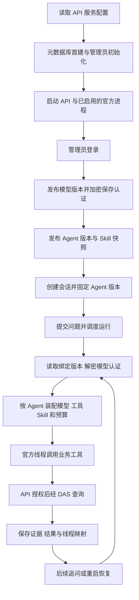

# 模型数据库配置交付说明

日期：2026-09-21。依据[已批准实施清单](模型数据库配置实施清单.md)，由主代理单独完成，依赖操作为 0。

## 交付结果

API 启动读取服务配置，业务运行读取数据库中的模型与 Agent 版本。空模型库可以先启动、登录，管理员随后通过 `POST /models` 发布模型、通过 `POST /agents` 发布 Agent。默认对话入口绑定 `default` Agent；首次发布成功后即可创建会话和执行分析。

`analysis_runtime` 保留 `enabled`、`state_directory`、`skills_directory`、`concurrency`、`poll_ms`。模型地址、模型名称、认证、上下文容量由模型版本保存；指令、工具、Skill 和预算由 Agent 版本保存。凭据继续使用现有 AES-256-GCM 加密，运行时按版本解密。已有会话、模型版本、加密主密钥和 Skill 快照继续复用。

项目的 `apps/api/config/api.config.json`、两份 API 配置示例及 `release/win32-x64/api/config/api.config.json` 已同步移除旧模型与预算字段。API bundle 已重新构建并同步到现有发布目录；API/DAS 发布配置示例已补齐。实际配置中的数据库连接、初始化管理员、启停、目录及调度参数按原值保留。

用户已自行删除开发库表；本轮 SQL 验证只创建、使用并清理随机隔离库。正式数据库随 API 下一次启动执行首建，模型与 Agent 由管理员发布。启动与完整 PowerShell 配置示例见[部署说明](../ai-data/DEPLOYMENT.md#首次发布模型与-agent)。

## 主要文件

| 范围                                                                | 改动                                                   |
| ------------------------------------------------------------------- | ------------------------------------------------------ |
| `apps/api/src/config/api-config.ts`                                 | 服务级配置严格校验，旧模型与预算字段不再接受           |
| `apps/api/src/agents/create-agent-configuration.ts`、`src/index.ts` | 启动装配配置服务，配置发布由管理接口负责               |
| `apps/api/src/runtime/create-analysis-runtime.ts`                   | 每次运行必须装配已绑定 Agent 和模型版本                |
| `apps/api/src/harness/`                                             | 官方进程可无初始模型启动，执行时要求有效模型配置       |
| API 配置、Harness、运行时和集成测试                                 | 空库启动、接口发布、版本、认证、官方协议及恢复验证     |
| `dialogue-model-fixture.ts`                                         | 显式真实模型验收从已有数据库读取配置与凭据             |
| `release.integration.ts`                                            | 经管理接口发布模型与 Agent，程序更新按发布文件清单复制 |
| 配置示例、实际配置和发布 API bundle                                 | 同步新的服务运行参数结构                               |
| 运行说明、部署说明、测试记录、设计与交接入口                        | 同步配置来源、首次操作和验证结果                       |

## 执行流程

## 验证结果

- 普通与工程测试：1221 项通过，其中 API 581、DAS 409、contracts 168、metadata 28、工程 35。
- API SQL、确定性对话和构建启动：70 项通过，真实模型专项 1 项按既定调优安排跳过。
- Windows x64 独立发布专项：1 项通过。包含空库启动、模型与 Agent 接口发布、认证、Skill 子文档、真实 SQL 查询、更新后配置及状态哈希保持一致、同一官方线程恢复。
- API、DAS、contracts、metadata 类型检查通过；API 当前生产 bundle 构建通过。
- 全工作区 ESLint、本轮文件格式与 `git diff --check` 通过；13 份文档的 156 个本地文件链接检查通过。全量格式检查仅报告既有 `pnpm-lock.yaml` 格式差异，锁文件保持原样。
- 项目和发布目录的 5 份 API 配置均通过当前 Schema 校验；发布 API bundle 与最新构建哈希一致。

发布测试初次复验因来源目录包含实际配置而触发配置保留断言。夹具现按部署说明只复制程序资源及示例，修正后复验通过。测试期间的临时实例和隔离 SQL 库已清理。

本轮验证使用固定 Responses 夹具。真实模型的最终业务回答与调优继续按既有安排验收；其他五种平台目标沿用打包规则，实机启动仍待对应环境验证。
