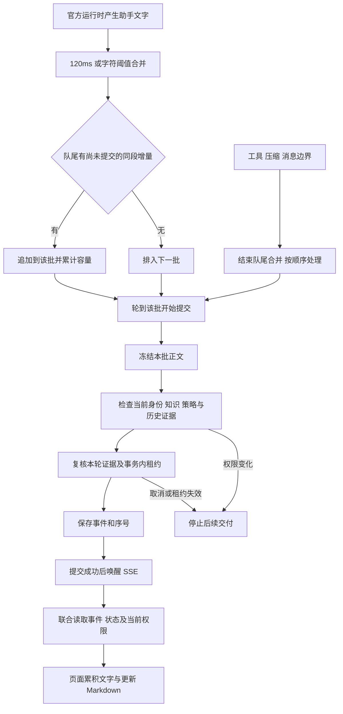

# 流式输出性能修复交付说明

日期：2026-10-08。用户回复“开始”，按[实施清单](流式输出性能修复实施清单.md)由主代理完成。依赖安装、升级、卸载和子代理数量均为 0。

## 交付结果

助手文字在提交较慢时，会合并队尾尚未执行的同段增量，避免固定小片段不断积压。权限复核、数据库持久化、提交后 SSE 唤醒及恢复序号继续生效。

相同的慢提交模拟中，90 字按每秒 30 个增量输入、每批提交固定耗时 250ms：

| 指标                 |  修复前 |  修复后 |
| -------------------- | ------: | ------: |
| 输入全部结束         | 3,003ms | 3,002ms |
| 最后一个增量提交     | 6,030ms | 3,372ms |
| 输入结束后的文字拖尾 | 3,027ms |   370ms |
| 完整消息校准结束     | 6,294ms | 3,633ms |
| 输入结束时已提交字数 | 41 / 90 | 73 / 90 |
| 总提交批数           |      24 |      14 |

正常 30ms 提交对照也保持实时：最后一个增量在输入结束后 47ms 提交。完整数据见[队列性能对照](流式输出性能验收/队列性能对照.json)。该对照隔离验证队列行为；模拟字数和用户模型日志中的 tokens 口径不同。

## 主要改动

1. `codex-session-router.ts`：只合并尚未开始提交的相邻同消息、同阶段增量；回调开始后正文保持稳定。工具、压缩、其他消息和完成事件结束当前合并区间。保留 64,000 字符单段、128 项队列和 512,000 字节在途限制，合并文字参与容量计算。
2. `sql-runtime-repository.ts`、`runtime-types.ts`、`analysis-executor.ts`：把既有身份、组织策略、运行配置的指纹算法提取为专用读取，流式复核从原先五次查询缩为一次策略查询；完整输入仍用于启动和恢复。历史运行逐次复核，本轮证据由消息或最终提交服务复核。
3. `analysis-run-service.ts`：消息提交刷新一次身份后，用同一当前身份读取状态、复核证据并进入租约事务；联合读取事件与状态在事件读取后检查当前身份和证据。
4. `analysis-routes.ts`、`app-types.ts`：SSE 每轮使用一次联合读取结果，避免额外重复读取状态和复核证据。初次订阅仍检查归属和游标；提交唤醒、一秒兜底、每页 200 条回放及终态追平继续生效。
5. 更新对应 API 测试、路由和浏览器夹具。真实模型与浏览器时序支持 `ANALYSIS_STREAM_ACCEPTANCE_DIRECTORY` 指定本次验收目录，保留原有验收记录。

HTTP 接口、SSE 事件结构和数据库结构保持兼容。API bundle 已重新生成；启动或重启使用本工作区源码或最新 bundle 的 API 后生效。独立部署实例需要更新其 API 程序。

## 执行流程



## 验证结果

| 检查                  | 结果                                                                                                                                      |
| --------------------- | ----------------------------------------------------------------------------------------------------------------------------------------- |
| TDD 首次运行          | 新增的 5 个目标用例失败，分别暴露慢提交拖尾、队列积压、重复身份刷新、缺少联合读取和重读完整输入；原有 27 项通过。                         |
| API 普通测试          | 90 个文件、712 项通过。覆盖慢提交、在途正文稳定、长时间阻塞合并、工具与压缩顺序、取消和提交失败、证据撤销、租约、SSE 唤醒与多页终态回放。 |
| 工程规则              | 42 项通过。                                                                                                                               |
| 隔离 SQL 与确定性对话 | 23 项通过，真实模型项在该次默认运行中跳过；验证指纹一致性、持久化事件恢复、授权、租约、事务回滚及 API→DAS→SQL 对话。                      |
| 真实 rj 模型专项      | 1 项通过：授权科室 SQL、流式正文、关闭官方进程后恢复同线程追问成功，追问复用证据。                                                        |
| 生产 Web 浏览器       | 3 项通过：流式文字/工具/最终正文顺序及刷新恢复，生成中取消及账号切换，认证刷新/断流游标恢复及权限收窄。                                   |
| 工程检查              | API 类型、修改文件 Lint/Prettier 和 diff 空白检查通过；API bundle、Web 生产构建通过。Web 构建保留既有大块资源提示。                       |

本轮数据库验证使用随机隔离库，测试结束已执行清理。实际模型配置从现有库只读加载，复制到隔离库验收；临时模型状态目录已清理。

### 真实模型时序

本次 rj 首轮约 62.1 秒完成，第一段正文在约 51.8 秒进入提交回调，最终正文提交在约 61.6 秒结束。记录 27 个增量、484 字符；单批回调平均 338ms，中位数 269ms，最大 737ms。待处理片段在这类慢提交过程中持续合并。

`received_ms` 记录开始执行提交回调的时间，回调耗时包括复核与落库；它不包含模型输出到回调开始前的等待。因此真实时序用于确认实际链路与提交成本，队列拖尾改善使用上述固定输入对照衡量。原始记录见[真实模型时序](流式输出性能验收/真实模型/真实模型流式时序.json)。

### 验证中的环境问题

- 首次真实模型探测 `/v1/models` 被沙箱以 `EACCES` 拒绝，未开始生成；原始失败时序保存在[首次记录](流式输出性能验收/真实模型流式时序.json)。内网权限获准后，第一次准备临时 Skill 目录遇 Windows `EPERM`；随后相同隔离专项重试通过。
- 首次开发模式浏览器验收有 2 项通过，完整流式场景在打开登录页时超过 30 秒，尚未进入问答。构建 Web 后改用生产预览，场景总预算设为 60 秒，三项通过；页面行为断言保持原要求。

浏览器使用隔离夹具和真实 HTTP/SSE 路由，数据与 rj 专项分别验证。[浏览器时序](流式输出性能验收/浏览器/浏览器流式时序.json)记录页面异常为 0；[最终页面](流式输出性能验收/浏览器/07-最终完成.png)与[展开过程](流式输出性能验收/浏览器/08-展开分析过程.png)均为 1920×1080。

## 复验命令

API 目录 `ai-data/apps/api`，使用现有依赖：

```powershell
node node_modules/vitest/vitest.mjs run --maxWorkers=1
node node_modules/typescript/bin/tsc -p tsconfig.json --noEmit
node node_modules/vitest/vitest.mjs run --config vitest.integration.config.ts tests/integration/analysis.integration.ts tests/integration/dialogue.integration.ts
```

显式启用真实模型专项时：

```powershell
$env:LOCAL_MODEL_ACCEPTANCE='1'
$env:ANALYSIS_STREAM_ACCEPTANCE_DIRECTORY='D:/porject_new_2026/ai-data/任务交接/流式输出性能验收/真实模型'
node node_modules/vitest/vitest.mjs run --config vitest.integration.config.ts tests/integration/dialogue.integration.ts -t '本地模型通过'
```

Web 目录 `ai-data/apps/web`：

```powershell
node node_modules/vite/bin/vite.js build
$env:WEB_E2E_PREVIEW='1'
$env:ANALYSIS_STREAM_ACCEPTANCE_DIRECTORY='D:/porject_new_2026/ai-data/任务交接/流式输出性能验收/浏览器'
node node_modules/@playwright/test/cli.js test tests/e2e/analysis-stream.spec.ts tests/e2e/analysis.spec.ts --grep '真实 HTTP|生成中取消|事件认证刷新与断流' --timeout=60000
```
