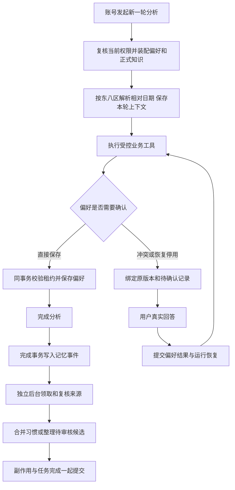
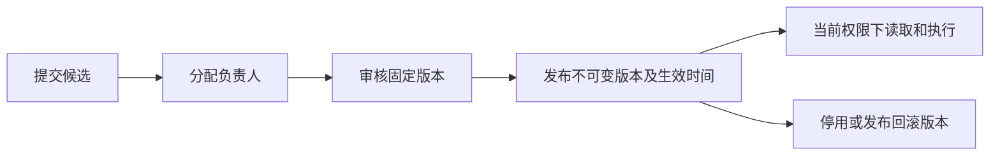

# 第 10 步交付：知识审核、账号记忆与后台任务

日期：2026-09-20。用户“开始做第十步”批准了实施清单及两个子代理；主代理负责共享合同、首建结构、运行接入、后台队列和总体验收，两个子代理分别完成账号记忆、知识与指标领域。

## 交付内容

- 同一组织、同一账号跨会话和 Agent 使用个人偏好。一般保存直接生效，冲突或恢复停用设置时才确认；用户当前明确要求修改时直接执行。
- 保存相对时间语义、来源、使用次数和自动应用开关。每轮按东八区重算“本年”等范围；当前明确条件优先，临时查询不覆盖默认。
- 偏好确认绑定真实账号与原版本。保存、确认与运行租约协调，重复回答幂等；确认处理后，恢复执行不会重复提出原问题。
- 企业规则和指标采用候选、负责人、固定版本审核、不可变发布版本、生效时间、停用与回滚。现有 `/admin/metrics` 改为提交待审候选。
- 成功完成分析时事务入队。后台独立限流、租约接管、退避重试和失败重派；副作用与完成状态共用事务。
- 记忆和知识参与线程上下文摘要，运行保存实际使用的版本和日期范围。四个新增工具可由新 Agent 版本选择。

接口和配置详见 [MEMORY-KNOWLEDGE.md](../ai-data/MEMORY-KNOWLEDGE.md)。

## 文件范围

| 模块       | 主要文件                                                                      |
| ---------- | ----------------------------------------------------------------------------- |
| 共享合同   | `packages/contracts/src/memory/`、`knowledge/`、运行澄清及 SSE 合同、公共出口 |
| 账号记忆   | `apps/api/src/preferences/`、`routes/preference-routes.ts`                    |
| 企业知识   | `apps/api/src/knowledge/`、`metrics/`、知识和指标路由                         |
| 后台与权限 | `apps/api/src/memory/`、`config/memory-task-config.ts`、任务管理路由          |
| 分析接入   | `analysis-runs/`、`runtime/`、应用入口与依赖装配、管理员权限初始化            |
| 首建结构   | `apps/api/migrations/001_initial_api_schema.sql`                              |
| 验证       | 合同、领域、HTTP、运行时、SQL、构建启动测试及业务测试准备                     |

路径相对 `ai-data/`。沿用已安装依赖。第 10 步新增结构继续归入 `001`，包括偏好/来源/审计、知识/发布、记忆事件和 `analysis_memory_contexts`。

## 执行流程

## 验证记录

普通/合同及工程测试共 1145 项：API 534、contracts 159、metadata 28、DAS 409、工程规则 15。API 完整类型检查和相关包类型检查通过；工作区 ESLint 通过。API 与 DAS 构建成功。

SQL 与确定性对话共 55 项通过：原 API SQL 27、偏好 SQL 6、知识 SQL 6、记忆事件及对话衔接 SQL 11、确定性 API→DAS→SQL 对话 4、构建产物启动及 HTTP 功能验收 1。真实模型用例 1 项按既定安排跳过。首建和失败回滚专项另有 4 项通过，28 项未选中的 DAS 查询测试不计入此专项。

关键场景包括同账号跨会话读取、相对时间跨年、停用后重复观察、来源去重、并发版本冲突、拒绝及重复确认、确认后恢复、取消后迟到写入、审核后修改失效、未来版本、停用回滚、同连接事务授权、多执行器接管、失败回滚与重试。构建产物经过登录、创建固定 Agent 会话、偏好保存读取、知识提交审核发布及任务管理读取。

初次联调发现 SQL Server 事务内并发授权读取不兼容，已用串行执行器修复并复验业务 SQL。Windows 测试清理遇到官方运行时暂时占用 SQLite 文件，清理加入有限重试后启动验收通过，遗留测试目录已清理。普通测试最初出现一次文件改名占用及协议超时，在降低测试并发后通过，最终按项目单 Worker 配置全量复验通过。

全量格式检查中的既有 `pnpm-lock.yaml` 差异保持原样；本次源码和文档单独检查。所有 SQL 验证使用隔离库，现有开发库未重建。

## 后续衔接

代码与首建结构按第 10 步交付，当前开发库仍属于旧基线，使用新首建需单独重建开发库。真实本地模型的工具选择调优和完整业务复验沿用用户此前安排。本阶段为 API 与共享合同，Web 页面按产品阶段接入上述接口。

后续顺序为第 9 步剩余的报告、画布与导出，实施前沿用项目清单审核规则。
