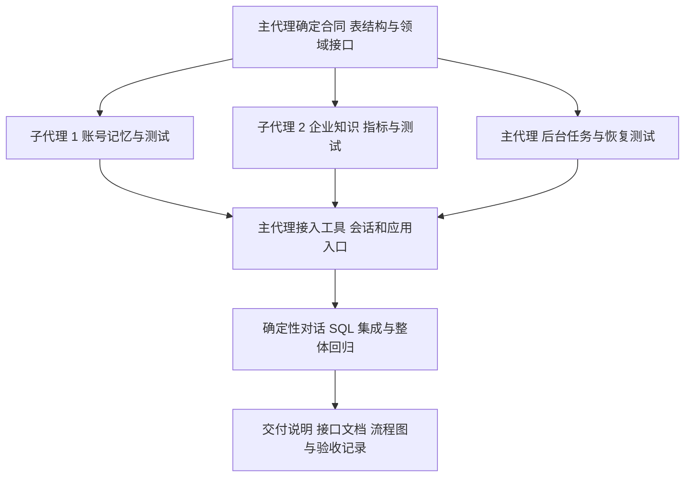
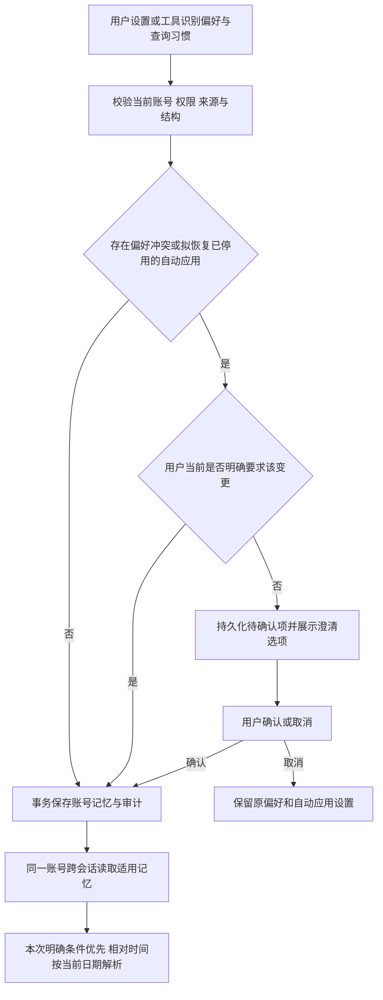
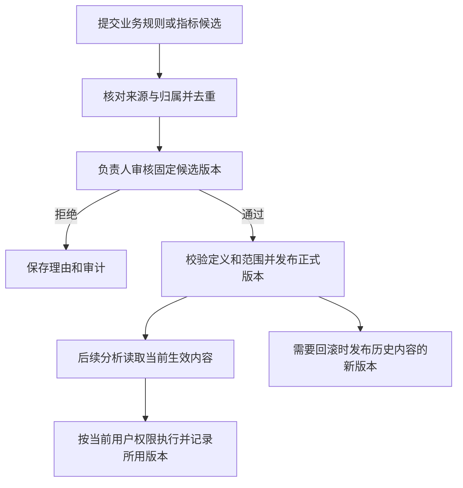
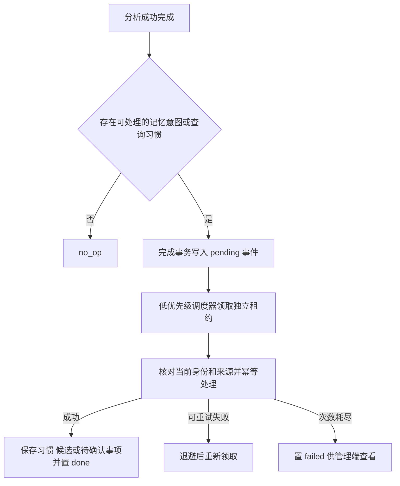

# 第 10 步：知识审核、记忆与后台任务实施清单

日期：2026-09-20。状态：用户回复“开始做第十步”批准本方案与两个子代理分工，现已实现并完成代码验收，见[交付说明](第10步交付说明.md)。执行顺序为第 8 步 → 第 10 步 → 第 9 步剩余内容。

## 1. 目标与现状

本阶段让同一账号的偏好与常用查询习惯可以跨会话使用，让企业口径经过审核、发布和版本管理后进入分析，并可靠处理对话产生的记忆任务。主要影响 API、共享合同和 API 元数据库。

| 能力       | 已核对实现                                                                                      | 本阶段补充                                         |
| ---------- | ----------------------------------------------------------------------------------------------- | -------------------------------------------------- |
| 指标定义   | `MetricService`、`SqlMetricRepository` 已有不可覆盖的连续版本、固定时间依据、查询校验和执行证据 | 候选、负责人审核、发布状态、生效范围和回滚         |
| 指标发布   | `POST /admin/metrics` 当前直接发布                                                              | 接入统一审核流程，正式读取和执行选择已发布版本     |
| 会话上下文 | 已有消息、澄清回答、历史证据、当前权限复核和官方线程恢复                                        | 装配当前可用的已发布知识与用户偏好，并处理版本变化 |
| 用户偏好   | 尚无对应表、服务、路由和模型工具                                                                | 自动保存和读取、冲突确认、修改、删除与审计         |
| 企业知识   | 尚无候选、审核记录和发布服务                                                                    | 候选去重、审核、版本发布、范围过滤与追溯           |
| 后台记忆   | 尚无 `memory_events`；已有前台分析派发与租约模式                                                | 独立任务状态、领取、续租、重试、幂等和恢复         |

依据：`需求文档/requirements.md` 第 8–10 节、`technical-design.md` 第 8/11 节、`api-implementation-plan.md` 第 10 步及 `development-checklist.md` 第 7 节。

## 2. 拟实施范围

### 2.1 账号偏好与跨会话记忆

- 按组织和用户账号保存默认指标、常用筛选、查询习惯及展示偏好，供同一账号的新旧会话读取；会话和 Agent 版本仅作为来源，不作为个人记忆的所有权边界。不同组织和账号分别隔离，每次使用复核当前权限。
- 每类使用严格结构，保存适用业务范围、来源消息及运行、版本、更新时间；查询习惯还记录规范化条件、使用次数和最近使用时间。相同含义重复出现时合并来源和次数。
- 提供当前用户的偏好读取、保存和删除 API，支持管理是否自动应用。用户通过管理接口主动修改，或在对话中明确要求设置、替换、停用时，直接执行该项操作。
- 增加 `get_user_preferences`、`save_user_preference` 工具。一般偏好可由模型直接调用保存并在适用时使用；首次保存无需确认，保存同步完成。普通查询中反复出现的时间、指标、范围和分组习惯也可跨会话记忆。
- 只有拟保存的默认值与已有偏好冲突，或用户曾要求不要默认应用该项而本次拟重新启用时，才复用现有澄清流程确认；用户当前已明确要求这项变更时直接执行。保存“不要默认这样算”的要求同样无需确认，后续重复查询不能自行恢复自动应用。
- 需要确认时，记录关联当前用户、运行、原偏好版本、拟变更内容摘要和一次性标识；真实回答同意后提交，拒绝则保留原偏好及自动应用设置。模型传入 `confirmed: true` 不能替代这类确认；重复提交幂等，版本或归属不符时拒绝。
- “本年”“本月”等保存相对时间语义及业务时区，每次使用由 API 按东八区和当前日期重新解析；明确的“2025 年”等固定范围保持固定。记忆引用查询方法和条件，实际数值通过当前授权查询获取。
- 默认值在本次问题及当前会话缺少对应明确选择时补充，并在查询条件中说明实际采用的范围。一次性的明确条件只影响本次查询，不能因此覆盖账号默认值；常用习惯按对应业务场景使用。
- 默认筛选只能收窄当前用户可访问范围；指定指标需验证当前版本及访问权。用户停用自动应用后仍可在某次查询明确使用该条件，本次使用不等于重新启用默认。

### 2.2 企业口径与知识审核

- 第一版候选包括结构化指标定义和业务规则说明，关联提交者、负责人、适用范围、来源消息、运行、指标版本及证据引用。
- 普通用户可提交和查看自己的候选；负责人在被分配的范围内审核、发布，系统管理员可管理分配并代审。拟新增 `knowledge:manage` 功能权限承载知识管理入口。
- 采用负责人单级审核，记录接受/拒绝意见、操作者和时间；内容修改形成新候选版本，旧审核结果不能直接用于修改后的内容。
- 审核后的发布形成不可覆盖的正式版本，保存生效时间和组织、数据源、对象或指标适用范围。查询默认选择当前生效版本；未发布候选只用于审核，不进入正式口径读取。
- 回滚通过发布引用历史内容的新版本完成，保留原发布和执行记录。停用后不再进入新分析上下文。
- 相同内容按组织、类型、适用范围和规范化内容摘要去重，追加来源支持记录；支持次数不会自动发布或提升权限。
- 候选与正式知识的来源引用按当前权限读取；发布内容保存规则和方法，查询结果及原始数据继续由既有证据权限控制。

### 2.3 现有指标接口接入

- 保留 `metric_definitions` 的历史版本、固定时间依据与查询校验，增加负责人、发布状态、适用范围和生效版本元信息。
- **接口行为调整**：现有 `POST /admin/metrics` 从直接发布改为提交待审指标候选，响应返回候选标识和审核状态；正式写入指标版本统一由审核发布服务完成。同步调整对应调用约定和测试。
- `GET /metrics`、`GET /metrics/:id` 和指标执行接口使用已发布、已生效且当前用户可访问的定义；指定历史版本仍校验其发布状态与权限。
- 发布时验证引用对象、字段、维度和固定时间依据；执行时继续复用当前授权链路与确定性计算。

### 2.4 运行上下文与 Agent 工具

- 将已发布企业口径、当前会话已确认条件和当前用户偏好作为带来源、版本的结构化数据装配，读取优先级沿用需求：企业口径 → 会话确认 → 用户默认 → 历史案例 → 模型推断。
- 新会话按当前账号加载适用偏好与常用查询习惯，遵守自动应用设置。本次明确条件优先于个人默认；相对时间在执行前重新解析，记录实际日期范围及所用记忆版本。
- 首版装配当前已实现的前三层。历史案例继续使用既有证据关联，案例沉淀功能后续另行安排。
- 补充已发布业务规则的查询工具和 `create_knowledge_candidate`；指标仍通过既有指标工具读取与执行。
- 新工具注册到资源目录，由新的 Agent 配置版本选择；已有 Agent 版本及工具清单保持固定。
- 偏好或已发布知识版本变化纳入运行上下文摘要。后续轮次按新版本装配；必要时使用新官方线程，并复用经当前权限验证的业务历史。
- 普通数据查询继续由 API/DAS 校验对象、字段、行权限和查询合同，知识与偏好不能扩大数据权限。

### 2.5 后台记忆任务

- 对话工具提交结构化记忆意图，成功查询的受控条件可形成查询习惯记录；成功完成分析时按规则筛选并写入 `memory_events`。入队与运行完成记录保持事务一致，后台处理在回答提交后进行。
- 普通查数可记录适用场景内的查询习惯并累计频次；单次临时筛选不自动替换个人默认，闲聊、猜测及失败或取消的分析不提炼为长期知识。无可处理意图或查询习惯时为 `no_op`。
- 后台处理包括来源核对、去重、查询习惯合并、候选整理和审计；企业规则输出为待审核候选。工具直接保存的个人偏好以同步写入结果为准，后续分析失败不撤销已成功提交的独立设置操作。
- 后台合并遵守与同步工具相同的版本、偏好冲突和自动应用规则；发现冲突时保留待确认事项供后续对话处理，不能覆盖已有默认或恢复已停用的自动应用。习惯频次本身不代表修改既有偏好的授权。
- 任务状态采用 `pending → processing → done/failed`；保存独立租约、递增执行代次、尝试次数、下次重试时间和幂等键。
- 领取及副作用提交使用 SQL 事务；过期租约可回收，旧执行器不能提交；重复处理不重复创建候选或支持记录。达到重试上限后可由管理员查看和重试。
- 在同一 API 进程运行独立调度器，默认并发 1、限量领取、独立执行超时；前台繁忙时延后领取，关闭服务时停止领取并释放在途租约。
- 首版处理结构化意图及已有来源，使用 SQL 和确定性业务规则，不新增后台模型调用。任务保存身份引用，执行时重新验证用户状态、组织及资源权限。

## 3. 接口与数据对象清单

接口命名在实现中保持现有风格，拟增加以下分组：

| 分组                          | 能力                                                     |
| ----------------------------- | -------------------------------------------------------- |
| `/me/preferences`             | 当前账号偏好与查询习惯读取、按键保存、删除和自动应用设置 |
| 既有运行澄清回答接口          | 处理偏好冲突或恢复自动应用的确认，提交后继续原运行       |
| `/knowledge-candidates`       | 提交、读取个人候选、补充来源或撤回未发布候选             |
| `/admin/knowledge-candidates` | 负责人分配、审核、拒绝与发布                             |
| `/knowledge`                  | 当前用户可用的已发布业务规则及指定版本                   |
| `/admin/knowledge`            | 正式规则版本、适用范围、停用与回滚                       |
| `/admin/memory-events`        | 任务状态与脱敏错误读取、失败任务重试                     |
| 既有 `/admin/metrics`         | 提交指标候选，正式发布走上述审核服务                     |

新增数据库对象按职责包括：`user_preferences`、查询习惯与来源记录、条件确认/记忆意图记录、`knowledge_candidates`、候选来源支持记录、`knowledge_reviews`、正式知识版本与发布记录、指标发布元信息和 `memory_events`。个人记忆保存适用场景、相对或固定时间语义、自动应用设置及使用信息；所有可访问记录携带组织归属，个人内容同时携带用户归属；事件及写操作保存幂等标识。

## 4. 文件影响与依赖

以下路径相对于 `ai-data/`：

| 变更      | 路径/模块                                                                | 目的                                       |
| --------- | ------------------------------------------------------------------------ | ------------------------------------------ |
| 新增      | `packages/contracts/src/memory/`、`src/knowledge/` 及对应 `*-types.ts`   | 偏好、确认、候选、审核、发布与任务合同     |
| 修改      | `packages/contracts/src/metrics/`、`src/analysis-runs/`、`src/index.ts`  | 指标发布元信息、确认关联与公开导出         |
| 修改      | `apps/api/migrations/001_initial_api_schema.sql`                         | 在完整首建中补充第 10 步表、约束与任务索引 |
| 新增      | `apps/api/src/preferences/`、`src/knowledge/`、`src/memory/`             | 服务、仓储、状态与后台调度                 |
| 新增/修改 | `apps/api/src/routes/`、`src/metrics/`                                   | 新 API 和指标审核发布入口                  |
| 修改      | `apps/api/src/analysis-runs/`、`src/runtime/`                            | 偏好确认、完成入队、工具与上下文装配       |
| 修改      | `apps/api/src/config/`、`src/app-types.ts`、`src/app.ts`、`src/index.ts` | 调度配置、依赖装配及服务启停               |
| 新增/修改 | contracts/API 对应单元测试和 `tests/integration/`                        | 新行为、事务与恢复验收；更新迁移清单断言   |
| 修改      | 需求、接口说明、`TESTING.md` 与任务交接                                  | 最终合同、操作流程、验证记录和流程图       |

不预计删除既有业务模块。依赖使用当前 Zod、dayjs、SQL Server 仓储与 Node.js 能力，无需安装、升级或卸载依赖。当前范围是 API 与共享合同；DAS 查询协议及 Web 页面保持原阶段安排。

### 4.1 执行分工与子代理申请

建议启用 **2 个子代理，加主代理共 3 个执行者**。账号记忆和企业知识可按领域独立实现；共享合同、迁移、运行状态与应用装配由主代理统一负责。以下分工已随实施方案获准。

下表路径相对于 `ai-data/`，新文件名为拟定名称：

| 执行者             | 业务职责                                                                                         | 文件范围与交付                                                                                                                                                                              |
| ------------------ | ------------------------------------------------------------------------------------------------ | ------------------------------------------------------------------------------------------------------------------------------------------------------------------------------------------- |
| 子代理 1：账号记忆 | 个人偏好、查询习惯、相对时间解析、自动应用设置、冲突检测与确认提交                               | `apps/api/src/preferences/`、新增 `src/routes/preference-routes.ts` 及对应单元、路由、独立 SQL 集成测试；交付服务、仓储和 HTTP 路由                                                         |
| 子代理 2：企业知识 | 候选去重、负责人审核、版本发布、停用回滚、指标发布和有效版本选择                                 | `apps/api/src/knowledge/`、`src/metrics/`、新增 `src/routes/knowledge-routes.ts`、既有 `src/routes/metric-report-routes.ts` 的指标部分及对应测试；交付知识服务、仓储与指标接入              |
| 主代理             | 共享合同、SQL 首建、身份与工具接入、条件确认的会话衔接、记忆任务、事务入队和调度、总体审查与验收 | `packages/contracts/`、`apps/api/migrations/001_initial_api_schema.sql`、`apps/api/src/memory/`、`src/analysis-runs/`、`src/runtime/`、资源目录注册、配置与应用入口、共享测试准备和交付文档 |

主代理先确定输入输出、错误码、表结构、版本检查及事务协作接口，完成相应合同测试并提供给两个子代理。每个子代理按 BDD → 失败测试 → 实现 → 领域回归交付。需要调整共享合同、表或公共文件时，先反馈主代理统一修改；超出本清单的变化仍提交用户审核。

两个子代理的实现阶段与主代理的后台任务开发并行；子代理交付后由主代理接入和审查。数据库集成与整体回归由主代理统一调度。此次申请只覆盖表中两个领域任务，后续追加派工按项目规则另行审核。

### 4.2 实施顺序与完成标准

| 阶段                | 实施内容                                                                                                                     | 完成标准                                                                               |
| ------------------- | ---------------------------------------------------------------------------------------------------------------------------- | -------------------------------------------------------------------------------------- |
| 1. 合同与数据库基础 | 将第 6 节场景落实为合同测试，定义个人记忆、候选审核、发布与后台任务合同；完善 `001` 首建结构及约束，确定跨模块服务和事务接口 | 合同非法输入被拒绝；隔离库建表与约束测试通过；两个子代理获得一致接口和文件范围         |
| 2. 三路并行实现     | 子代理 1 实现账号记忆；子代理 2 实现企业知识与指标接入；主代理实现 `memory_events` 仓储、租约、重试和独立调度器              | 各模块先验证目标测试失败，再使对应业务测试通过；来源、组织归属、版本与幂等规则可验证   |
| 3. 对话与运行接入   | 注册偏好和知识工具；每轮装配当前账号记忆和已发布知识；接入按需确认、动态日期解析、成功完成事务入队、配置和启停               | 新会话可使用同账号记忆；当前明确条件优先；冲突确认后继续原运行；回答提交与后台入队一致 |
| 4. 接口与恢复验收   | 验证偏好管理、候选审核、指标新入口、跨用户隔离、权限变化、并发更新、重复提交、进程重启与租约接管                             | 第 6 节关键场景通过确定性对话及隔离 SQL 集成；旧执行器无法重复提交副作用               |
| 5. 回归与交付       | 运行工程及相关包测试、类型、Lint、格式与构建检查，核对最终合同和文档                                                         | 交付实现清单、接口行为变化、流程图和真实验证记录；保存到任务交接目录并更新测试说明     |

阶段 1 的范围和接口确定后再启动两个子代理。验收使用当前已安装依赖和隔离测试数据；依赖操作由用户执行。第 10 步业务实现及派工已获准，按上述顺序推进。

## 5. 执行流程

## 6. BDD/TDD 与验收

先按下列场景补测试并确认目标失败，再实现对应行为；已有权限、查询、会话恢复和模型凭据测试继续回归。

| 场景                                             | 验收结果                                                                    |
| ------------------------------------------------ | --------------------------------------------------------------------------- |
| 工具首次保存无冲突的个人偏好，随后同账号新建会话 | 直接保存和使用；其他用户及组织不可读取，同账号不受来源会话或 Agent 版本限制 |
| 常查本年数据，跨会话或跨年后再次使用该习惯       | 同账号记住查询语义与场景；按当前日期和东八区重算范围，重新取数              |
| 记忆为相对时间或明确固定年份，时钟跨过年末       | 相对年份随当前年变化；固定年份保持不变，执行记录含解析后的日期范围          |
| 本次指定不同时间或临时筛选                       | 本次明确条件优先；不会把临时选择直接覆盖为账号默认                          |
| 保存与已有偏好冲突，或拟恢复用户已停用的自动应用 | 需要确认；拒绝或伪造确认时保留原偏好及设置；当前已明确要求变更时直接执行    |
| 用户要求不要默认使用，随后再次查询相同条件       | 立即保存停用设置；可完成本次查询，重复次数不会恢复自动应用                  |
| 相同习惯重复出现、同一操作重试或偏好并发修改     | 合并来源与频次；重试不重复计数，版本冲突不覆盖其他有效更新                  |
| 企业正式口径、会话条件和个人默认冲突             | 按既定优先级装配；企业指标固定规则继续由服务执行                            |
| 候选尚未审核、被拒绝、内容修改或未到生效时间     | 不作为当前正式知识；旧审核不能发布新内容                                    |
| 无权限用户、其他负责人或其他组织尝试审核发布     | 拒绝，保留合法流程状态                                                      |
| 并发审核、发布、相同候选重复提交                 | 状态转换和版本写入原子；相同内容只追加允许的来源记录                        |
| 正式指标发布、停用与回滚                         | 当前版本选择正确，历史版本和证据可追溯                                      |
| 来源证据权限变化或用户失效                       | 后台与读取入口按当前身份拒绝不可访问内容                                    |
| 普通查数形成可记忆的结构化条件                   | 成功完成后记录习惯及使用次数，企业规则仍仅产生候选                          |
| 失败/取消分析，或没有可处理意图和查询习惯        | 不从该分析提炼记忆；此前独立提交成功的个人设置保持有效                      |
| 完成事务入队、进程重启、多实例竞争领取           | 事件不丢失；同一任务只有有效租约可提交                                      |
| 租约过期后旧进程迟到提交、失败重试               | 旧执行被拒绝；重试不重复创建候选或支持记录                                  |
| 前台繁忙、后台失败、服务关闭                     | 回答不等待后台处理；领取受限，关闭可恢复                                    |
| Agent 未选择新增工具、偏好/知识版本变化          | 工具范围仍受控；后续轮次更新上下文及版本关联                                |

使用单元/合同测试、模拟模型的确定性对话、隔离 SQL Server 集成、多实例租约及重启测试验收；运行类型、Lint、相关格式及构建检查。真实模型工具选择问题按用户安排另行调优，此阶段的代码验收与该问题分别记录。

本清单已按五个阶段实施。最终接口、流程图和测试记录见[第 10 步交付说明](第10步交付说明.md)。现有开发库未重建，真实模型调优与完整业务复验沿用用户此前安排。
