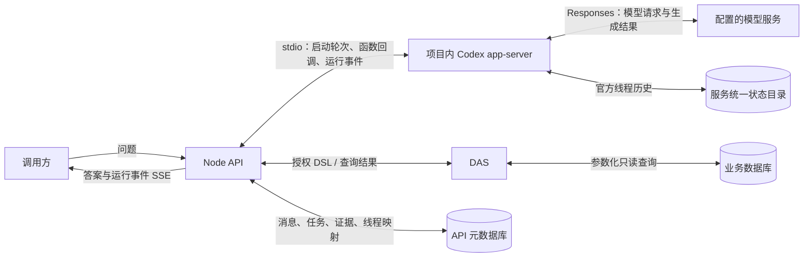
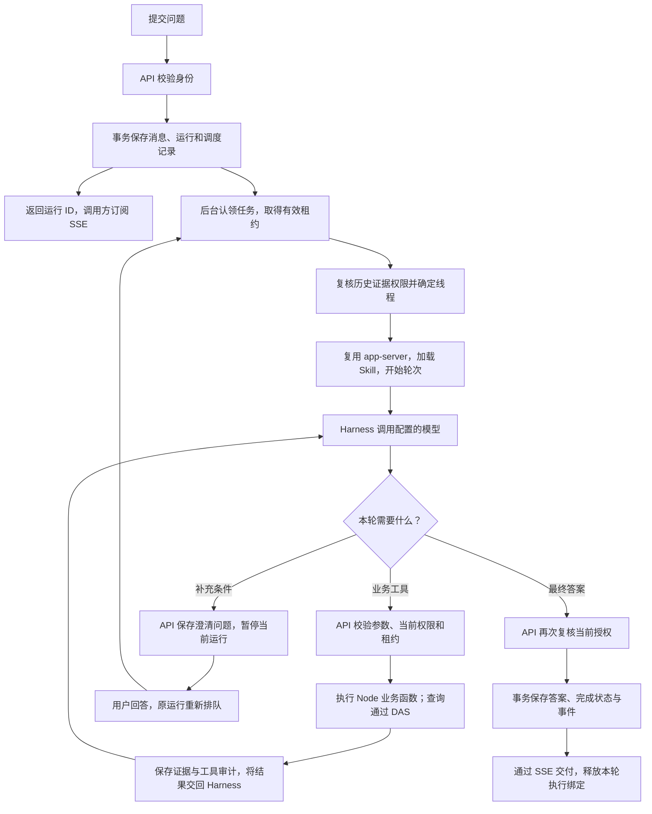
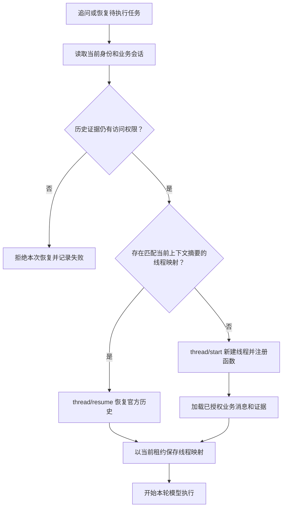

# API 第 7 步交付说明

交付日期：2026-09-15。范围：官方 Codex Harness 接入、普通函数调用、会话恢复及对应验证。常驻进程与压缩状态的最新交付及复验结果见[补充说明](第7步常驻运行与状态推送.md)。

2026-09-20 数据库结构已统一到 `001_initial_api_schema.sql`；下文迁移编号为当时的交付记录，当前文件及首建流程见[API 首建迁移整合](API首建迁移整合说明.md)。

## 1. 现在如何工作

用户提交问题后，API 保存消息和分析任务，后台执行器认领任务，使用 API 启动时初始化的常驻 Codex app-server。Harness 调用配置的模型，模型选择业务工具，API 执行对应的 Node 函数。查询工具经过权限校验后把结构化 DSL 发给 DAS，DAS 编译并执行 SQL。查询结果形成证据后回到模型，最终答案和运行状态由 API 保存并通过 SSE 交付。

各部分的职责：

| 部分             | 职责                                                                       |
| ---------------- | -------------------------------------------------------------------------- |
| Node API         | 用户身份、会话、任务调度、租约、业务函数、权限、证据、审计、最终状态和 SSE |
| Codex app-server | 官方 Harness 的模型轮次、函数调用调度、Skill 加载和官方线程历史            |
| 模型服务         | 理解问题、选择工具、生成工具参数、根据返回结果组织答案                     |
| DAS              | 校验内部认证与签名，编译 DSL，执行受控查询，处理结果和审计                 |
| API 元数据库     | 保存业务消息、运行、证据、工具审计及官方线程映射                           |
| 官方状态目录     | 保存官方线程历史和本会话使用的 Skill                                       |

这里的“普通函数”是 API 已注册的业务函数。函数定义通过进程协议交给 Harness，执行代码留在 Node API 中；例如 `query_dataset` 会进入已有授权查询服务。

## 2. 一次问题的执行流程

同一会话串行推进任务，不同会话在配置的并发数内运行。执行期间持续续租；取消或超时会中断轮次，失效租约的执行器不能提交新结果或覆盖线程映射。

流程图中的工具分支表示正常执行；参数错误会作为工具结果反馈给模型，认证失效、取消或租约冲突会停止当前执行。

## 3. 追问和重启恢复

业务会话、分析运行和官方线程是三个不同的标识：

| 标识              | 含义                                                 |
| ----------------- | ---------------------------------------------------- |
| `conversation_id` | 一段用户业务会话                                     |
| `analysis_run_id` | 一次分析任务；普通追问创建新任务，澄清回答续接原任务 |
| `thread_id`       | 官方 Harness 保存历史所使用的线程                    |

一个 API 实例复用一个 app-server。执行结束后保留进程、线程映射和磁盘历史；取消仅中断对应轮次，API 关闭时统一关闭进程。

上下文摘要包含当前身份范围、目录策略版本、提供方标识及模型地址/名称、工具定义、分析指令和 Skill 内容。相关配置变化后，已有映射不再匹配；历史证据权限复核仍然必须通过。

SQL 中的线程映射和磁盘中的官方历史要配套保留。当前验证覆盖本机进程重启；多实例恢复需要目标实例能够访问相应状态目录。

## 4. 本次改动

| 改动                           | 目的                                                      | 主要位置                                                                             |
| ------------------------------ | --------------------------------------------------------- | ------------------------------------------------------------------------------------ |
| 新增 app-server 通信与进程管理 | 从项目依赖启动官方运行时，处理请求、事件、取消及退出      | `src/harness/codex-app-server.ts`、`codex-app-server-types.ts`                       |
| 改造 Harness 适配器            | 注册普通函数，回调 Node 工具，连接可配置的 Responses 模型 | `src/harness/codex-analysis-harness.ts`、`harness-types.ts`                          |
| 改造执行器与仓储               | 绑定业务会话、复核历史权限、保存及恢复线程映射            | `src/runtime/analysis-executor.ts`、`sql-runtime-repository.ts`、`runtime-types.ts`  |
| 新增 `007_codex_threads` 迁移  | 持久化官方线程标识、上下文摘要和更新时间                  | `migrations/007_codex_threads.sql`                                                   |
| 更新装配及本地配置合同         | 选择提供方、状态目录、上下文容量和执行预算                | `src/runtime/create-analysis-runtime.ts`、`src/index.ts`、`src/config/api-config.ts` |
| 修正 Skill 加载                | 将两份业务 Skill 放入服务统一官方目录后显式加载           | `query-analysis`、`query-dsl` 的加载流程                                             |
| 替换旧适配与中间服务           | 完成向 app-server 普通函数入口的迁移                      | 删除旧 `sdk-analysis-harness.ts`、`analysis-mcp-server.ts` 及旧适配测试              |
| 更新测试和文档                 | 验证官方协议、业务权限、持久化及真实模型闭环              | `tests/harness`、`tests/runtime`、`tests/integration` 等                             |

表内代码路径相对 `ai-data/apps/api/`。现有查询授权、指标、报告、证据和 DAS 执行服务继续由业务工具调用。

## 5. 配置和部署

- `@openai/codex@0.154.0` 提供本次使用的官方运行时。已安装的 `@openai/codex-sdk@0.154.0` 自身也依赖它；当前生产代码直接调用 app-server。当前 API 声明 SDK，启动代码从 SDK 的依赖位置解析官方运行时。
- 模型提供方、地址、模型名称、认证和请求头从本地 `api.config.json` 读取；协议为 `responses`，切换配置后重启 API。
- 新增 `state_directory`，默认 `secrets/codex-runtime`，相对项目启动工作目录解析；`context_window` 填写模型实际容量。
- 运行预算包含总时限、工具次数、本次业务输入容量和最终文本容量。旧 `max_steps`、`max_output_tokens` 配置已移除；当前没有逐次生成的输出 token 配额开关。
- 部署保留 API 构建产物、迁移、本地配置、两份 Skill、Codex 运行时及对应平台包，并持久化官方状态目录。
- `dynamicTools` 在本次版本为实验性接口，升级运行时后需要重新验证协议和模型兼容性。

## 6. 初次接入验证记录

| 验证                                         | 结果                                        |
| -------------------------------------------- | ------------------------------------------- |
| API 普通测试                                 | 391 项通过，40 个测试文件                   |
| API SQL 集成                                 | 18 项通过                                   |
| 确定性 API → DAS → SQL 对话                  | 3 项通过                                    |
| 实际本地模型对话                             | 1 项通过，包含查询和重启后的追问            |
| 类型检查、ESLint、API 构建及本轮文件格式检查 | 通过                                        |
| API 构建产物启动                             | 隔离 SQL 库、启用运行时，`/health` 返回 200 |

本地模型验收的实际结果：受限角色查询得到 A 科室 2 人次，证据和审计落库；关闭并重建运行实例后，恢复同一官方线程，追问“上轮结果加 1”得到 3，第二轮没有新增 SQL 查询。

详细配置见[模型运行时说明](../ai-data/MODEL-RUNTIME.md)，验证入口见[测试说明](../ai-data/TESTING.md)。本节保留初次接入结果，本轮常驻运行的复验结论以[补充说明](第7步常驻运行与状态推送.md)为准。
