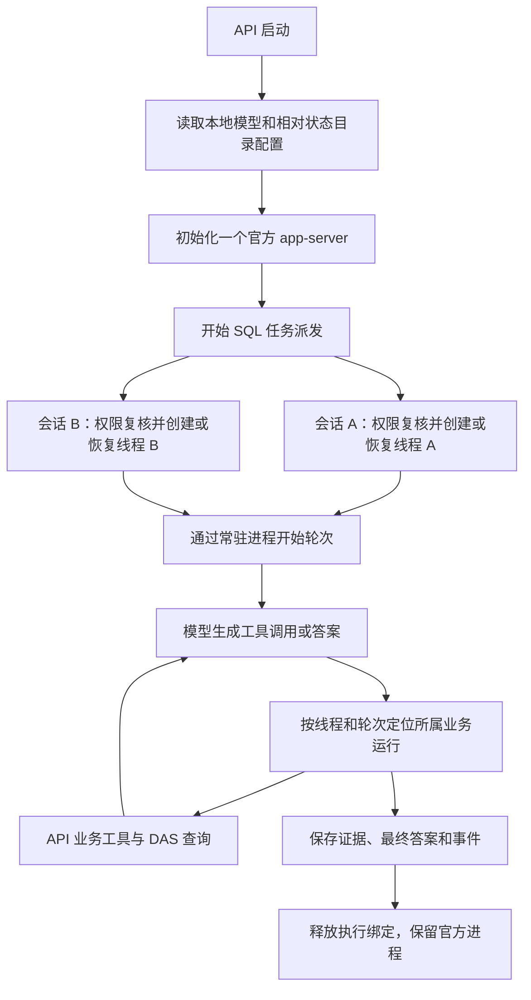
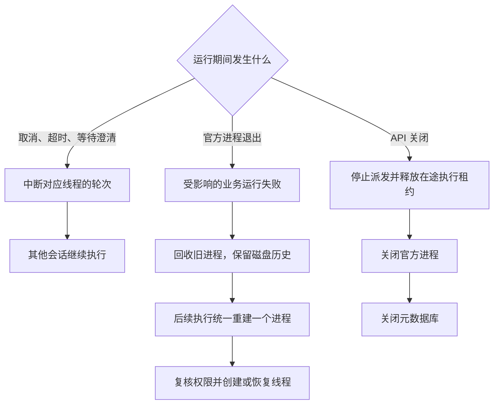
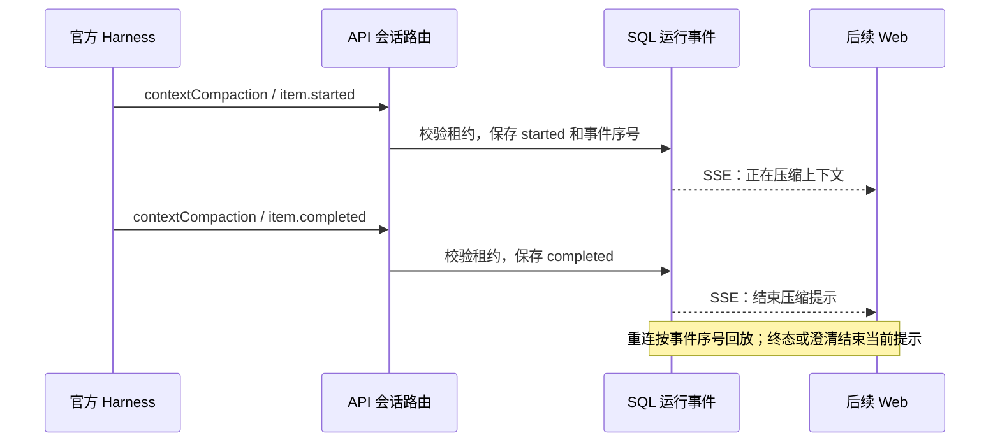

# 第 7 步：常驻运行与状态推送

状态：2026-09-15 已按审核范围实现。确定性验证通过；实际本地模型完整对话复验未通过，详情见下文。

## 已确认范围

API 实例通过项目安装的 Codex SDK 所携带的官方运行时启动一个常驻 app-server。多个业务会话分别使用官方线程，工具执行和事件始终绑定所属用户、会话、运行及租约。API 关闭时释放执行租约并关闭官方进程；进程异常影响当前执行，后续请求统一重建进程。

`state_directory` 相对于项目启动工作目录（`process.cwd()`）解析。官方历史、状态、日志、工作目录和子进程临时目录归入此目录。当前本地配置为 `secrets/codex-runtime`。上下文压缩使用官方默认触发逻辑，API 转发其实际开始、完成事件。

前台开发时依据本文的事件展示约定实现压缩状态。当前实施范围为 API、共享合同及文档，由主代理执行，使用现有依赖。

## 验收场景

| 前提与操作                         | 预期                                                                     |
| ---------------------------------- | ------------------------------------------------------------------------ |
| API 启动，连续执行两个会话及追问   | 初始化一次；共用进程，线程独立，追问恢复所属线程                         |
| 两个会话并发，工具交错返回         | 各自收到自己的结果；重复调用及错误线程请求不能执行其他会话工具           |
| 取消、超时或澄清暂停一个会话       | 仅中断对应轮次；其他会话及后续会话继续使用原进程                         |
| 同一会话的上一轮尚未结束           | 拒绝重叠执行；晚到事件不能写入新轮次                                     |
| app-server 在两个会话执行中退出    | 两个运行失败；后续并发请求只重建一个进程；失败查询不会自动重跑           |
| API 正常关闭或启动失败             | 停止派发、释放执行、关闭进程；无遗留子进程                               |
| 项目在任意目录启动                 | 状态根目录按启动目录解析；官方进程的历史、日志和临时目录都位于配置根目录 |
| 收到压缩开始、完成事件             | 按顺序持久化并通过 SSE 推送，包含运行及压缩条目标识                      |
| 压缩期间发生失败、取消、澄清或重连 | 运行状态结束提示；回放可以恢复正确状态；旧租约不能写入新事件             |
| 官方协议测试和隔离 SQL 对话        | 普通函数、Skill、历史恢复及权限复核继续生效                              |

## 前台事件展示约定

API 提供 `context_compaction` 事件，字段包括 `item_id`、`status`（`started` / `completed`）和 `occurred_at`。同时保留公共字段 `conversation_id`、`analysis_run_id`、`sequence`、`lease_epoch`。时间由 API 使用 dayjs 生成东八区时间。

开始时显示“正在压缩上下文”；完成时移除该提示，继续显示当前分析状态。`run_completed`、`run_failed`、`run_cancelled`、澄清等待和执行租约切换均结束上一阶段提示。重连使用 SSE 序号恢复，首次加载可以回放当前运行事件。客户端以运行、租约、条目标识关联状态，以事件序号去重；中断不能显示为压缩成功。运行总耗时与压缩状态分别展示。

## 交付记录

最新实现与验证结果如下。

## 实现结构与目录

`CodexAnalysisHarness` 管理服务唯一进程、初始化合并、异常回收和业务会话占用；`CodexAppServer` 处理 stdio 请求与响应；`CodexSessionRouter` 绑定当前线程和轮次，消费函数调用及压缩事件。业务工具异常只结束所属运行，进程异常结束该进程承载的在途执行。

API 当前声明 `@openai/codex-sdk@0.154.0`，通过 SDK 的 ESM 入口解析其自带的 `@openai/codex@0.154.0` 和平台运行时。初始化完成后才开启 SQL 派发；关闭时先等待执行器释放租约，再关闭进程及元数据库。

```text
<项目启动目录>/secrets/codex-runtime/
├─ home/             官方线程历史、SQLite 状态及共享业务 Skill
├─ logs/             官方运行日志
├─ tmp/              官方子进程 TEMP、TMP、TMPDIR
└─ work/<会话摘要>/   各业务会话工作目录
```

根目录由启动工作目录与本地 `state_directory` 共同确定，当前本地配置无需改动。官方跨线程记忆的生成和使用关闭，业务上下文依靠线程归属、工具白名单、历史证据复核及运行租约隔离。重启部署应保持启动目录与配置一致。

## 流程图







## 验证结果与限制

- API 普通测试 404 项通过，覆盖进程复用、会话并发、取消与工具交错、延迟轮次响应、异常后统一重建、启动失败释放资源和事件持久化；SSE 合同 9 项通过。
- 真实官方运行时连接本机模拟 Responses 服务：业务 Skill 与普通函数进入请求；工具返回的 `UNSUPPORTED_QUERY` 错误进入下一次模型请求。
- 压缩事件合同、租约失效拒绝写入、取消后的 SSE 回放通过。压缩触发沿用默认逻辑，本轮通过协议事件验证状态交付。
- 隔离 SQL 集成 18 项、确定性 API → DAS HTTP → SQL 对话 3 项通过。
- 实际本地模型复验失败：完成数据源与目录发现后，连续对普通关系表提交 `parameterized_query`；API 每次返回 `UNSUPPORTED_QUERY`，180 秒后运行超时。此次未到达重启后的追问步骤。业务 Skill、模型配置和原始验收问题保持原样；模型的查询分支选择需后续单独分析。
- API 构建通过。完整测试数量、静态检查与命令见[测试说明](../ai-data/TESTING.md)。

API 已提供前台所需压缩事件，Web 按本文约定接入。回答正文逐段流式推送仍为后续待审核项目。
