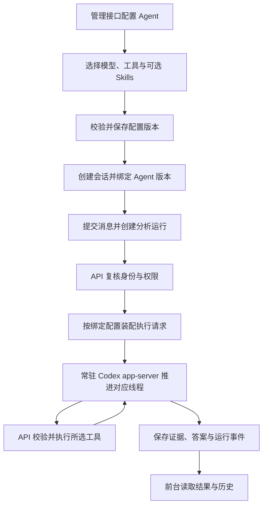

# 第 8 步：Agent 配置与运行框架

记录日期：2026-09-16。状态：方向与范围留档，代码尚未实施。

用户确认本阶段先完成通用框架。业务分析 Skills 在实际使用、了解报表与人工分析方法后编写。正式实施前，按本文细化文件、合同、数据迁移及验证清单，取得用户明确批准。

## 1. Agent 的组织方式

**一组报表共用的业务分析思路，是组织 Agent 的依据。** Agent 关联所需模型、工具、Skills 和行为配置，使一次分析围绕这套业务方法推进。

例如门诊报表与住院报表可能具有不同的口径确认方式、指标关注点和问题排查顺序，可以分别配置 Agent。实际如何分组，在使用阶段依据报表和业务方法确定。

每个 Agent 都可以使用所选工具完成查询、分析、追问和结果整理。前台统一提供分页和 Excel 导出，使用已有授权结果。通用工具和 Skills 可被多个 Agent 引用，业务数据访问仍由当前用户权限控制。

## 2. 本阶段目标

框架需要完成以下可运行链路：

```text
创建 Agent → 配置模型、工具与 Skills → 选择 Agent 创建会话
→ 按绑定版本装配运行 → 执行工具 → 保存结果、证据与历史
```

允许 Agent 暂未配置业务 Skill。框架验收使用临时测试 Skill、模拟模型和隔离测试数据，具体报表的分析效果在使用阶段另行验收。

现有 `query-analysis`、`query-dsl` 是已实现资源，后续接入可选 Skill 目录。业务方法、指标口径和数据映射各自按职责维护：Skills 描述分析方法，指标与目录配置提供实际业务定义。

## 3. 实施清单

| 项目         | 拟完成能力                                                                                |
| ------------ | ----------------------------------------------------------------------------------------- |
| Agent 管理   | 名称、说明、指令、模型选择、工具选择、Skill 绑定、执行限制、启停及配置版本                |
| 模型配置     | 提供模型配置管理接口，供后续 Web 配置；Agent 引用模型配置，认证信息由服务端管理并脱敏返回 |
| 工具目录     | 列出后端已注册工具，按 Agent 选择；注册及实际调用均受所选工具范围约束                     |
| Skill 接入   | 列出、读取和绑定指定目录里的 Skills；支持暂未配置业务 Skill                               |
| 会话绑定     | 创建会话时选择 Agent，绑定配置版本，运行记录可追溯实际采用的配置                          |
| 运行装配     | 根据 Agent 加载模型、工具和 Skills，复用现有执行器、租约、审计、SSE 和线程恢复能力        |
| Web 接口约定 | 保存配置管理、资源选择、会话选择及测试所需接口说明，页面在 Web 阶段开发                   |

工具的业务函数由 API 实现，Web 配置选择已注册能力。用户编写 Skill 后，通过资源目录和 Agent 绑定接入运行。

Agent 配置更新形成新版本，新会话使用选定版本，已创建会话及正在执行的分析保持绑定配置。旧配置、旧会话和官方线程的兼容处理，以及所引用资源的版本或内容固定方式，需要在具体实施清单中明确。

组织归属、用户身份、数据权限、超时、取消和审计继续由 API 执行。Agent 的配置范围不能扩大用户已有权限。

## 4. 预计文件与模块影响

下列路径相对 pnpm 工作区 `ai-data/`，具体文件名在实施前细化。

| 增改范围                                                           | 用途                                                                       |
| ------------------------------------------------------------------ | -------------------------------------------------------------------------- |
| 新增 `packages/contracts/src/agents/` 及相关资源合同，更新公共出口 | Agent 配置、资源引用和管理接口的严格 Schema 与类型                         |
| 新增 API Agent、模型及 Skill 管理模块和路由                        | 配置校验、资源读取、持久化及管理接口                                       |
| 新增 `apps/api/migrations/` 迁移                                   | Agent 定义、配置版本及会话关联；具体模型配置和认证信息保存方式在实施前明确 |
| 修改 `apps/api/src/conversations/` 及会话路由                      | 选择 Agent、绑定版本及兼容已有会话                                         |
| 修改 `apps/api/src/runtime/`                                       | 按 Agent 装配配置、筛选工具、关联实际运行版本                              |
| 修改 `apps/api/src/harness/`                                       | 传递所选模型与 Skills，适配常驻进程中的执行配置                            |
| 修改 API 配置及应用装配入口                                        | 接入新增管理服务、资源路径与配置读取                                       |
| 新增或修改对应合同、单元、协议和 SQL 集成测试                      | 验证配置到执行的完整链路                                                   |
| 更新实施计划、运行说明与交接文档                                   | 记录接口、流程、目录和实际验收结果                                         |

本阶段主要影响 API 和共享合同，DAS 现有查询链路继续复用。当前方案不预计新增依赖；如发现确有需要，先给出依赖清单与命令，由用户操作。拟由主代理单独实施。

## 5. 实施前的协议核查

当前运行时在启动时绑定一个模型提供方，工具从统一目录注册，Skills 固定加载两份。按 Agent 选择资源需要调整这三处装配。

继续以一个 API 实例复用一个常驻 app-server 为目标，先验证当前项目 Codex 版本对多提供方、线程模型选择、Skill 选择及恢复的支持。模型地址、认证和配置更新的生效方式以协议验证结果为依据。

会话创建时绑定 Agent 配置版本及对应的 Skill 资源版本。在同一 app-server 中创建或恢复官方线程后，首轮通过 `turn/start` 的 `skill` 输入加载选定的 `SKILL.md` 入口；子文档按需读取。后续追问沿用该会话绑定的配置和资源版本。

Skill 可见范围由当前线程绑定的 Agent 配置决定，核查须覆盖自动发现清单、入口加载和子文档读取。显式加载选定入口本身不足以证明其他 Skill 不可见；共享的全局 Skill 启停配置不能用于并发 Agent 的切换。线程作用域的具体隔离方式须通过当前版本协议验证后，再纳入实施清单审核。

现有 `read_skill_reference` 读取范围是运行时统一加载的资源。第 8 步需要将该范围绑定到当前运行所属 Agent 的 Skill 清单，读取入口和子文档时都执行相同范围校验。

如当前协议不支持所需行为，应报告具体限制、备选方案及各自原因和影响，待用户审核后调整技术路线。

## 6. 验收场景

以下为计划验收内容，尚未执行：

| 场景                                       | 预期结果                                           |
| ------------------------------------------ | -------------------------------------------------- |
| 创建、编辑、启停 Agent                     | 配置校验、管理权限及组织归属正确                   |
| Agent 暂未绑定业务 Skill                   | 框架可以保存和装配，正常执行所选工具与基础指令     |
| 两个 Agent 选择不同模型、工具和测试 Skills | 各自实际请求与配置一致，资源及返回结果不串用       |
| 请求调用 Agent 未启用的工具                | API 拒绝执行                                       |
| 加载已绑定的测试 Skill                     | 验证正文实际进入对应模型请求                       |
| 首轮加载与子文档按需读取                   | 首轮提供选定入口，读取工具调用后才加入对应子文档   |
| 同一 app-server 并发运行两个 Agent         | 各自只发现配置内的 Skills，读取未绑定 Skill 被拒绝 |
| 修改 Agent 配置后创建新会话                | 新会话使用新版本，已有会话保持绑定版本             |
| 并发、取消、超时及进程恢复                 | 复用已有隔离和租约机制，历史归属正确               |
| 使用隔离 SQL 数据完成授权查询              | Agent 接入后权限、证据和审计链路继续成立           |

第 7 步最新本地模型复验的查询分支错误与超时仍为已知问题，记录见[常驻运行与状态推送](第7步常驻运行与状态推送.md)。框架的确定性验证与实际模型对话结果分别记录。

## 7. 配置与执行流程



后续实际使用时，依据报表及人工分析经验编写业务 Skills，绑定对应 Agent，再验收分析步骤、指标口径、结论及证据是否符合业务预期。
