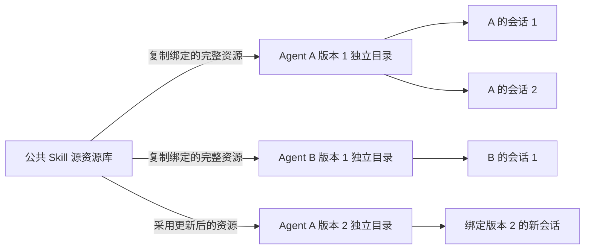
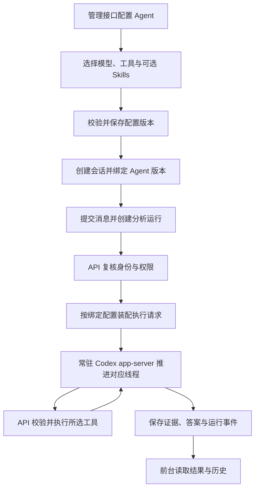

# 第 8 步：Agent 配置与运行框架

记录日期：2026-09-16；实施更新：2026-09-20。状态：框架已实现，验收与已知模型行为见[第 8 步交付说明](第8步交付说明.md)。

用户确认本阶段先完成通用框架。业务分析 Skills 在实际使用、了解报表与人工分析方法后编写。2026-09-20 用户批准实施清单及两个子代理：Agent 管理持久化、Skill 独立目录；主代理完成模型、会话、运行时和整体集成。正式接口见 [Agent 配置接口](../ai-data/AGENT-CONFIGURATION.md)。以下保留方案和先行协议核查过程。

## 1. Agent 的组织方式

**一组报表共用的业务分析思路，是组织 Agent 的依据。** Agent 关联所需模型、工具、Skills 和行为配置，使一次分析围绕这套业务方法推进。

例如门诊报表与住院报表可能具有不同的口径确认方式、指标关注点和问题排查顺序，可以分别配置 Agent。实际如何分组，在使用阶段依据报表和业务方法确定。

每个 Agent 都可以使用所选工具完成查询、分析、追问和结果整理。前台统一提供分页和 Excel 导出，使用已有授权结果。通用工具和 Skills 可被多个 Agent 引用，业务数据访问仍由当前用户权限控制。

## 2. 本阶段目标

框架需要完成以下可运行链路：

```text
创建 Agent → 配置模型、工具与 Skills → 选择 Agent 创建会话
→ 按绑定版本装配运行 → 执行工具 → 保存结果、证据与历史
```

允许 Agent 暂未配置业务 Skill。框架验收使用临时测试 Skill、模拟模型和隔离测试数据，具体报表的分析效果在使用阶段另行验收。

现有 `query-analysis`、`query-dsl` 是已实现资源，后续接入可选 Skill 目录。业务方法、指标口径和数据映射各自按职责维护：Skills 描述分析方法，指标与目录配置提供实际业务定义。

## 3. 实施清单

| 项目         | 拟完成能力                                                                                |
| ------------ | ----------------------------------------------------------------------------------------- |
| Agent 管理   | 名称、说明、指令、模型选择、工具选择、Skill 绑定、执行限制、启停及配置版本                |
| 模型配置     | 提供模型配置管理接口，供后续 Web 配置；Agent 引用模型配置，认证信息由服务端管理并脱敏返回 |
| 工具目录     | 列出后端已注册工具，按 Agent 选择；注册及实际调用均受所选工具范围约束                     |
| Skill 接入   | 列出、读取和绑定指定目录里的 Skills；支持暂未配置业务 Skill                               |
| 会话绑定     | 创建会话时选择 Agent，绑定配置版本，运行记录可追溯实际采用的配置                          |
| 运行装配     | 根据 Agent 加载模型、工具和 Skills，复用现有执行器、租约、审计、SSE 和线程恢复能力        |
| Web 接口约定 | 保存配置管理、资源选择、会话选择及测试所需接口说明，页面在 Web 阶段开发                   |

工具的业务函数由 API 实现，Web 配置选择已注册能力。用户编写 Skill 后，通过资源目录和 Agent 绑定接入运行。

Agent 配置更新形成新版本，新会话使用选定版本，已创建会话及正在执行的分析保持绑定配置。Skill 资源按第 5.2 节的独立目录方案固定版本；旧配置、旧会话和官方线程的兼容处理，需要在具体实施清单中明确。

组织归属、用户身份、数据权限、超时、取消和审计继续由 API 执行。Agent 的配置范围不能扩大用户已有权限。

## 4. 预计文件与模块影响

下列路径相对 pnpm 工作区 `ai-data/`，具体文件名在实施前细化。

| 增改范围                                                           | 用途                                                                       |
| ------------------------------------------------------------------ | -------------------------------------------------------------------------- |
| 新增 `packages/contracts/src/agents/` 及相关资源合同，更新公共出口 | Agent 配置、资源引用和管理接口的严格 Schema 与类型                         |
| 新增 API Agent、模型及 Skill 管理模块和路由                        | 配置校验、资源读取、持久化及管理接口                                       |
| 新增 `apps/api/migrations/` 迁移                                   | Agent 定义、配置版本及会话关联；具体模型配置和认证信息保存方式在实施前明确 |
| 修改 `apps/api/src/conversations/` 及会话路由                      | 选择 Agent、绑定版本及兼容已有会话                                         |
| 修改 `apps/api/src/runtime/`                                       | 按 Agent 装配配置、筛选工具、关联实际运行版本                              |
| 修改 `apps/api/src/harness/`                                       | 传递所选模型与 Skills，适配常驻进程中的执行配置                            |
| 修改 API 配置及应用装配入口                                        | 接入新增管理服务、资源路径与配置读取                                       |
| 新增或修改对应合同、单元、协议和 SQL 集成测试                      | 验证配置到执行的完整链路                                                   |
| 更新实施计划、运行说明与交接文档                                   | 记录接口、流程、目录和实际验收结果                                         |

本阶段主要影响 API 和共享合同，DAS 现有查询链路继续复用。当前方案不预计新增依赖；如发现确有需要，先给出依赖清单与命令，由用户操作。拟由主代理单独实施。

## 5. 实施前的协议核查

实施前，第 7 步运行时在启动时绑定一个模型提供方，工具从统一目录注册，Skills 固定加载两份。第 8 步已将这三处装配接入 Agent 配置，以下保留先行核查依据。

继续以一个 API 实例复用一个常驻 app-server 为目标，先验证当前项目 Codex 版本对多提供方、线程模型选择、Skill 选择及恢复的支持。模型地址、认证和配置更新的生效方式以协议验证结果为依据。

会话创建时绑定 Agent 配置版本及对应的 Skill 资源版本。在同一 app-server 中创建或恢复官方线程后，首轮通过 `turn/start` 的 `skill` 输入加载选定的 `SKILL.md` 入口；子文档按需读取。后续追问沿用该会话绑定的配置和资源版本。

Skill 可见范围由当前线程绑定的 Agent 配置决定，核查须覆盖自动发现清单、入口加载和子文档读取。显式加载选定入口本身不足以证明其他 Skill 不可见；共享的全局 Skill 启停配置不能用于并发 Agent 的切换。线程作用域的具体隔离方式须通过当前版本协议验证后，再纳入实施清单审核。

现有 `read_skill_reference` 读取范围是运行时统一加载的资源。第 8 步需要将该范围绑定到当前运行所属 Agent 的 Skill 清单，读取入口和子文档时都执行相同范围校验。

如当前协议不支持所需行为，应报告具体限制、备选方案及各自原因和影响，待用户审核后调整技术路线。

### 5.1 协议核查结果（2026-09-20）

已使用项目实际安装的 `codex-cli 0.154.0` 导出协议类型，并用官方 app-server 连接本机模拟 Responses 接口验证。测试使用虚拟密钥和临时 Skill 资源，15 项协议断言通过；并发阶段共用一个进程，恢复阶段关闭旧进程后再重建。核查由主代理单独执行，正式 Agent 功能仍待实施清单审核。

| 核查内容             | 实测结论                                                                                                                                   |
| -------------------- | ------------------------------------------------------------------------------------------------------------------------------------------ |
| 一个进程运行多个线程 | 两条线程同时发送模型请求并完成各自的函数回调                                                                                               |
| 模型与提供方隔离     | 各线程的模型名、请求地址、认证和自定义请求头分别生效                                                                                       |
| 运行中新增提供方     | `thread/start.config` 可以补充提供方定义；新线程变更地址、认证和请求头不影响已有线程的配置                                                 |
| 业务工具选择         | `dynamicTools` 按线程注册；未注册函数返回 `unsupported call`，不会回调 Node 业务函数                                                       |
| Skill 清单及入口     | 线程 `config["skills.config"]` 可按路径禁用未绑定资源；配合显式 `skill` 输入，两条线程各自只收到选定的清单和入口                           |
| 子文档读取           | 通过普通函数按需返回子文档；临时读取函数绑定线程的 Skill 范围后，跨 Agent 请求被拒绝。正式实现仍需给现有 `read_skill_reference` 接入该绑定 |
| Agent 暂不配置 Skill | 可以启动线程并运行，业务工具也可配置为空                                                                                                   |
| 重启后恢复           | 提供绑定配置后，线程标识、历史和原动态工具保持一致，模型、认证和 Skill 范围正确                                                            |
| 按目录限定发现范围   | 不同 Agent 的 `.agents/skills` 位于各自受控工作目录中；在 B 目录新增 Skill 后，A 线程仍看不到它                                            |

以下约束须纳入正式实施清单：

1. **Skill 使用版本固定的独立资源目录。** 按用户确认的第 5.2 节方案，为每个 Agent 配置版本复制完整 Skill 资源。原始资源库放在自动发现范围之外，并按线程禁用未绑定的系统或其他来源资源。
2. **启动和恢复都重传绑定配置。** `thread/resume` 能恢复已保存的动态工具与历史，但不会自动保存全部运行时覆盖项。实测省略 Skill 限制后，恢复请求重新出现全局 Skill 清单；仅在线程配置中新增的提供方，重启后省略定义会报 `Model provider ... not found`。API 必须按会话绑定版本重新提供完整的提供方、Skill 范围、工作目录和执行约束。
3. **区分业务工具与官方内建工具。** 当前版本还会在工具 Schema 中列出 `request_user_input`；实测默认模式下调用会返回 `request_user_input is unavailable in Default mode`，不会产生用户输入回调。业务澄清继续使用运行服务已注册的 `request_clarification`，正式验收应保留默认模式约束。

密钥更新策略需要在实施清单中明确：

| 方式                                       | 选择理由                                                         | 生效方式与代价                                                                  |
| ------------------------------------------ | ---------------------------------------------------------------- | ------------------------------------------------------------------------------- |
| 沿用 `env_key`                             | 与现有接入一致，官方推荐从环境变量读取密钥                       | 进程只持有启动时的环境；新增或修改其中的密钥需要重建 app-server，并协调在途会话 |
| 在线程配置传入 `experimental_bearer_token` | 本轮验证了进程启动后引入全新虚拟密钥并立即生效，可支持配置热更新 | 属于官方标注不推荐的实验字段；API 需要负责密钥保护，并在恢复时重新传入绑定值    |

官方配置参考建议使用 `env_key`，将 `experimental_bearer_token` 标为不推荐；本轮仅验证协议可用性，认证方案由后续实施清单审核确定。[官方配置参考](https://learn.chatgpt.com/docs/config-file/config-reference)

本地生成的 `SkillsListParams` 只有 `cwds` 和 `forceReload`，没有最新版文档中的 `perCwdExtraUserRoots`。实现须以项目版本的协议为准；官方加载及普通函数接口可参照 [app-server 文档](https://learn.chatgpt.com/docs/app-server)。

建议装配顺序：会话绑定 Agent 版本 → 准备固定资源目录及可见清单 → 在同一 app-server 中启动或恢复线程并传入配置 → 首轮加载 Skill 入口 → 按当前 Agent 范围执行业务工具与子文档读取。

### 5.2 Skill 独立目录方案（2026-09-20 用户确认）

公共 Skill 在源资源库中维护一份。运行时以 **Agent 配置版本**为单位准备独立目录，将该版本绑定的每份 Skill 完整复制到对应的 `.agents/skills` 中，包含 `SKILL.md` 和子文档等配套资源。

- 多个 Agent 引用同一个 Skill 时，各配置版本目录保存各自的资源快照。
- 同一 Agent 配置版本的多个会话共用该版本目录；会话分别使用自己的官方线程。
- 配置版本生效后保持资源目录内容固定。采用更新后的 Skill 时形成新配置版本和新目录，已有会话继续使用绑定版本。
- 线程工作目录与该版本的资源目录对应，发现范围、入口加载及 `read_skill_reference` 都使用当前绑定资源；启动和恢复时重传同一套绑定配置。
- API 实例继续共用一个常驻 app-server，源资源库位于线程自动发现范围之外。



资源组织方式、版本复用规则及流程图已按用户确认实现。先行协议证据见 [Skill 白名单验证](第8步Skill白名单验证.md)：18 个场景、11 项行为检查完成。正式实现和验收结果见[第 8 步交付说明](第8步交付说明.md)。

## 6. 验收场景

以下为本阶段验收场景；框架场景的通过情况及真实模型业务断言失败记录见[交付说明](第8步交付说明.md)：

| 场景                                                   | 预期结果                                                           |
| ------------------------------------------------------ | ------------------------------------------------------------------ |
| 创建、编辑、启停 Agent                                 | 配置校验、管理权限及组织归属正确                                   |
| Agent 暂未绑定业务 Skill                               | 框架可以保存和装配，正常执行所选工具与基础指令                     |
| 两个 Agent 选择不同模型、工具和测试 Skills             | 各自实际请求与配置一致，资源及返回结果不串用                       |
| 请求调用 Agent 未启用的工具                            | API 拒绝执行                                                       |
| 加载已绑定的测试 Skill                                 | 验证正文实际进入对应模型请求                                       |
| 首轮加载与子文档按需读取                               | 首轮提供选定入口，读取工具调用后才加入对应子文档                   |
| 同一 app-server 并发运行两个 Agent                     | 各自只发现配置内的 Skills，读取未绑定 Skill 被拒绝                 |
| 两个 Agent 引用同一 Skill，同一 Agent 版本创建多个会话 | 两个版本目录各有完整资源，同一版本的会话共用目录，官方线程分别独立 |
| 更新源 Skill 并形成新配置版本                          | 新版本使用新资源目录，旧会话绑定目录的内容保持固定                 |
| 修改 Agent 配置后创建新会话                            | 新会话使用新版本，已有会话保持绑定版本                             |
| 并发、取消、超时及进程恢复                             | 复用已有隔离和租约机制，历史归属正确                               |
| 使用隔离 SQL 数据完成授权查询                          | Agent 接入后权限、证据和审计链路继续成立                           |

第 7 步已于 2026-09-20 通过本地模型收尾复验，结果与此前失败记录见[常驻运行与状态推送](第7步常驻运行与状态推送.md)。第 8 步框架验证与本轮实际模型对话结果分别记录在[交付说明](第8步交付说明.md)，实际模型本轮未完成统计与重启追问验收。

## 7. 配置与执行流程



后续实际使用时，依据报表及人工分析经验编写业务 Skills，绑定对应 Agent，再验收分析步骤、指标口径、结论及证据是否符合业务预期。
