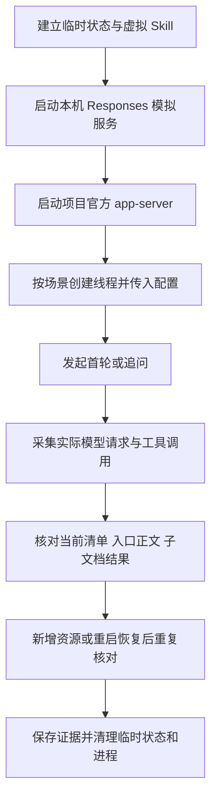

# 第 8 步：Skill 白名单协议验证

验证日期：2026-09-20。项目运行时：`@openai/codex@0.154.0`，Windows x64。

## 结论

本轮核查的官方配置与 `skill` 输入组合，尚不能满足“共享目录持续新增 Skill，而旧线程始终只看到绑定白名单”的要求。

API 可以把业务白名单转换成完整的逐项启停配置。在已枚举的资源范围内，两条线程的 Skill 清单、入口加载及子文档调用可以分别控制。但该配置只覆盖枚举时已有的路径；共享发现目录新增资源后，旧线程会发现新增 Skill，也可以通过显式调用加载正文。

把共享资源放到自动发现范围之外，然后直接通过官方 `skill` 输入传文件路径，本轮未加载入口正文。进程或线程启用 `skip_host_skill_discovery`，也未关闭本机这些资源的发现。因此，“关闭发现、仅传白名单路径”的候选方式未通过本次验证。

这些结果说明的是当前版本已测试接口的限制。资源如何共享存储、入口由谁加载，仍是正式实施清单需要确定的事项；本轮没有据此更改 API 的接入方式。

## 验证范围与方法

- 使用项目已安装的官方 app-server，主代理单独执行。
- 使用本机 HTTP Responses 模拟服务、虚拟密钥与带唯一标记的临时 Skill。
- 检查 app-server 实际发往模型接口的请求，不依赖模型自述“是否看到 Skill”。
- 检查当前 Skill 清单、完整请求中的历史入口正文以及子文档工具返回，分别保留记录。
- 并发场景使用同一进程；恢复场景关闭并重建进程，保留测试状态后恢复原线程标识。
- 本轮完成 18 个协议场景、21 次模拟模型请求、11 项行为检查。检查通过表示观察到报告中的行为，包括候选方式不满足白名单要求的反例。
- 未调用真实模型或业务数据库，未安装依赖，未修改业务源代码。临时状态、资源目录和进程已清理。

## 实测结果

| 场景                                          | 模型请求中的结果                               | 含义                                           |
| --------------------------------------------- | ---------------------------------------------- | ---------------------------------------------- |
| 共享目录有 A、B，显式加载 A                   | 清单包含 A、B；正文只有 A                      | 入口选择与清单可见范围是两个控制点             |
| 只给 A 设置 `enabled: true`                   | B 仍在清单                                     | 正向启用项不构成默认拒绝的白名单               |
| 按路径禁用 B，再显式传入 B                    | B 正文没有加载                                 | 已知路径的禁用规则能限制入口加载               |
| 共享文件位于发现范围外，直接传 `skill` 路径   | 请求成功完成，但正文没有加载                   | 接受协议输入不代表实际注入了 Skill             |
| 发现范围外的路径另设 `enabled: true`          | 正文仍未加载                                   | 启用配置未把该路径注册为可发现资源             |
| 线程设置 `skip_host_skill_discovery: true`    | 仍看到本机 A、B                                | 此开关未达到本次所需的本地隔离效果             |
| 进程设置同一开关                              | 功能查询确认启用，仍看到本机资源               | 本轮不能以该开关实现关闭目录发现               |
| Skill 配置 `allow_implicit_invocation: false` | 未列入默认清单；用户文本点名后仍加载正文       | 调用策略不能替代访问白名单                     |
| 枚举全部已有资源，两个线程分别仅启用 A、B     | 两条线程分别收到 A、B 的清单、入口与所选子文档 | 固定资源集合中的线程隔离成立                   |
| A 线程通过读取函数请求 B 的子文档             | 测试读取函数返回 `PROBE_DENIED`                | API 工具层能够执行按线程白名单；此处为验证替身 |
| 在共享目录新增 C，刷新发现缓存后追问旧 A 线程 | 当前清单出现 C                                 | 原来的禁用路径集合没有覆盖新增资源             |
| 旧 A 线程显式调用 C                           | C 正文进入请求                                 | 影响不止于显示 Skill 名称                      |
| 重启后用原启停配置恢复 A 线程                 | 当前清单仍含 C                                 | 重传旧配置不足以覆盖新增资源                   |
| 恢复另一线程时重新枚举并禁用未选资源          | 当前清单重新限制为所选 A；历史中的 B 正文保留  | 更新发现范围不会删除已进入线程历史的内容       |

新增资源场景显式调用了 `skills/list` 的 `forceReload: true`。本轮证明的是刷新后的结果，不推断各平台文件监听器的触发时机。

`skip_host_skill_discovery` 在本版本标记为 `underDevelopment`；本轮结论只覆盖这里使用的本地 app-server 配置和资源来源。

## 执行流程



## 复现与证据

在项目根目录执行，使用已安装 Node 与运行时：

```powershell
node '任务交接/验证/skill-allowlist-probe.mjs'
```

- [验证脚本](验证/skill-allowlist-probe.mjs)：建立隔离测试环境、模拟 Responses 协议、采样并断言。
- [本次请求与结果](验证/skill-allowlist-probe.result.json)：包含版本、18 个场景摘要、11 项检查、工具调用及 21 份模型请求。文件中的临时绝对路径用于标识本次样本，对应目录已清理。

脚本中的 `currentCatalog` 取最后一段官方 Skill 清单；`descriptions` 和 `bodies` 检查整个请求，可能含有历史内容。恢复场景必须区分这两类证据。

## 正式实施待确定事项

业务层仍应保存每个 Agent 版本绑定的 Skill 白名单，并在入口和子文档读取时校验。官方自动发现也必须受到同一范围约束。

如果继续使用官方发现与 `skill` 入口机制，需要另外确定发现范围的固定方式，或资源发布与线程配置更新的一致性措施。如果改由 API 从共享资源库提供清单和入口，则需要验证完整读取流程并审核接入调整。这两项都未在本轮转为业务实现。
