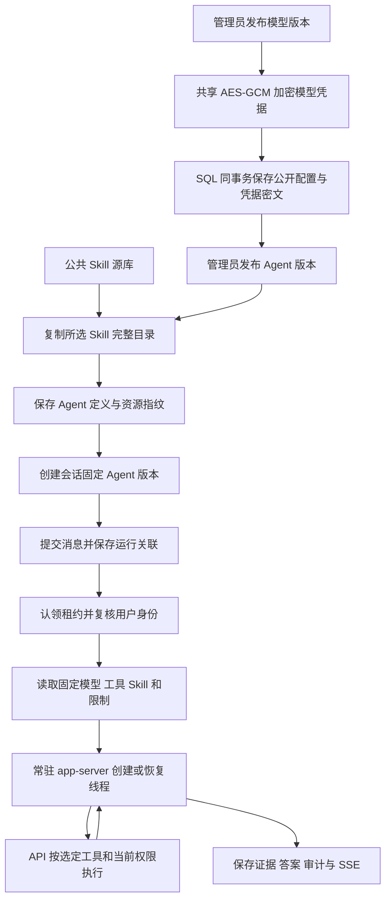
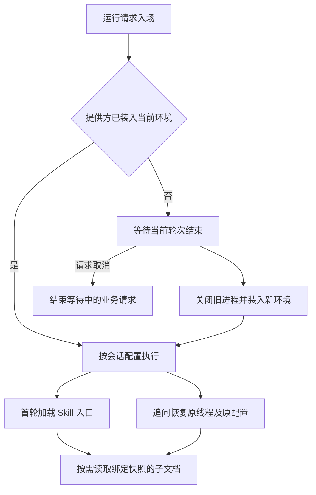
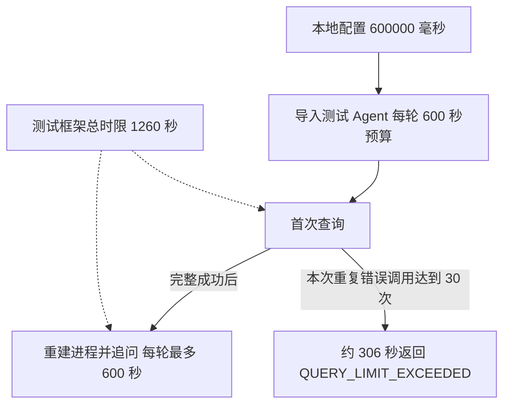

# 第 8 步交付说明

日期：2026-09-20。用户回复“开始”，批准此前清单及两个子代理：Agent 管理与持久化、Skill 固定版本目录。主代理负责共享合同、模型配置、会话与运行装配、官方进程及集成验收。依赖沿用已安装版本。

## 交付内容

- 模型和 Agent 按组织管理，配置按连续版本发布；启停状态独立于历史定义。
- 模型认证使用与 DAS 共用的 AES-256-GCM 机制加密，密文和模型版本在同一 SQL 事务中保存；接口返回认证状态及头名称。主密钥由 API 本地密钥库管理，追加交付见[模型凭据加密入库](第8步模型凭据加密入库.md)。
- 工具按 Agent 选择，发现与实际执行均限制范围，查询继续复用用户授权链路。
- 每个 Agent 配置版本保存独立 Skill 完整副本；同版本多个会话共用资源，各用独立官方线程。
- 新会话固定所选版本，运行记录和读取接口可以追溯；升级前会话在首次自动执行时固定默认 Agent。
- 一个 API 实例复用常驻 app-server。线程创建与恢复均传入模型、指令、Skill 范围、工作目录和上下文容量。新增提供方先排空在途轮次，再重建进程装入环境认证；等待支持取消。
- Agent 与模型版本表使用迁移事务及锁，支持重复启动；定义已于 2026-09-20 合并至 `001_initial_api_schema.sql`，见[首建整合说明](API首建迁移整合说明.md)。

接口、请求样例、权限、版本及默认配置兼容规则见 [Agent 配置接口](../ai-data/AGENT-CONFIGURATION.md)。运行时目录和部署要求见 [模型运行时配置](../ai-data/MODEL-RUNTIME.md)。

## 发布和运行流程

## 验证记录

本轮先补配置合同、服务、绑定与协议场景，再确认目标失败并实现。SQL 重复迁移场景暴露 `009` 首版缺少幂等保护，修复后重复迁移及数据保留通过。运行读取场景验证 API 快照返回实际 Agent 版本。

第 8 步框架首次交付时，普通与工程测试共 1073 项通过：工程 15、contracts 150、metadata 24、API 471、DAS 413。模型凭据加密入库后的追加验收见[对应交付说明](第8步模型凭据加密入库.md)。API SQL 集成 27 项通过，其中新增 Agent 5 项、模型与会话绑定 4 项。官方原生进程配合模拟 Responses 验证不同模型认证、两个 Agent 并发、Skill 隔离、空资源、首轮入口加载及重建后的同线程恢复；子进程夹具另验证进程复用、认证更新排空和取消。

第 8 步框架初次交付时，真实本地模型未通过完整业务验收：

1. 沙箱内连接探测返回 `EACCES`，模型轮次无工具调用并超时。
2. 在已授权的沙箱外运行后能完成查询，但结果未满足“授权 A 科室 2 人次”的断言；该次未输出详细查询证据。
3. 增加合成样本证据诊断后复跑，模型成功读取目录和 `query-dsl/references/relational-query.md`，随后反复向普通表提交 `parameterized_query`。API 返回 `UNSUPPORTED_QUERY`，180 秒超时，未进入重启追问断言。

2026-09-20 用户重启模型后，再次执行原真实模型验收：模型读取目录与关系查询说明后使用了 `relational_query`，前面多次查询遗漏日期条件，得到 A 科室 3 人次；最后在 `from.filters` 中补上 2026 年 9 月日期范围，查询返回正确的 A 科室 2 人次。整轮仍在 180 秒后返回 `QUERY_TIMEOUT`，未完成最终答复，也未进入重启追问断言。结果为 1 项失败，4 项未选中跳过；本次使用模型凭据加密入库后的代码，没有调整 Skill、运行预算或测试断言。

随后用户指定 600 秒：本地配置使用 `timeout_ms: 600000`，验收夹具同步使用配置，整条测试预算改为“两轮预算加 60 秒”，即 1260 秒。用例约 306 秒后以 `QUERY_LIMIT_EXCEEDED` 失败：模型反复对普通表提交 `parameterized_query`，达到现有 30 次工具调用预算；本次未取得有效统计结果，未进入重启追问。API 类型检查、相关测试文件的 ESLint 和格式检查通过。只读核查确认生成的工具 Schema 包含正确的关系查询分支，工具拒绝结果已进入官方线程历史；反复选择错误分支的原因仍待定位。

上述记录按实际发生顺序保留，最新结论为：600 秒配置已生效，完整业务验收因重复错误工具调用仍未通过。官方模拟协议恢复测试与真实模型业务验收分别计数。测试临时进程、目录和隔离数据库由清理钩子回收。

用户确认本轮结束排查，真实模型行为留待后续自行调优。当前根因尚未完全隔离，完整业务验收继续保留待通过状态；后续模型调整后再复跑相同查询、权限、最终答复及重启追问断言。

确定性 API → DAS → SQL 对话 4 项通过，包含固定 Agent 工具装配后的 A 科室 2 人次查询。API 构建产物从临时启动目录运行的验收 1 项通过：完成迁移、默认配置导入、常驻进程初始化、健康检查、登录、配置读取及固定版本会话创建。DAS SQL 集成 31 项通过；其中 API 迁移清单断言补齐 `007`–`009`。

工作区类型检查、ESLint、两应用构建、本轮文件格式及 `git diff --check` 通过。根全量格式检查仅有原 `pnpm-lock.yaml` 格式问题；已核对 HEAD 也存在该问题，锁文件内容未变。复跑命令见 [测试说明](../ai-data/TESTING.md)。Web 配置页、具体业务分析方法及报表 Skill 在后续阶段推进。
