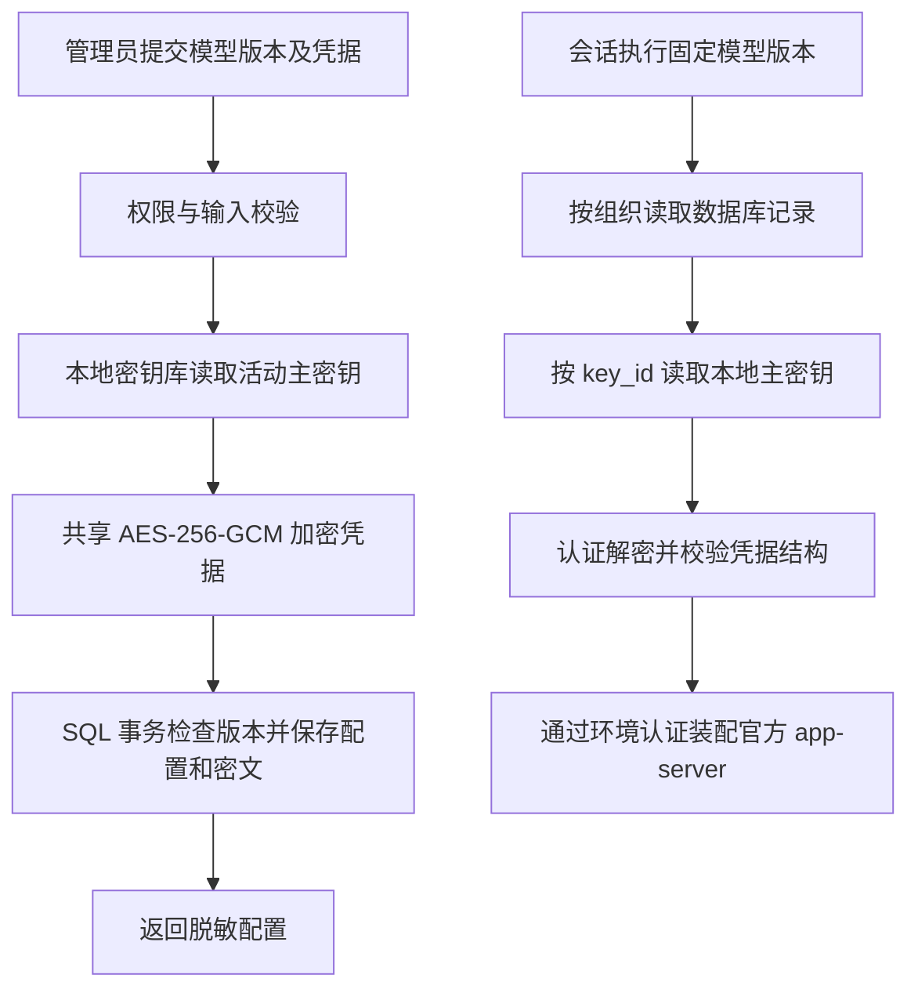

# 第 8 步模型凭据加密入库

日期：2026-09-20。用户确认模型请求凭据存入数据库，并要求加密机制复用现有实现；当前未到生产阶段，无需迁移已有数据。主代理实施，依赖沿用已安装版本。

## 主要改动

- 将 DAS 现有 `Aes256GcmSecretCipher`、`LocalMasterKeyStore` 及其测试移至 `packages/metadata`，通过 `@ai-data/metadata/secrets` 供 API、DAS 共用。保留原有随机 IV、认证标签、密钥版本、首次初始化及读取行为。
- `ModelCredentialCipher` 负责将 `api_key` 和请求头值整体加密及校验解密结果。模型服务仅将密文交给仓储，公开接口继续返回 `has_api_key`、`header_names` 等配置字段。
- 模型版本表保存 `key_id`、`encrypted_payload`、`encryption_metadata_json`，公开配置和密文在同一事务写入。建表定义现位于 `001_initial_api_schema.sql`；逐版本 JSON 凭据存储实现已删除。首建整理见[整合说明](API首建迁移整合说明.md)。
- API 主密钥库位于 `state_directory/model-keys`；`active-key.json` 只保存活动版本引用，`keys/<版本>.key` 保存 32 字节主密钥。DAS 使用原目录，两服务复用代码，各自管理主密钥。
- 旧会话继续按固定模型版本解密；模型新版本省略认证项表示不用该项。错误主密钥、缺失主密钥及密文认证失败均拒绝运行，错误消息不包含原文。

## 发布和执行流程

## 数据与部署边界

本次只调整开发阶段的建表定义，不导入旧 JSON，也不重置工作区已有数据库或删除历史文件。已执行旧版 `009` 的开发库需要由使用方重建后使用当前结构；本轮 SQL 验证使用独立临时数据库。

备份和部署需同时保留 SQL 与 API 主密钥库，主密钥目录由服务账号及 Windows ACL 保护。初始部署模型仍可从本地部署配置导入，导入记录采用相同加密写入；后续通过管理 API 发布新版本。

## 验证

先增加“仓储收到凭据密文”的测试，确认旧文件引用实现导致预期失败，再修改业务代码。

| 验证                            | 结果                                                                   |
| ------------------------------- | ---------------------------------------------------------------------- |
| API 普通测试                    | 476 项通过，包括模型服务 7 项及官方 app-server 模拟 Responses 认证测试 |
| DAS 普通测试                    | 409 项通过                                                             |
| metadata 共享包                 | 28 项通过，包括原有加密器和主密钥库 4 项测试                           |
| contracts / 工程规则            | 150 / 15 项通过                                                        |
| API SQL / 确定性对话 / 构建启动 | 27 / 4 / 1 项通过                                                      |
| DAS SQL 集成                    | 31 项通过                                                              |
| 类型检查、ESLint、API/DAS 构建  | 通过                                                                   |
| 本轮文件格式、git diff --check  | 通过                                                                   |

普通及工程测试合计 1078 项，集成与启动测试合计 63 项。根全量格式检查仍报告原有 `pnpm-lock.yaml` 格式问题，锁文件保持原样。

关键场景包括：二进制密文不含测试凭据原文、公开接口脱敏、每次加密使用不同 IV、按版本解密、重建服务后恢复、无认证版本、缺失/错误主密钥及篡改密文拒绝，以及并发版本冲突后成功版本保持完整。

加密修改完成时未重跑真实模型业务验收。随后用户重启模型并要求复验：180 秒用例取得正确的 A 科室 2 人次后仍超时；按用户要求改为 600 秒再次复验，约 306 秒后因重复提交不支持的查询、达到 30 次工具调用预算而失败。两次均未完成最终答复和重启追问，不计入上表通过项，详细记录见[第 8 步交付说明](第8步交付说明.md)。
