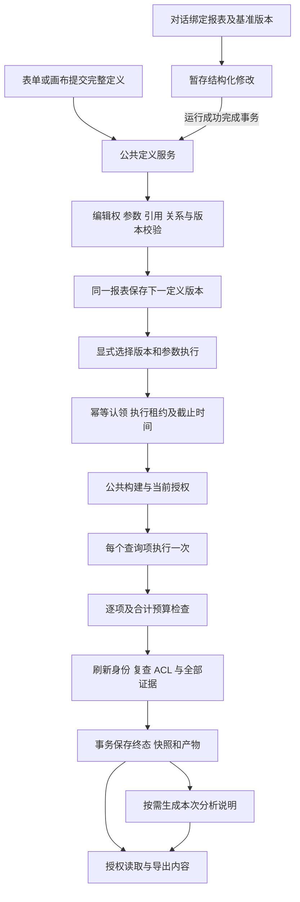

# 第 9 步交付说明：统一报表、关系与导出内容

日期：2026-09-21。用户回复“ok 准了开始干”，批准[实施清单](第9步报告画布与导出实施清单.md)及两个子代理分工。本次完成 API 与共享合同实施；调用方式见[统一报表接口](../ai-data/REPORTS.md)。

## 交付结果

对话、表单和画布共同使用一份可编辑定义、一个保存服务和一个执行服务。报表保持稳定 ID，支持重新打开后追加参数、修改绑定、查询字段、图表与布局，并形成连续版本。保存只进行结构、引用和授权校验；运行由固定定义与参数驱动，不依赖模型调用。

定义版本、执行记录和结果快照分别保存。每个查询项独立产生一张表，多个展示块共用查询结果；整次执行的全部查询成功且权限复核通过后，一次提交完成快照、产物和运行终态。分析说明另行绑定执行 ID，参数重跑不会带入旧数值结论。

| 获准工作       | 实际交付                                                                           |
| -------------- | ---------------------------------------------------------------------------------- |
| 统一合同与首建 | 参数、查询图、指标引用、展示、布局、块引用、执行与导出合同；结构集中补充到 `001`   |
| 二次编辑       | 定义及块版本仓储；公共保存、读取、引用校验、作者权限和 `expected_version` 冲突检查 |
| 关系管理       | 独立稳定关系记录，显式批量创建/更新/停用；完整配置兼容、一层入向/出向图与版本控制  |
| 公共执行       | 关系与参数构建、当前权限、逐项结果、整体预算、幂等、超时及迟到结果隔离             |
| 对话与画布接入 | Agent 读取/暂存统一定义，成功完成事务提交；画布节点、关系边及布局使用同一结构      |
| 报告管理       | 列表、双版本序列、分享、运行产物及报告/执行/会话内容包                             |
| 模板发布       | 接入知识候选、固定版本摘要、负责人审核、生效、停用与发布回滚                       |
| 验收交付       | 合同、领域、HTTP、真实隔离 SQL、DAS 链路、工程及构建检查；接口文档与流程图         |

## 关键行为

1. 参数定义、查询绑定与可复用块映射原子校验。删除仍被引用的参数、无效展示字段、错误图表轴、重复标识及并发旧版本更新均拒绝。
2. 关系使用批准方向和完整字段对，批准的 Join 类型、基数和唯一键证明沿用现有查询授权规则。普通关系图过滤不可见对象与字段；管理图可读取停用记录。
3. 指标分组与总计独立重算，同次构建固定实际指标版本。历史指标快照提取为可编辑定义时保留固定版本、日期与维度，并验证能精确还原原请求。
4. 单项证据和整次执行合计最多 5,000 行、2 MiB，默认总时限 120 秒。失败保留审计，结果与完成快照不部分交付。普通查询继续使用原 100,000 行、32 MiB 交付边界。
5. 执行操作键绑定组织、账号与报表，相同请求复用原记录。版本或参数不同的同键请求冲突；新执行用新键。过期运行在读取时收敛为失败，旧执行器不能覆盖终态。
6. 最新 ACL 控制全部历史版本。分享查看、执行结果、产物和内容包均复核完整来源数据范围；授权不足时可运行可访问定义，产生属于访问者当前权限的独立结果。
7. 对话编辑先绑定报表及基准版本，再暂存修改；只有运行完成事务提交新版本。取消、失败、版本冲突和失效租约保持原定义。同一编辑请求重试返回原分析运行。
8. 旧 `save_report` 工具在有效运行租约内保存快照，成功完成时创建同 ID 可编辑定义；手动保存已完成分析同样原子接入。未完成来源不能公开交付。
9. 分析说明只读取指定执行结果，并以该执行保存。说明失败不影响已完成查询；内容导出读取保存的说明和结果，不新增业务 SQL/HTTP 查询。
10. 组织模板发现使用当前已生效知识版本，未审核的私有头版本不进入组织目录。模板发布权与原始结果数据权限分别复核。

## 文件与依赖

路径相对项目内的 `ai-data/` 工作区。

| 范围                                                            | 新增或修改                                                                                     |
| --------------------------------------------------------------- | ---------------------------------------------------------------------------------------------- |
| `packages/contracts/src/reports/`                               | 新增 `report-definition`、`report-execution`、`report-management` 及对应类型；完善现有快照合同 |
| `packages/contracts/src/catalog/`                               | 新增 `catalog-relations` 及类型；批准关系增加允许的连接方式                                    |
| `packages/contracts/src/knowledge/knowledge.ts`、`src/index.ts` | 模板知识内容及公共导出                                                                         |
| `apps/api/src/reports/`                                         | 定义、查询、执行、编辑、模板、管理、产物和 SQL 仓储；统一装配工厂                              |
| `apps/api/src/catalog/`、`query/approved-joins.ts`              | 独立关系存储、发布和授权读取、配置并发版本                                                     |
| `apps/api/src/analysis-runs/`、`runtime/`                       | 完成事务回调、报表上下文与普通函数工具、固定执行说明的工具门禁                                 |
| `apps/api/src/knowledge/`、`memory/create-memory-services.ts`   | 模板审核发布与同连接事务授权依赖                                                               |
| `apps/api/src/routes/`、`app-types.ts`、`app.ts`、`index.ts`    | 新报表管理、执行、关系路由及必需服务装配                                                       |
| `apps/api/migrations/001_initial_api_schema.sql`                | 新表、约束及索引，沿用完整首建方案                                                             |
| 对应 `tests/`                                                   | 合同、领域、路由、真实 SQL 与统一报表链路验收                                                  |
| `REPORTS.md`、`TESTING.md`、需求文档与任务交接                  | 接口、状态、流程及验证记录                                                                     |

首建增加 11 张业务表：`approved_relations`、`report_templates`、`report_template_versions`、`report_blocks`、`report_block_versions`、`analysis_artifacts`、`report_executions`、`analysis_report_contexts`、`report_template_publications`、`report_revision_requests`、`report_narratives`；另补数据集配置版本及报告索引。业务首建现包含 63 张表，迁移记录表继续由 `000` 创建。

本轮新增依赖和删除文件均为 0。工作区进入本轮前已有第 7、8、10 步及迁移整合的未提交变更，交付按本清单职责区分，未对这些既有变更执行清理或提交。

主代理完成共享合同、迁移、公共查询/执行、对话及模板接入和最终验收；两个获准子代理分别完成定义与报告管理、目录关系领域。没有追加分工。

## 执行流程

## 验证记录

最终数量及命令同步到[测试说明](../ai-data/TESTING.md)。本次先观察新合同、公共执行、对话事务、模板及快照边界测试的预期失败，再补实现并回归。

| 验证                                | 结果                                                                                            |
| ----------------------------------- | ----------------------------------------------------------------------------------------------- |
| API 普通测试                        | 574 项通过，74 个文件                                                                           |
| 共享合同                            | 168 项通过                                                                                      |
| DAS 普通测试                        | 409 项通过                                                                                      |
| Metadata                            | 28 项通过                                                                                       |
| 工程边界规则                        | 15 项通过                                                                                       |
| API 隔离 SQL、确定性对话和构建启动  | 70 项通过，真实模型 1 项按既定安排跳过                                                          |
| DAS 隔离 SQL 与首建回滚             | 32 项通过                                                                                       |
| 四包类型、工作区 ESLint、两应用构建 | 通过；最后边界修正后重跑 API/合同类型、领域 ESLint、API 构建及报表端到端 6 项                   |
| 格式与差异                          | 本轮代码及文档、相对链接、`git diff --check` 通过；完整工作区保留既有 `pnpm-lock.yaml` 格式问题 |

统一报表端到端 6 项包含：HTTP 创建与追加参数、表格图表共用一次查询、幂等和导出查询次数、两账号范围与分享撤销、确定性 Harness 暂存及完成提交、并发冲突和取消、旧工具与手动快照转定义、指定执行说明、模板审核发布及私有版本隔离。该套件使用真实 API 领域和路由、独立 DAS 进程、签名 HTTP、真实 SQL Server，并把 API 元数据连接池限制为 1，检查事务内同连接装配。

另外，关系专项验证事务批量回滚、配置兼容及入向约束；管理专项验证来源完成状态、版本、跨账号授权及内容包；执行领域验证总预算、超时后的晚到结果、历史说明归属和长查询标识。

SQL 连接使用本地配置，测试仅创建随机隔离库；DAS 首次调用未设置 `SQLSERVER_TEST_CONFIG`，在创建数据库前退出，补充当前配置路径后 32 项全部通过。测试库、临时配置及进程均由验收清理流程释放。本轮没有重建现有开发库。

## 接续边界

- Web 阶段实现详情与参数表单、画布可视交互、分页及 Excel、Word、PDF 文件生成，并补浏览器交互验收。本次交付这些功能所需合同、映射和后端接口。
- 旧开发库沿用旧迁移记录，使用新完整首建需另行安排重建。当前验证针对新建隔离库。
- 报表对话工具进入新 Agent 版本白名单；既有 Agent 与会话保持原固定版本。普通报表执行不需要模型。
- 真实模型自主工具选择与完整业务复验按此前用户安排继续留待调优；本轮通过的确定性 Harness 验收不替代真实模型结论。
- 构建验证沿用已有命令；发布目录复制与依赖清单脚本仍按 [BUILD.md](BUILD.md) 的后续清单另行实施。
