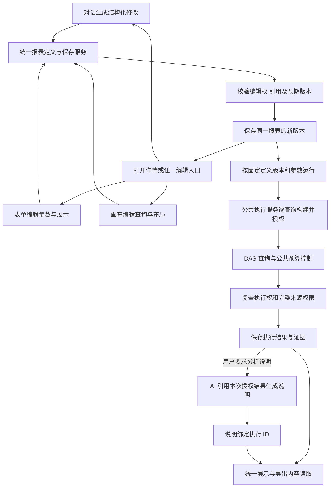
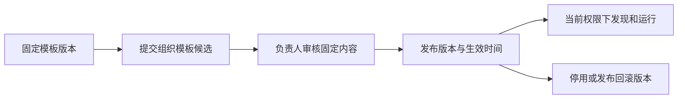

# 第 9 步实施清单：报告、画布与导出

日期：2026-09-21。状态：用户回复“ok 准了开始干”批准本清单及两个子代理分工，API 与共享合同已实施并验收。实际文件、流程和测试见[第 9 步交付说明](第9步交付说明.md)。以下保留获准的实施范围与验收标准。

关联：[API 实施方案](../需求文档/api-implementation-plan.md) · [结果交付与导出设计](../需求文档/result-delivery-and-export.md) · [开发规范](../需求文档/development-standards.md) · [第 10 步交付](第10步交付说明.md)

## 开工审核清单

本次交付统一报表后端：对话、表单和画布编辑同一份定义，公共服务负责校验、版本保存、查询执行、权限复查及结果交付。以下工作按既有实现补齐，详细合同、接口及文件范围见后文。

| 顺序 | 工作项                 | 交付内容                                                                                     | 负责人                                     |
| ---- | ---------------------- | -------------------------------------------------------------------------------------------- | ------------------------------------------ |
| 1    | 共享合同与首建结构     | 统一定义、参数与查询引用、版本、执行及导出合同；补充 `001` 表、约束和索引                    | 主代理                                     |
| 2    | 公共定义保存与二次编辑 | 创建、读取、参数增删改、字段与展示修改、版本冲突检查；可复用块及模板保存                     | 子代理 1                                   |
| 3    | 关系发布与查询构建     | 稳定关系记录、批量发布、一层关系图；公共查询构建复用批准关系、指标和统计规则                 | 子代理 2 负责关系；主代理负责查询构建      |
| 4    | 公共执行服务           | 单查询与多查询统一执行、参数绑定、当前权限、预算、幂等、失败及过期处理；逐项结果和证据       | 主代理                                     |
| 5    | 对话编辑与画布映射接入 | 读取同一结构定义；对话绑定目标和版本、提交修改；画布操作映射相同结构；按需生成说明并关联执行 | 主代理                                     |
| 6    | 报告管理与内容读取     | 列表、版本、分享、产物、完整来源校验；报告及会话导出内容包                                   | 子代理 1                                   |
| 7    | 组织模板审核发布       | 接入第 10 步候选、负责人审核、生效时间、停用和回滚                                           | 主代理                                     |
| 8    | 装配、验收与交付       | BDD/TDD、权限与事务回归、隔离 SQL/HTTP、工程检查、接口文档及交付流程图                       | 主代理统一验收，两个子代理提交各自模块验证 |

范围和操作约定：

- 业务修改集中在共享合同、API 报表、目录关系、查询、运行时、知识及对应测试；复用现有 DAS 执行能力。
- 新增合同、服务、仓储、路由及测试，修改公共入口和完整首建；计划删除文件为 0。具体目录见第 5.2 节。
- 数据结构统一补充 `001_initial_api_schema.sql`，保留 `000`；SQL 验收使用隔离库，现有开发库重建另行安排。
- 沿用已安装依赖，本次依赖安装、升级、卸载操作为 0；如出现新增需要，先列明原因和准确命令，由用户执行。
- 报表保存结果采用现有 5,000 行、2 MiB 证据边界，多查询另按相同额度控制合计结果；普通查询的 100,000 行、32 MiB 交付能力保持原用途。
- 本次完成 Web 所需合同和后端能力；详情页、画布交互、浏览器分页和 Excel、Word、PDF 文件生成由 Web 阶段验收。

执行安排为 **2 个子代理，加主代理共 3 个执行者**。先由主代理完成共享合同、表结构和文件分工，再启动两个子代理；公共入口、迁移及最终集成由主代理集中处理。

开工验收重点：对话与画布交替编辑保持同一报表和版本链；参数新增及绑定可运行；模型不可用时已保存报表仍可执行；同一查询多处引用只执行一次；跨账号权限、分享撤销、并发修改、多查询失败与超预算准确处理；导出内容读取不增加业务查询次数。

## 1. 目的与交付范围

将分析保存为可重复编辑和运行的报表。对话、参数表单和画布共同编辑同一份报表定义，使用同一套参数、版本、权限、执行、展示和导出能力。用户可以在这些入口间交替修改，保存新版本后继续运行。每次运行使用访问者当前权限，生成独立结果。

本阶段交付六项能力：

1. 完善报告列表、版本读取、分享管理与来源追溯。
2. 将已完成分析的展示内容保存为可复用报表块。
3. 建立统一报表定义与执行服务，让对话、表单和画布共同支持参数维护、查询编辑及版本更新。
4. 补齐批准关系独立发布、临时编辑输入和一层关系图接口。
5. 衔接第 10 步的指标发布与审核机制，支持组织常用模板发布。
6. 提供报告、报表执行和会话导出内容的授权读取合同。

当前应用范围仍为 API 和 DAS；报表详情与参数编辑界面、画布编辑界面、前端分页、虚拟滚动和 Excel、Word、PDF 文件生成按 Web 阶段开发。本阶段提供这些入口所需的编辑定义、授权和对话修改接口。第九步后端交付时分别标注 API 完成项和 Web 待办项。

## 2. 当前实现核对

以下为开工前代码静态核对，实施后的结果以交付说明为准。

| 能力           | 当前事实                                                                                | 本次补齐                                             |
| -------------- | --------------------------------------------------------------------------------------- | ---------------------------------------------------- |
| 报告快照       | `reports/report.ts` 已定义章节、文字、表格、图表和证据；`saved_reports` 保存版本化 JSON | 完善展示描述校验、产物关联和查询接口                 |
| 报告接口       | 已有 `POST /reports`、`GET /reports/:id`、`PUT /reports/:id`                            | 列表、版本列表、专用分享管理和导出内容读取           |
| 报告权限       | 最新版本的 `shared_with` 决定分享访问；每份来源调用 `assertEvidenceAccess`              | 将相同检查落实到全部新增读取入口及列表输出           |
| 快照范围复查   | 重新授权历史 `requested_query`，比较最终 DSL 与 `output_masks`；不能确认一致时拒绝      | 保持该保守判定，新增入口复用同一规则                 |
| 模型保存报告   | `save_report` 已接入工具；运行中的有效租约与操作键保护事务保存                          | 保持调用兼容，补齐正式产物的完成状态约束             |
| 报告块         | `reportBlockSchema` 是快照内的展示块，依赖证据 ID                                       | 新增可独立保存、版本化和参数化运行的报表块模型       |
| 画布模板与执行 | 尚无 `report_template`、`report_execution` 合同、仓储及路由                             | 新增模板、转换服务、执行记录和读取能力               |
| 批准关系       | `approved_relations` 嵌在数据集配置 JSON 中；支持可选 `relation_id`、字段对和基数       | 独立关系记录、稳定引用、Join 配置、发布事务及关系图  |
| 分析产物       | 已有 `analysis_evidence`、步骤和 SSE；尚无独立 `analysis_artifacts` 表                  | 保存稳定的展示描述与证据引用，支持从完成运行提取产物 |
| 指标与知识     | 第 10 步已实现审核、发布、生效时间、停用、回滚；知识类型为指标和业务规则                | 增加组织模板候选与发布接入，复用原审核流程           |
| 结果交付       | 普通查询最多 100,000 行、32 MiB；运行证据最多 5,000 行、2 MiB；SSE 使用样本             | 沿用现有预算与完整性语义，明确可导出内容来源         |

参考实现：[报告服务](../ai-data/apps/api/src/reports/report-service.ts)、[报告仓储](../ai-data/apps/api/src/reports/sql-report-repository.ts)、[快照授权](../ai-data/apps/api/src/evidence/evidence-access.ts)、[目录合同](../ai-data/packages/contracts/src/catalog/api-dataset.ts)、[知识合同](../ai-data/packages/contracts/src/knowledge/knowledge.ts)。

## 3. 实施规则

### 3.0 统一报表模型

报表使用稳定的 `report_id`，可编辑定义、执行记录和结果快照分别记录版本及关联。`report_template` 表示可复用的报表定义，适用于所有编辑入口；`report_block` 表示可复用组成部分。来源会话和编辑入口只承担追溯职责。

```text
ReportDefinition
├─ parameters         参数定义与绑定
├─ queries            带稳定 query_id 的查询项与指标引用
├─ presentation       章节、表格、图表、说明及 query_id 引用
└─ editor_layout      可选的画布位置等编辑状态
```

- **一份定义**：业务查询图和参数绑定是统一的结构化数据；最终 DSL 由公共查询构建服务生成。画布坐标等编辑状态与查询语义分别保存。对话追加参数后，表单和画布都能读到同一修改；画布调整字段后，对话读取当前定义继续修改。
- **一个保存服务**：全部入口提交同一合同及 `expected_version`，经过相同的编辑权、参数引用、关系和指标校验，保存同一报表的新版本。切换入口保持报表 ID、业务定义及历史版本连续。
- **一个执行服务**：全部入口按固定定义版本、实际参数和当前访问者发起 `report_execution`。单查询与多查询使用相同调度、授权、预算、幂等和结果合同。
- **查询与展示绑定**：每个查询项产生一张最终输出表，表格、图表及说明通过 `query_id` 引用结果；同一查询项被多个展示块引用时只执行一次。报表可包含多个查询项，每项内部的 Join、聚合和参数均由既有 DSL 能力表达。
- **AI 的职责**：将自然语言整理成结构化定义修改、澄清业务含义，并在用户要求时基于指定执行结果生成分析说明。已保存报表的参数运行按定义执行，模型可用性不影响该查询链路。
- **一个结果来源**：展示和导出读取同一份执行快照及完整性、版本和证据。AI 说明关联生成时的执行 ID；新运行完成后，旧说明仍属于旧执行，需重新生成才可作为本次分析内容。

统一范围包括单个查询项产出一张表、多查询项组成一份报表。查询项之间的结果拼接按受支持 DSL 在查询内部表达，报表层按结果引用组织展示。

### 3.1 报告、产物与版本

- 继续使用 `SavedReport`、章节和现有展示块合同，保存表格、图表、结论、条件、指标版本、来源 DSL、数据新鲜度及生成时间。
- 完善文字内容、图表轴、字段类型、重复块标识和证据引用校验。所有数据性内容声明真实证据，API 校验归属与引用关系；结论的业务正确性仍需由分析及业务验收判断。
- `analysis_artifacts` 保存产物 ID、运行归属、展示描述和证据引用，查询结果继续引用 `analysis_evidence`。保存报告时把渲染所需内容固定到该报告版本，后续修改产物不会改变历史报告。
- 用户从会话保存报告、提取报表块时，来源运行必须为 `completed`。现有 `save_report` 工具发生在 `running` 阶段，继续以有效租约保存运行内产物；对外报告读取、分享和导出同时检查来源运行已完成。失败或取消运行的产物不能作为完成报告交付。
- 版本更新携带 `expected_version`，冲突返回 `CONFLICT`。旧版本内容保持固定；最新分享名单控制所有历史版本的访问。
- 分享管理只允许作者操作，校验接收者属于同一组织。分享变更形成新版本，保留历史内容。分享链接指向报告及可选版本，访问者登录后仍需通过报告 ACL 和来源权限检查。
- 报告列表默认每页 20 条、最多 100 条，使用稳定游标。列表只返回可交付报告的必要摘要，标题、摘要和来源信息同样受权限检查；分页游标按实际扫描位置推进。

### 3.2 可复用报表块

- 为可复用块新增独立合同名称，保留现有快照展示块的含义。块保存基础查询、展示配置、参数定义、指标引用、来源运行及产物、作者、版本和更新时间。
- 从已完成分析提取时，使用证据中的原始查询定义和已验证的业务语义；执行权限由新访问者重新注入。原作者的授权 DSL 只作为历史依据。
- 表格和图表引用明确的查询项及输出字段，说明可以引用一份或多份结果。可复用块携带其完整查询依赖和参数映射，加入报表时一并校验，保证来源完整。
- 结论块保存说明与来源；旧数值结论属于原执行。新运行先交付结果与确定性计算，用户要求生成分析说明时，再通过现有模型运行引用本次已授权结果生成并保存说明。
- 参数采用 `required`、`optional`、`default` 规则，定义类型、允许值或范围、默认值和绑定位置。运行时填写参数值，作用于该版本已声明的筛选值或固定输出输入参数；参数定义及绑定位置可在二次编辑时修改。
- 日期复用 dayjs 和东八区规则；相对时间参数复用第 10 步解析能力，执行记录保存实际日期范围。

#### 3.2.1 二次编辑与参数维护

- 已保存的快捷报表、报表块和画布模板均可重新打开编辑，完整恢复查询定义、参数、绑定关系和展示配置。作者或具有相应维护权限的负责人修改定义；分享查看和执行权限按既有 ACL 判断。
- 支持新增、修改、删除参数，包括参数名称、标签、类型、必填规则、默认值、允许值和取值范围；支持把原有固定筛选改为运行参数，以及为授权字段追加筛选参数。
- 例如第一版报表只有“开始日期、结束日期”，二次编辑可追加“科室”参数，绑定科室字段的筛选条件，保存第二版。第二版运行时显示三个参数，API 在用户选择的科室与其授权范围内执行。
- 编辑参数时同时维护 DSL 绑定、全局参数与块参数映射。重名、类型不符、绑定字段不存在或删除参数后仍有引用时，指出具体问题；参数与其查询定义必须一起校验并原子保存。
- 标题、展示字段、图表、布局和普通查询条件也可按现有编辑能力调整。指标日期依据、统计口径及服务端权限继续受对应规则约束。
- 保存携带 `expected_version`，形成同一报表的新版本；保存成功后可继续编辑或执行。纯编辑保存不执行业务查询，用户运行时才按新定义获取数据。
- 模板固定引用某个块版本。块追加参数后，模板通过二次编辑选择新块版本并补齐参数映射，保存为新模板版本；已有模板版本与执行结果保留原定义和参数。
- 已发布的组织模板可以继续编辑形成待审新版本，通过审核后按生效时间发布。历史执行记录保留当时版本、参数和结果；新运行使用明确选择的版本。

#### 3.2.2 统一编辑入口

所有报表进入同一详情页，展示参数表单、表格、图表、分析说明及来源。详情提供参数与展示编辑、画布编辑和对话修改，按同一报表 ID 和当前定义版本切换。

- **参数与展示编辑**：维护参数名称、类型、默认值、必填规则、筛选绑定、标题、列顺序和图表。表单直接读写统一定义，权限及版本规则沿用第 3.2.1 节。
- **画布编辑**：把统一定义中的查询项、业务关系和展示配置映射为可编辑节点，操作后提交同一结构化定义。首次打开时可根据定义排列节点；布局坐标不参与查询语义。
- **对话修改**：例如“加一个科室筛选”“默认查本月”“按月份汇总”。API 将当前报表 ID、基准版本、定义及授权来源绑定到运行；Agent 通过受控工具提出定义修改，调用同一保存服务校验并提交。
- 对话修改先保存本轮待提交内容，成功完成时原子提交定义版本和运行完成状态；取消、失败或版本冲突时保留原版本。提交目标由 API 的编辑上下文约束。
- 对话、画布和表单同时编辑时，共用预期版本检查。入口切换从保存的当前定义恢复参数和查询，尚未提交的内容按编辑草稿处理。
- 保存定义时保持已有执行记录的实际版本。用户要求运行时，无论从哪个入口发起，都由公共执行服务按所选定义重新查询。用户另行要求分析说明时，AI 引用该次执行的授权结果；说明生成失败时已完成的查询结果仍可读取。

当前代码已有 `save_report` 的运行内快照保存，尚需补齐统一定义、目标报表编辑上下文和定义读写工具合同。新增工具进入 Agent 资源目录，由新 Agent 配置版本选择；已有版本继续使用原工具合同。本节为第九步待审核方案。

### 3.3 统一查询构建与画布映射

- 统一定义保存查询项的逻辑查询图、展示配置、参数、固定版本的块引用和指标引用。公共服务从逻辑查询图生成 DSL；执行记录保存实际 DSL。编辑布局与查询语义独立维护。
- 关系查询由一个主对象和可验证的 Join 顺序组成；每条连线引用已发布关系的稳定标识。API 根据关系记录生成完整字段对，再生成 `queryDslSchema` 支持的 DSL。
- 多字段关系在逻辑图中是一条业务连线。多个别名引用同一对象时逐个授权；多条业务关系按用户选择的标识解析。不存在、方向不符、字段漂移或 Join 类型不符时拒绝保存或运行。
- 固定输出数据集按现有 `parameterized_query` 能力保存与执行；其参数、输出列和行权限绑定继续由现有授权服务校验。
- **一个查询项执行一份最终查询，产生一张输出表；一份报表可以包含多个查询项。** 两种编辑入口遵循相同规则。展示块绑定具体 `query_id` 及输出字段；多结果分析说明声明全部来源。
- 统计复用已审核的粒度、唯一键、基数、去重和预聚合能力。引用指标时记录指标 ID、版本选择方式及实际生效版本；校验日期依据、条件和聚合表达与指标定义一致。
- 现有指标服务可能分别构建分组和总计查询。统一报表复用其构建与统计校验，把所需查询明确保存为查询项，表格与总计分别引用对应结果并固定同一指标版本及实际参数。
- 所有入口保存时校验当前编辑者的对象、字段、关系及指标权限；运行时重新加载当前访问者身份和目录，绑定参数，再经 `QueryAuthorizationService` 逐查询注入行条件与 `output_masks`。
- 模板中的强制权限条件由服务端生成。当前明确参数优先于模板默认；账号默认值仅按已确认的适用规则补充，完整参数在执行记录中可查。

### 3.4 报表执行与快照

- `report_execution` 保存报表 ID、执行者、组织、固定定义版本和实际参数；按 `query_id` 保存实际指标版本、请求 DSL、授权 DSL、输出脱敏规则、结果、完整性、来源和数据时间。
- 公共执行服务展开该版本声明的全部查询项，复用 API/DAS 链路，持久化 `running`、`completed`、`failed` 状态。同一查询项的多个展示引用复用一次结果。与模型运行关联时保存 `analysis_run_id`，同时保留独立执行 ID 和逐查询审计关联。
- 已保存的单查询及多查询报表均按确定定义运行。AI 编辑工具需要试算或用户要求重算时，调用同一个执行服务；模型理解及生成说明通过现有 Harness 按需完成。
- 多查询中任一项失败，整次执行标记失败并记录具体查询及原因；完成快照只引用该次成功执行的完整结果集合。已执行查询的必要审计保留，整次运行共用总时限及结果容量预算。
- 请求携带幂等键；同一账号、同一操作键和相同请求返回同一执行记录，内容不同则冲突。执行完成的重试仅重新授权并读取已有结果。
- 在事务中领取执行权并记录截止时间及代次，提交前检查执行权、当前身份和权限。进程中断或执行超时后将过期执行标记失败；新查询由显式新请求发起，已有结果可读取。
- 各查询证据采用既有 5,000 行、2 MiB 上限，省略行数时按此默认值执行；多查询的保存结果集合也受整次执行 5,000 行、2 MiB 总预算约束，超预算明确失败。普通 `POST /query` 的 100,000 行、32 MiB 交付能力继续由当前浏览器会话持有。
- 结果中的截断、实际行数和总量语义沿用 `QueryResult`。读取、分享和导出执行快照时复查完整来源，不能确认覆盖则整份拒绝；用户可以用当前权限显式创建新执行。
- 结果返回前复查身份、最终 DSL 和脱敏规则，并设置 `Cache-Control: no-store`。查询阶段权限变化不能交付旧范围结果。

### 3.5 关系发布与一层关系图

- 为每条批准关系建立独立记录，保存数据源、源对象、目标对象、稳定标识、版本、业务说明、方向、允许的 Join 类型、字段对、基数及唯一键依据。
- 稳定引用使用数据源、源对象和 `relation_id` 的组合。新发布关系要求标识完整；现有配置入口中省略标识的关系在保存时分配标识并返回，查询匹配的既有兼容行为保留。
- 现有 `ApiDatasetConfig.approved_relations` 接口形态继续提供；仓储读取时由独立关系记录组装，写入时在事务中拆分保存。关系记录作为唯一来源，避免配置 JSON 与关系接口分别修改同一关系。
- 管理员一层关系图读取中心表的入向、出向全部已发布关系，保持原有方向和 Join 含义，返回对象说明、字段对、基数、版本及可编辑信息。出现在图中不等于允许反向执行该关系。
- 普通报表用户读取关系选项时，只返回当前有权使用的对象、字段和关系。
- 临时编辑内容通过接口加载，由客户端持有。发布提交明确的新增、修改和停用操作及预期版本；整批校验后事务提交，遗漏某条线不代表删除。
- 一批关系任一项校验失败或版本冲突，整批回滚；发布成功后再次展开关系图即得到新记录。模板运行时复查当前关系，关系变化需要重新校验。
- 关系修改沿用目录管理权限。此阶段变更限于关系存储、接口及其查询消费者，数据源和角色权限仍按当前服务维护。

### 3.6 组织模板与第 10 步衔接

- 个人模板由作者编辑、保存并按 ACL 分享。作为组织或医院正式常用模板发布时，使用第 10 步的候选、负责人审核、固定版本发布、生效时间、停用和回滚流程。
- 在知识内容类型中增加模板候选，内容引用确定的模板版本并固定其内容摘要。审核后修改模板须重新提交候选。
- 发布前复查模板查询、关系、指标版本和发布范围；正式目录只返回已生效且当前访问者可使用的模板。模型只提交候选或读取已发布内容。
- 模板指标引用支持固定版本或当前有效发布版本，执行开始时解析并固定实际版本。停用和未来生效版本按现有指标规则处理。
- 回滚发布为新版本，历史模板执行和报告继续保留生成时内容。知识候选与模板发布副作用在同一事务内提交。

### 3.7 导出内容读取

- 提供面向浏览器的结构化内容包，覆盖报告、报表执行及用户可见会话。包含标题、章节、用户问题、澄清与回答、分析说明、图表描述、必要表格、证据、查询条件、指标版本、完整性和数据时间。
- 会话内容包复用现有消息及运行记录，按顺序组织；图表和表格从授权产物及证据恢复。内部工具参数、模型内部信息和运行凭据不进入用户导出合同。
- 历史内容先检查会话或报告访问权，再逐一检查相关证据的当前权限。已有消息读取授权链路继续复用，导出聚合不会放宽其范围。
- 内容包读取使用已保存结果；业务 SQL 和业务 HTTP 查询次数在读取前后保持不变。授权所需的元数据与目录读取单独计数。
- Excel 可使用完整且仍可用的结果，包括当前普通查询明细；快照或 SSE 样本不能替代完整明细。内容包标明可用结果及缺失原因，截断结果不能标记为可导出的完整表。
- Word 使用可编辑的文字和表格，图表可转换为图片；PDF 使用固定版式分析内容。这两项由 Web 阶段实现并检查中文、分页及打印效果。
- 浏览器刷新后只恢复已保存内容；尚未保存的普通查询明细若已丢失，需要用户显式发起新查询。

## 4. 拟新增及调整的接口

接口按报表定义、执行与结果组织，供对话、表单和画布共同调用。输入输出使用严格 Zod 合同，可信组织、用户及角色来自登录上下文。

| 接口                                                       | 用途与主要约束                                                                                     |
| ---------------------------------------------------------- | -------------------------------------------------------------------------------------------------- |
| `POST /report-definitions`                                 | 创建统一定义并分配稳定报表 ID；可从完成分析及证据初始化                                            |
| `GET /reports/:id/definition`                              | 读取指定或当前定义版本，用于展示参数、运行及编辑                                                   |
| `PUT /reports/:id/definition`                              | 提交完整结构化修改与预期版本，公共服务统一校验并保存                                               |
| `POST /reports/:id/execute`                                | 固定定义版本、参数及幂等键，创建统一执行记录                                                       |
| `POST /reports/:id/revisions`                              | 自然语言编辑适配入口，绑定报表和基准版本；Agent 调用公共定义服务，返回会话与运行标识，进度复用 SSE |
| `GET /reports`                                             | 当前可读报表摘要与可用状态，游标分页；定义和快照按报表 ID 关联展示                                 |
| `GET /reports/:id/versions`                                | 可读定义版本与对应结果快照关联，明确两种版本含义                                                   |
| `PUT /reports/:id/sharing`                                 | 作者按预期版本更新同组织分享名单                                                                   |
| `GET /reports/:id/export-content`                          | 读取指定版本或执行快照的固定内容包                                                                 |
| `GET /report-executions/:id`                               | 状态、实际定义版本、参数、逐查询结果和证据摘要                                                     |
| `GET /report-executions/:id/export-content`                | 当前权限下读取已保存执行结果                                                                       |
| `GET /conversations/:id/export-content`                    | 按消息顺序组织会话分析内容                                                                         |
| `GET /analysis-runs/:id/artifacts`                         | 读取完成运行中当前有权查看的产物                                                                   |
| `POST /report-blocks`、`GET /report-blocks`                | 创建和发现可复用组成部分                                                                           |
| `GET /report-blocks/:id`、`PUT /report-blocks/:id`         | 读取及更新块版本，加入报表后由统一服务校验和执行                                                   |
| `GET /report-templates`                                    | 发现可用的已发布模板，返回统一报表定义及发布版本引用                                               |
| `GET /admin/catalog/:sourceId/objects/:objectId/relations` | 中心表完整一层关系与临时编辑初始数据                                                               |
| `POST /admin/catalog/:sourceId/relations/publish`          | 批量发布有版本约束的关系变更                                                                       |
| `GET /catalog/:sourceId/objects/:objectId/relations`       | 可选的已授权关系                                                                                   |
| 现有知识候选、审核、发布、停用和回滚接口                   | 支持统一定义的固定版本发布                                                                         |

现有 `POST /reports`、`GET /reports/:id` 和 `PUT /reports/:id` 的快照保存、读取与更新合同继续有效；增加可选定义及执行引用。编辑定义的当前版本、快照版本和实际执行版本分别表达，读写均归属同一稳定报表 ID。

公共保存服务接收统一定义及 `expected_version`。对话适配运行持久化目标报表、基准版本和待提交内容，成功时调用该服务，在同一事务中提交定义版本与运行完成状态。直接编辑调用同一校验与版本提交能力。纯定义修改保持已有结果的原执行标记；重新运行才生成新的数据结果。

定义读取校验报表访问权，涉及历史结果的部分另外检查完整来源；定义修改还需编辑权。新增参数错误复用 `INVALID_INPUT`，版本冲突复用 `CONFLICT`，来源权限拒绝复用 `POLICY_REJECTED`。导出读取已有授权结果。

## 5. 数据库与文件增删改

### 5.1 首建结构

继续保留 `000_schema_migrations.sql`，所有本阶段结构统一补充 `001_initial_api_schema.sql`。

| 表或存储                                       | 拟变更                                             |
| ---------------------------------------------- | -------------------------------------------------- |
| `saved_reports`                                | 保留版本化快照，补充支持列表排序的元信息及索引     |
| `analysis_artifacts`                           | 新增产物描述、运行归属、证据引用及稳定操作键       |
| `report_blocks`、`report_block_versions`       | 新增作者、当前版本、版本定义及来源引用             |
| `report_templates`、`report_template_versions` | 新增模板归属、分享范围、不可变版本和块引用         |
| `report_executions`                            | 新增执行状态、幂等键、执行权、版本、参数和结果快照 |
| `approved_relations`                           | 新增按源对象和稳定标识保存的独立关系记录及版本     |
| `api_dataset_configs`                          | 调整关系读写装配及并发版本信息，保留其他配置职责   |
| 知识候选、发布版本及模板发布关联               | 复用第 10 步存储，增加模板版本的发布绑定           |

每张新增业务表明确归属、主键、唯一键、JSON 校验及必要索引；报告、模板与执行按组织和账号隔离。首建验证使用隔离数据库。现有开发库切换到新首建基线需单独安排重建，本清单不执行现有开发库重建。

统一定义使用拟新增的 `report_templates` 及版本表保存，按稳定报表 ID 关联；该模型供全部编辑入口复用。对话编辑的运行上下文另行记录目标报表、基准版本和待提交修改。相关结构随本阶段统一加入 `001`，用于恢复与完成事务提交；历史报告保留原执行版本。

### 5.2 文件清单

以下路径相对 `ai-data/`。新增文件名为拟定名；实现按这些目录和职责拆分，测试镜像业务目录。

| 类型        | 文件范围                                                                                                                                                                     | 目的                                                        |
| ----------- | ---------------------------------------------------------------------------------------------------------------------------------------------------------------------------- | ----------------------------------------------------------- |
| 修改        | `packages/contracts/src/reports/report.ts`、`report-types.ts`                                                                                                                | 完善现有快照与分享、列表合同                                |
| 新增        | `packages/contracts/src/reports/` 下 `analysis-artifact`、`reusable-report-block`、`report-template`、`report-execution`、`report-export`、`canvas-query` 及各自 `-types.ts` | 新产物、模板、执行、导出和画布合同                          |
| 修改 / 新增 | `packages/contracts/src/catalog/api-dataset.ts`、关系发布与关系图合同及类型                                                                                                  | 完整关系配置与读写边界                                      |
| 修改        | `packages/contracts/src/knowledge/knowledge.ts`、对应类型、`src/index.ts`                                                                                                    | 模板候选及统一公共导出                                      |
| 修改 / 新增 | `apps/api/src/reports/`                                                                                                                                                      | 报告、产物、块、模板、画布转换、执行和内容包服务及 SQL 仓储 |
| 修改 / 新增 | `apps/api/src/catalog/`、`catalog-admin/`、`query/`                                                                                                                          | 关系独立存储、发布、图查询和授权消费者接入                  |
| 修改        | `apps/api/src/metrics/`、`knowledge/`                                                                                                                                        | 复用指标构建与校验，接入模板审核发布                        |
| 修改        | `apps/api/src/analysis-runs/`、`runtime/analysis-tools.ts`、`runtime/tool-contracts.ts`、`conversations/`                                                                    | 产物保存、完成状态、历史内容聚合及报告工具兼容              |
| 修改 / 新增 | `apps/api/src/routes/`                                                                                                                                                       | 新报告接口、块模板执行、导出内容及关系路由                  |
| 修改        | `apps/api/src/app-types.ts`、`app.ts`、`index.ts`                                                                                                                            | 必需依赖装配与启动接入                                      |
| 修改        | `apps/api/migrations/001_initial_api_schema.sql`                                                                                                                             | 完整首建表、约束及索引                                      |
| 新增 / 修改 | `packages/contracts/tests/`、`apps/api/tests/` 对应领域与集成测试                                                                                                            | BDD 场景、合同、权限、SQL 事务与 HTTP 链路验收              |
| 新增 / 修改 | `REPORTS.md`、`TESTING.md`、相关需求文档和任务交接文档                                                                                                                       | 接口使用、执行流程、实施状态与交付证据                      |

本清单没有计划删除的文件。沿用现有依赖，无安装、升级或卸载操作；如实际实施出现新增依赖需要，先说明用途和影响，再提供准确命令由用户执行。

统一报表的合同增加 `report-definition.ts` 及对应类型，公共服务集中在 `reports/`，画布映射和 `runtime/` 的 Agent 工具均调用该服务。补充范围包括报告及会话路由、`analysis-runs/` 的编辑完成事务和恢复、Agent 工具资源目录与对应测试。主代理负责统一合同、查询构建与执行、运行时及 Agent 装配，子代理 1 负责公共定义保存和报告管理领域，沿用下述分工边界。

## 6. 实施顺序与子代理建议

获准执行安排为 **2 个子代理，加主代理共 3 个执行者**，实际按下列职责完成。

| 执行者   | 分工                                                                                                             | 文件归属                                                                                                                                                |
| -------- | ---------------------------------------------------------------------------------------------------------------- | ------------------------------------------------------------------------------------------------------------------------------------------------------- |
| 主代理   | 共享合同、首建结构、公共查询构建与执行、画布映射、Agent 编辑工具、知识发布衔接、运行时与应用装配、整体验收和交付 | contracts、迁移、公共入口；`reports/report-query-*`、`reports/report-execution-*`、`reports/canvas-*`、执行仓储、runtime、knowledge、metrics 及关联测试 |
| 子代理 1 | 公共定义保存与二次编辑、报告列表、版本、分享、产物、可复用块、模板管理、导出内容读取及测试                       | 分配的 `reports/` 定义及管理服务与仓储、报告管理路由、对应 tests；查询构建与执行文件由主代理负责                                                        |
| 子代理 2 | 关系记录、批量发布、一层关系图及现有目录读写兼容，以及对应测试                                                   | 分配的 `catalog/`、`catalog-admin/`、关系路由、对应 tests；共享合同和迁移由主代理负责                                                                   |

执行次序：

1. 主代理统一合同、表结构、接口签名、文件归属和验收场景，明确当前行为的兼容边界。
2. 按 BDD/TDD 编写场景与测试，确认新行为的预期失败。
3. 在批准的分工内实现公共定义保存、报告管理和关系领域；主代理实现公共查询构建、执行、画布映射、Agent 编辑、发布及应用接入。
4. 主代理合并调用链，完成权限变化、版本冲突、失败恢复和业务统计验收。
5. 完成必需工程检查、隔离 SQL/HTTP 验证，保存交付说明、流程图及 Web 接入约定。

新增分工或扩大目录范围时按项目规则另行说明；已有子代理的下一批派工也遵循批准范围。

## 7. 执行流程






## 8. BDD 验收清单

| 编号 | 前提与操作                                     | 验收预期                                              |
| ---- | ---------------------------------------------- | ----------------------------------------------------- |
| R1   | 保存完成运行的表格、图表和结论                 | 内容、来源、条件、版本及时间可追溯                    |
| R2   | 保存中、失败或取消的运行产物被请求公开读取     | 完成状态检查阻止交付，现有工具租约保存仍可运行        |
| R3   | 读取报告列表、详情、版本和内容包               | 全部执行相同归属、分享及来源授权                      |
| R4   | 作者撤销分享后，接收者访问旧版本链接           | 最新 ACL 生效，旧版本不能继续访问                     |
| R5   | 两个请求按同一旧版本更新或分享                 | 一项成功，另一项 `CONFLICT`，历史内容保持固定         |
| R6   | 产物伪造证据或图表引用错误字段                 | 输入拒绝，数据库没有部分产物                          |
| B1   | 从完成分析提取块并更换日期运行                 | 原始查询语义保留，新结果、参数和证据独立保存          |
| B2   | 历史文字包含旧数值或依赖多份查询               | 来源完整保留，不能把旧结论冒充新结果解释              |
| C1   | 两个不同科室账号执行同一模板                   | 使用相同模板版本，各自取得当前授权结果                |
| C2   | 参数尝试替换字段、关系或扩大行权限             | 合同或授权拒绝；允许参数只能收窄有效结果              |
| C3   | 多字段关系、多条具名关系或同表多别名           | 使用被选关系的完整字段对，逐个别名授权                |
| C4   | LEFT JOIN 可选侧没有授权匹配                   | 保留符合要求的主记录，统计符合基准                    |
| C5   | 多明细关联、去重与预聚合                       | 每个查询项的统计与人工 SQL 基准一致，展示引用正确结果 |
| C6   | 固定输出数据集含强制权限参数                   | 参数受控绑定，字段与脱敏规则正确                      |
| C7   | 展示块引用不存在的查询项或输出字段             | 保存拒绝并说明不匹配位置                              |
| E1   | 相同执行幂等键重试或并发提交                   | 返回同一记录；已完成结果不会再次执行业务查询          |
| E2   | 执行中权限变化、登录失效或超过截止时间         | 不提交成功结果，迟到执行器不能覆盖终态                |
| E3   | 进程中断后再次读取或重试执行                   | 过期状态可收敛；显式新执行使用新标识                  |
| E4   | 空结果、截断、行数及字节预算边界               | 行数与完整性准确，超预算明确失败                      |
| G1   | 中心表同时存在入向、出向、多字段关系           | 一层全部返回，方向和字段对准确，执行规则不被反转      |
| G2   | 批量关系发布含错误字段、基数或版本冲突         | 整批回滚；合法发布后图查询立即反映变更                |
| G3   | 旧目录配置接口保存并读取关系                   | 与新关系接口使用相同记录，标识稳定                    |
| K1   | 模板候选获准后修改定义再请求发布               | 固定版本校验拒绝旧审核结果                            |
| K2   | 指标或模板未来生效、停用、回滚                 | 新执行使用符合规则的版本，历史快照保持固定            |
| X1   | 读取报告或会话导出内容包                       | 业务 SQL/HTTP 调用次数不增加，内容来自已保存记录      |
| X2   | 快照包含访问者无权覆盖的文字、图表或表格来源   | 整个内容包拒绝，不能通过隐藏表格保留越权结论          |
| X3   | SSE 样本、截断结果或已丢失普通明细尝试完整导出 | 可用状态准确，不能伪装完整表格                        |
| X4   | 会话包含澄清、确认、多个运行及图表             | 用户可见顺序、条件和证据对应准确                      |

二次编辑专项场景：

| 编号 | 前提与操作                                                 | 验收预期                                                           |
| ---- | ---------------------------------------------------------- | ------------------------------------------------------------------ |
| D1   | 重新打开只有日期参数的报表，追加科室参数并保存             | 查询、参数和展示完整恢复；新版本按日期及科室运行，当前行权限生效   |
| D2   | 调整参数类型、必填规则、默认值及绑定，或将固定条件改成参数 | 保存时统一校验；新运行使用新定义，旧版本的参数和执行结果不变       |
| D3   | 参数改名、删除后仍有旧绑定，或新增参数重名、类型不符       | 保存拒绝并定位问题；合法的参数及绑定变更原子提交                   |
| D4   | 报表块追加参数后，引用它的模板选择新块版本                 | 提示并校验待补参数映射；模板保存新版本后可执行，旧模板仍引用原版本 |
| D5   | 保存编辑后的定义，随后显式运行；两人并发修改同一版本       | 保存时业务查询次数不变，运行时使用新版本；并发旧版本更新返回冲突   |
| D6   | 修改已发布组织模板的参数定义                               | 新定义形成待审版本，审核生效后用于新运行，历史执行保留原版本       |

编辑入口专项场景：

| 编号 | 前提与操作                                         | 验收预期                                                       |
| ---- | -------------------------------------------------- | -------------------------------------------------------------- |
| V1   | 打开对话生成的报表并追加科室参数                   | 详情返回参数和结果，表单编辑即可保存并运行，画布是可选入口     |
| V2   | 在报表详情发起“把科室加成筛选项”                   | 运行绑定目标与基准版本，成功后更新同一报表定义和参数表单       |
| V3   | 多查询分析报告的日期参数绑定多个查询，用户要求重算 | 各查询使用已验证绑定与当前权限，结论对应新证据，完整来源可追溯 |
| V4   | 对话修改途中取消、失败或发生版本冲突               | 原报表和定义版本保留，迟到修改不覆盖其他编辑                   |
| V5   | 仅调整参数定义或展示，随后查看历史执行             | 保存不自动查数；结果仍标明实际执行版本，重算后记录新版本       |
| V6   | 当前账号只有分享查看权，或来源权限被收回           | 编辑入口及修改提交按当前权限拒绝                               |

统一逻辑专项场景：

| 编号 | 前提与操作                                             | 验收预期                                                       |
| ---- | ------------------------------------------------------ | -------------------------------------------------------------- |
| U1   | 对话追加参数，切到画布修改字段，再通过对话读取并保存   | 同一报表 ID 和连续版本，参数、字段、关系及展示完整保留         |
| U2   | 对话工具与表单提交相同定义修改，或并发修改同一基准版本 | 使用同一校验和版本服务；等价修改结果一致，并发旧版本提交冲突   |
| U3   | 模型不可用，运行已保存的单查询及多查询报表             | 公共执行链路按参数正常查询，结果、权限和预算保持有效           |
| U4   | 多个展示块引用同一查询项，其他块引用另一查询项         | 每个查询项执行一次，结果通过稳定引用分配到展示块               |
| U5   | 多查询中途失败或合计结果超出整次预算                   | 整次执行失败，保留必要审计，不产生完成快照                     |
| U6   | 参数重跑后查看旧说明，再请求生成本次分析说明           | 旧说明关联原执行，新说明关联本次结果；说明失败不丢失已完成结果 |

验证顺序为合同与领域单测、SQL 事务、真实 API→DAS→隔离 SQL 的统一报表执行、HTTP 读取与权限回归，最后运行受影响包的格式、类型、Lint、工程规则和构建检查。入口切换先以结构化定义及 API 合同验收，Web 阶段补真实交互验收。使用已安装 CLI，SQL 验证记录环境与清理结果；缺少环境时如实标记未实跑。

本阶段不以真实模型的自主工具选择作为新增模板链路的唯一验收依据；确定性对话覆盖 `save_report` 兼容及产物完成状态。真实模型完整复验沿用已有调优安排。

## 9. 审核重点与交付标准

本次需要审核的具体行为包括：统一报表定义及公共保存、执行服务，编辑入口交替使用，多查询项与逐项结果引用，整体执行预算及失败规则，二次编辑参数，关系独立存储与兼容，产物完成状态，分享及来源授权，组织模板发布，以及两个子代理的分工。

获准后完成上述业务实施，再提供 `第9步交付说明.md`、接口说明、流程图、测试结果及仍由 Web 阶段承担的验收项。文档与代码分别标注完成状态；代码验收不等同于浏览器编辑器和文件生成已交付。

实施及验证已经完成，接口用法见[统一报表接口](../ai-data/REPORTS.md)，具体结果和后续 Web 接入边界见交付说明。
