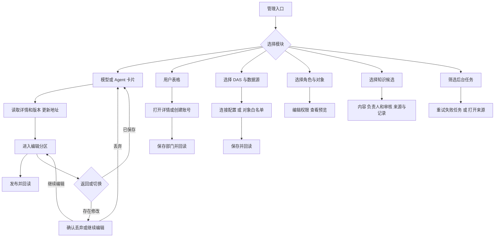

# 管理页面布局调整交付说明

日期：2026-10-06。依据[已批准实施清单](管理页面布局调整实施清单.md)，七个管理模块已完成调整，进入页面审核。执行者为主代理，依赖操作为 0。

## 页面结果

沿用报表页面的主题、系统字体、细边框和强调色。模型、Agent、数据源以卡片进入配置；用户使用账号表格和选中详情；权限、审核与任务保留适合比较信息的列表与表格。

| 模块 | 主要变化 | 验证的业务流程 |
| --- | --- | --- |
| 模型 | 搜索与状态筛选、资源卡片、完整配置区域、版本侧栏 | 认证发布、版本冲突、历史读取、地址恢复、丢弃草稿、撤权清理 |
| Agent | 资源卡片，基本配置/工具/Skill/运行限制分区 | 固定模型版本、版本发布、工具选择、Skill 预览 |
| 用户 | 账号表格、状态筛选、按需打开详情和创建表单 | 创建后回读、授权版本与部门范围保存、关闭详情 |
| 角色与权限 | 顶部数据源与角色选择，对象和规则分区，按需展开预览 | 角色实际版本、对象权限保存、范围预览 |
| 数据管理 | DAS 上下文栏、数据源卡片、连接配置/对象白名单标签，凭据独立打开 | 完整配置回读、SQL Server 连接参数、冲突与回执丢失、白名单与关系发布 |
| 知识审核 | 候选列表与详情，内容/负责人和审核/来源与记录分区 | 固定版本审核、负责人分配、发布与停用、个人入口回归 |
| 后台任务 | 状态筛选、对齐的表格与状态徽标 | 失败重试、来源授权校验、处理中刷新 |

模型和 Agent 详情地址通过 `resource` 与可选 `version` 查询参数定位。刷新、浏览器返回和指定历史版本均可恢复；认证与编辑草稿保存在当前页面内存，离开前沿用现有未保存确认。

搜索和筛选作用于现有接口返回的数据，数量显示当前范围。数据源卡片使用真实返回的标识、类型和目标库字段。

## 实际文件

以下路径以 `ai-data/apps/web/` 为基准。

| 操作 | 文件 |
| --- | --- |
| 新增 | `src/shared/management/resource-card.vue`、`use-resource-location.ts` |
| 修改 | `src/styles/management.css` |
| 修改 | `src/features/models/pages/models-page.vue`、`components/model-form.vue` |
| 修改 | `src/features/agents/pages/agents-page.vue`、`components/agent-form.vue` |
| 修改 | `src/features/users/pages/users-page.vue` |
| 修改 | `src/features/permissions/pages/permissions-page.vue` |
| 修改 | `src/features/data-management/components/das-manager.vue`、`data-source-manager.vue`、`catalog-manager.vue` |
| 修改 | `src/features/knowledge/pages/knowledge-page.vue`、`components/knowledge-board.vue`、`knowledge.css` |
| 修改 | `src/features/tasks/pages/tasks-page.vue` |
| 新增 | `tests/e2e/management-layout.spec.ts`、`management-gallery.spec.ts` |
| 修改 | `tests/e2e/management.spec.ts`、`knowledge.spec.ts`、`ui-gallery.spec.ts` |

计划中的路由和部分叶子组件可以直接复用，实际未修改这些文件。地址恢复在共享 helper 与对应 feature 内实现，沿用已有路由权限。删除文件为 0。

交接文件包括本说明、实施清单状态、截图审核目录和 README 追加记录。API/DAS、数据库、依赖及运行配置变更为 0；本轮构建使用已有脚本更新本机产物。

## 操作流程



## 验证结果

| 检查 | 结果 |
| --- | --- |
| 根目录 `typecheck` | 通过 |
| 根目录 `lint` | 通过 |
| 根目录 `test` | 1,584 项通过：工程 42、metadata 28、contracts 199、DAS 444、API 704、Web 167 |
| 根目录 `build` | 通过，包含 Web 与 Windows x64 API/DAS 产物整理 |
| 最终 Web `typecheck`、`lint`、`build` | 通过 |
| 本轮 Web 修改及新增文件格式 | 通过 |
| 新增布局专项与截图用例 | 最终 8 项通过 |
| 原管理与知识浏览器用例 | 21 项通过 |
| 报表、画布、全站和应用浏览器回归 | 32 个场景通过；另有 1 个登录断网重试场景偶发失败，见下文 |
| 视觉与适配 | 15 张 1920×1080 桌面截图、1 张 390×844 适配图；亮暗、四配色、1024/390 宽度及键盘入口检查通过 |

浏览器使用 Chromium、现有隔离认证服务和管理/知识测试数据。用户表格截图增加了五条隔离演示账号，便于审核多行布局。正式数据写入、真实数据库连接与 rj 模型调用未纳入本轮验收。

测试过程保留：管理布局初测发现新入口尚未实现；实现后修复了知识审核操作后标签复位的问题，以及标签隐藏作用在多根组件上的问题。随后适配旧截图脚本的用户入口，并等待模型列表加载完成再注入历史版本测试数据。最终管理专项全部通过。

### 待处理回归问题

`application.spec.ts` 的“服务断网与退出失败提供重试”在整组回归中失败一次，单独复验通过；进一步重复三次为 2 次通过、1 次失败。失败发生在首次身份恢复请求断网、恢复网络并点重试后，页面停在“正在打开页面”，30 秒内未出现登录表单。

本轮未修改 `app.vue`、路由认证守卫、AuthSession 或该测试。现有证据可以确认问题具有偶发性，尚不能据此断定根因。保留[失败截图](管理页面布局调整验收/回归问题/登录断网重试.png)、[页面快照](管理页面布局调整验收/回归问题/登录断网重试快照.md)和[Playwright trace](管理页面布局调整验收/回归问题/登录断网重试-trace.zip)。后续建议单独检查首次路由就绪、身份恢复和重试导航之间的时序，再按项目审批规则实施修复。

### 全仓格式与构建提示

根目录格式检查报出 25 个本轮未修改文件的问题，范围为 API/DAS 配置及接入凭据相关源码/测试、contracts 的 DAS 会话合同、`apps/web/src/styles/app.css` 和 `pnpm-lock.yaml`。本次修改文件的格式检查通过；全仓格式检查不能记为通过。

Vite 构建仍报告已有大资源分块提示，主要涉及图表、布局和导出相关资源，构建成功。本轮未调整这些模块的打包策略。

### 命令与环境

工作区为 `D:\porject_new_2026\ai-data\ai-data`。pnpm 11 首次执行验证时触发依赖预检，尝试自动安装后因网络/非交互条件停止；未完成安装。后续关闭命令前的依赖自动校验，复用已有工具链：

```powershell
$env:pnpm_config_verify_deps_before_run = 'false'
pnpm --config.verify-deps-before-run=false --config.manage-package-manager-versions=false typecheck
pnpm --config.verify-deps-before-run=false --config.manage-package-manager-versions=false lint
pnpm --config.verify-deps-before-run=false --config.manage-package-manager-versions=false test
pnpm --config.verify-deps-before-run=false --config.manage-package-manager-versions=false build
```

浏览器专项在 `apps/web/` 使用已安装 CLI：

```powershell
node node_modules/@playwright/test/cli.js test management-layout.spec.ts management.spec.ts knowledge.spec.ts ui-gallery.spec.ts ui-refresh.spec.ts application.spec.ts reports.spec.ts report-bi.spec.ts report-editor.spec.ts
node node_modules/@playwright/test/cli.js test management-gallery.spec.ts management-layout.spec.ts
```

本机测试端口为 4318 和 5317，测试服务由已有脚本启动并清理。历史验收目录中由回归脚本重写的 PNG 已恢复，本轮审核图单独保存。

## 页面审核

打开[审核页](管理页面布局调整验收/审核.html)可逐张查看；[截图索引](管理页面布局调整验收/README.md)列出模块、尺寸与重点。下一步按用户逐页反馈调整。
