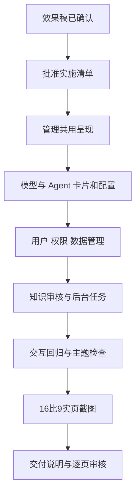

# 管理页面布局调整实施清单

日期：2026-10-06。状态：用户回复“改”批准实施，七个管理模块已完成，进入页面审核。交付、流程图及已发现的回归问题见[交付说明](管理页面布局调整交付说明.md)。

依据：用户要求管理页面参照报表风格，查看四张效果稿后回复“不错 可以”。视觉基线见[管理页面效果稿](管理页面效果稿-2026-10-06/README.md)。本清单将管理区的落地范围、文件与验收方式列出，获准后由主代理单独实施。

## 1. 目的与范围

让管理入口便于浏览，编辑页面的信息分组和主操作清晰，统一沿用现有报表页面的字体、表面、细边框、间距与强调色。

| 模块 | 落地布局 | 保留的业务能力 |
| --- | --- | --- |
| 模型管理 | 资源卡片 → 独立内容区域的详情/版本/编辑视图；名称或标识搜索、状态筛选 | 完整认证发布、历史版本读取、启停、发布冲突核对 |
| Agent 管理 | 沿用模型卡片与配置分区，展示绑定模型版本、Skill 与状态 | 固定模型版本、Skill 预览、版本发布、启停 |
| 用户管理 | 账号表格 + 选中用户详情；新建表单按需打开 | 创建账号、查看角色、保存部门范围、账号启停 |
| 角色与权限 | 顶部数据源/角色选择；对象列表与规则编辑分区；历史/预览按需查看 | 对象/字段/行范围规则、版本历史、权限预览 |
| 数据管理 | DAS 选择 → 数据源卡片 → 配置/凭据/对象白名单；目录与关系独立标签 | 数据库发现、完整配置保存、SQL Server 连接参数、白名单、业务目录和关系发布 |
| 知识审核 | 顶部分类标签、候选列表、选中项审核详情，重点突出版本与审核操作 | 分配负责人、审核固定版本、管理正式知识生效状态 |
| 后台任务 | 状态筛选 + 结构化任务表格，状态与操作对齐 | 处理中自动刷新、失败重试、打开来源会话 |

搜索与筛选依据现有接口返回的数据实现，数量文字明确表示当前返回范围。页面只显示真实返回字段；名称缺失时用现有标识展示。

## 2. 交互与呈现

- 复用 Element Plus、Lucide 和现有主题变量，覆盖亮色、暗色及已有配色。保留系统字体。
- 模型与 Agent 的浏览、详情和编辑清晰切换；支持返回列表，详情定位随页面地址保存，刷新与浏览器返回能恢复选中资源。
- 模型配置按基本信息、上下文、认证、版本组织；版本只读信息与待提交输入分开，主操作放在稳定位置。
- 模型与 Agent 版本仍由现有接口读取；版本记录视图采用当前支持的指定版本读取能力。
- 用户详情展示角色，部门范围继续使用实际业务部门 ID。详情在窄屏下改为独立区域或抽屉，避免压缩表格和表单。
- 数据源概览聚焦名称/标识、类型、数据库及启用状态；编辑凭据、配置、白名单按入口展开，保存后回读。
- 权限、知识审核及任务使用列表/表格承载比较信息；详情分区沿用同一视觉规格。
- 保留未保存提示、提交忙碌状态、输入错误、权限失效处理、空态与重试反馈。键盘能够进入卡片、列表、详情和主要操作。
- 管理样式收敛到管理页面范围；知识公共组件按现有管理模式区分呈现，回归个人知识入口。

## 3. 文件增删改

下列 Web 路径以 `ai-data/apps/web/` 为基准。

| 操作 | 文件或目录 | 改动用途 |
| --- | --- | --- |
| 修改 | `src/styles/management.css` | 卡片、工具栏、表格、配置分区、详情面板与响应式样式 |
| 修改/新增 | `src/shared/management/` 的呈现组件 | 复用资源卡片与编辑区域；已有资源列表保留必要使用场景 |
| 修改 | `src/features/models/pages/models-page.vue`、`components/model-form.vue` | 模型卡片、详情及认证/版本分区 |
| 修改 | `src/features/agents/pages/agents-page.vue`、`components/agent-form.vue`、`skill-preview.vue` | Agent 卡片、配置和 Skill 展示 |
| 修改 | `src/features/users/pages/users-page.vue`、`components/user-create-form.vue` | 用户表格、详情与按需新建 |
| 修改 | `src/features/permissions/pages/permissions-page.vue` 及其 `components/` | 规则编辑、历史与预览的页面组织 |
| 修改 | `src/features/data-management/pages/data-management-page.vue` 及其 `components/` | DAS、数据源、凭据、白名单、目录与关系的分区和入口 |
| 修改 | `src/features/knowledge/pages/knowledge-page.vue`、`components/knowledge-board.vue`、`knowledge.css` | 管理模式的列表与审核详情；必要的关联呈现组件一并调整 |
| 修改 | `src/features/tasks/pages/tasks-page.vue` | 任务列表、状态和操作布局 |
| 修改 | `src/app/router.ts`；按需要调整 `src/app/app-layout.vue` 的标题/面包屑定位 | 模型/Agent 详情定位和返回路径，沿用现有路由权限元信息 |
| 修改/新增 | `tests/e2e/management.spec.ts`、`knowledge.spec.ts`、`ui-gallery.spec.ts`、管理界面交互专项及对应 `tests/support/` | 适配操作路径，验证真实提交内容与截图 |
| 修改/新增 | `tests/app/`、`tests/shared/management/`、相关 `tests/features/` | 为受影响的路由、选择与编辑行为补充必要回归 |
| 新增 | `任务交接/管理页面布局调整交付说明.md`、`任务交接/管理页面布局调整验收/` | 保存实际文件清单、流程图、验证结果和审核截图 |

详情子视图在所属 feature 内拆分，文件名遵守 kebab-case。计划删除文件 0。

影响范围为 Web 呈现、客户端选择/导航及相关验证。现有 API/DAS 合同、数据库表结构与实际连接配置作为本轮实现基线；业务能力扩展另列清单。原有报表、分析和画布作为回归参照。

## 4. 执行顺序与人员

1. 以批准的四张图为视觉依据，记录受影响的既有业务流程和测试基线。
2. 为卡片进入详情、返回列表、搜索筛选、按需编辑等行为补充验收场景与必要测试。
3. 完成管理区域的共用呈现，以及模型/Agent 卡片与配置。
4. 完成用户、权限及数据管理布局。
5. 完成知识审核和后台任务布局，检查七个模块的视觉一致性。
6. 执行相关验证，保存 1920 × 1080 实际浏览器截图和交付说明。

执行者：主代理。子代理数量：0。依赖安装、升级、卸载：0；使用项目已有工具链。

## 5. 验收场景

| 场景 | 预期 |
| --- | --- |
| 搜索模型/Agent/数据源并改变状态筛选 | 结果与可见数量一致；清空后恢复；没有匹配时显示空态 |
| 从模型/Agent 卡片进入详情、刷新、返回 | 选中标识与版本正确，返回列表可继续操作 |
| 发布新模型/Agent 版本 | 提交内容、版本号和固定模型绑定正确，成功后回读；冲突可核对 |
| 填写认证后取消、切换资源或离开 | 依现有未保存规则确认，敏感输入按既有生命周期清理 |
| 用户表格选择与部门保存 | 账号信息正确，部门范围提交附带授权版本并回读，账号启停继续确认 |
| 在不同 DAS/数据源间切换并保存配置 | 选中对象一致；完整配置与白名单回读；连接参数保留 |
| 切换角色/对象并编辑规则 | 权限范围、版本与预览上下文正确，未保存提示有效 |
| 审核知识固定版本、重试失败任务 | 使用原有业务动作和权限，状态准确更新 |
| 亮暗、各配色、窄屏与键盘操作 | 控件清晰可用，焦点可见，详情和主要按钮可达，页面无非预期横向溢出 |
| 访问分析、报表、知识与偏好 | 共用组件和样式调整不影响已有操作 |

涉及行为变化时按 BDD/TDD 顺序执行；视觉尺寸与排版通过浏览器截图检查。

在 `ai-data/` 下使用现有命令：

```powershell
pnpm --filter @ai-data/web typecheck
pnpm --filter @ai-data/web lint
pnpm --filter @ai-data/web format:check
pnpm --filter @ai-data/web test
pnpm --filter @ai-data/web test:e2e -- management.spec.ts knowledge.spec.ts ui-refresh.spec.ts ui-gallery.spec.ts
pnpm --filter @ai-data/web build
```

新增专项测试纳入实际执行命令。受公共路由或呈现影响的应用/报表浏览器用例纳入回归；完成后按开发规范执行根目录提交前检查，记录实际通过项与环境限制。

写入类流程使用项目现有隔离测试数据，截图注明数据来源。七个模块各提供 1920 × 1080 总览，模型/Agent 配置、用户详情、数据源编辑及审核详情补充截图；关键布局增加亮色、其他配色和窄屏检查。

## 6. 流程图


