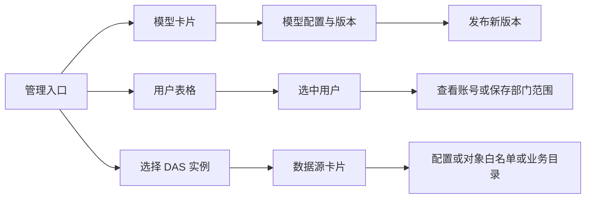

# 管理页面效果稿

日期：2026-10-06。状态：等待用户审核视觉方案。

用户要求管理页面参照已确认的报表风格，先提供图片查看效果。本轮交付四张暗色效果稿，使用内置 imagegen 生成；完整提示词见[生成提示词](生成提示词.md)。

## 页面与设计方向

| 图片 | 设计重点 |
| --- | --- |
| [01 模型管理](01-模型管理-卡片.png) | 按报表中心的方式浏览模型卡片，展示名称、标识、发布状态与版本，进入配置页查看和编辑。 |
| [02 模型配置](02-模型配置-详情.png) | 独立详情页面；基本配置、认证配置、版本信息分区；主要操作固定在标题区。 |
| [03 用户管理](03-用户管理-列表与详情.png) | 表格便于比较账号；右侧展示选中用户并编辑部门范围，停用操作单独摆放。 |
| [04 数据管理](04-数据管理-数据源.png) | DAS 实例选择与数据源浏览分层；配置、对象白名单、业务目录从资源卡片进入。 |

采用当前 Web 的暗色与紫色强调色、细边框、系统字体方向。资源入口用卡片，账号管理使用结构化表格；后续实际实现沿用项目现有 Logo、图标、主题 token 和 Element Plus 组件。

## 操作流程示意

## 交付与核对

- 交付范围：四张效果图、本说明与提示词；业务页面代码尚未修改。
- 图中账号、版本、模型和数据源均为演示内容，不代表当前系统真实数据或连接状态。
- 每张实际输出为 1672 × 941，接近 16:9；保留生成原图。
- 已逐张检查页面主体、中文主要标签、信息分组和操作位置。生成图的 Logo、图标及少数字形存在差异，实际实现统一复用现有资源。
- 模型详情图的“留空时由运行时识别”提示在实现时应紧随上下文窗口字段；认证内容按现有完整凭据规则提交。
- 效果稿中的搜索、筛选、导航及详情布局属于待确认的交互方案，具体实现范围在用户选定风格后列清单。
- 依赖操作为 0。本轮为视觉方案，未启动服务或执行业务测试。

确认后的流程：用户反馈 → 调整效果稿或确认 → 提交实施清单 → 获准后修改页面 → 浏览器验证与截图审核。

## 2026-10-06 用户确认

用户查看四张效果稿后回复“不错 可以”，本组视觉方向已确认。当前进度以本节为准；下一阶段范围已整理为[管理页面布局调整实施清单](../管理页面布局调整实施清单.md)，等待实施批准。

## 2026-10-06 实施交付

用户随后回复“改”批准实施。七个管理模块已按此方向落地，当前进度以本节为准。修改后的实际浏览器截图见[页面审核](../管理页面布局调整验收/审核.html)，验证结果与待处理问题见[交付说明](../管理页面布局调整交付说明.md)。
