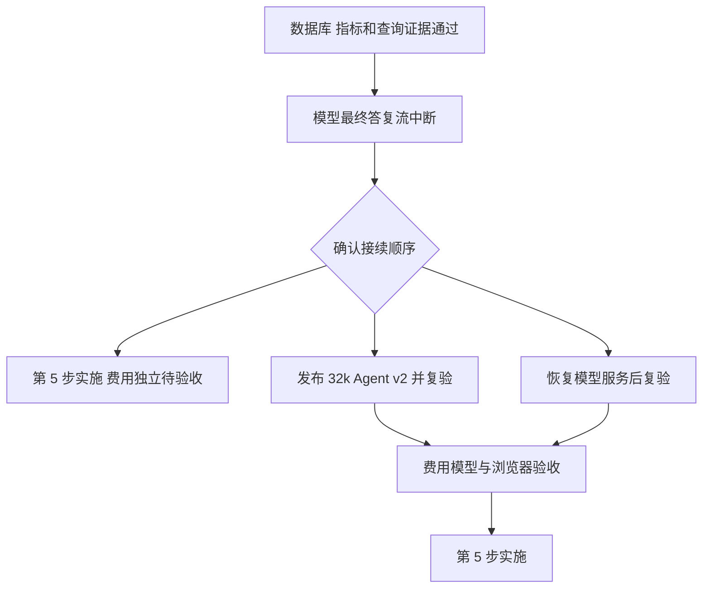

# 费用模型复验与第 5 步接续

日期：2026-09-27。当前门诊、住院模型验收通过；费用 SQL、指标 v2 与真实模型取得的查询证据一致，最终答复因模型服务流中断未完成。

## 已确认的事实

- 演示库 24 表、475,793 行；23 项正式 SQL/API 基准通过。
- 事务目录修复完成，相关普通测试 82 项、真实 SQL 集成 7 项通过。
- 门诊模型完成，763 人次、763 位患者，各科室结果与 SQL 一致；刷新和追问通过，追问无新增查询。
- 住院模型完成，入院 40、出院 0、在院 200，浏览器与 SQL 验证通过。
- 两个费用指标 v2 增加费用分类维度。费用日期和整数分口径保留，冲销负数参与汇总，v1 保留。独立 SQL 对账均通过。
- 费用模型第三次复验正确执行 v2，取得 10 类住院费用和总计 226,315,800 分，但在生成最终答复前流连接中断，错误为 `error decoding response body`。
- 第二次复验明确报出输入 34,612 tokens 超过服务端 32,768 tokens。模型配置和 Agent 均未显式填写 `context_window`；Agent 的 `max_context_bytes: 65536` 是输入字节预算，不能当作模型 token 窗口。

## 接续选择

### A. 先完成第 5 步

将费用真实模型最终答复保留为独立待验收项，按已经批准的[第 5 步清单](前端第5步实施清单.md)完成报表中心、参数执行、版本历史、表格图表和 AI 说明。报表查询可直接使用正式 SQL；AI 说明的真实模型状态单独记录。修改范围、依赖操作和验证沿用该清单。本选择改变“第四步全部通过后再做第五步”的顺序，需要用户确认。

### B. 先适配 32k 再复验

通过现有管理 API 发布 `default` Agent v2，仅增加 `limits.context_window: 32768`，保持模型 v1、工具、Skill、600 秒运行预算及 30 次工具预算。旧会话继续绑定 v1，新会话使用 v2。依赖操作和生产代码变更为 0；新增一个版本化配置脚本和交接结果。

验证读取新旧版本、创建新会话并确认绑定 v2，再运行费用原问题，检查最终答复与全部分类金额、元／分换算、表格图表及刷新恢复。窗口适配针对已确认的容量错误，流连接故障仍需模型服务恢复，不能预先承诺该设置会解决断流。

### C. 先恢复模型服务

模型维护方处理 Responses 流中断并确认可用上下文窗口后，再继续费用复验。第 5 步按原前置条件等待。本轮数据、已通过场景及失败记录均保留。

确认依据：项目根 `AGENTS.md` 要求变更已批准范围或技术安排先提交清单；事务目录修复清单明确未包含模型、Agent 和 Skill 配置调整。主代理单独执行，子代理为 0。
