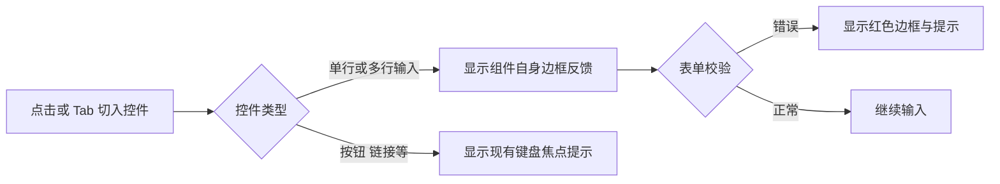

# 输入框焦点样式调整交付说明

日期：2026-10-06。用户批准输入框和多行文本框焦点样式调整清单。

## 改动

修改 `ai-data/apps/web/src/styles/app.css` 的全局焦点选择器，将 `[tabindex]:focus-visible` 收窄为 `[tabindex]:not(input):not(textarea):focus-visible`。单行与多行输入控件使用组件自身的边框反馈；按钮、链接及其他可聚焦元素继续使用现有焦点样式。

本轮业务源码为一行 CSS 调整。红色表单校验边框与提示、输入行为及 Tab 切换保持有效。主代理单独完成，依赖操作和子代理均为 0。

## 验证

- Vue／Node TypeScript 检查和 Vite 生产构建通过，既有分块体积提示保留。
- 本轮 CSS、验收脚本和交付文件格式检查通过。
- 使用本机 Chrome、正式 Web 生产构建及现有隔离认证服务，检查亮暗主题各五项：鼠标点击输入、Tab 切入密码、必填校验状态、多行输入和按钮键盘焦点。全部通过，浏览器页面错误为 0。
- 读取实际计算样式，单行与多行输入框的 `outline-style` 均为 `none`；必填校验仍显示红色边框，按钮保有可见焦点提示。四张截图已人工查看，临时浏览器及验收服务已关闭。

环境记录：默认 Playwright 浏览器未安装，使用本机已有 Chrome 完成检查；截图定位及按钮焦点检查按当前页面结构修正后，通过最终生产产物复验。Vite 在沙箱内受到 `spawn EPERM` 限制，经授权在沙箱外构建通过。

结果与截图：

- [计算样式和检查结果](输入框焦点样式验收/结果.json)
- [亮色登录输入框](输入框焦点样式验收/light-登录输入框.png) · [暗色登录输入框](输入框焦点样式验收/dark-登录输入框.png)
- [亮色多行输入框](输入框焦点样式验收/light-多行输入框.png) · [暗色多行输入框](输入框焦点样式验收/dark-多行输入框.png)
- [浏览器检查脚本](输入框焦点样式验收/检查.mjs)

## 流程

开发服务读取新样式后刷新页面即可查看。使用静态部署时，发布本轮生成的 Web 构建产物后生效。
