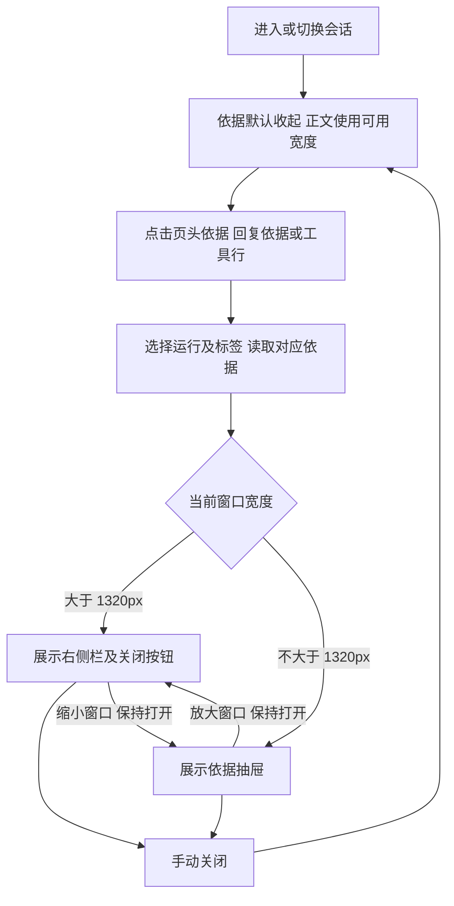

# 问答全宽与依据收起交付说明

日期：2026-10-08。实施范围见[实施清单](问答全宽与依据收起实施清单.md)。主代理单独完成，依赖操作为 0。

## 改动结果

分析工作台正文使用完整可用宽度：解除消息容器的 920px 上限，并在分析消息范围内覆盖段落、列表、引用的 75ch 上限。表格与正文共用内容边界，输入区随之对齐，保留桌面和手机原有页边距。

分析依据默认收起。页头依据按钮在桌面和手机均可见，点击展开，再次点击收起；桌面侧栏新增关闭按钮。回复底部的“查看分析依据”和工具行继续打开对应运行、对应工具的详情。首次从页头打开时选择当前会话最新运行，再次打开保留此前选择；刷新、切换会话、新建分析均回到收起状态。

桌面关闭依据后，300px 侧栏空间交还正文；窄屏通过抽屉展示，可用关闭按钮、遮罩和 Escape 关闭。窗口在桌面与手机尺寸间切换时，保留打开状态、运行选择和依据标签。抽屉仅在窄屏挂载，避免切回桌面后的抽屉关闭回调误改侧栏状态。

## 表格对齐由谁决定

截图中的表格来自模型回复的 Markdown。对齐来源分为三个部分：

| 来源 | 生效规则 |
| --- | --- |
| 模型输出 | Markdown 分隔行的 `:---`、`---:`、`:---:` 分别表示左、右、居中，显式设置优先 |
| 前端渲染 | 未显式指定时，整列数字补右对齐，其他内容左对齐；表头与数据列一致 |
| 浏览器布局 | 表格撑满内容区，浏览器根据内容和最小列宽分配各列宽度 |

因此，截图排名列出现较大的左侧空白，是列宽自动分配和数字右对齐叠加的结果。规则位于 `ai-data/apps/web/src/shared/content/markdown.ts` 和 `src/styles/content.css`。原始查询结果区的结构化表格由独立结果组件根据列类型设置对齐。

## 文件范围

- `ai-data/apps/web/src/features/analysis/pages/analysis-page.vue`：统一依据开关、桌面条件渲染、页头运行选择和窄屏抽屉挂载。
- `ai-data/apps/web/src/features/analysis/components/evidence-panel.vue`：可选关闭按钮和关闭事件。
- `ai-data/apps/web/src/styles/analysis.css`：两列/三列布局切换、全宽正文与输入区、关闭按钮样式。
- `ai-data/apps/web/tests/e2e/analysis-evidence-layout.spec.ts`：3 项浏览器场景及静态截图。
- 任务交接实施清单、本文、验收截图和 README 追加入口。

## 执行流程

## 验证结果

新增浏览器场景先确认 3 项预期失败：正文比容器窄约 354px、依据栏初始可见、桌面页头打开按钮不可见。实施后首次回归 5 项通过，发现手机切回桌面会关闭依据的边界问题；调整抽屉挂载后专项通过。

最终最新 Web 构建产物的 6 项浏览器测试全部通过，覆盖全宽正文、依据默认关闭、页头及回复打开、侧栏关闭释放 300px、刷新/切换会话、跨断点切换、手机关闭及 Escape，以及原有工具详情、对应 SQL、查询结果切换、导出入口和保存报表。

相关 10 项单元测试通过，涵盖 Markdown 对齐及查询结果规则。Web Vue/Node 类型检查、修改文件 ESLint、Prettier、差异检查和 Web 构建通过。构建仍有项目已有的大资源块提示。

浏览器验证使用隔离 fixture，截图为验收数据；本轮修改 Web 源码并更新 `ai-data/apps/web/dist`。开发模式刷新页面即可查看；静态部署需使用更新后的 Web 产物。

## 验收附件

- [桌面全宽正文](问答全宽与依据收起验收/桌面全宽正文.png)
- [桌面依据展开及关闭按钮](问答全宽与依据收起验收/桌面依据展开.png)
- [手机依据抽屉](问答全宽与依据收起验收/手机依据展开.png)
- [工具详情暗色回归](问答布局与工具依据验收/工具状态与依据暗色.png)
