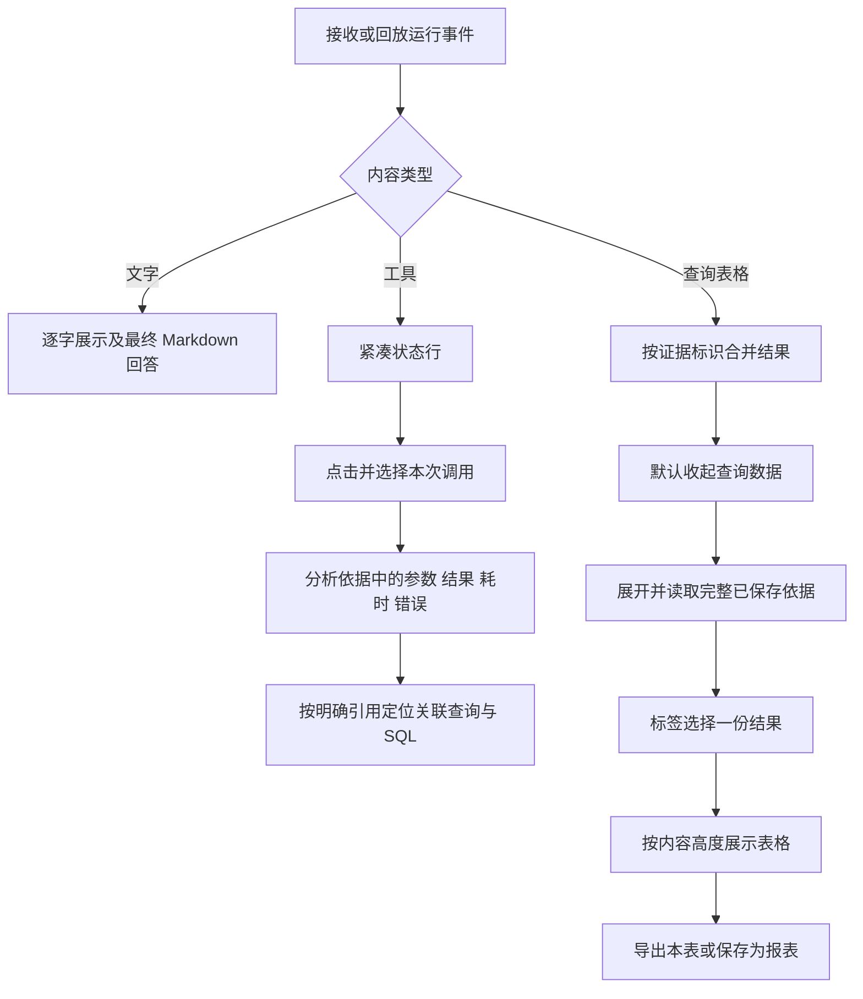

# 问答布局与工具依据交付说明

日期：2026-10-08。用户审核对话布局和工具调用两张效果稿，回复“差不多 来吧”后实施。主代理单独完成，依赖操作为 0。

## 交付效果

- 最终回答保留正文与 Markdown 表格；原始查询结果统一放在默认收起的“查看查询数据”中。多个结果通过标签切换，同时显示当前选中的一张表。
- 表格左侧显示查询编号和行数，右侧集中展示方式、显示列、导出本表和保存为报表。单行表格高度约 88px，多行结果最多使用 340px 的滚动区域，单页数据省去分页栏。
- 同一证据的流式样本与完整结果合并展示。打开查询数据时读取已保存依据；完整结果替换样本后保持结果顺序与选择。
- 工具调用改为内容宽度的图标和简短状态行。执行中、完成、失败及终态未留存结果分别展示；点击后在右侧分析依据查看对应调用。
- 分析依据分为“工具调用”和“查询依据”。工具详情展示名称、参数摘要、执行结果或错误、耗时及关联查询；关联查询可定位到对应 SQL。手机使用现有抽屉。
- Markdown 表格铺满内容列，宽表内部滚动，整列数值默认右对齐，作者显式指定的对齐方式继续生效。

## 实现位置

| 文件                                                                   | 职责                                                     |
| ---------------------------------------------------------------------- | -------------------------------------------------------- |
| `ai-data/apps/web/src/features/analysis/components/query-results.vue`  | 原始结果折叠、标签切换、单表导出及保存入口               |
| `ai-data/apps/web/src/features/analysis/models/query-results.ts`       | 按证据 ID 合并流式样本和完整结果，兼容无证据标识的旧表格 |
| `ai-data/apps/web/src/features/analysis/models/tool-activity.ts`       | 工具状态文案与明确证据引用的关联                         |
| `ai-data/apps/web/src/features/analysis/components/run-panel.vue`      | 紧凑工具状态行，保留文字流式显示及过程折叠               |
| `ai-data/apps/web/src/features/analysis/components/evidence-panel.vue` | 调用选择、详情、查询依据和 SQL 定位                      |
| `ai-data/apps/web/src/features/analysis/pages/analysis-page.vue`       | 当前运行、调用和依据分类联动，跟随新增查询与终态更新依据 |
| `ai-data/apps/web/src/shared/results/result-table.vue`                 | 工具栏分组、内容高度、列宽与数值对齐、按需分页           |
| `ai-data/apps/web/src/shared/content/markdown.ts`                      | 安全表格容器和对齐类生成                                 |
| `ai-data/apps/web/src/styles/analysis.css`、`content.css`、`main.ts`   | 桌面、手机及主题样式，加载现有 Tabs 样式                 |

时间线保留服务端调用标识；同名调用各自展示。关联优先使用输出摘要中的明确证据 ID，并支持精确调用标识；不会按工具名称猜测关联。旧记录缺少的参数、结果或 SQL 按实际留存情况提示。

API 生产源码、DAS 和数据库结构沿用已有实现。浏览器隔离夹具新增失败重试、多结果和保存快照，以验证完整交互。保存和导出仍复用现有权限检查及单证据引用逻辑。

## 执行流程

## 验证结果

| 检查                             | 结果                                                                                                               |
| -------------------------------- | ------------------------------------------------------------------------------------------------------------------ |
| 新增展示模型与 Markdown 行为测试 | 先确认缺失模型及表格容器导致预期失败，再实现；相关 14 项通过                                                       |
| Web 单元测试                     | 37 个文件、183 项通过                                                                                              |
| 相关浏览器回归                   | 23 项分批通过，覆盖布局、工具依据、流式、会话管理和报表                                                            |
| 最新 Web 构建产物复验            | 8 项通过，包含桌面/手机布局、选中结果保存导出、失败与成功调用、SQL、会话删除、流式恢复、四套明暗配色与 1024px 布局 |
| 类型                             | Web 应用、Web 浏览器测试及 API 隔离夹具通过                                                                        |
| 规范                             | 本轮文件 ESLint、Prettier 及 `git diff --check` 通过                                                               |
| 构建                             | Web Vite 构建通过，产物更新到 `ai-data/apps/web/dist/`                                                             |

首次浏览器验收发现夹具缺少表格样本标记而退出，补齐合同字段后恢复；新标签页初次未加载组件样式，截图发现后补齐；旧全选测试文案与当前组件不一致，按当前“全选”更新定位；配色截图专项按八种组合调整超时，全部通过。手机布局专项先设置主题再切换视口，避免主题弹层的初始布局时机影响本轮目标验收。最终补拍时发现登录跳转前操作外观按钮的时序问题，测试增加工作台就绪等待；截图等待弹层关闭及抽屉到位。全部录像关闭。

构建保留已有大型图表/导出依赖的分块体积提示。测试服务使用隔离账号与确定性数据，没有调用用户真实模型或业务数据库。实际 API/DAS 进程未操作，本次变更位于 Web。

## 实际页面截图

- [桌面工具状态与分析依据](问答布局与工具依据验收/工具状态与依据.png)
- [单行结果及右侧操作](问答布局与工具依据验收/单行查询与操作.png)
- [手机查询结果](问答布局与工具依据验收/手机查询结果.png)
- [手机工具依据](问答布局与工具依据验收/手机工具依据.png)
- [深色工具状态与依据](问答布局与工具依据验收/工具状态与依据暗色.png)

所有截图来自已构建的实际 Web 页面，数据为隔离验收夹具。实施范围见[实施清单](问答布局与工具依据实施清单.md)。
