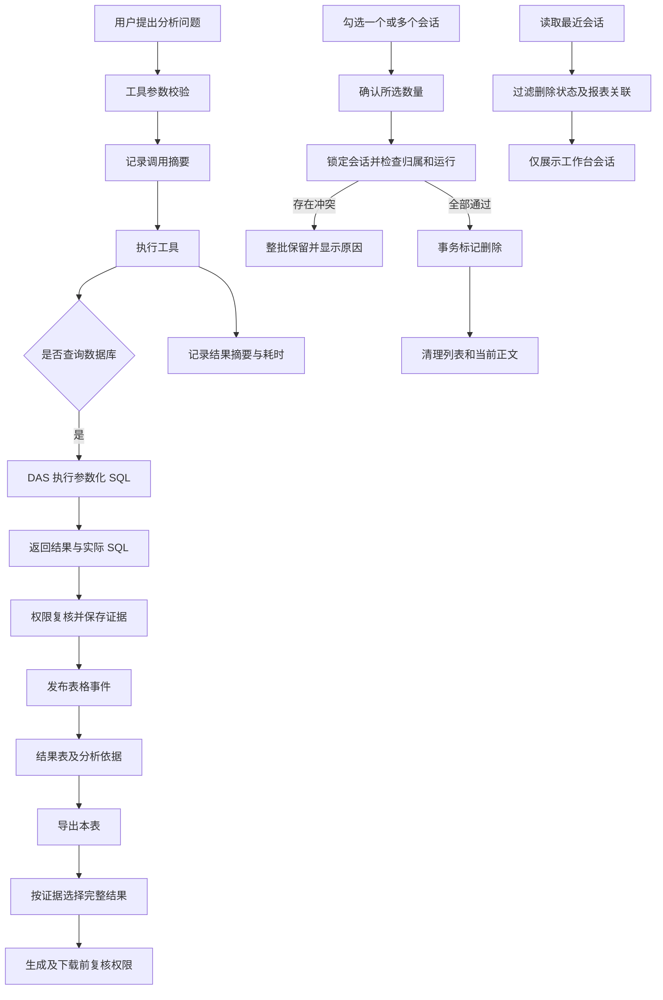

# 问答执行明细与会话管理交付说明

日期：2026-10-08

## 交付结果

分析工作台已支持单个删除和多选删除。点击“多选”后可以逐项勾选，或全选当前搜索下已显示的会话；删除前显示所选数量并确认。每批最多 100 个，单次列表先显示 50 个，可以继续加载。删除当前会话后返回新分析，清理该会话的正文、草稿与待提交状态。

删除只处理当前组织、当前账号的工作台会话。在一个数据库事务中按固定顺序锁定所选会话，核对归属及活跃运行；任何一个会话不符合条件，整批保留。进行中、待澄清或取消中的分析需要先停止。重复删除本人已删除的会话可安全重试。

删除使用现有 `conversations.status='deleted'`，保留数据库中的消息、执行证据和审计。删除后工作台列表、会话详情、运行与事件读取、继续提问不再访问该会话；此前保存的报表仍能读取、运行和导出。本次没有提供恢复入口。

报表执行、AI 修改和分析说明所产生的会话，通过 `report_executions`、`report_revision_requests` 和 `analysis_report_contexts` 的持久化关联从工作台列表分离，覆盖已有记录。报表中心仍能读取对应执行与说明；普通问答即使标题包含“报表分析说明”也正常保留。

## 工具明细、SQL 与结果表

- 工具调用展示各自已校验参数的摘要、目录命中对象、字段定义、返回行数、结果范围、耗时和失败信息。查询值和数据行继续通过受权限检查的证据查看。模型管理的查询由外层工具审计统一展示，避免内层查询再产生重复工具记录。
- 分析依据增加“执行 SQL”，显示数据库方言、实际提交驱动的参数化语句、绑定顺序及类型，支持复制 SQL。DAS 把 `execution_sql` 随结果返回，API 保存在 `analysis_evidence.evidence_json` 的 `result` 内；SQL 不传入模型结果样本。参数值不新增副本，可结合原有请求条件与授权条件核对。
- 每次成功查询提交证据时会产生 `table` 事件，因此一次分析可能出现多张结果表。初始 SSE 最多交付 100 行样本；读取证据后显示保存的结果。指标查询的分组和总计也可能分别产生结果表。
- 每张结果表增加“导出本表”，默认 Excel。按证据 ID 选择该表的全部已保存完整结果及其筛选说明，复用现有生成、下载前权限复核。表格当前页、显示列和 SSE 样本不会缩小 Excel 内容；截断结果仍按既有规则禁止作为完整明细导出。

新执行会保存新的摘要和 SQL。旧工具事件原来只有通用文案，无法从哈希恢复完整调用参数；旧查询证据或 HTTP 数据源没有执行 SQL 时，页面明确显示“这份查询证据未留存执行 SQL”。

## 主要文件与影响范围

| 范围       | 主要文件                                                                                          | 作用                                                   |
| ---------- | ------------------------------------------------------------------------------------------------- | ------------------------------------------------------ |
| 共享合同   | `ai-data/packages/contracts/src/query/query-result.ts`、`src/sse/sse-events.ts`                   | 可选 SQL 元数据、工具摘要与耗时，兼容旧证据            |
| DAS        | `ai-data/apps/data-access/src/connectors/database-connector.ts`                                   | 回传实际驱动 SQL 及绑定描述                            |
| 工具运行   | `ai-data/apps/api/src/runtime/tool-presentation.ts`、`analysis-tools.ts`、`model-query-result.ts` | 生成有界摘要，保留模型结果样本边界                     |
| 审计事件   | `ai-data/apps/api/src/analysis-runs/analysis-run-service.ts`、`tool-audit.ts`                     | 持久化摘要并发布工具事件，消除重复记录                 |
| 会话服务   | `ai-data/apps/api/src/conversations/`、`src/routes/conversation-routes.ts`、`src/app-types.ts`    | 单个/批量删除、本人归属、事务原子性、报表关联过滤      |
| 运行可见性 | `ai-data/apps/api/src/analysis-runs/sql-analysis-run-repository.ts`                               | 拒绝读取已删除会话的运行、事件及证据                   |
| 工作台     | `ai-data/apps/web/src/features/analysis/`、`src/styles/analysis.css`                              | 多选管理、删除后状态清理、具体工具明细、SQL 查看与复制 |
| 表格导出   | `ai-data/apps/web/src/shared/results/result-table.vue`、`src/features/exports/`                   | 表格操作插槽和按证据选择的导出                         |
| 测试       | API 会话/工具/路由/SQL 集成、DAS 连接器、Web 时间线/导出/工作台、`analysis-management.spec.ts`    | 归属、冲突、旧数据兼容与真实页面交互                   |

新增摘要和工作台关联范围辅助文件、删除接口测试、浏览器验收及交付记录；未删除源码文件。主代理单独完成，依赖操作、表结构变更和开发库重建均为 0。

## 执行流程

## 验证结果

| 检查               | 结果                                                                                                                           |
| ------------------ | ------------------------------------------------------------------------------------------------------------------------------ |
| API 单元与协议测试 | 92 个文件、717 项通过                                                                                                          |
| Web 单元测试       | 36 个文件、178 项通过                                                                                                          |
| 共享合同测试       | 27 个文件、199 项通过                                                                                                          |
| DAS 回归           | 448 项分批通过：首次 445 项通过，修正两处新增元数据的完整对象断言后，相关 35 项复验通过，包含先前偶发失败的 50ms HTTP 超时用例 |
| 工程规则           | 42 项通过                                                                                                                      |
| 隔离 SQL Server    | 会话及业务分析 21 项通过；报表/DAS HTTP/SQL 流程 9 项通过                                                                      |
| 生产 Web 浏览器    | 桌面 1440×1000、手机 390×844，4 项通过                                                                                         |
| 类型               | API、DAS、Web 应用与 E2E 配置通过                                                                                              |
| 静态与构建         | 修改文件 lint、格式、Git diff 空白检查，API/DAS bundle 与 Web 生产构建通过                                                     |

数据库验收只在随机命名的隔离库中进行并清理，覆盖跨账号/组织拒绝、活跃运行整批冲突、删除后访问拒绝、重复删除、历史报表关联过滤及已保存报表导出。SQL Server 通过真实 DAS 进程验证 SQL 回传；MySQL、PostgreSQL、Oracle 通过连接器测试核对回传语句与实际驱动入参一致。本轮没有重新调用实际模型。

浏览器验收下载的 Excel 包含所选一张结果表及导出说明，共两张工作表；数据表为表头加 5,000 行，第 5,000 行为“科室 5000”。桌面检查页面脚本错误为 0。首次多选测试定位到 Element Plus 隐藏的原生 input，改为点击可见 label 后四项全部通过。

本轮沙箱最初阻止本机 HTTP/SQL 连接、官方子进程和符号链接原生 realpath，造成类型误报、构建及测试环境失败；经自动审批在沙箱外复验通过。DAS 首次 SQL 集成测试使用旧 bundle 未产生 SQL 元数据，重新构建后 9 项全部通过。既有 Web 大文件分包提示仍存在。

## 生效与兼容

源码以及 `ai-data/apps/api/dist/index.js`、`ai-data/apps/data-access/dist/index.js`、`ai-data/apps/web/dist` 已更新；当前运行中的实际 API/DAS 服务未在本轮重启。独立部署需要使用对应产物，并重启 API/DAS、刷新 Web。更新顺序先 API，再 DAS 和 Web；旧 API 的严格查询结果合同不识别新增 SQL 字段。

不需要执行数据库迁移。报表会话分离对已有数据库记录即时按关联计算；SQL 和具体工具摘要在新执行中产生。站点文档 `ai-book` 按用户约定留待明确的文档维护任务。

## 验收附件

- [工具详情与 SQL](问答执行明细与会话管理验收/工具详情与SQL.png)
- [多选删除](问答执行明细与会话管理验收/多选删除.png)
- [手机删除冲突提示](问答执行明细与会话管理验收/手机删除冲突提示.png)
- [单表导出](问答执行明细与会话管理验收/单表导出.png)
- [5,000 行单表 Excel](问答执行明细与会话管理验收/科室单表明细.xlsx)
- [实施清单](问答执行明细与会话管理实施清单.md)
