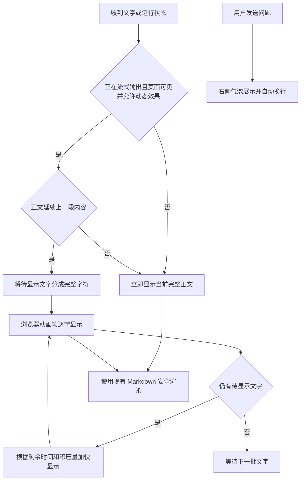

# 问答逐字显示与消息布局交付说明

日期：2026-10-08

## 交付效果

AI 回复收到流式片段后逐字显示。待显示文字较多时自动加速，以约 200ms 的追赶窗口消化积压；完成、停止或收到更正正文时立即同步当前完整内容。历史消息直接展示。用户输入采用靠右气泡，AI 回复保持左侧布局。

桌面气泡宽度上限为内容区的 80% 且不超过 42rem，手机为 92%；多行内容和连续英文均可换行，沿用现有主题色。系统启用“减少动态效果”或页面切到后台时直接显示收到的正文。组件卸载时取消动画帧并移除事件监听。

## 主要文件

| 文件 | 变更 |
| --- | --- |
| `ai-data/apps/web/src/shared/content/use-streaming-text.ts` | 新增逐字显示、积压追赶与生命周期处理；按完整字素分割中文、组合字符和表情 |
| `ai-data/apps/web/src/shared/content/markdown-content.vue` | 以逐字显示替换原有 80ms 批量刷新；完成时更新代码与流程图增强 |
| `ai-data/apps/web/src/styles/analysis.css` | 用户消息、标签靠右，限制桌面与手机气泡宽度 |
| `ai-data/apps/web/tests/shared/content/use-streaming-text.test.ts` | 8 项显示行为与 Markdown 集成测试 |
| `ai-data/apps/web/tests/e2e/analysis-presentation.spec.ts` | 桌面逐字、刷新恢复，以及手机长文本与停止验证 |

共享 Markdown 的流式调用均使用同一显示逻辑；现有安全清洗、代码复制、表格及流程图继续保留。主代理单独实施，依赖操作为 0。

## 执行流程

## 验证结果

- Web 单元测试：36 个文件、175 项全部通过，其中新增 8 项覆盖逐字、追赶、完整字符、完成/停止、权威替换、历史、动态偏好、后台与卸载、Markdown 安全渲染。
- 生产构建浏览器专项：2 项通过，覆盖 1440×1000 桌面和 390×844 手机；桌面页面错误为 0。
- 实测首批“我先核对本年的”分 6 次显示，从“我”到完整首批约 136ms；后续片段继续递增。时序为浏览器 DOM 采样，使用真实 HTTP 隔离夹具。
- 刷新校验首次因流程图在可视区外尚未加载而失败；按照现有可见区域延迟加载逻辑，测试先滚动到流程图再比较，复验 2 项全部通过。产品逻辑沿用原行为。
- Web 两份 TypeScript 配置、修改文件 ESLint/Prettier、Git diff 空白检查和生产构建通过。构建仍有既有大文件分包提示。

本轮浏览器验收使用隔离数据，未重新调用真实模型。源码和 `ai-data/apps/web/dist` 已更新；线上或独立静态服务需使用本次构建产物。此前后端流式性能验证见[流式输出性能修复交付说明](流式输出性能修复交付说明.md)。

## 验收附件

- [桌面消息布局](问答显示验收/桌面消息布局.png)
- [手机消息布局](问答显示验收/手机消息布局.png)
- [逐字显示时序](问答显示验收/逐字显示时序.json)
- [实施清单](问答逐字显示与消息布局实施清单.md)
