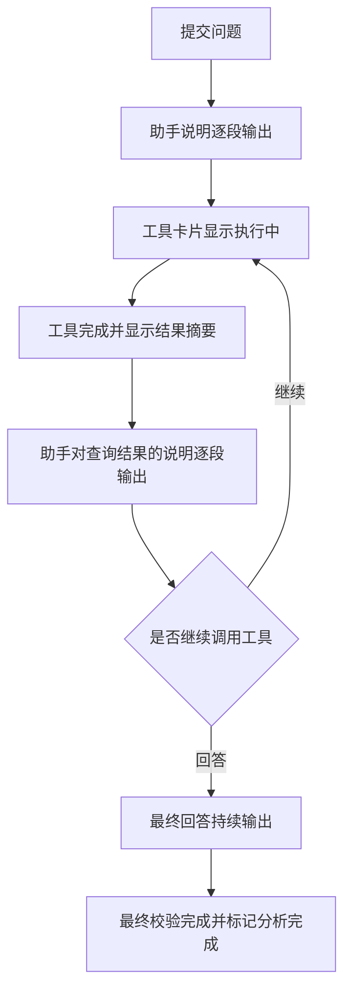

# 页面 03—05：分析过程与文字流式输出修改清单

日期：2026-10-03。状态：用户回复“改”批准，已实施并验收。见[交付说明与流程图](页面03-05流式输出交付说明.md)。

## 1. 目标与已确认原因

用户要求逐页审核，本项仅处理分析工作台：按实际发生顺序展示助手说明、工具执行、查询后的说明、结果和最终回答；助手文字随生成持续输出。

03、04、05 原截图均在运行完成后拍摄，因此静态图片不能证明实时展示。但当前代码确实存在以下缺口：

| 位置 | 当前实现 | 影响 |
| --- | --- | --- |
| `apps/api/src/harness/codex-analysis-harness.ts` | 通知白名单仅包含 turn 与 item 开始/完成 | 文字增量通知在入口被过滤 |
| `apps/api/src/harness/codex-session-router.ts` | 每个完成的 agentMessage 覆盖同一个 content，整轮结束返回最后一段 | 中间面向用户的说明没有进入业务事件流 |
| `apps/api/src/harness/harness-types.ts` | 仅有工具、压缩等回调 | 缺少助手消息生命周期与文字片段回调 |
| `apps/api/src/analysis-runs/analysis-run-service.ts` | complete 时提交完整 final_answer | 正文只能整段出现 |
| `packages/contracts/src/sse/sse-events.ts` | 有进度、工具和完整结论事件 | 没有可恢复的文字增量合同 |
| `apps/api/src/routes/analysis-routes.ts` | 持久化事件以 1 秒间隔读取 | 需要核对文字流延迟与数据库读取负载 |
| `apps/web/src/features/analysis/components/run-panel.vue` | 摘要、工具、澄清、答案、表格分别汇总渲染 | 工具前后的助手说明无法保留原始穿插顺序 |

前端第 4 步清单曾明确按既有完整 final_answer 展示。本项新增文字流与按发生顺序展示的能力，需要 API、共享合同及 Web 一起修改。

OpenAI Docs 的 [App Server 事件说明](https://learn.chatgpt.com/docs/app-server#events)列出 `item/agentMessage/delta`，item 开始与完成事件通过条目标识关联；agentMessage 可带 commentary / final_answer 阶段。实施首先核对项目已安装运行时的实际协议和通知，不据最新文档推定旧版本字段一定存在。

## 2. 用户看到的流程

以下文字仅为交互示例，实际显示模型生成的面向用户说明和服务端真实工具状态。

- 同一轮按事件顺序排列文字段与工具卡片，工具完成时更新原卡片。
- 多次调用同名工具使用调用 ID 区分，结果与相应工具关联。
- 过程说明保留在时间线上，详细参数与结果摘要可以折叠查看。
- 模型有阶段说明时实时展示；模型直接调用工具时展示真实工具状态。
- 最终回答生成过程中显示“正在输出”；整轮正式完成后才标记“分析完成”。
- 用户向上查看内容时保持滚动位置；停留底部时跟随新内容。

## 3. 实施清单

1. **消息接入**：接入助手消息开始、文字增量与完成，绑定线程、轮次、消息条目。完成事件校准对应段落；中间说明与最终回答分别保留。既有压缩、工具串行提交及取消机制保持有效。
2. **持久化事件合同**：新增消息标识、阶段、片段及完成文本事件；沿用现有 JSON 事件表、sequence 和 lease_epoch。连续片段短时合并提交，在工具边界与结束前及时提交，限制缓存和排队容量。终态保留 final_answer 兼容入口并与末段建立关联，前台只显示一次最终正文。
3. **实时权限与交付**：文字公开前复核当前身份与运行租约，已引用证据继续遵循当前授权复核。最终结果仍经过既有最终校验与事务提交；校验失败、权限撤回、取消或旧租约的后续片段不得作为有效结果交付。已输出内容明确区分进行中、停止或失败状态。
4. **有序推送与延迟**：沿用现有认证 SSE 和持久化回放机制，在当前架构内调整文字事件的等待/唤醒与回放频率；避免每个 token 都写库或对所有会话固定高频轮询。用实测数据核对持续输出延迟与事件数量。
5. **前端时间线**：将 run-panel 改为有序事件模型，文字按消息 ID 累积，工具卡片按调用 ID 更新；表格在对应事件位置展示。Markdown 在输出阶段适度合并渲染，代码块和流程图在内容完整时渲染，减少跳动。
6. **恢复与历史兼容**：断线续传、重复事件去重、刷新重建、停止后保留已产生过程、后续追问和账号切换清理均覆盖；旧历史使用已有事件恢复，历史缺失的中间说明不会被补造。报表分析说明与 AI 修改等共用 SSE 消费者需通过兼容回归。
7. **验收交付**：先补行为场景和失败测试，再实现。产出生成中、工具执行中、工具后说明、最终结果的 16:9 截图与短录屏，更新 03—05 对应审核资料，保存交付说明及流程图。

## 4. 文件范围

以下路径均相对于 `ai-data/`。

| 类型 | 文件或目录 | 用途 |
| --- | --- | --- |
| 修改 | `packages/contracts/src/sse/sse-events.ts` 及配套类型/出口（如需） | 增量消息与完成事件合同 |
| 修改 | `apps/api/src/harness/codex-analysis-harness.ts`、`codex-session-router.ts`、`harness-types.ts` | 消息生命周期、增量与有序提交 |
| 修改 | `apps/api/src/runtime/analysis-executor.ts` | 消息回调、当前授权与交付装配 |
| 修改 | `apps/api/src/analysis-runs/analysis-run-service.ts`、相关仓储接口/实现（按需） | 有效租约内持久化、片段边界与最终结果关联 |
| 修改 | `apps/api/src/routes/analysis-routes.ts` | SSE 延迟、回放和关闭 |
| 修改/新增 | `apps/web/src/features/analysis/components/`、`stores/`、分析页面与现有样式 | 有序时间线、文字累积、工具展示与滚动 |
| 修改（按需） | `apps/web/src/shared/content/` | 流式 Markdown 与完整代码块渲染 |
| 测试 | contracts SSE；API harness、runtime、analysis-runs、routes、隔离 SQL；Web analysis、stream、E2E | 对应正常与边界场景 |
| 验收支持 | `apps/api/tests/support/web-analysis-fixture.ts`、相关浏览器脚本 | 有时间间隔的确定性通知与真实流读取 |
| 交接 | 本清单、后续交付说明/验收目录、任务交接 README | 审核范围、证据与结果 |

删除文件预计 0；依赖安装、升级、卸载预计 0；表结构与迁移预计 0。主代理单独实施。当前模型版本与 Agent 配置保持现状；若实际模型无法输出已核对的消息事件，报告具体缺口并按项目规则审核调整。

## 5. 验收方式

| 场景 | 必须证明 |
| --- | --- |
| 文字—工具—文字—工具—最终回答 | 各段按事件顺序出现，中间说明完整保留 |
| 最终答复仍在生成 | 完成事件前浏览器已显示多次增长的正文，时间戳记录可对照 |
| 同名工具连续或并行调用 | 每次调用的状态、摘要与调用 ID 一一对应 |
| 工具返回结果、失败、澄清与压缩 | 时间线及时显示对应状态，并按业务状态继续或结束 |
| 断线、重复片段、刷新 | 已显示段落可恢复、续接，完成校准不重复追加正文 |
| 切换账号、撤回权限、取消与租约失效 | 内容及时清理/停止，迟到事件不越权覆盖 |
| Markdown、代码块、流程图和长结果 | 持续输出时页面可操作，完整内容形成后正确渲染 |
| 旧会话与共用 SSE 页面 | 旧完整答案仍可读，报表分析/修改的终态语义保持正确 |

使用现有已安装 CLI，执行相关包级测试、类型、lint、修改文件格式、Web 生产构建、真实 HTTP/SSE 与隔离 SQL 检查。真实 rj 验收区分模型实际生成事件与确定性协议验收；记录首段到达、工具开始/结束和最终完成时间，不将静态完成态截图当作流式验收依据。

## 6. 审批状态

用户回复“改”，明确批准本清单。主代理单独完成本项页面问题、配套 API / 合同 / Web 修改、验证和审核资料更新；依赖操作与数据库结构变更均为 0。
