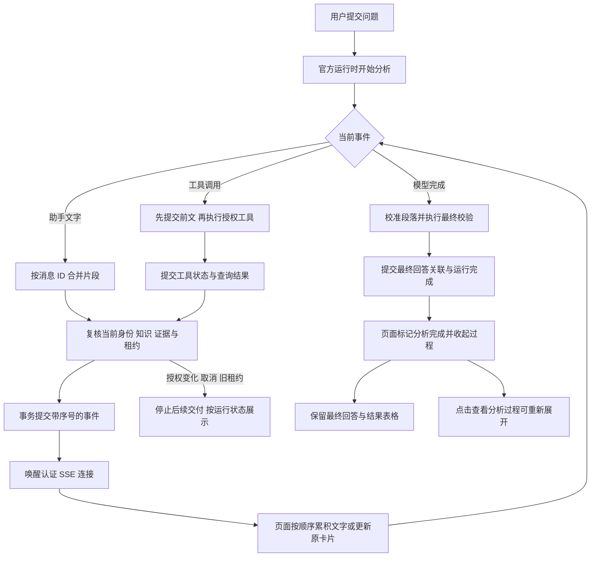
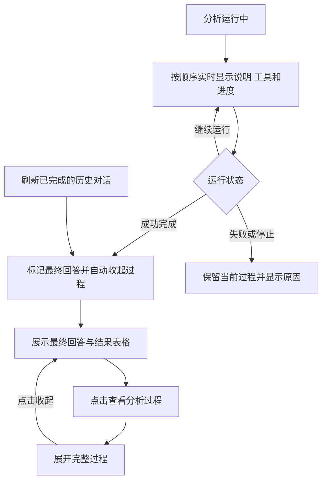

# 页面 03—05：分析过程与文字流式输出交付

日期：2026-10-03。用户回复“改”，批准[修改清单](页面03-05分析过程与文字流式输出修改清单.md)。主代理单独实施，依赖操作、数据库结构及迁移变更均为 0。

## 页面效果

分析工作台现在按实际发生顺序展示助手说明、工具卡片、查询结果、查询后的说明与最终回答。文字在模型生成过程中持续出现，工具完成时更新原卡片；卡片可展开查看输入和输出摘要。只有收到运行完成事件，整轮才显示“分析完成”。

[打开本项审核页](页面03-05流式验收/审核.html)可直接观看 1920×1080 录屏和五张阶段截图；[全模块审核目录](页面审核-2026-10-03/页面审核.html)中的 03—05 已更新。其余模块继续按用户逐项审核。

用户向上阅读时保持位置，返回底部后跟随新内容；取消保留已经产生的过程并标记停止。刷新和断线依照持久化序号恢复，重复事件不重复追加，最终校准不产生第二份答案。账号或数据权限失效时清除相应页面内容。

## 主要改动

| 范围 | 改动 |
| --- | --- |
| 官方运行时适配 | 接入 `item/agentMessage/delta`，用 thread / turn / item 绑定消息；保留所有面向用户的段落。只接收 `agentMessage`，推理通知不进入正文。 |
| 事件合同 | 新增 `assistant_message`，包含消息 ID、可选阶段、started / delta / completed 及文字。完整消息用于校准；`final_answer.message_id` 关联已输出段落，旧事件继续可读。 |
| 合并与容量 | 连续片段按 120ms 或 2,048 字符合并；工具、压缩与段落边界及时提交。单段 64,000 字符、单轮 256,000 字符、200 个段落；在途消息队列最多 128 项 / 512,000 UTF-8 字节。 |
| 当前权限与租约 | 每次交付前复核身份、知识指纹、会话授权及历史证据；写入事务核对租约。终态仍经过既有最终校验与事务。 |
| SSE | 同实例事件提交后唤醒活跃连接；订阅先于读取，避免遗漏唤醒。跨实例保留一秒回放，关闭连接释放订阅与计时器。 |
| 有序展示 | 消息按 ID、工具按调用 ID 和租约代次归并；运行中表格留在对应事件位置，完成后过程收起，最终回答与表格继续显示。旧代次未完成段落不会继续显示为正在输出。 |
| 内容渲染 | Markdown 输出阶段按 80ms 合并更新；代码围栏闭合后进行高亮和流程图渲染；可见完整代码块复用当前主题的渲染结果。内容高度变化仅在停留底部时触发跟随。 |

文件清单见[本轮文件范围](页面03-05流式验收/文件范围.json)。运行时、API、Web 和共享合同一起发布；`pnpm dev` 的源码启动方式继续适用。

## 执行流程



## 验证结果

先新增失败用例，确认原实现未交付文字片段、没有有序投影和提交唤醒，再实施并通过以下验证。

| 验证 | 结果 |
| --- | --- |
| API 普通全量 | 90 个文件、682 项通过；随后新增唤醒和不完整终段边界后，相关 Harness / runtime / run / routes 10 个文件、60 项再次通过。 |
| contracts | 27 个文件、189 项通过，覆盖增量、完整校准、阶段限制、容量和旧答案。 |
| Web 普通全量 | 33 个文件、159 项通过；最后调整后的内容、订阅、分析与共用报表消费者 8 个文件、53 项通过。 |
| 隔离 SQL 与真实模型 | 24 项通过。覆盖事件持久化、重建后回放、事务失败回滚、授权范围、rj SQL 查询及官方进程重启后的追问。 |
| 生产 Web 浏览器 | 分析工作台、报表说明、AI 修改共 30 项通过；最终内容缓存和租约标记版本的流式、取消、四套明暗主题再验 3 项通过。 |
| 工程检查 | API、contracts、Web 应用及 Node 工程类型通过；修改文件 lint、格式检查通过；Web 生产构建通过。构建仍有既有大资源块提示。 |
| 视觉 | 阶段截图、录屏均为 1920×1080；浏览器验收无页面异常。 |

另外尝试的 Playwright 独立 `tests/tsconfig.playwright.json` 类型检查报现有 `dayjs/plugin/customParseFormat` 声明路径错误 TS7016。标准 Web 应用 / Node 类型入口、实际浏览器执行与修改文件 lint 均已通过；该额外入口不记为通过。

### 真实 rj 结果

读取当前数据库已发布的模型和 Agent 配置，复制到随机隔离验收库，正式配置保持当前版本。首次在受限执行环境中无法探测模型窗口；获得内网执行权限后，原配置通过。隔离固定模型夹具同时补齐已要求的 `context_window` 字段。

实际模型 `rj-model-v1` 的首轮约 **85.5 秒**完成；记录到 **2 段助手正文、72 个合并增量、635 字符**，包括查询后的说明及最终回答。消息回调从开始校验到完成提交的最长耗时为 **253ms**。原始时序见[真实模型流式时序](页面03-05流式验收/真实模型流式时序.json)。

本轮模型在前几次工具调用时没有生成说明，第一段文字约在第 59 秒出现；页面在此之前展示实际工具状态。该现象属于模型本轮输出行为。中间说明生成后、下一次查询前完成提交，最终段落随后逐片段交付。模型未提供 phase 时按消息完成顺序保留各段，最终回答关联最后一个完成段落。

真实查询只返回授权 A 科室 2 人次，进程重建后同一官方线程追问得到 3；隔离库、临时进程和状态目录已由验收清理。

### 浏览器证据

确定性夹具通过真实 HTTP / SSE 路由和生产 Web 验证，数据来源与真实 rj 测试分开记录。最新录像包含文字生成、工具执行、后续说明、最终正文增长、完成收起和手动展开；各阶段耗时见[浏览器记录](页面03-05流式验收/浏览器流式时序.json)。

服务端真实 HTTP 测试另验证：已有连接收到提交唤醒后，文字在 700ms 以内到达，且发生在终态之前；该场景的持久化事件读取次数不超过 5 次。

## 复验入口

沿用已经安装的依赖，在 `ai-data/apps/api` 执行：

```powershell
node node_modules/vitest/vitest.mjs run tests/harness tests/runtime/analysis-executor.test.ts tests/analysis-runs/analysis-run-service.test.ts tests/routes/analysis-routes.test.ts --maxWorkers=1
$env:LOCAL_MODEL_ACCEPTANCE='1'
node node_modules/vitest/vitest.mjs run --config vitest.integration.config.ts tests/integration/dialogue.integration.ts tests/integration/analysis.integration.ts
```

在 `ai-data/apps/web` 执行：

```powershell
node node_modules/vue-tsc/bin/vue-tsc.js -p tsconfig.app.json
node node_modules/typescript/bin/tsc -p tsconfig.node.json
node node_modules/vite/bin/vite.js build
$env:WEB_E2E_PREVIEW='1'
node node_modules/@playwright/test/cli.js test tests/e2e/analysis-stream.spec.ts tests/e2e/analysis.spec.ts
```

浏览器用例使用隔离认证及业务数据，在本机 4318 / 5317 启动临时服务并自动关闭。录屏先由 Playwright 生成在 `apps/web/test-results/`，本轮已归档至任务交接目录。协议核对摘录见[本机 0.154.0 协议](页面03-05流式验收/本机协议核对.json)。

## 2026-10-03 审核补项：完成后收起过程

按用户本轮反馈执行[收起过程修改清单](页面03-05完成后收起过程修改清单.md)。运行时仍展示阶段说明、工具状态和进度；收到完成状态后，自动收起这些过程内容，保留最终回答与结果表格。入口显示工具调用次数，可手动展开或收起。刷新历史对话默认收起；失败和停止时保留已有过程及提示。

Web 时间线增加已提交答案标记，仅由服务端 `final_answer` 事件确认。模型提供的阶段名称不直接作为最终结果，避免隐藏或重复展示正文。稳定条目标识和显示切换保留工具详情、表格的当前交互状态；完成后正文排在结果表格之前。

业务文件仅修改 `run-panel.vue`、`run-timeline.ts`、`run-timeline-types.ts`；验证文件修改 `run-timeline.test.ts`、`analysis-stream.spec.ts`。沿用现有依赖，主代理单独实施。



验证先确认新增答案标记用例失败，再完成实现。相关 Web 单测 **6 个文件、41 项通过**；生产预览浏览器 **11 项通过**，覆盖流式期间可见、完成自动收起、再次展开与收起、刷新恢复、最终正文和表格保留、取消、错误、四套明暗主题及窄屏。Web 应用与 Node 类型、修改文件 lint、格式检查和生产构建通过。构建保留既有大资源块提示。本次为 Web 展示补项，API / SQL / rj 的记录沿用前次验收。

已更新 [1920×1080 收起截图](页面03-05流式验收/07-最终完成.png)、[展开截图](页面03-05流式验收/08-展开分析过程.png)及[审核页与录屏](页面03-05流式验收/审核.html)。
