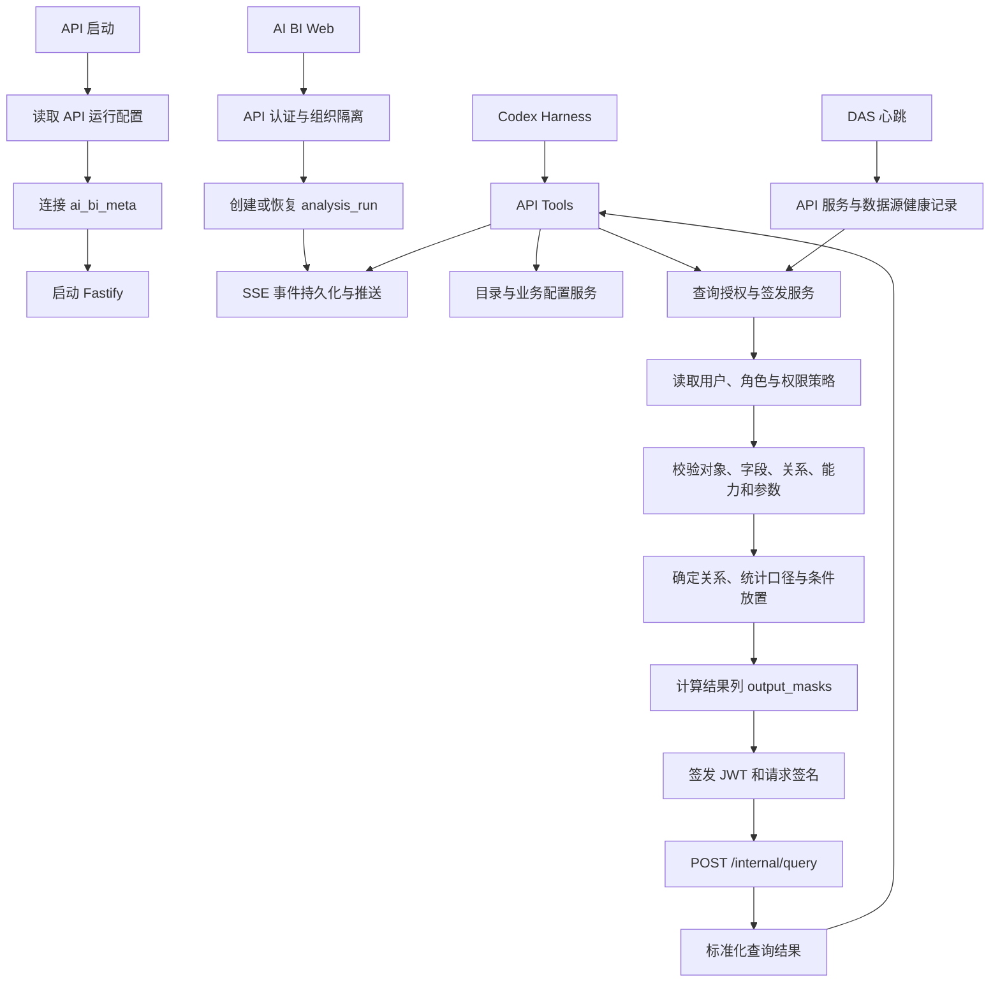

# API 实施方案与开发顺序

版本：v0.2  
设计基线日期：2026-09-11  
状态：实施中  
关联文档：[technical-design.md](./technical-design.md) · [contracts.md](./contracts.md) · [das-implementation-plan.md](./das-implementation-plan.md) · [development-standards.md](./development-standards.md)

## 1. 系统边界

AI BI API 是浏览器、Codex Harness 与 Data Access Service（DAS）之间的业务控制面。它管理身份、组织、权限策略、业务目录、会话和分析运行，并将已授权的查询请求发送给 DAS。

- `ai_bi_meta`：API 自己的 SQL Server 元数据数据库，保存组织、用户、角色、权限策略、业务目录配置、会话、分析运行、审计、指标、记忆和报告等产品数据。
- API 运行配置：HTTP 服务参数、`ai_bi_meta` 连接、JWT 签发私钥引用、签发方、接收方和短时令牌参数。
- DAS：保存数据源连接配置、对象物理映射、对象白名单、连接器运行状态和查询执行审计；API 通过内部 HTTP 调用 DAS。
- AI BI Web：只访问 API 的浏览器接口和 SSE 事件流。
- Codex Harness：只调用 API 提供的工具；用户、角色、JWT、`access`、`signature` 和 DAS 地址不属于模型工具参数。

API 不保存业务数据源连接凭据，也不编译或执行 SQL。业务查询的最终执行、资源限制和结果脱敏由 DAS 完成。

本方案以 2026-09-11 批准的设计为实施基线。API 负责查询的业务语义、授权范围、关系与统计正确性，构造语义完整的最终可执行 DSL；DAS 完成校验、执行、匿名化/脱敏和返回，物理映射与 SQL 编译保持既定语义。第 6 节保留现有实施记录，新增的 Join 权限语义、指标与证据模型、运行一致性及报告数据范围校验按后续步骤实施。

## 2. 总体流程



## 3. API 的持久化模型

### 3.1 `ai_bi_meta` 产品元数据

首个受控查询闭环依赖以下数据：

| 分类           | 表或数据模型                                                                            | 用途                                                                                    |
| -------------- | --------------------------------------------------------------------------------------- | --------------------------------------------------------------------------------------- |
| 身份与组织     | `organizations`、`users`、`roles`、`user_roles`                                         | 从认证结果确定当前用户、组织和角色。                                                    |
| 权限           | `role_object_permissions`、`role_object_row_policies`、`role_object_column_permissions` | 计算对象、字段操作和行过滤条件。                                                        |
| 目录与业务配置 | `data_sources`、`catalog_objects`、API 数据集配置                                       | 保存 API 可见的数据源路由、业务说明、批准关系、基数与键、能力收窄、参数策略和字段策略。 |
| 指标与统计语义 | 指标定义、指标版本、对象粒度与聚合规则                                                  | 固定时间口径、解析对象与字段、去重键、关联基数及可汇总规则。                            |
| 分析运行       | `conversations`、`conversation_messages`、`analysis_runs`、运行状态与事件               | 保存归属、上下文、澄清、幂等记录、执行租约和恢复所需的持久化状态。                      |
| 分析产物与报告 | `analysis_artifacts`、`analysis_evidence`、`saved_reports`                              | 保存表格、图表、结论、章节和证据的可查看分析快照，以及报告版本与分享范围。              |
| 审计           | `audit_logs`                                                                            | 关联 API 工具调用、权限版本、查询摘要与 DAS 返回结果摘要。                              |
| DAS 健康       | 服务实例和 `source_id` 健康记录                                                         | 决定一次查询是否可以路由至目标 DAS 实例和数据源。                                       |

首个分析闭环先建立最小指标、统计语义、运行状态与证据模型；丰富报告和记忆功能复用同一组织、用户、会话和 `analysis_run` 关联关系扩展。

### 3.2 登录与可信身份上下文

所有产品动作都在登录后执行。认证中间件从可信会话建立当前请求上下文：

```text
user_id
organization_id
role_ids
permission_context
session_id
```

该上下文控制会话访问、报表和模板的编辑与分享、画布运行、导出、口径候选提交以及医院口径的审批和发布。浏览器和模型工具都不能自行提供或覆盖其中的用户、组织和角色值。

API 通过 `AuthenticationAdapter` 对接认证来源。首阶段实现本地登录；医院确认身份源后，再通过同一适配器接入医院 SSO、AD 或 LDAP。

#### 3.2.1 JWT、会话与 SSO 边界

API 统一签发自己的 JWT。无论用户通过本地账号还是医院 SSO 登录，认证成功后都先映射到 API 的内部 `user_id`，再创建本地会话并签发 API JWT。SSO 只负责确认身份和提供单点登录入口；组织、角色、功能权限、数据范围和报表访问权全部由 API 的本地模型决定。

```text
本地账号 / SSO
    -> API 验证身份
    -> 映射内部 user_id
    -> 创建 API 会话
    -> 签发 Access JWT
    -> 业务请求加载本地权限上下文
```

Access JWT 使用非对称签名，短时有效，标准 claims 和业务 claims 至少包括：

```json
{
  "iss": "ai-data-api",
  "aud": "ai-data-api",
  "sub": "user-001",
  "sid": "session-001",
  "jti": "token-001",
  "org_id": "organization-001",
  "authz_version": 3,
  "iat": 1760000000,
  "exp": 1760000900
}
```

- `sub` 是 API 内部用户 ID；业务表、分析运行和报告均关联该 ID。
- `sid` 关联服务端会话，支持注销、强制下线和设备会话管理。
- `jti` 用于令牌审计和必要的重放识别。
- `org_id` 标识当前组织边界。
- `authz_version` 用于账号状态或权限版本变更后的重新校验。
- JWT 不保存完整角色明细、部门过滤条件或字段脱敏规则；这些内容在每次业务请求中由 API 根据本地配置重新计算。

Refresh Token 用于换取新的 Access JWT。服务端保存 Refresh Token 的哈希值、会话状态、过期时间、轮换状态和撤销时间；每次刷新都轮换 Refresh Token。浏览器侧将 Refresh Token 放在 `HttpOnly`、`Secure` Cookie 中，Access JWT 只作为短时访问凭证使用。用户退出、管理员停用账号或撤销会话后，Refresh Token 立即失效；Access JWT 通过短有效期、会话状态和 `authz_version` 校验快速停止使用。

每个受保护请求按以下顺序建立 `AuthContext`：

```text
Authorization: Bearer <access_token>
  -> 校验签名、iss、aud、iat、exp
  -> 读取 sub、sid、org_id
  -> 查询用户和会话状态
  -> 检查用户启用状态与 authz_version
  -> 加载本地角色、功能权限和数据策略
  -> 生成当前请求的 AuthContext
```

```ts
type AuthContext = {
  userId: string;
  organizationId: string;
  sessionId: string;
  roles: string[];
  permissions: string[];
  dataPolicies: DataPolicy[];
};
```

所有聊天、分析、快捷报表、画布、查看报告和导出请求都复用该上下文。数据策略由 API 服务端注入最终 DSL。例如用户的数据范围为 `deptname = "产科"` 时，API 必须将该条件作为强制条件加入查询；前端提交的筛选、报表参数或画布连线不能删除、覆盖或扩大该范围。

SSO 接入优先采用 OIDC 适配器，后续可按医院身份源增加 CAS 或 LDAP 适配器。SSO 回调完成 `state`、`nonce`、授权码和身份声明校验后，使用 `provider + subject` 查找本地身份映射，再创建 API 会话并签发本系统 JWT。SSO 返回的角色、部门或组织声明只作为用户资料同步参考，不直接成为本系统权限。首次出现的 SSO 身份按配置创建待审批用户或进入管理员绑定流程。

建议的认证相关数据模型为：

```text
organizations
users
roles
permissions
user_roles
role_permissions
data_scopes
role_data_scopes
user_data_scopes
identity_providers
external_identities
auth_sessions
refresh_tokens
```

其中 `external_identities` 以 `(provider, subject)` 建立唯一约束；本地用户、角色、数据策略和审计记录均不依赖 SSO 账号作为业务主键。

功能权限和常规数据范围均绑定到角色：用户取得角色后继承其权限和数据范围。`user_data_scopes` 只保存经过审批的个人例外，并与角色继承范围合并为当前请求的 `DataPolicy`；它不承载常规岗位权限。

### 3.3 API 与 DAS 的责任划分

| API                                                                                  | DAS                                                                        |
| ------------------------------------------------------------------------------------ | -------------------------------------------------------------------------- |
| 认证、组织隔离、角色合并和权限策略计算                                               | 验证 JWT、请求签名与本地对象白名单                                         |
| 组合纯目录与业务配置，向模型返回可见目录                                             | 发现和返回纯数据源目录                                                     |
| 配置批准关系、基数、键、粒度与指标规则，校验关联及统计正确性                         | 将最终 DSL 的逻辑对象映射为物理对象，并编译参数化执行请求                  |
| 按 Join 语义放置授权与用户条件，确定聚合、去重和关联，生成最终 DSL 与 `output_masks` | 收紧超时、行数、并发等资源限制，并在结果出口应用 API 签名的 `output_masks` |
| 签发 JWT、签名 `{ access, query }`、记录产品审计                                     | 记录查询执行、拒绝、超时和失败审计                                         |

### 3.4 运行状态、归属与恢复

每个 `analysis_run` 持久化所属 `organization_id`、`user_id`、`conversation_id`、运行状态和版本、待回应的 `clarification_id`、执行租约、工具调用与证据关联。API 的读取、状态写入、工具调用和 SSE 订阅都从可信身份校验归属；每个运行使用独立 Agent 上下文，目录、历史消息、工具结果和澄清不能串入其他用户或会话。

首版同一会话同一时刻只允许一个正在推进的运行。等待澄清仍属于该运行；澄清回应依据运行和 `clarification_id` 续接，完成后的追问创建新运行并引用已授权的历史证据。不同会话可以并发执行。

目标状态为 `created`、`running`、`waiting_clarification`、`cancelling`、`completed`、`failed`、`cancelled`。状态转换和恢复规则见技术方案第 9.2 节，对应合同与持久化实现待补齐；终态保持稳定。

- 为消息提交、澄清回应、运行创建和工具执行建立持久化幂等记录。重复请求返回既有处理结果，冲突的重复澄清返回稳定错误。
- 状态转换以预期状态和版本执行原子比较更新；状态变化与对应事件在同一事务提交，SSE 仅发布已提交事件，并以每次运行单调递增的 `sequence` 续传。
- 每次运行仅有一个当前有效的执行租约，持久化 `lease_owner`、到期时间和递增的 `lease_epoch`。接管和续租须原子校验；执行器写状态、事件、工具结果或产物时均校验当前 owner、epoch、状态和版本。
- 取消原子改变运行状态并使执行租约失效；迟到的查询结果不能推进运行、发布产物或覆盖终态，取消和超时后的执行结果保留可追溯审计。
- 服务重启后从持久化状态恢复：等待澄清继续等待，未过期租约由当前持有者负责，过期租约经原子接管后按幂等记录恢复可重试步骤；无法安全恢复的步骤记录失败，向用户提供重试入口。

### 3.5 最小指标、统计语义与证据

指标定义在 API 持久化并按版本使用。每个时间口径对应独立的指标定义和稳定 `metric_id`，例如“门诊人次（挂号时间）”与“门诊人次（就诊时间）”。单个指标的时间口径固定，运行参数只选择日期范围；当问题存在口径歧义时，模型通过澄清选定对应指标。

首版指标至少记录名称、别名、固定时间口径、数据对象与字段解析结果、统计粒度、度量与去重键、必要筛选、聚合及跨维度汇总规则、批准关系引用和指标版本。API 负责验证定义与当前目录的一致性，按基数、键和粒度判定 Join 扩行是否会重复计数，并确定所需的去重、预聚合、关联和最终聚合行为。

最终 DSL 必须明确所有影响结果的关系、条件放置和统计步骤。需要新增 DSL 表达能力时，先定义对应合同及 API/DAS 一致性测试，再启用依赖该能力的查询；现有 `queryDslSchema` 的支持范围以已实现并验证的合同为准。

初始证据模型保存 `analysis_run_id`、查询或工具调用标识、指标 ID 与版本、实际采用的时间口径、已解析对象与字段、实际参数、最终 DSL、权限版本与结果覆盖的数据范围、标准化结果摘要、数据新鲜度和生成时间。结论、追问和后续报告引用这些记录；确定性数值由 API 工具计算并关联证据。

## 4. 已签名查询请求

API 在调用 DAS 前完成业务授权。内部请求固定为：

```ts
{
  access: {
    user_id: "user-001",
    organization_id: "organization-001",
    analysis_run_id: "run-001",
    policy_version: 12,
    expires_at: "2026-09-01 10:30:00",
    output_masks: [
      {
        result_column: "patient_phone",
        rule: {
          type: "partial_mask",
          prefix_length: 3,
          suffix_length: 4,
          mask_character: "*"
        }
      }
    ]
  },
  query: {
    // 已由 API 确定关系、统计步骤和授权条件放置的最终可执行 QueryDsl
  },
  signature: "..."
}
```

请求签名覆盖 `access` 和 `query`。API 还通过 `Authorization: Bearer <token>` 向 DAS 发送短时 JWT；JWT 的标准 claims 包含 `iss`、`aud`、`iat`、`nbf`、`exp` 和 `jti`，并关联当前分析运行和权限策略版本。

### 4.1 关系查询授权流程

1. 从认证上下文读取当前用户、组织和已分配角色。
2. 合并角色对象、字段和行策略，生成当前查询的有效授权范围。
3. 从 API 业务目录读取数据集、字段、查询能力、批准关系、基数、键、粒度和本次指标版本。
4. 校验 `source_id`、对象、别名、选择字段、聚合、筛选、分组、排序和 Join 条件，结合指标去重及汇总规则校验关联扩行后的统计正确性。
5. 按用户筛选的业务意图、对象授权范围和 Join 保留语义，确定每个条件的位置。授权条件和用户条件均使用带别名的字段引用；需要保留已授权主表的未匹配行时，将关联侧限制放入 `ON` 或在关联前过滤相应对象。主表权限须独立生效，保证未授权主表行始终被排除。
6. 构造最终可执行 DSL，明确关系、条件位置、去重与聚合步骤；使用预聚合或其他关联表达时，须落在已定义并通过测试的合同能力内。
7. 依据字段策略和当前角色，为最终返回列生成 `access.output_masks`。
8. 按当前 `analysis_run_id`、`policy_version` 和有效期生成 `access`，签发 JWT 和 `signature`。
9. 将 `{ access, query, signature }` 发送到可用的 DAS 实例，由 DAS 校验、编译并执行确定的查询语义。

例如已授权门诊记录通过 LEFT JOIN 关联收费记录时，关联侧权限限制只允许授权收费记录参与关联，并保留没有授权收费记录匹配的门诊行；主表门诊范围另行强制过滤。用户要求“仅查看具有指定收费的门诊”时，API 按该意图构造筛选语义；要求“保留门诊并展示符合条件的收费”时，API 将收费条件用于关联匹配。两种查询均在签发前确定完整语义。

### 4.2 参数化查询授权流程

存储过程和 HTTP API 数据集使用 `parameterized_query`。API 以数据集 `query_parameters` 和 `query_parameter_policies` 校验参数名称、数据类型、允许操作、必填状态和默认值，并构造带 `data_type` 的参数值。

数据集须配置能够实际约束返回行范围的参数及其约束语义。API 从当前可信权限上下文注入组织、科室等范围参数，并校验用户输入只能落在授权范围内；日期等普通参数与权限参数一起进入签名请求。受行权限限制的用户请求缺少可执行范围约束的数据集时，API 拒绝调用。

参数化查询的固定结果列须有可校验的输出合同。API 在调用前验证列访问权和脱敏规则：允许返回的受限列生成 `output_masks`；禁止访问的列须由受支持的执行能力排除，否则拒绝调用。DAS 按签名规则校验结果并脱敏后返回，字段脱敏与行范围约束分别执行。

## 5. API 接口分层

### 5.1 浏览器接口

- 身份会话与当前用户上下文。
- 会话创建、用户消息提交、澄清选项提交、运行取消和重试。
- SSE 事件订阅与按 `sequence` 断线续传。
- 报告创建、列表、只读查看、版本更新、分享链接和 PDF、Excel、Word 导出请求。
- 管理端的数据源、目录、表关系图、关系编辑发布、角色策略、指标和审核接口。

浏览器请求经过认证中间件建立可信的用户与组织上下文。路由处理程序不从请求体接收可信的 `user_id`、角色或组织身份。

### 5.2 Codex API Tools

API 工具使用 `@ai-data/contracts` 的输入输出合同：

- `search_catalog`
- `list_datasets`
- `describe_dataset`
- `query_dataset`
- `get_session_context`
- `get_user_preferences`
- `get_metric_definition`
- `save_user_preference`
- `create_knowledge_candidate`
- `save_report`

目录工具和查询工具共享同一个当前用户授权上下文。`query_dataset` 仅接收 `QueryDsl`，由查询授权与签发服务构造 DAS 内部请求。

### 5.3 DAS 内部调用

API 通过单独的 DAS Client 封装以下调用：

| 调用                     | 用途                                                         |
| ------------------------ | ------------------------------------------------------------ |
| `POST /internal/catalog` | 读取某个 `source_id` 的纯数据源目录。                        |
| `POST /internal/query`   | 提交已签名的 `{ access, query, signature }`。                |
| DAS 管理接口             | 由 API 管理端代理完成数据源、对象白名单和连接测试管理。      |
| DAS 心跳接收接口         | 接收 `dataAccessHeartbeatSchema`，记录服务和数据源健康状态。 |

### 5.4 报告与分析产物接口

报告是一次分析运行的可追溯快照。API 保存报告时，将 `analysis_run` 关联的章节、结论、表格、图表、查询证据、指标版本、DSL、筛选条件、数据新鲜度和生成时间写入 `ai_bi_meta`。

- 报告由 `saved_reports` 记录标题、组织、创建人、来源 `analysis_run`、版本、生成时间和分享范围。
- `analysis_artifacts` 保存报告引用的表格、图表和其他可渲染产物；`analysis_evidence` 保存每个主要结论关联的查询结果摘要、指标版本与查询上下文。
- 快照保存覆盖所有内容的来源范围，包括实际数据源、对象、字段、授权行范围、指标版本、策略版本及输出脱敏要求；文字结论和计算使用的数据同样记录来源。
- `save_report(analysis_run_id)` 只从已完成的分析运行生成报告，返回稳定的报告标识与版本信息。
- 报告查看、分享、版本更新和导出均建立当前访问者身份，同时校验报告访问权及其对快照完整来源范围和输出敏感程度的访问权，覆盖表格、图表、文字、证据和已有静态导出产物。
- 权限不足或来源范围无法确认时拒绝读取原快照；访问者可在自身权限内创建新执行结果，原快照保持历史记录。
- 导出 PDF、Excel 或 Word 前，API 执行相同的快照授权、导出权限及字段脱敏校验；下载入口同样鉴权。
- Word 导出以一次会话为范围，按对话顺序组织用户问题、澄清、分析过程中的表格和图表、结论与引用证据，形成可归档的完整沟通文档。
- 报告展示生成时的条件、指标版本、数据新鲜度和生成时间；报告快照仅作为该次分析的历史产物使用。

### 5.5 画布报表与可复用报表

画布是 Query DSL 的可视化编辑器。用户在画布中拖入数据集、选择字段、配置聚合、筛选、排序、Join 和图表后，API 将画布状态转换为受控 DSL，再使用已有的查询授权链路执行。

对话分析产生的表格、图表和结论可被保存为快捷报表。用户下次直接输入参数运行，形成普通 BI 报表；也可将该报表放入画布继续编排。完整流程为：

```text
对话分析
-> 表格、图表、结论
-> 保存为可复用报表块
-> 参数化运行
-> 画布报表
-> 组织或医院共享报表
```

一个画布报表由三部分组成，并且对应一个最终输出表：

```text
CanvasReport
├─ query_dsl              # 一份关系查询定义，所有连线表汇聚为最终输出表
├─ presentation           # 最终表及其图表、标题和结论的显示配置
└─ report_metadata        # 参数、指标口径、版本、分享范围和更新时间
```

表格、图表和结论都是同一最终结果的呈现或解释，不能各自绕开该结果另行扩展数据范围。

#### 5.5.1 报表块与报表模板

- `report_block` 表示一个可复用的指标卡、表格、图表或结论块，保存已校验的基础 `query_dsl`、展示配置、参数定义和口径引用。
- `report_template` 表示一个可保存、分享和重复运行的画布，保存最终查询、展示布局、全局参数和引用的 `report_block`。
- `report_execution` 表示用户输入参数后的一次运行，记录当前访问者、实际 DSL、指标版本、数据新鲜度、生成时间、结果摘要、来源范围和证据关联，按需关联 `analysis_run`。
- 对话生成的 `table`、`chart` 和结论可从 `analysis_run` 转换为 `report_block`；转换时沿用已验证的 DSL、口径和证据关联，不重新猜测查询语义。

报表模板保存查询定义和布局，每次运行由 API 根据当前访问者重新生成授权后的最终 DSL。模板可在个人、组织或医院范围发布，具体可见范围由 API 权限控制。运行结果作为快照读取时，遵循第 5.4 节的完整数据范围校验。

#### 5.5.2 关系配置与表关系图

关系配置画布是管理员一次性创建或修改 API 批准关系的编辑器，不作为持久化业务对象保存。发布时，API 将画布中的每条连线转换为一条独立的 `approved_relation`；后续关系查看和维护由这些关系记录驱动。

每条 `approved_relation` 至少具有稳定的 `relation_id`、源对象、目标对象、业务说明、关联方向、Join 类型、`column_pairs` 及关联基数与键的校验依据；API 数据集配置补充粒度和唯一键。多字段关联在画布上显示为一条业务连线，线详情中维护多个字段对。两张表存在不同业务关系时，可以有多条具名连线。

管理员从数据目录选择一张表时，API 根据已发布的 `approved_relation` 返回该表的一层全部关联及连线。界面可通过“展开全部关联”生成以该表为中心的关系图。点击一条线查看或编辑其字段对和业务说明；进入编辑时，API 创建临时画布并自动带入中心表及当前一层全部关联。发布后关系记录更新，临时画布关闭。

报表用户只选择 API 已配置的业务关系，不能选择关联字段。若两个数据集之间存在多条已发布关系，API 返回业务说明供用户选择，并以被选关系的 `relation_id` 生成 Join 条件。

#### 5.5.3 画布 DSL 生成与校验

画布操作到 DSL 的映射统一使用 `queryDslSchema`：

| 画布操作                     | DSL 结果                                          |
| ---------------------------- | ------------------------------------------------- |
| 拖入表或数据集               | `from` 或参数化查询的 `from`                      |
| 拖入第二个对象并选择业务关系 | `joins`，仅允许 API 已批准的 `approved_relations` |
| 选择字段                     | `select`                                          |
| 添加指标聚合                 | `select.aggregation`                              |
| 添加筛选器                   | `filters`                                         |
| 添加分组                     | `group_by`                                        |
| 设置排序和行数               | `order_by`、`limit`                               |
| 选择图表类型和轴             | `presentation`，不改变查询语义                    |

API 在保存和运行画布时都重新校验数据源、对象、字段、操作能力、参数类型、Join 关系和指标口径。画布选中的业务关系保留在 API 的逻辑查询图中；API 据此确定最终 DSL 的 Join、关联条件及统计步骤，保证所选关系生效且聚合结果正确。前端提交画布编辑结果，API 完成查询构建和授权后签名，DAS 按最终 DSL 编译执行。

#### 5.5.4 画布报表的权限注入

画布是查询编排层，权限边界由 API 服务端维护。每次运行时，API 根据当前用户、组织和角色计算权限，并按第 4.1、4.2 节将权限、画布筛选和运行参数落实到最终查询：

```text
当前访问者权限 + 画布固定筛选 + 本次运行参数
-> API 按对象范围、Join 语义和指标统计规则构建查询
-> 最终可执行 DSL + output_masks
```

例如门诊数据集作为主对象，当前用户的行范围是 `deptname = "产科"`，API 将以下带别名条件作为主对象的强制限制：

```json
{
  "field": "visit.deptname",
  "op": "eq",
  "data_type": "string",
  "value": "产科"
}
```

该条件由 API 生成，不作为画布可编辑筛选项展示。用户可以增加更窄的条件，但不能删除、替换或扩大服务端权限范围。画布保存与运行按当前身份重新校验；角色变化后，下一次运行使用新权限。历史结果的查看、分享和导出同时执行第 5.4 节的快照范围校验。

Join 涉及多个对象时，API 独立落实每个对象的授权范围，并按外连接保留语义安排条件位置。可选侧无授权匹配时保留应保留的主记录；参数化数据集通过受控参数执行权限。所有位置和参数在最终 DSL 中确定，模板编辑始终受这些服务端约束限制。

#### 5.5.5 报表参数

报表参数分为三类：

- `required`：每次运行必须由用户提供，例如日期范围。
- `optional`：用户可以调整，但只能在 API 允许的枚举、类型和范围内取值。
- `default`：模板保存的默认值；运行时仍要经过当前用户权限和数据集参数策略校验。

参数绑定只改变 DSL 中的值，不改变数据集、字段、Join、聚合和权限条件。API 对每次参数化运行生成独立的 `report_execution`，并记录实际参数。

#### 5.5.6 医院口径与报表优先级

对话中用户确认的指标定义、别名、筛选习惯和分析结构可以形成知识候选。候选经后台审核后，按版本发布为医院口径或医院常用报表模板。

口径使用优先级为：

```text
医院已发布口径
> 当前会话已确认口径
> 用户个人默认
> 历史分析案例
```

医院口径发布后：

- 对话识别指标时优先作为澄清选项展示。
- 报表块和画布模板引用 `metric_id`，运行时按配置使用最新发布版本或固定版本。
- 常用报表和画布可显示当前采用的口径、负责人、生效时间和版本。
- 口径变更不会修改历史 `report_execution`；后续运行按新的生效版本记录。

候选口径、医院口径和报表模板的审批、发布、回滚及适用范围都由 API 管理端完成，模型只能提交候选或使用已发布内容。

## 6. 实施顺序

### 第 1 步：API 工程骨架（已完成）

- 创建 `apps/api` 独立 Fastify 应用与工作区脚本。
- 建立 API JSON 配置读取（`apps/api/config/api.config.json`）、应用创建、健康检查、就绪检查、版本接口、统一错误处理与结构化日志。
- 接入 Helmet 和限流；浏览器同域访问由 Nginx 反向代理处理。
- 建立 `ai_bi_meta` 的 SQL 迁移、仓储和受限 SQL Server 数据库客户端，复用 `@ai-data/metadata/sqlserver` 的连接池、参数化查询、健康检查和迁移执行能力；通用元数据库接口从 `@ai-data/metadata` 引用。
- 先编写 BDD/TDD 测试，覆盖配置校验、健康状态、错误响应和请求身份边界。

已实现 `apps/api` 独立 Fastify 应用、JSON 配置读取、健康/就绪/版本接口、统一错误处理、结构化日志、Helmet 和限流。API 使用 `@ai-data/metadata/sqlserver` 连接独立的 `ai_bi_meta`，并通过首建 SQL 创建认证基础表；相关配置、类型检查、Lint 和测试均已通过。

### 第 2 步：认证、组织、角色与分析运行（已完成）

- 定义认证适配器接口；开发环境实现本地账号认证，预留 OIDC、CAS 或 LDAP 适配器。（已完成本地认证与适配器接口）
- 建立组织、用户、角色、权限、用户角色、数据范围和外部身份映射表及读取服务。（已完成认证相关表和权限上下文读取）
- 实现 API 自己签发的短时 Access JWT、服务端 Refresh Token 会话、轮换、注销和强制失效。（已完成）
- API 首次启动时在实例本地密钥目录自动生成 RSA-2048 `RS256` 密钥对，后续启动直接读取已有 PEM；私钥只由 API 使用，公钥提供给 DAS 验签。密钥目录不写入元数据库、配置文件或 Git。（已完成）
- 初始化元数据库时按部署配置幂等创建默认组织、`system_admin` 角色、`user:manage` 权限和首个管理员账号；初始密码只通过配置进入并保存为派生哈希。（已完成）
- 提供管理员用户管理接口：按当前组织创建、列表、查看和启用/停用用户；用户分配角色，常规数据范围由角色继承，个人数据范围仅作为例外；变更后递增 `authorization_version`、清理权限上下文缓存。（已完成）
- 为 API 路由注入当前用户和组织上下文，并从本地角色与数据策略生成 `AuthContext`；SSO 只负责身份认证，不直接提供本系统权限。（本地 JWT 请求上下文已完成，SSO 接入待后续实现）
- 建立会话、消息和 `analysis_run` 创建、读取和状态更新服务。（已完成会话、用户消息与运行创建；运行状态更新仓储已完成，Harness 驱动待后续接入）
- 所有持久化查询和后续聊天、查询、报表、画布、导出接口统一使用当前身份上下文。

已实现 `AuthenticationAdapter`、本地密码认证、API 自有 Access JWT、Refresh Token 会话轮换、注销、身份上下文缓存，以及默认管理员幂等初始化和管理员用户维护接口。数据范围采用“角色继承为主、用户例外为辅”：常规范围写入 `role_data_scopes`，个人例外写入 `user_data_scopes`。已实现受当前身份上下文保护的会话创建、列表、详情、用户消息提交与 `analysis_run` 创建；Harness 驱动、SSE 和业务查询将在后续步骤接入。

### 第 3 步：目录、策略与权限计算（已完成）

- 接收 DAS 注册心跳，记录 `service_id`、实例和 `source_id` 的最近有效健康状态；DAS 启动后立即发送并每 30 秒更新一次。心跳上报从实际监听地址识别的 `service_protocol` 与 `service_port`，API 以连接远端 IP、协议和端口生成并保存 `service_url`，再以元数据库记录和 90 秒失联阈值筛选健康实例。（已完成）
- 通过 DAS Catalog Client 同步或读取纯数据源目录；DAS 心跳同时报告已启用 `source_id` 的健康状态，目录读取只选择对应健康实例。（已完成）
- 建立 API 数据集业务配置：业务说明、字段说明、查询能力收窄、参数策略、批准关系和字段默认脱敏策略；保存前校验对象、字段和关联目标存在于 DAS 当前目录。（已完成）
- 实现多角色权限合并：对象访问、字段操作和行策略求值；对象 `deny` 优先，字段 `deny` 优先，存在字段 `allow` 配置时只暴露获准字段，系统管理员保留全量目录访问。（已完成）
- 基于当前用户有效权限返回目录搜索、列表和详情结果；画布可读取已授权数据集的业务配置和批准关联关系。（已完成）

### 第 4 步：查询授权、签发与 DAS Client（部分完成）

- 实现 `QueryAuthorizationService`，校验 `QueryDsl` 与当前可见目录、角色权限、批准关系和数据集能力的一致性。（已完成关系查询主链路）
- 基础关系查询已实现用户条件与授权条件的根级合并；按外连接语义区分条件位置及统计正确性校验，在第 5 步补齐。
- 对参数化查询校验参数类型、对象类型、必填状态和默认值。（已完成基础校验，API 参数收窄策略待补齐）
- 关系查询已根据最终返回列和字段策略构造 `access.output_masks`；参数化固定输出的完整授权校验在第 5 步补齐。
- 使用 API 的签名密钥为 DAS 内部调用签发受众为 DAS 的短时 JWT，并生成覆盖 `{ access, query }` 的请求签名；该内部令牌与浏览器访问 API 的 Access JWT 分开管理。（已完成）
- 实现 DAS Query Client：选择健康服务实例、发送内部请求、校验 `queryResultSchema` 并映射基本错误。（已完成，API 产品审计待补齐）

### 第 5 步：最小指标、查询正确性与证据模型

- 建立最小指标定义、版本和别名模型，固定时间依据、统计粒度、去重键、聚合与总计规则；不同时间依据使用独立 `metric_id`。
- 完善 API 数据集粒度与唯一键、批准关系的稳定 `relation_id`、关联基数及字段对校验，按配置生成正确的最终 DSL。
- 完善外连接权限条件位置、参数化数据集的强制权限参数和固定返回列授权；对当前 DSL 无法正确表达的场景，先补齐合同及执行支持再开放。
- 建立分析步骤、假设、查询/计算证据和最小结果产物模型，保存实际对象、字段、指标版本、数据范围和最终 DSL。
- 选择一个真实指标、两个数据范围不同的角色，先核对直接查询的业务结果及权限边界，为对话闭环提供基准。

### 第 6 步：运行状态、SSE 与恢复

- 补齐第 3.4 节的状态、澄清和操作请求合同，保持组织、用户、会话、运行与 Agent 上下文的归属一致。
- 消息提交与运行创建原子保存；使用幂等键和会话串行控制，保证同会话一个活跃运行，不同会话并行。
- 持久化澄清问题、选项和 `clarification_id`，以待答状态校验和幂等提交续接同一运行。
- 状态转换、结果/证据与对应事件以事务提交，运行内 `sequence` 唯一递增；SSE 仅推送已提交事件，订阅和回放均检查当前权限。
- 实现租约及递增 `lease_epoch`，拒绝过期执行器写入；取消传播到模型和在途查询，晚到结果仅保留必要审计。
- 从持久化状态恢复运行、待答问题和可复用证据；恢复及引用历史结果前重新校验访问权，终态保持稳定。

### 第 7 步：查询工具与真实对话闭环

- 实现 `search_catalog`、`list_datasets`、`describe_dataset` 和 `query_dataset` 工具服务。
- 按官方 SDK 固定 Codex App Server 的启动与事件接收合同；为一次 `analysis_run` 创建独立 Agent 上下文，注册目录、查询、指标定义和会话上下文工具。
- 接入初版 `query-analysis` Skill，完成“用户提问 → 口径选择或澄清 → 目录探索 → 受控查询 → 结果与证据 → 追问”的闭环，使用第 5 步的一个真实指标和两个角色验收。
- 实现数据源、目录、对象白名单、角色对象权限、行策略、字段策略和策略版本的管理 API。
- 管理 API 使用管理员身份和组织范围校验；数据源凭据与物理连接信息由 DAS 保存和处理。
- 提供指定角色的查询预览服务，复用 `QueryAuthorizationService` 输出可见目录或拒绝原因。

- 将工具调用、输入摘要、输出摘要、耗时和失败写入审计，并补齐 API、Harness、DAS 查询之间的关联查询能力。
- 为 App Server 启动失败、运行异常结束和工具调用失败补齐状态转换、错误映射与集成测试。

### 第 8 步：基于 Skill 的动态分析

- 编写通用 `anomaly-diagnosis` Skill，提供调查方法、可选分析手段、分支判断和结束条件；模型结合运行时指标知识、当前目录和查询结果决定实际路径。
- 从真实人工分析案例提炼可选参考，按实际查询效果持续完善方法；初始能力以通用 Skill、受控工具和真实指标闭环为基础。
- API/工具执行确定性计算、权限和预算控制，处理零分母、数据完整性及截断结果，并记录步骤、假设、查询/计算结果和证据。
- 输出与证据强度一致的结论、变化贡献、未验证假设和停止原因；更换日期范围或维度重放案例，验证查询与计算正确性。

### 第 9 步：报告、画布与导出

- 在 `@ai-data/contracts` 中定义报告、章节、结论、图表、表格、证据、版本和 PDF、Excel、Word 导出请求的 Zod 合同，并为 `save_report` 补齐工具输入输出合同。
- 在已有结果与证据模型上完善 `analysis_artifacts`，建立 `saved_reports` 表和仓储，关联组织、创建人、`analysis_run`、版本及完整来源范围。
- 实现报告创建服务，将已完成分析的表格、图表、结论、指标版本、DSL、筛选、数据新鲜度和生成时间保存为可渲染快照。
- 定义 `report_block`、`report_template` 和 `report_execution` 的合同与数据模型，保存基础 DSL、画布布局、展示配置、参数和指标口径引用。
- 实现画布 DSL 转换服务，并在画布保存和运行时复用 `QueryAuthorizationService` 重新校验、注入当前访问者的行权限条件和 `output_masks`。
- 支持从已完成的 `analysis_run` 将表格、图表和结论保存为可复用 `report_block`。
- 复用第 5 步的稳定关系标识和统计配置，完善关系查看、临时关系编辑和发布合同；发布时逐条写入关系记录，不持久化配置画布。
- 实现按表查询一层关联的 API，返回中心表、全部已发布关系、关联表、业务说明、Join 类型和字段对，供 Web 自动展开关系图。
- 实现报告列表、只读查看、版本更新和分享服务，每次读取同时校验报告权限、完整来源范围及输出敏感程度；权限不足时拒绝原快照，允许按访问者权限生成新执行结果。
- 实现 PDF、Excel 与 Word 导出服务，导出与下载复用快照授权规则；Word 导出按会话消息和分析产物生成完整沟通文档。
- 为报告保存、查看、分享、版本更新、导出、关系发布、表关系图和证据追溯编写 BDD/TDD 测试。

### 第 10 步：知识审核、记忆与后台任务

- 在最小指标模型上完善企业口径候选、负责人审核、发布、回滚及适用范围管理。
- 建立用户偏好和企业知识候选服务。
- 建立 `memory_events` 的租约、重试和幂等处理，并以低优先级运行。
- 分析步骤、假设和证据引用已持久化的查询结果摘要、指标版本和运行关联信息。

## 7. 首阶段验收

第 5–7 步完成一个真实指标、两个不同数据范围角色的对话查询闭环后，应满足：

- API 能从认证上下文创建并关联 `analysis_run`。
- API 仅为当前用户可访问的对象构造查询请求。
- 关系查询的条件位置、字段、Join、去重、聚合、排序和参数均经过 API 校验，DAS 按最终可执行 DSL 执行。
- API 生成 `access.output_masks`、短时 JWT 与覆盖 `{ access, query }` 的请求签名。
- API 仅向健康的 DAS 实例和健康的 `source_id` 调度查询。
- DAS 返回的标准化结果可被 API 校验、审计并作为 `query_dataset` 的工具输出返回。
- 越权、无效 DSL、不可用数据源、DAS 拒绝和执行失败均映射为稳定的 API 错误结果。

关键验收场景：

| 场景                                   | 预期结果                                                                     |
| -------------------------------------- | ---------------------------------------------------------------------------- |
| 已授权主记录关联不到授权明细           | 按外连接意图保留主记录、明细为空；未授权主记录始终受限。                     |
| 参数化数据集无法表达当前行权限         | API 拒绝调用；可表达时由 API 强制绑定权限参数，固定输出满足列授权。          |
| 多费用、多处方共同参与统计             | 人次按业务键计数，金额和处方统计与人工基准一致，总计遵循指标规则。           |
| 挂号时间与就诊时间筛选得到不同结果     | 选择不同指标 ID，分别使用固定日期依据并保留版本和字段记录。                  |
| 重复提交、澄清回答、取消后的晚到结果   | 操作幂等、澄清续接原运行，取消后的结果不能覆盖终态或生成正式产物。           |
| 两用户并发、同会话竞争、租约接管与重启 | 身份及事件隔离，同会话串行，过期执行器提交被拒绝，按授权后的持久化状态恢复。 |
| 查数后继续追问                         | 使用当前权限引用已确认条件和历史证据，来源运行明确。                         |

第 8 步验收时，模型依据 Skill、口径、目录和中间结果动态选择查询分支；数值由受控工具计算，每项主要结论可追溯，数据或证据不足时说明原因并按运行限制结束。

## 8. 报告阶段验收

- 已完成的分析运行可以保存为包含章节、结论、表格、图表和证据的版本化报告。
- 每个主要结论可追溯到其查询结果摘要、指标版本、DSL、筛选条件、数据新鲜度和生成时间。
- 用户可以将对话产生的表格、图表和结论保存为可参数化运行的报表块，并在画布中组合为报表模板。
- 每个画布报表执行一份最终关系查询，表格、图表和结论均来自该最终输出表。
- 画布运行时，当前访问者的对象、字段、Join、行范围和脱敏权限均由 API 重新校验和注入；画布参数与筛选器不能改变权限条件。
- 用户查看历史报告、访问分享链接和更新报告版本时，同时具备报告访问权及快照完整数据范围的权限。
- 只有产科权限的访问者读取包含全院数据的快照时被拒绝，可按产科权限生成新执行结果；表格、图表、文字和证据采用同一规则。
- PDF、Excel 与 Word 导出及静态产物下载完成相同的快照范围授权和字段脱敏校验。
- 管理员可以从任意表展开一层全部已发布关联；关系编辑发布后，展开视图立即反映新的 `approved_relation`。

## 9. 首批代码目录

```text
apps/api/
├─ migrations/                     # ai_bi_meta SQL Server 迁移
├─ src/
│  ├─ app.ts                       # Fastify 应用装配
│  ├─ index.ts                     # 服务启动与关闭
│  ├─ config/                      # API 运行配置
│  ├─ auth/                        # 认证适配器与请求身份上下文
│  ├─ metadata/                    # SQL Server 客户端与产品元数据仓储
│  ├─ permissions/                 # 角色策略合并与行条件求值
│  ├─ catalog/                     # 纯目录与业务目录组合
│  ├─ data-access/                 # DAS Client、JWT 和请求签名
│  ├─ query/                       # QueryAuthorizationService
│  ├─ conversations/               # 会话与分析运行
│  ├─ reports/                     # 报告、报表块、画布、执行记录、证据、分享和导出
│  ├─ sse/                         # 事件持久化与流式推送
│  ├─ routes/                      # 浏览器、管理和内部路由
│  └─ tools/                       # Codex API Tools
└─ tests/                          # 按 src 业务分类镜像测试
```

`packages/metadata` 提供中立的元数据库接口，`packages/metadata/src/sqlserver` 提供 SQL Server 连接配置、连接池、参数化查询、健康检查和迁移执行。API 与 DAS 各自使用独立的数据库连接和业务仓储，不跨应用读写元数据。

每个步骤先定义 BDD 场景与 TDD 断言，再实现相应服务和路由。跨服务数据统一从 `@ai-data/contracts` 导入。
