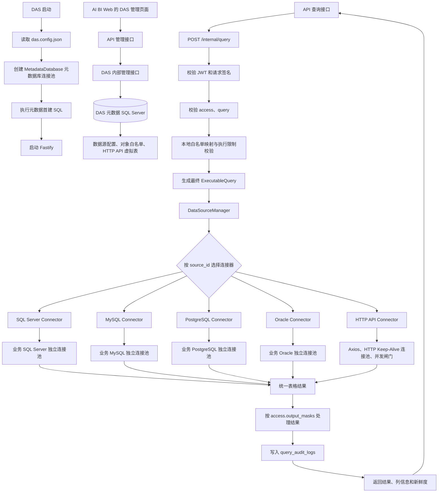

# DAS 实施方案与开发顺序

版本：v0.2  
状态：实施中（第 6 步执行映射核心已完成，新增合同要求待验收）  
设计基线日期：2026-09-11  
关联文档：[data-access-design.md](./data-access-design.md) · [contracts.md](./contracts.md) · [development-standards.md](./development-standards.md)

## 1. 系统边界

Data Access Service（DAS）对 API 查询请求无会话状态，但持久化自己的运行元数据与查询审计。API 完成关联、指标统计、条件位置、参数和权限处理，生成最终可执行 DSL；DAS 的查询链路固定为校验、执行、匿名化/脱敏和返回。

- `das.config.json`：DAS 启动所需配置，包括 API 地址、JWT 验签公钥与实例接入凭证文件路径、DAS 元数据库连接和实例参数。
- DAS 元数据 SQL Server：数据源配置、对象暴露白名单、HTTP API 虚拟表定义、加密密文和审计日志。
- API：用户认证、管理员权限、访问凭证、权限策略计算，以及 API 与 DAS 的内部调用。
- AI BI Web：提供 DAS 管理页面；浏览器不直接访问 DAS 元数据库或业务数据源。
- 数据源连接器：访问业务 SQL Server、MySQL、PostgreSQL、Oracle 或 HTTP API。

实例接入使用 API 预先签发的凭证文件：首次注册验签后，DAS 保存 API 返回的随机会话，每 30 秒携带会话上报健康状态。会话空闲有效期为 90 秒；收到 HTTP 401 后重新读取文件并注册。目录和全部五类管理接口在业务调用前验证 API 的 60 秒 JWT，检查目标实例、用途和请求摘要。用户管理权限由 API 的管理代理检查。配置及生命周期见 [服务接入说明](../ai-data/SERVICE-AUTH.md)。

## 2. 总体流程



## 3. 两类连接池

### 3.1 DAS 元数据库连接池

`MetadataDatabase` 只连接 DAS 自己的 SQL Server 元数据库，用于：

- 读取数据源配置、对象白名单和 HTTP API 映射。
- 写入查询审计。
- 初始化 DAS 元数据表。

它不能用于访问业务数据源，业务慢查询也不能占用该连接池。

### 3.2 业务数据源连接池或并发控制

每个 `source_id` 对应一个独立的运行时连接器实例：

| 数据源类型 | 连接复用                       | 请求并发控制                     |
| ---------- | ------------------------------ | -------------------------------- |
| SQL Server | 独立 `mssql` 连接池            | 每源独立并发上限                 |
| MySQL      | 独立 `mysql2` 连接池           | 每源独立并发上限                 |
| PostgreSQL | 独立 `pg` 连接池               | 每源独立并发上限                 |
| Oracle     | 独立 Oracle 连接池             | 每源独立并发上限                 |
| HTTP API   | Axios + HTTP Keep-Alive 连接池 | `p-limit` 并发闸门和等待队列上限 |

即使两个数据源都属于 SQL Server，也不得共用连接池。各数据源的连接池大小和并发上限由自身的运行配置决定。

## 4. HTTP API 虚拟表

HTTP API 不支持自动扫描目录。管理员在 AI BI Web 的 DAS 管理页面配置虚拟表，API 经过管理员身份校验后调用 DAS 内部管理接口保存配置。

每个虚拟表至少配置：

```text
source_id
object_id
固定 request method
固定 request path
受控请求参数映射
response_mode
response_path
字段 name
字段 json_path
字段 data_type
字段 nullable
```

示例：

```json
{
  "source_id": "his_api",
  "object_id": "patient_visits",
  "request": {
    "method": "GET",
    "path": "/v1/visits",
    "parameter_mappings": [
      { "name": "start_date", "location": "query", "key": "startDate" }
    ]
  },
  "response": {
    "response_mode": "list",
    "response_path": "$.data.records[*]",
    "fields": [
      {
        "name": "patient_id",
        "json_path": "$.patient.id",
        "data_type": "string",
        "nullable": false
      },
      {
        "name": "visit_date",
        "json_path": "$.visitDate",
        "data_type": "datetime",
        "nullable": true
      }
    ]
  }
}
```

HTTP API 原始响应按受信任配置映射为统一表结构。API、模型和浏览器只能引用 `object_id` 与已配置参数，不能提交 URL、请求方法、JSONPath、字段映射或认证信息。

## 5. 最终可执行 DSL

API 传来的 `{ access, query, signature }` 包含最终可执行 DSL。关联关系、去重、聚合、条件位置和权限参数都已由 API 确定。DAS 完成验签、本地白名单映射和限制收敛后，生成供连接器执行的内部 `ExecutableQuery`，保持原 DSL 的统计和过滤语义。

```text
query
+ access
+ DAS 本地对象白名单
+ 数据源限制
-> ExecutableQuery
-> Connector
-> 参数化 SQL 或固定 HTTP 请求
```

连接器只接收 `ExecutableQuery`，不接收或处理 JWT、用户、角色、原始权限策略、`access`、`signature` 或未处理的行过滤规则。

内部连接器合同：

```ts
interface DataSourceConnector {
  checkHealth(): Promise<SourceHealth>;
  discoverCatalog(): Promise<DiscoveredDataset[]>;
  execute(query: ExecutableQuery): Promise<ConnectorExecutionResult>;
  close(): Promise<void>;
}
```

## 6. 实施顺序

### 第 1 步：内部连接器合同（已完成）

- 定义 `ExecutableQuery`、统一目录模型、统一结果模型和 `DataSourceConnector`。
- `ExecutableQuery` 是 DAS 内部类型，不导出到 `@ai-data/contracts`。
- 先编写 BDD/TDD 测试，验证最终 DSL 不携带权限上下文，且对象映射、行过滤、参数和限制都已处理完成。

已实现于 `apps/data-access/src/connectors/`，并覆盖物理对象映射、权限载荷拒绝、资源限制和结果行数一致性测试。

### 第 2 步：DAS 元数据模型和仓储（已完成）

- 完善首建 SQL 的数据源、对象白名单和 HTTP API 虚拟表配置。
- 开发期修改首建 SQL 后通过删除 DAS 元数据库重建，不维护升级迁移。
- 实现 `DataSourceRepository`、`ExposedObjectRepository`、`ApiDatasetRepository` 和 `AuditRepository`。
- 所有仓储只使用 `MetadataDatabase` 的连接池并采用参数化 SQL。

已实现首建 SQL 中的 HTTP API 固定请求定义，并完成四个仓储及其参数化读写测试。所有 DAS 自有元数据库实现收敛在 `apps/data-access/src/metadata/`；`MetadataDatabase` 提供受限参数化执行器，底层连接池不向路由或业务连接器暴露。

按 S-02 收拢后的数据定义与使用边界如下，路径均相对于 `apps/data-access/src/`：

| 职责 | 读取或边界 Schema | 运行时类型 |
| ---- | ----------------- | ---------- |
| 数据源配置 | `metadata/data-source-records.ts`，连接器枚举归 `data-sources/connector-kind.ts` | `data-sources/data-source-types.ts` |
| 加密凭据 | `metadata/secret-records.ts`，IV 与认证标签归 `secrets/aes-gcm-encryption-metadata.ts` | `secrets/secret-types.ts` |
| 对象暴露 | `metadata/exposed-object-records.ts` | `catalog/catalog-types.ts` |
| HTTP 虚拟表映射 | `metadata/api-dataset-records.ts`，请求参数映射归 `connectors/api-request-parameter-mapping.ts` | `connectors/api-dataset-mapping-types.ts` |
| 查询审计事件 | `query-execution/query-audit.ts` | `query-execution/query-audit-types.ts` |

仓储先校验数据库行和持久化 JSON，再显式转换为业务对象。共享 JSON 解析函数位于 `metadata/parse-persisted-json.ts`；对象、字段及参数使用的安全标识符 Schema 位于 `catalog/catalog-identifier.ts`。

### 第 3 步：密钥和运行时数据源管理（已完成）

- 定义 `SecretResolver`，将 `secret_ref` 解析为连接器专属连接配置。
- 使用 `AES-256-GCM` 加密外部数据源凭据；每条 `data_source_secrets` 记录使用独立随机 IV 和认证标签。
- 主密钥使用 DAS 独立本地密钥库，不写入或回写 `das.config.json`，也不依赖操作系统证书库或密钥服务。
- 首次启动时密钥库不存在则生成 32 字节随机 AES 主密钥与初始 `key_id`；后续启动只复用已有密钥。密钥文件丢失、长度错误或内容损坏时必须启动失败，禁止自动生成新密钥覆盖旧密文。
- 密钥文件仅允许 DAS 服务账户读取，不进入 Git、日志、API 响应或审计；轮换时保留旧 `key_id` 对应密钥，直到旧密文全部重新加密。
- 实现 `DataSourceManager`：按 `source_id` 创建、缓存、更新和关闭连接器实例。
- 数据源停用、配置变更或 DAS 退出时，必须关闭相应连接池或 HTTP 连接代理。

已实现于 `apps/data-access/src/secrets/`、`apps/data-access/src/data-sources/` 和 `apps/data-access/src/metadata/secret-repository.ts`。启动时初始化独立 `apps/data-access/secrets/` 密钥库；密钥库只保存活动密钥指针与原始 32 字节密钥，SQL Server 仅保存 AES-GCM 密文、`key_id`、IV 和认证标签。管理接口变更或停用数据源时必须调用 `DataSourceManager.invalidate(source_id)`，以关闭旧业务连接器；DAS 退出时调用 `DataSourceManager.close()`。

### 第 4 步：五类连接器的基础能力（已完成）

五类连接器同时纳入框架：SQL Server、MySQL、PostgreSQL、Oracle、HTTP API。

- SQL Server、MySQL、PostgreSQL、Oracle：创建各自业务库连接池、健康检查和纯目录发现。
- HTTP API：创建 Axios、HTTP Keep-Alive 连接池和并发闸门；目录仅由管理员配置的虚拟表生成。
- 目录输出统一的对象、字段、参数、标准类型、可空性、注释和基础能力；不返回连接串、URL、密钥、JSONPath 或原始响应。

已实现于 `apps/data-access/src/connectors/`：四类数据库使用各自独立驱动连接池、目录发现 SQL 和 SQL 方言。可复用密文保存服务器 `host`、`port` 和登录凭据；每个 `source_id` 配置一个目标数据库。Oracle 先以 CDB SID 或 Service Name 连接，发现 PDB 及其实际 Service Name，再由 `source_id` 使用选择出的 PDB Service Name。HTTP API 使用 Axios、Keep-Alive Agent 和 `p-limit`，仅按元数据中的固定虚拟表请求及 JSONPath 映射生成统一表格。`DefaultConnectorFactory` 已接入启动流程，`DataSourceManager` 负责连接器缓存和生命周期释放。所有连接器测试均使用 BDD/TDD 场景覆盖。

### 第 5 步：目录接口（已完成）

- 实现 DAS 对 API 的目录发现接口。
- 数据库连接器的发现结果必须与 `exposed_source_objects` 白名单取交集。
- HTTP API 目录完全来自虚拟表配置。

已实现 `POST /internal/catalog`，请求体为 `{ source_id }`。`CatalogService` 读取运行时连接器目录；数据库目录按物理对象与 `exposed_source_objects` 白名单精确匹配后返回逻辑 `object_id`，HTTP API 目录直接由已配置虚拟表生成。接口输出统一 `Dataset[]`，不返回连接信息、密钥、URL、JSONPath 或原始响应。

### 第 5.5 步：数据源管理链路（已完成）

AI BI Web 的管理员页面经 API 调用 DAS 内部管理接口，完成数据库数据源的配置与对象白名单管理：

```text
保存共享服务器凭据
-> 使用凭据读取可访问数据库列表
-> 选择一个目标数据库并保存 source_id
-> 展开该 source_id 的表、视图、存储过程
-> 勾选对象
-> 替换 exposed_source_objects 白名单
```

`data_source_secrets` 保存一套服务器地址、端口和登录凭据对应的 AES-256-GCM 密文；同一 `secret_ref` 可被多个 `source_id` 复用。每个 `source_id` 只绑定一个目标数据库，分别拥有连接池、并发、超时、行数和成本限制，以及独立对象白名单。当前不支持跨 `source_id` 查询或跨库 Join。

已实现以下 API 到 DAS 的内部接口：

| 接口                                                | 用途                                              |
| --------------------------------------------------- | ------------------------------------------------- |
| `POST /internal/admin/data-source-secrets`          | 加密保存共享数据库服务器凭据。                    |
| `POST /internal/admin/database-targets`             | 读取当前凭据可访问的目标数据库。                  |
| `PUT /internal/admin/data-sources`                  | 保存一个绑定目标数据库的 `source_id`。            |
| `POST /internal/admin/data-source-objects/discover` | 读取该 `source_id` 的完整表、视图和存储过程目录。 |
| `PUT /internal/admin/data-source-objects`           | 校验管理员勾选对象仍存在后替换 API 对象白名单。   |

SQL Server 使用 `sys.databases`、MySQL 使用 `SHOW DATABASES`、PostgreSQL 使用 `pg_database` 读取目标库列表。Oracle 使用管理员填写的 CDB SID 或 Service Name 查询 `CDB_PDBS` 和 `CDB_SERVICES`，返回 PDB 显示名与实际 Service Name；Web 选择 PDB 后，DAS 保存其 Service Name 并展开该 PDB 下当前账号可见的 Schema、表、视图和存储过程。凭据或数据源配置更新后，`DataSourceManager` 会关闭关联的旧运行时连接器，下一次使用时创建新实例。

### 第 6 步：执行映射与限制校验（核心已完成）

- API 完成用户权限、字段、批准关系、去重、聚合、排序、参数和业务查询能力校验，生成最终 DSL 并签名 `{ access, query }`。
- DAS 接收已验证签名的请求，校验请求结构、关系别名和参数名等可编译性。
- API 在最终 DSL 中明确对象引用、别名、条件位置及参数。DAS 按本地白名单将 `object_id` 映射为物理 Schema 和对象名，依照既定语义执行。
- DAS 应用自己的行数、超时和并发限制。
- 输出 `ExecutableQuery`。

已实现的 `QueryPlanner` 承担执行映射：通过 `QueryRequestSignatureVerifier` 验证 API 签名，读取 DAS 本地对象白名单和已启用数据源配置，将逻辑 DSL 映射为 `ExecutableQuery`，并将 `limit` 收紧至数据源 `row_limit`、采用配置的 `timeout_ms`。`access` 承载审计关联和 API 已计算的输出脱敏规则。对象权限、批准关系、统计规则及参数授权的业务处理归 API，DAS 按收到的结构校验和执行。

当前执行映射保留主对象和关联对象的 `filters`，只允许引用所属别名；四种数据库方言将对象过滤编译为参数化派生表，关联后的筛选继续作为查询级 WHERE。LEFT/RIGHT JOIN 已覆盖授权匹配、仅未授权匹配和无匹配三类记录。带值 ON、多明细分层聚合及统计总计语义仍在后续合同完善范围内。

### 第 7 步：连接器执行和审计

- 四类数据库连接器将 `ExecutableQuery` 编译为参数化 SQL 并执行。
- HTTP API 连接器将已审核参数映射至固定请求定义，并按虚拟表映射输出统一表格。
- 成功、拒绝、超时和失败均写入 `query_audit_logs`。
- 对 `access.output_masks` 指定的字符串结果列执行部分脱敏后，返回统一结果、列元数据和新鲜度。

查询 HTTP 边界通过 `AuditedQueryService` 串联验签、执行和最终审计，启动时同时装配执行服务、验签器及 `AuditRepository`。格式拒绝也进入审计；尚未验签的载荷身份不写入记录。审计失败时停止返回结果。

每源资源闸门管理有限排队、并发、总执行预算及关闭排空；API 请求断开会取消对 DAS 的调用，DAS 再向具体驱动传播取消。名额在底层工作完成清理后归还。资源校验以可执行的超时、并发和等待容量为依据，历史 `cost_limit` 为兼容字段。

参数化对象的完整定义与升级步骤见 [参数化查询配置](../ai-data/PARAMETERIZED-QUERIES.md)。关系查询输出与参数化固定输出分别验收；固定输出经过 API 审核和签名后，还需与 DAS 本地定义及实际结果一致。

关系查询的 `pre_aggregate` 在对象过滤之后、参与关联之前执行。规划器核对派生字段及层次作用域，四种方言编译每对象分组与最终外层聚合，只有最外层使用 N+1 返回行数探测。API 提供的唯一键和基数负责统计校验，DAS 保持既定语义。配置与验收例子见 [分层聚合说明](../ai-data/RELATIONAL-AGGREGATION.md)。

## 7. 首批代码文件

```text
apps/data-access/src/connectors/connector.ts
apps/data-access/src/connectors/executable-query.ts
apps/data-access/src/connectors/connector-result.ts
apps/data-access/src/connectors/database-connector.ts
apps/data-access/src/connectors/database-drivers.ts
apps/data-access/src/connectors/database-dialects.ts
apps/data-access/src/connectors/http-api-connector.ts
apps/data-access/src/connectors/default-connector-factory.ts
apps/data-access/src/data-sources/data-source-manager.ts
apps/data-access/src/metadata/data-source-repository.ts
apps/data-access/src/metadata/exposed-object-repository.ts
apps/data-access/src/metadata/api-dataset-repository.ts
apps/data-access/src/metadata/audit-repository.ts
```

每一项功能先完成 BDD 场景和 TDD 断言，再实现代码；测试是后续调用方和重构的行为基线。
